# 11 个有用的前端 Web 开发人员 Web 应用程序来提高工作效率

> 原文：<https://javascript.plainenglish.io/11-useful-frontend-web-developer-web-apps-to-boost-productivity-c8b2afeab251?source=collection_archive---------1----------------------->

## 2022 年每个网络开发者都应该使用的令人敬畏的网络应用。

Photo by [Louise Viallesoubranne](https://unsplash.com/@louisemink?utm_source=medium&utm_medium=referral) on [Unsplash](https://unsplash.com?utm_source=medium&utm_medium=referral)

总的来说，作为一名 web 开发人员，如果你想在工作中取得成功并在正确的时间交付项目，生产力是非常重要的。无论你是自由职业者，全职员工，或者只是在做自己的项目，你都需要专注于成为一个高效的人。

如今，作为一名 web 开发人员，有很多工具和 web 应用程序可以帮助你提高工作效率。

这就是为什么我整理了一个有用的生产力网络应用的列表，你可能会发现它对你的开发者工作流程有用。

这些应用涵盖了从处理照片、排版到帮助你创建社交媒体内容的所有内容。

因此，在本文中，我们将与您分享一些 web 工具(应用程序),以帮助您提高工作效率，加快开发速度。让我们开始吧。

# 1.Readme.so

这个 [web 应用](https://readme.so/)允许您快速添加和定制项目的自述文件。它有一个很好的编辑器，提供了定制项目自述文件所需的所有工具。

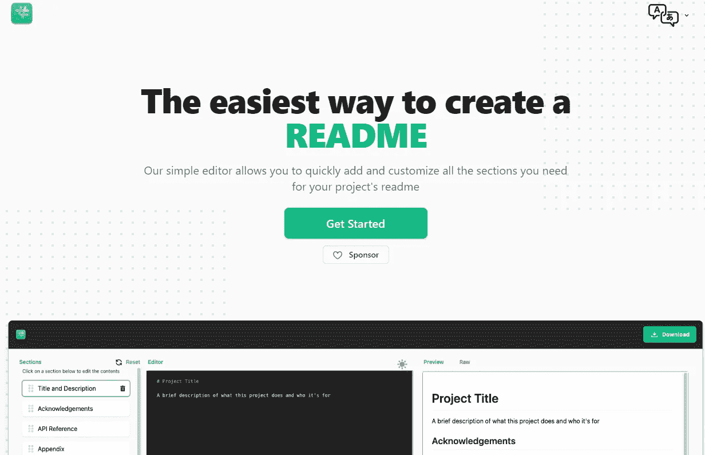

Capture by the author from Readme.so.

# 2.Lorem Picsum

[如果你的项目需要随机图像，Lorem Picsum](https://picsum.photos/) 是一个非常有用的工具。这是一个易于使用的图片占位符生成器。

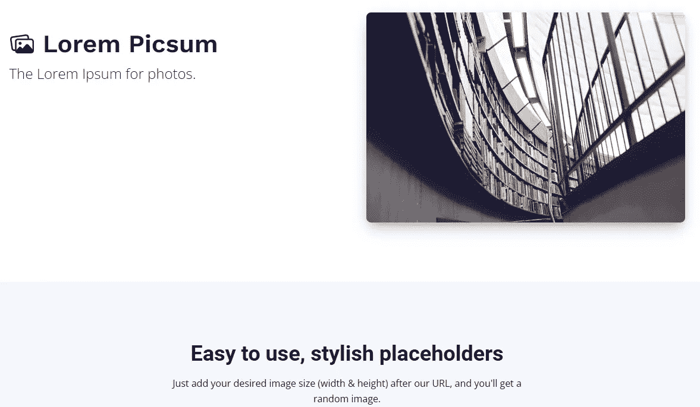

Capture by the author from Lorem Picsum.

当你需要为你的项目获得一个随机图像时，这个有用的 web 应用程序给你很多定制。您可以直接在图像的 URL 中设置参数来定制它们。

# 3.响应地

[响应式](https://responsively.app/)是另一款神奇的网络应用，它给你工具，让你比以往更快地开发响应式网络应用。

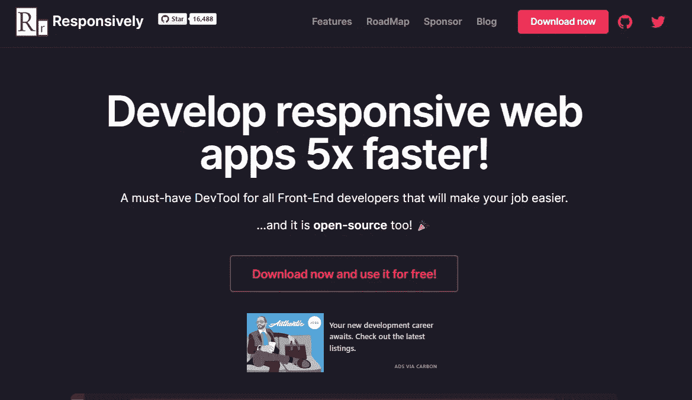

Capture by the author from Responsively.

这是一个非常棒的 web 应用程序，适合所有希望让工作变得更简单、更高效的前端开发人员。

# 4.CSSGradient

CSSGradient 是一个很棒的网络应用程序，它可以让你很容易地获得你想要在你的网络项目中使用的任何类型的渐变背景。

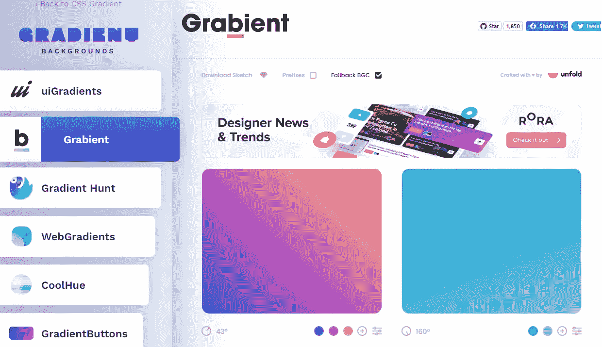

Capture by the author from CSSGradient.

这个 web 应用程序有很多有用的工具来帮助你创建新鲜的 web 渐变，并让你的渐变游戏更上一层楼。

# 5.M3O

[M3O](https://m3o.com/) 是一款非常有用的 web 应用，包含一个面向开发者的免费公共 API 和云服务库。包括电影 API、音乐 API、开放数据 API、Crypto、NFTs 等等。还有一个地方你可以贡献你自己的 API。

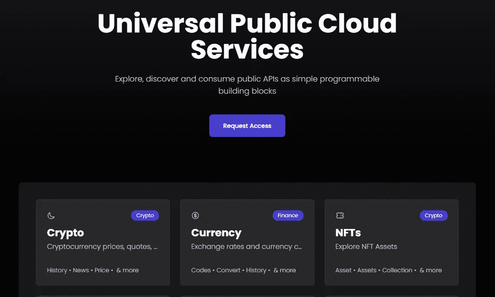

Capture by the author from M3O.

# 6.扁平图标

Flaticon 是一个非常有用的网络应用程序，它提供了一个免费的矢量图标和贴纸库，你可以在你的项目中使用。你可以得到很多格式的图标，比如 SVG，PSD，甚至 CSS 格式。

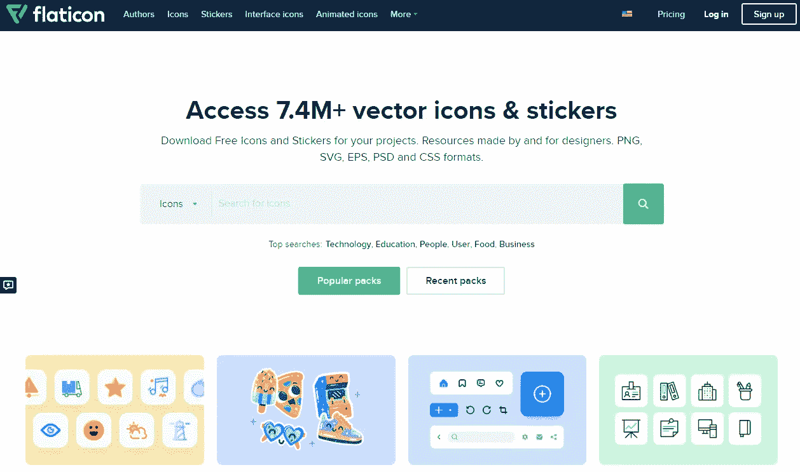

Capture by the author from Flaticon.

您可以搜索要在项目中使用的任何类型的图标或贴纸。您可以访问超过 700 万个图标。

# 7.拉开

[Undraw](https://undraw.co/) 是另一个令人惊叹的网络应用，它包含了许多很酷的 SVG 插图和图像，你可以在你的网络项目中使用。

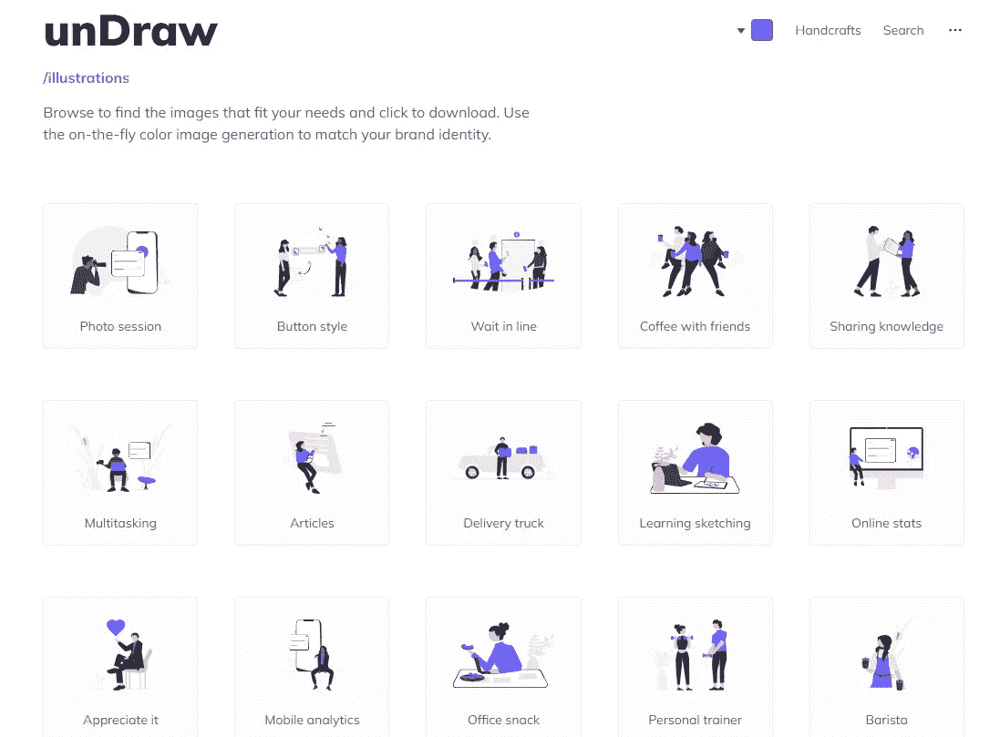

Capture by the author from Undraw.

你可以搜索你需要的任何类型的插图，你也可以选择你的颜色。

# 8.碳

如果你想轻松地创建和分享漂亮的源代码图片， [Carbon](https://carbon.now.sh/) 是一个很棒的网络应用，开发者可以使用。当我需要为我的代码的一部分创建一个漂亮的图像时，我经常使用它，这样我就可以在社交媒体等上分享它。

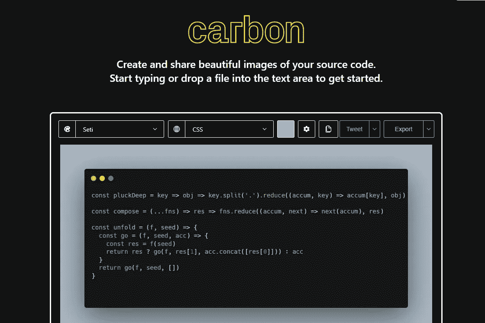

Capture by the author from Carbon.

Carbon 有一个有用的编辑器，你可以选择你自己的语言，代码的主题，还可以发推特或者下载图片。

# 9.压缩机。木卫一

[压缩机。Io](https://compressor.io/) 是一个伟大而简单的网络应用程序，它可以让你轻松地压缩图像的大小，使它们为网络优化。该应用程序有一个好看的用户界面，易于使用。

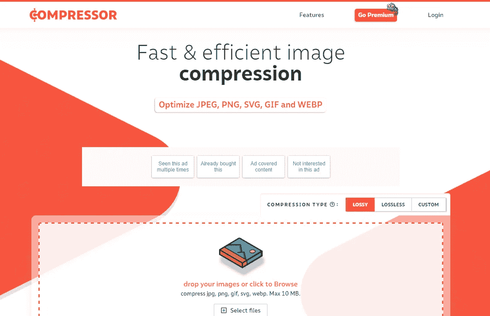

Capture by the author from Compressor.Io.

# 10.正则表达式 101

Regex 101 是一个免费的有用的正则表达式调试器，提供实时解释、错误检测和正则表达式高亮显示。PHP、JavaScript、Python 和 Golang 都支持。

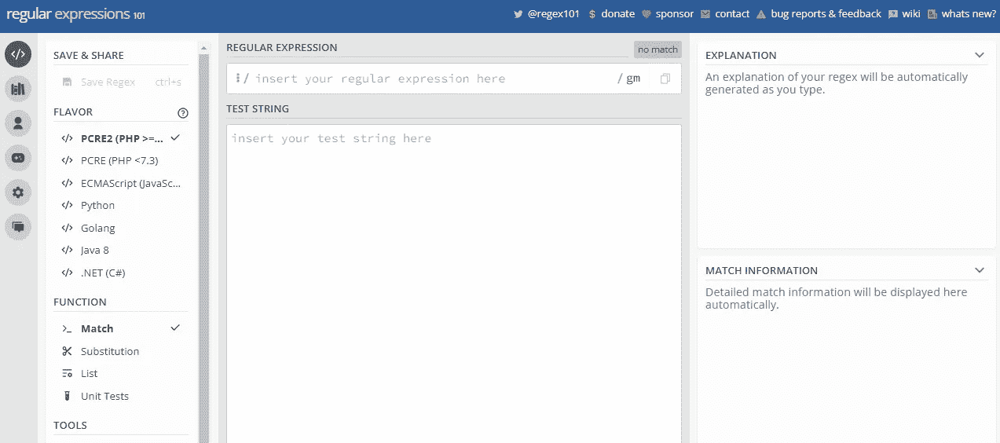

Capture by the author from Regex 101.

如果你是一个苦于正则表达式的开发者，这是一个很好的应用。

# 11.神经形态

[neuromorphism . io](https://neumorphism.io/#e0e0e0)是另一个很棒的网络应用，它给你生成美丽的神经形态所需的一切。您只需从选项中选择软 UI 的类型，然后工具将为您生成 CSS 代码。

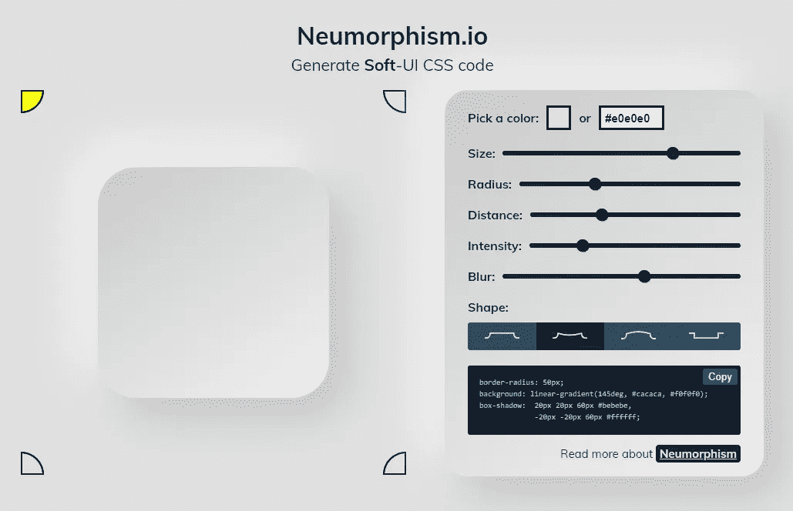

Capture by the author from Neumorphism.io.

# 结论

正如你在这个列表中看到的，这些是你作为前端开发人员可以用来提高工作效率的一些网络应用。这些可以非常有用，帮助你节省更多的时间，让你的生活更轻松。

*感谢您阅读本文。此外，如果你发现我的内容有用，而你不是一个媒体成员，你可以抓住你的媒体成员* [***这里***](https://mehdiouss.medium.com/membership) *(媒体推荐链接)获得无限制的* ***访问媒体上的所有内容*** *并支持我们作为作家。*

 [## 通过我的推荐链接加入 Medium-Mehdi Aoussiad

### 作为一个媒体会员，你的会员费的一部分会给你阅读的作家，你可以完全接触到每一个故事…

mehdiouss.medium.com](https://mehdiouss.medium.com/membership) 

**更多阅读:**

 [## 您应该知道的 6 个非常棒的 JavaScript DOM 技巧和窍门

### 作为开发人员，您需要了解的强大的 JavaScript DOM 技巧和提示。

javascript.plainenglish.io](/6-awesome-javascript-dom-tips-and-tricks-you-should-know-d784ef3a5232)  [## 9 个有用的前端 Web 开发人员备忘单来节省时间

### 2022 年每个 web 开发人员都应该知道的惊人的备忘单。

javascript.plainenglish.io](/9-useful-front-end-web-developer-cheatsheets-to-save-time-2e1fe7495e8) 

*更多内容看* [***说白了。报名参加我们的***](https://plainenglish.io/) **[***免费每周简讯***](http://newsletter.plainenglish.io/) *。关注我们* [***推特***](https://twitter.com/inPlainEngHQ) *和*[***LinkedIn***](https://www.linkedin.com/company/inplainenglish/)*。查看我们的* [***社区不和谐***](https://discord.gg/GtDtUAvyhW) *加入我们的* [***人才集体***](https://inplainenglish.pallet.com/talent/welcome) *。***