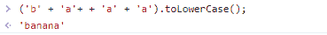
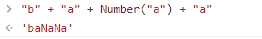

# 关于 JavaScript 冒险你不知道的 11 个奇怪事实

> 原文：<https://javascript.plainenglish.io/11-weird-facts-you-didnt-know-about-javascript-adventures-51910bdaeac?source=collection_archive---------17----------------------->

## 尽快了解 JavaScript 隐藏的秘密来打动你的女朋友或男朋友。


Photo by [Dollar Gill](https://unsplash.com/@dollargill?utm_source=unsplash&utm_medium=referral&utm_content=creditCopyText) on [Unsplash](https://unsplash.com/s/photos/magic?utm_source=unsplash&utm_medium=referral&utm_content=creditCopyText)

从技术上来说，我在探索或实现 JavaScript 代码时意外或不幸地发现了数百个奇怪的事实。JavaScript 冒险的深度太大了，我们无法通过向 JavaScript 的深海的[扔一块鹅卵石来计算，但是这里有你可能知道的 20 个隐藏的秘密。](http://9mood.com/fun/deep-sea/open-deep-sea.html)

我观察到，许多开发人员在日常生活中与 JS 进行交互，但仍然对某些部分一无所知。我相信，通过分享知识，它一定会增加。*分享就是关爱*😉*。*

注意:我用 ES2015 和 ES2016 来说明本文中隐藏的秘密。推荐大家自己去尝试例子，增加更多自信！好吧！

## 1.JavaScript 真的很奇怪。这里有一个活生生的例子。

当您编写如下语法时，您会对输出感到惊讶:

```
> ('b' + 'a'+ + 'a' + 'a').toLowerCase(); 
'banana'
```



Photo by [Rakshit Shah](https://twitter.com/rakshitshah94) on [Twitter](https://twitter.com/rakshitshah94/status/1505523368430534656)

运筹学

```
"b" + "a" + Number("a") + "a"
b a NaN a
```



Photo by [Rakshit Shah](https://twitter.com/rakshitshah94) on [Twitter](https://twitter.com/rakshitshah94/status/1505534953601511435/photo/1)

## 2.NaN 事实:NaN 不是一个数，是一个特殊的数，不是有限的，既不是正的也不是负的，本身不具有可比性。

解释:NaN 不是一个数字，也是一个特殊的数字。如果看到南的`typeof`，就会显示`&quot;number&quot;`

```
typeof NaN
'number'
```

**如何切实获得南？**

有很多方法可以实现它。在这里，我强调复制相同的主要步骤。

*   0 除以 0[即 0/0 = NaN]
*   数字(" a") = NaN
*   当您尝试将非数字字符串+'somestring' = NaN
*   当你把大于 0 的数除以 0 时。[(1/0) - (1/0) =无穷大-无穷大= NaN]

你不能拿一个 NaN 和另一个 NaN 比较，就像 5 === 5 一样。

```
NaN === NaN
-> false

// If you store NaN to temp variable and try to compare the same variable, it will return false. See below examplevar bar = NaN
bar === bar
-> false// In array, you can't retrieve value by index of NaN.
var foo = [1, 2, NaN, 4];
foo.indexOf(1);
-> 0foo.indexOf(2);
-> 1foo.indexOf(NaN);
-> -1
```

永远记住 NaN 不是一个有限的数。还有，不代表它是无限的！它不是有限的，也不是无限的。

```
// Check whether it is finite or not using isFinite() function.isFinite(NaN)-> false
```

你也可以用小于或大于来检查。

```
Infinity > NaN
falseInfinity < NaN
false//NaN is not negative or positive too
-NaN
false+NaN
false
```

## 3.[0.1+0.2 = 0.3000000000000004]，只发生在 JS！

```
var a=0.1;
var b=0.2;
var c = a+b;
alert(c); //0.30000000000000004
```

**好建议:**如果你想在你的应用中使用 BTC 加密货币，你不应该使用 javascript，切换它——否则你必须从你的口袋中支付 0.000000000000004。😂

## **4。**未定义类型

神秘的是 undefined 可以用下面的例子来定义。

```
undefined = "I'm not undefined!"; 
var foo; 
alert(undefined == foo); **//true**
```

注意，“未定义”不是一个函数。

## 5.JS 是 10 天建成的。

JavaScript，(不要与 Java 混淆)是由 Brendan Eich 于 1995 年 5 月在 10 天内创建的，当时他在 Netscape 工作，现在是 Mozilla 的一员。

某人:10 天你能做什么？

我:可能要花 10 天时间从客户的需求中收集信息，分析，并根据他们的要求设计线框！

JavaScript 是世界上最可爱和最流行的编程语言，因为它是一种简单和基本的语言，现在在学校的所有年级都是标准化的。

JavaScript 是一种简单、易于理解、全球通用的编程语言，但很难掌握。

不要把自己的弱点告诉别人！炫耀你所知道的！😎

## 6.JS 支持两种空值

一个叫`null`，一个叫`undefined`。

## 7.有两个零

通常，我们在实现代码时使用正零。但是在 JavaScript -0 中也已经出现了。

如果你用正数或负数打印 0，它将返回`0`本身。背后的原因是`(+0).toString()` & `(-0).toString()`回归`0`。

```
+0
0-0
0
```

当比较正 0 和负 0 或它们的排列组合时，结果如下:

```
+0 < -0
-> false +0 > -0
-> false+0 === -0
-> true//Regarding indexOf positive or negative **0** [-0, +0].indexOf(+0)
-> 0[+0, -0].indexOf(-0)
-> 0
```

**现在你可能会奇怪为什么是负数(-0)？**

下面是寻找`negative 0`存在的最佳窍门。

```
1 / 0
-> Infinity1 / -0
-> -Infinity
```

如果将大于 0 的数除以正 0，它将返回正无穷大。如果将大于 0 的数除以负 0，将得出负无穷大。您可以尝试使用`isNegativeZero()`函数找到正的或负的零。

## 8.不是类型安全的！(没有紧密耦合的数据类型)

比方说，你正在创建一个变量 foo，并给这个变量赋一个数字 5。之后，您可以使用同一个变量来指定一个字符串。它会工作，它不会给出任何错误。

```
var foo = 5;
console.log(foo);foo = "Rax";
console.log(foo);
```

简而言之，无论您想要分配什么数据，它都会自动理解其数据类型并按照编写的语法执行操作。

**JS 是松散类型的，因此它根据情况有自己的优点和缺点！**

## 9.JavaScript 是 100%向后兼容的。

如果你的祖母在 90 年代写了一段代码，那么这段代码在今天仍然可以毫无问题地运行。

这意味着，您的相同代码也将在未来的 javascript 版本中工作。(除非第三次世界大战发生或者整个世界以一次大的小行星碰撞而终结。* T&C 申请了！)

## 10.机器文件系统的安全性

您不能使用 JavaScript 访问客户端的任何文件系统。使用 Javascript 无法从计算机上的文件系统中读取文件或将文件写入其中。出于安全考虑，它不允许访问您的机器。

浏览器也不允许一次多次下载，因为它们也是在呵护你的机器，为你避免屏幕冻结！

## **11。为什么 Javascript 要被很多开发者讨厌？**

喜欢和不喜欢有成千上万个原因，但这里有几个具体和一般的原因，说明开发者不太喜欢 JS。

*   JS 没有类/类。它只支持对象。继承在某种程度上是不可实现的。
*   由于一些设计错误，你可能会得到一些 bug(正如我们上面看到的，0.1+0.2 = 0.30…04)。
*   JS 没有灵活性，因为浏览器知道 JS，所以它不会理解您的 Java 或 Python 代码。
*   如果你知道 OOP(面向对象编程)，或者如果你正在使用 OOP，你绝对必须适应 JS 和它古怪的概念！

**参考文献:**

1.  [深海试玩](http://9mood.com/fun/deep-sea/open-deep-sea.html)
2.  [Mozilla Javascript 博客](https://developer.mozilla.org/en-US/docs/Web/JavaScript)
3.  [维基百科 Javascript](https://en.wikipedia.org/wiki/JavaScript)

如果你喜欢这篇文章，并想阅读更多，成为一个媒体成员，探索一些有价值的作家写的文章和想法。 [**通过这个链接加入 Medium，它将帮助我从你的费用中获得一点点佣金，你不必为此支付额外的费用。**](https://medium.com/@thundersoul/membership)

2022 年——最初由 [Rakshit Shah](https://medium.com/@thundersoul) 在媒体上发表。

*更多内容看* [***说白了就是***](https://plainenglish.io/) *。报名参加我们的* [***免费周报***](http://newsletter.plainenglish.io/) *。关注我们* [***推特***](https://twitter.com/inPlainEngHQ) *和*[***LinkedIn***](https://www.linkedin.com/company/inplainenglish/)*。加入我们的* [***社区不和谐***](https://discord.gg/GtDtUAvyhW) *。*