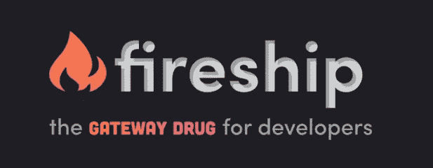
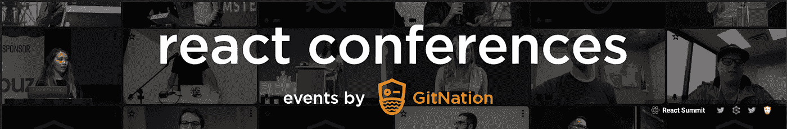
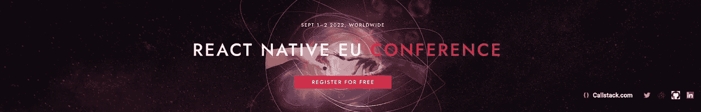
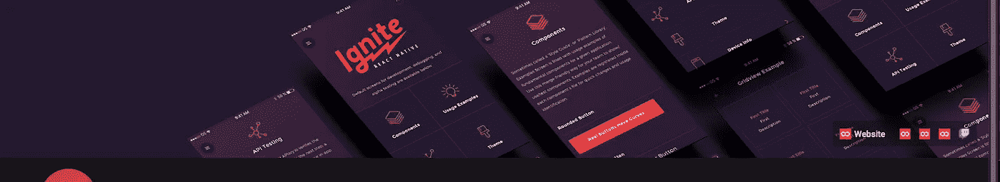

# 2022 年做软件工程师要关注的 11 个 YouTube 频道

> 原文：<https://javascript.plainenglish.io/11-youtube-channels-to-follow-as-a-software-engineer-in-2022-37186591c23c?source=collection_archive---------2----------------------->

## 同时考虑网络和移动领域。

Photo by [Christina @ wocintechchat.com](https://unsplash.com/@wocintechchat?utm_source=medium&utm_medium=referral) on [Unsplash](https://unsplash.com?utm_source=medium&utm_medium=referral)

软件工程是一项无止境的学习工作。软件和相关技术总是在发展，从事这一领域的人应该总是处于敏捷和学习的模式中。YouTube 是这份工作的绝佳平台。技术社区总是通过 YouTube 上的各种技术频道分享他们的想法和见解。这篇文章试图列出一些 2022 年值得关注的最佳 YouTube 技术频道。

## 1.火船

该频道在短时间内提供关键见解。他们处理**异构**技术。

[Fireship](https://www.youtube.com/c/Fireship/about)

这个频道是由[杰夫·德莱尼](https://fireship.io/contributors/jeff-delaney/)创建的。如前所述，这个频道最好的一点是，这里的大多数视频都很短，但很有见地，而且从不无聊。它们通常集中在以下几个方面。

*   Java Script 语言
*   摆动
*   重火力点
*   现代应用程序开发概述

## 2.freeCodeCamp.org

如果你喜欢课程和深入探讨某些主题，这个频道适合你。

[freeCodeCamp](https://www.youtube.com/c/Freecodecamp)

它们几乎涵盖了软件工程的每个方面，从前端到后端到机器学习——从开发到部署的一切。

你也可以从他们的[网站](https://www.freecodecamp.org/news)订阅他们的时事通讯。

## 3.通过 GitNation 响应会议

如果您是 React 开发人员，这个频道是必须订阅的。

[React Conferences by GitNation](https://www.youtube.com/c/ReactConferences/videos)

这个通道对于 React 和 React 本地工程师来说非常有用。大多数谈话是由参与大型技术和开源项目的人进行的。大部分都是业内重要人物。

涵盖的技术:

*   反应
*   GraphQL
*   JS 工具包
*   UI-UX
*   构建工具
*   其他前端的东西

## **4。真实世界的反应**

这个频道主要关注与 React 相关的内容。

这是[链接](https://www.youtube.com/c/RealWorldReact/featured)到他们的渠道。

## 5.呼叫堆栈工程师

CallStack 是一家对 React Native 和开源感兴趣的技术公司。

[Callstack Engineers](https://www.youtube.com/c/CallstackEngineers/videos)

他们为开源项目做出了巨大贡献，如**react-Native-paper**【UI toolkit】、**React-Native-testing-library**【BDD testing】，他们的一些工程师也参与了大型 React 原生开源项目，如 **react-navigation。**

他们还不时分享他们对 React Native 开发的见解和经验。

预期主题:

*   反应-本地性能
*   核心架构
*   技术讲座

## 6.软件大厦

这是 React 本地工程师的另一个必须订阅的频道。

[Software Mansion](https://www.youtube.com/c/SoftwareMansion/videos)

他们热衷于 React 和 React Native 以及开源贡献。他们是一些大型开源库背后的公司，如 **expo** 、**react-native-手势处理器**和**react-native-reactive。**

预期主题:

*   反应自然
*   反应
*   移动性能
*   UI-UX

## 7.无限红色

这个频道也是为本土工程师准备的。

[Infinite Red](https://www.youtube.com/c/InfiniteRed/videos)

这个频道的独特之处在于他们的现场编码会议和 RNN 时事通讯。

## 8.JSConf

这个频道分享了一系列来自世界各地的 JavaScript 会议。

[JSConf](https://www.youtube.com/c/JSConfEU/videos)

这个频道面向普通的 Javascript 技术人员，从基本的前端 web 开发到 Node。

预期主题:

*   Java Script 语言
*   HTML5
*   半铸钢ˌ钢性铸铁(Cast Semi-Steel)
*   节点. js
*   机器人学

## **9。韦尔塞尔**

Vercel 是 Next.js 的创建公司，现在他们真的很重视 Monorepo 的开发。这个频道适合订阅任何前端工程师。

[**Vercel**](https://www.youtube.com/c/VercelHQ/videos)

他们也是 Turborepo 背后的公司。

预期主题:

*   反应
*   Next.js
*   单一报告
*   Turborepo

## 10.独角鲸技术公司。

Nrwl 是一家软件开发咨询公司，致力于设计智能技术系统和工具，为企业创建高质量的以用户为中心的软件。

他们正在开发一些非常有趣的工具包， **nx** 。

[Nrwl — Narwhal Technologies Inc.](https://www.youtube.com/c/Nrwl_io/videos)

主题:

*   单一报告
*   （同 nonexpendable）非消耗品
*   莱尔纳

## 11.NDC 会议

这基本上是为了。NET 开发人员，但它也发表关于 CSS、设计和其他软件开发方面的有趣演讲。

[NDC Conferences](https://www.youtube.com/c/NDCConferences/about)

涵盖的主题:

*   。网
*   设计
*   UI-UX
*   敏捷开发

感谢阅读。Happy React 和 JavaScripting。🍻

*更多内容看* [***说白了。报名参加我们的***](https://plainenglish.io/) **[***免费周报***](http://newsletter.plainenglish.io/) *。关注我们*[***Twitter***](https://twitter.com/inPlainEngHQ)*和*[***LinkedIn***](https://www.linkedin.com/company/inplainenglish/)*。查看我们的* [***社区不和谐***](https://discord.gg/GtDtUAvyhW) *加入我们的* [***人才集体***](https://inplainenglish.pallet.com/talent/welcome) *。***