# 为您的 Web 项目提供 12 个出色的形状生成器😍🚀

> 原文：<https://javascript.plainenglish.io/12-awesome-shape-generators-for-your-web-projects-695da13f11fd?source=collection_archive---------12----------------------->

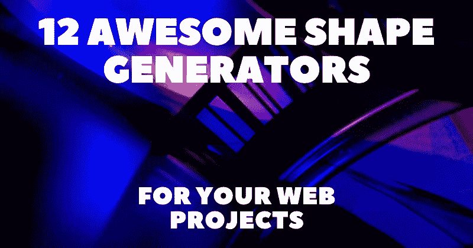

从头开始创建高级形状需要一些高级的 CSS 和 SVG 知识，并且您可能仍然需要在之后调整值。我建议使用一些 GUI 工具，它们提供了一个用户界面来调整参数。

在本文中，我收集了一些我最喜欢的形状生成器。我将它们进一步分类，如博客、博客、分隔符和其他，这样更容易浏览，你可以在每个类别的不同选项中进行选择。

对于每个工具，我将提供一个直接的链接，一个简短的描述，和一个预览图像，这样您就可以得到每个生成器及其特性的初步印象。

# 一滴

## 1.[奇特的边框形状](https://9elements.github.io/fancy-border-radius/)

在 CSS 中指定八个边界半径值，构建看起来很自然的形状。

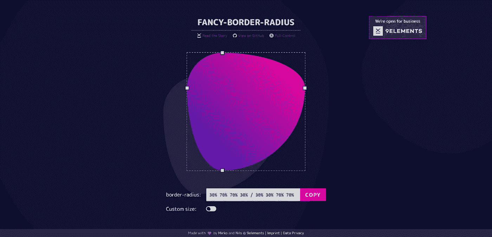

## 2. [Blobmaker.app](https://www.blobmaker.app/)

Blobmaker 是一个免费的创成式设计工具，帮助您快速创建随机和独特的 SVG 形状。

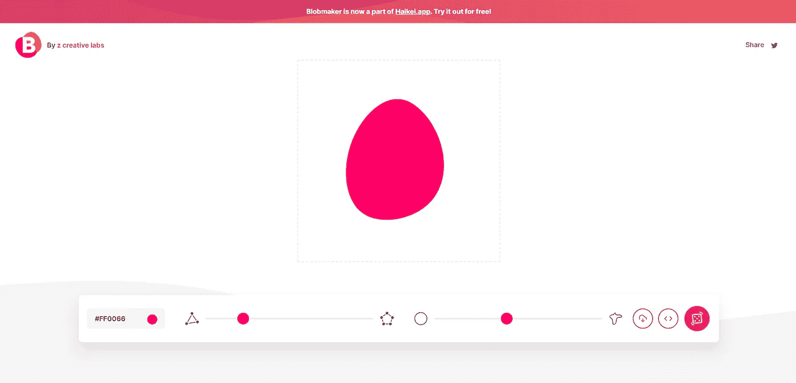

## 3. [SVG 形状生成器](https://www.softr.io/tools/svg-shape-generator)

一个免费的设计工具来创建丰富多彩的，随机的，独特的，有机外观的 SVG 形状。

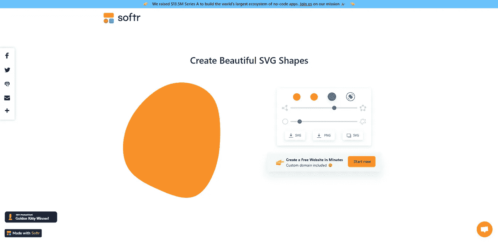

## 4. [Squircley.app](https://squircley.app/)

为徽标、图标和背景图像创建漂亮的形状。导出 SVG 文件，这些文件可以直接复制到剪贴板，放入您的项目中。

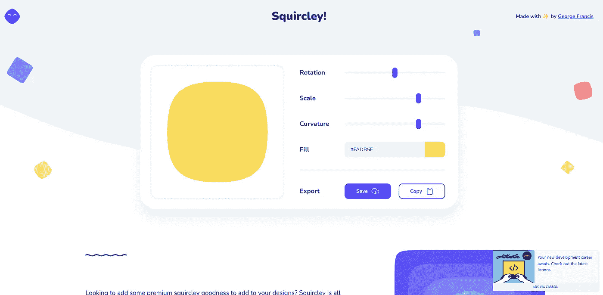

# 波

## 5. [CSS 波](https://getwaves.io/)

为您的下一个设计生成 SVG 波。

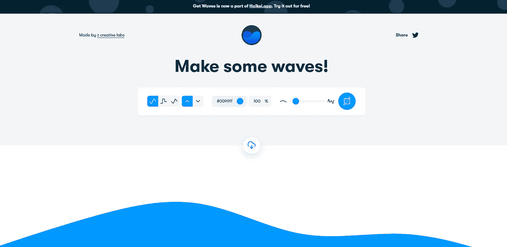

## 6.[多个动画波](https://svgwave.in/)

一个微小的，免费的和美丽的 SVG 渐变波发生器，有一个简单的用户界面来定制，并根据你的主题规范来设计你的波。

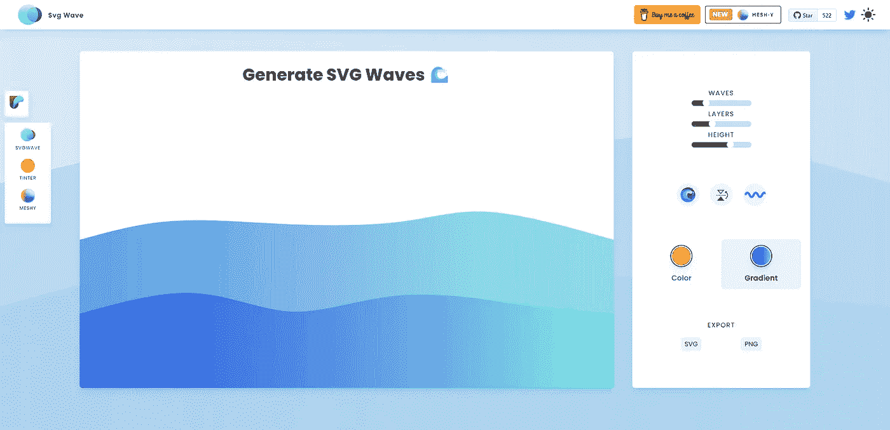

## 7. [SVG 波形发生器](https://www.softr.io/tools/svg-wave-generator)

一个免费的设计工具来创建丰富多彩的，多层的，随机的，独特的，有机的 SVG 波。

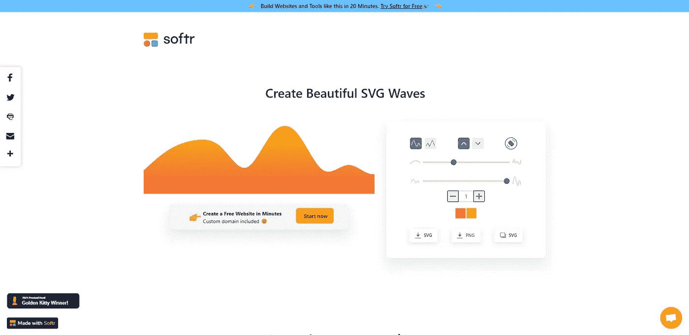

# 分离器

## 8. [Shapedivider.app](https://www.shapedivider.app/)

一个免费的工具，让设计师和开发人员更容易为他们的最新项目导出一个漂亮的 SVG
形状分割器。

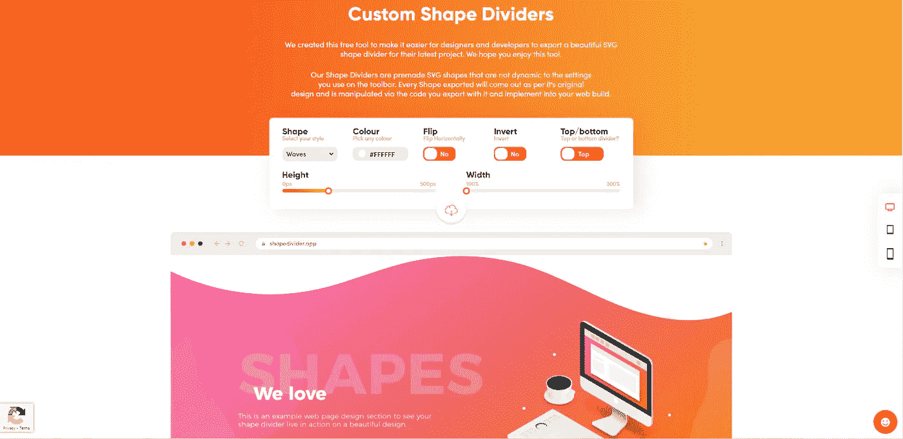

## 9.[Shapedividers.com](https://shapedividers.com/)

在 X 轴或 Y 轴上创建形状分隔线。一个创建动画效果的选项。

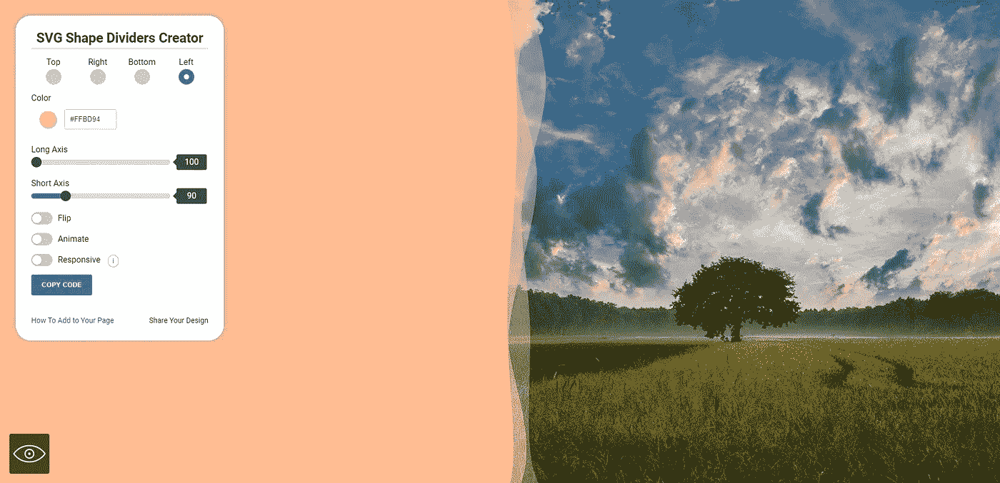

## 10.[分页符](https://omatsuri.app/page-dividers)

PWA 的一部分，带有 12 个开源前端聚焦工具 [Omatsuri](https://omatsuri.app) 。

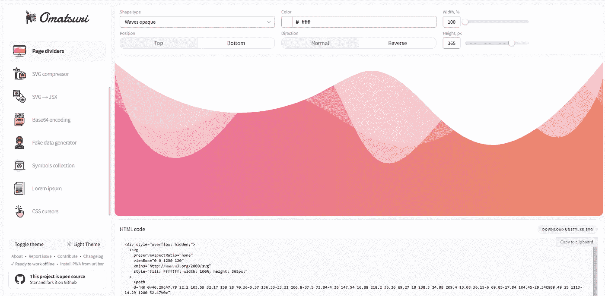

# 多方面的

## 11. [Rad-lines](https://msurguy.github.io/rad-lines/)

一个 Vue.js 项目，用于为绘图生成多边形的 SVG。

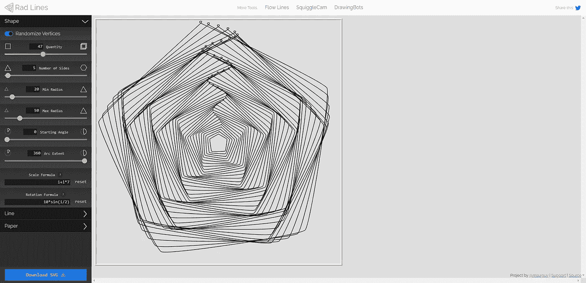

## 12. [Trianglify.io](https://trianglify.io/)

一个生成低多边形背景、纹理和矢量的工具。它基于开源库[三角化](https://github.com/qrohlf/trianglify)。

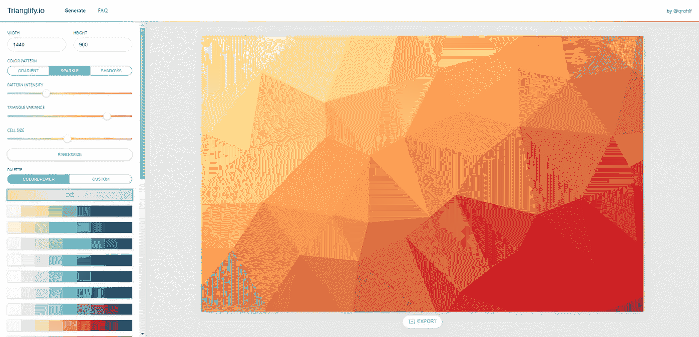

写作一直是我的激情所在，帮助和激励他人给我带来了快乐。如果您有任何问题，请随时联系我们！

在 [Twitter](https://twitter.com/madzadev) 、 [LinkedIn](https://www.linkedin.com/in/madzadev/) 和 [GitHub](https://github.com/madzadev) 上连接我！

访问我的[博客](https://madza.dev/blog)获取更多类似的文章。

*更多内容请看* [***说白了就是***](https://plainenglish.io/) *。报名参加我们的* [***免费每周简讯***](http://newsletter.plainenglish.io/) *。关注我们*[***Twitter***](https://twitter.com/inPlainEngHQ)*和*[***LinkedIn***](https://www.linkedin.com/company/inplainenglish/)*。加入我们的* [***社区不和谐***](https://discord.gg/GtDtUAvyhW) *。*