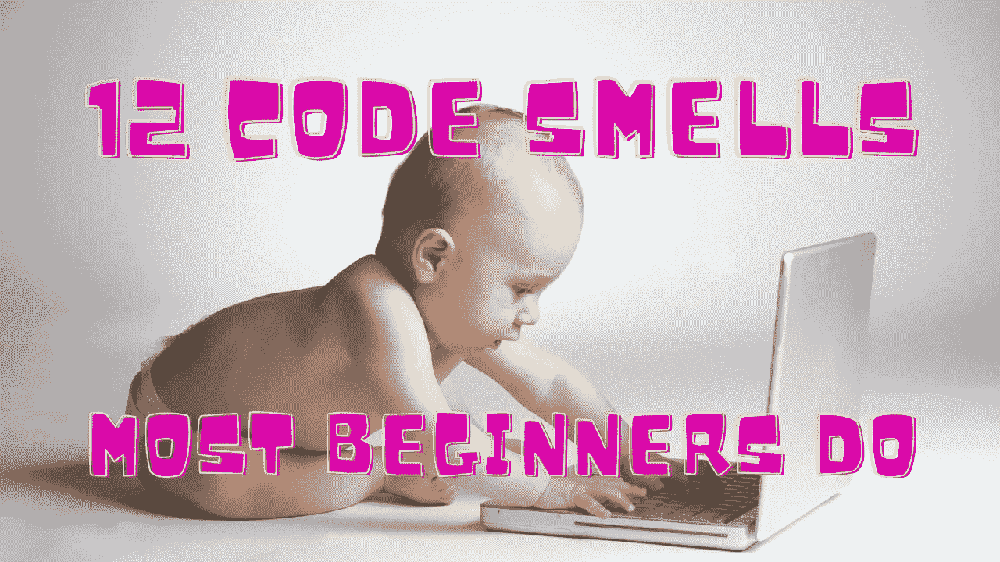

# 作为一名 JavaScript 初学者，你想向老板隐瞒的 12 种代码味道

> 原文：<https://javascript.plainenglish.io/12-code-smells-you-want-to-hide-from-your-boss-as-a-javascript-beginner-486b956b86a0?source=collection_archive---------5----------------------->

## 作为一名开发人员，您希望消除它们

Image made by the [Author](http://www.arnoldcode.com) via Canva.com

你是一个初级开发人员，*这很好！*你关注软件开发世界的许多新术语和概念。你可能没怎么听说过**码闻**。

你可能会想，“这不值得，因为我还没有掌握软件开发的概念。**但要提防这种邪念！**

> 代码味道指的是功能正常但结构不良的源代码。他们在编程中声明建议重构的结构。形象地说，这是难闻的代码。— [t2informatik](https://t2informatik.de/en/smartpedia/code-smell/)

有些代码气味在新手中很常见。不了解它们会让你的生活变得更加艰难，让你的学习之路变得不必要的困难——当你的代码中有代码味道时，下面是最大的问题:

*   修复一个 bug，创造 99 个新的 bug
*   如果你想增加功能，有 50 个地方你必须改变代码
*   一切都有某种程度的联系。你不知道从哪里开始做出新的改变
*   刚刚工作的代码现在被破坏了
*   你很快就失去了全局
*   所有组件都需要所有数据

# 1.名称中的二元运算符

您可以显式地判断名称中带有二进制按位运算符(如 AND 或 or)的方法或函数将会做什么。

这样的功能违反了[单一责任原则](https://medium.com/arnoldcode-academy/unity-solid-s-single-responsibility-6707d9569e73)。将方法分成两半分别做这两件事可能是有意义的。

## 事情是这样的:**违反** [**单一责任原则**](https://medium.com/arnoldcode-academy/unity-solid-s-single-responsibility-6707d9569e73)

当某物有连词时，它做不止一件事。

## 有臭味的

## 干净的

# 2.重复代码

不需要解释多余的代码。根据福勒的说法，冗余代码是最糟糕的气味之一。

另一个问题是检查现有副本是否相同。每次引入变更时，您都必须检查所有现有的代码副本。

## 如何重构:

*   提取类
*   提取功能
*   拉高方法
*   模板

# 3.死代码

死代码的味道是代码执行者永远不会去的任何地方，甚至是注释掉的代码。

任何不能达到的`if`或`switch-case`条件，方法或函数中任何不会在最终 return 语句后抛出错误的代码。甚至任何不会抛出错误的`try-catch`块。

您必须使用 IDE 工具来检测这一点。

## 因果

最终，长 else-if 块有太多的路径，以至于你都不记得它们是否被访问过了。

也许你学习了一种新的编码方法，却忘了移除/重构旧代码。

## 问题:

*   [**你不会需要它违反原则**](https://medium.com/next-level-source-code/do-you-follow-these-10-principles-for-good-programmers-1445727af447) **:** 将旧代码留在代码库中，即使它被注释掉“以防万一”，也只是让它膨胀。

## 如何重构:

*   只需删除它(git history 已经为您保存了它)

# 4.荒谬的评论

注释在某种程度上是死代码。他们没有被处决。

这可能会导致这样的情况，在代码返工后，周围的注释保持不变，不再说明事实。

这种情况不能伤害“为什么”评论族。这种情况根本不应该发生。 [**但是“什么”注释都是码闻**](https://levelup.gitconnected.com/why-comments-give-a-tremendous-insight-about-your-coding-skill-452245b57721) **。**

您通常会在向其他用户或您未来的自己公开的方法中发现这一点。

## 原因

匆忙中，您没有仔细检查更改后的所有内容是否都是最新的。没有自动检查评论的方法。

## 问题

*   **可读性降低:**不清楚是信任方法的签名还是注释。

## 有臭味的

## 干净的

# 5.标志参数

标志参数是函数参数，它告诉函数根据单个参数做两件不同的事情。

***臭有两个原因。***

1.  在阅读代码时，您将被这个方法的调用所停止。*在这种情况下，“假”或“真”是什么意思？*
2.  第二个问题是，在它发展成一个美丽的成熟的条件复杂性之前，它可能是一个茧阶段。

当你把这个方法分成两部分时，你就帮了自己一个忙。

## 原因

这可能就像给条件检查 blocveloper 添加另一个 if 子句一样简单而诱人，他认为这只是一个微小的差别，并没有费心去创建一个单独的方法。

## 问题:

*   **可读性:**你不会知道真假会造成什么。
*   **可变:**使用 boolean 作为标志参数意味着两种工作方式。

## 有臭味的

## 干净的

# 6.命令循环

循环大多是过时的。

今天，语言提供了另一种选择——管道。在 JavaScript 中，您经常将它们与数组结合使用，如 filter、map 或 reduce。

我不会说所有的循环都是代码味道。循环一直是并且可能会继续是编程的基本部分。但是它们在可读性和可靠性方面很差。

为了增加应用程序的可靠性，尽可能广泛地实现函数式语言的优点(如流或不变性)是值得的。

## 问题:

*   **难读:**循环不像管道那样提供声明性可读性。

## 难闻的 V1

## 清洁 V1

## 难闻的 V2

## 清洁 V2

# 7.不一致的名称

从第一个抽象类开始，每个后续类的操作和用法的概念都应该一般化。促进并迭代加速对代码的理解。

## 因果

[你可能不检查现有的命名约定就创建新的类。](https://medium.com/front-end-weekly/how-naming-ruins-your-code-6f3a53a380b9)那么你可能也选择了不同的命名约定来区分类。

## 问题:

*   **可读性:**心智捷径需要通过名字进行标准化的交流。
*   **流状态的中断:**您希望在兄弟类中有一个方法，但却找不到它。你现在玩查找同义词的游戏。

## 有臭味的

## 干净的

# 8.长方法

拥有一个长方法是初学者最明显的问题之一。

每当一个函数有很多代码行的时候，你就必须更加努力地去弄清楚它从 A 到 z 到底在做什么。

答。更长的程序是:

*   更难理解
*   更难改变
*   用力或伸展

你会多次阅读代码，阅读更多的行需要更多的时间。

## 因果

您会发现添加另一行代码会更容易，而不是中断流程。

## 问题

*   **很难读懂，也很难推理:**每次想改变一个简单的东西，都要把握整体，很费时间。
*   **重用率低:**较长的方法可能有多种功能，所以你不能像短的、特定的方法那样容易地重用它们。

## 症状

*   长方法不太可能只做它名字中所说的事情。

## 有臭味的

## 干净的

# 9.长参数列表

一般来说，参数表越长，越难理解。这是与 Long 方法处于同一抽象层次的另一个代码味道。

## 因果

当你试图推广一个有很多变化的例程时，你有可能一次传递了太多的参数。

也可能是因为你不知道对象之间是如何关联的，所以你只是通过参数来调用它们。

## 事情是这样的:

*   **不好用:**使用一个有很多参数的方法需要更多的知识。
*   **复杂性增加:**由于输入值不一致，在执行过程中可能会发生太多变化。
*   **违反** [**单一责任原则**](https://medium.com/arnoldcode-academy/unity-solid-s-single-responsibility-6707d9569e73) **:** 方法大概是在参数太多的情况下试图做太多的事情或者有太多的理由改变。

## 有臭味的

## 干净的

# 10.名称中嵌入的类型

每当一个变量有一个明确的类型前缀或后缀，它可以强烈地表明它应该是自己的类。

如果变量名称中存在类型注释或类型提示，就没有必要在变量名称中提及两次，因为有很多方法可以注释变量。

将具有嵌入类型的名称重构到单独的类中是一个好主意。

## 有臭味的

## 干净的

# 11.“什么”评论

许多人不同意是否所有的评论都应该被称为代码气味。

出于这个原因，一个名为“What”Comments 的具体评论子类只定义了这些评论，在大多数情况下，这些评论暗示了一些不好的东西。

这是一个简单的规则:当一个注释描述了代码段中的一些东西时，它可能试图掩盖另一种代码味道。

## 有臭味的

## 干净的

# 12.条件复杂性

最好避免使用冗长的级联`switch`语句，这些语句通常会执行分散在应用程序中的代码。

随着时间的推移，您的逻辑块变得更加广泛，添加另一个`if`也变得更加容易。一个类应该只有一个改变的理由——马丁·福勒。

## 问题:

*   **违反** [**开闭原则**](https://medium.com/arnoldcode-academy/unity-solid-principles-solid-o-be01b038485)**:**允许扩展，不允许修改。
*   **更复杂的 API**
*   可读性:很难理解`if`语句块，因为你必须考虑代码可能采用的所有路径。

## 有臭味的

## 干净的

# PS:如果你在搜索教程…

…关于如何开发一些项目让你快速起步:

*   [披萨派对计算器](https://medium.com/arnoldcode-academy/10-beginner-programming-projects-in-c-or-javascript-e829b470ee2)
*   待办事项清单
*   [财务比较器](https://medium.com/arnoldcode-academy/10-beginner-programming-projects-in-c-or-javascript-e829b470ee2)
*   [井字游戏](https://github.com/ArnoldCodeAcademy/WebDevConquerors_TT1_TTT)
*   [10 个初级 JavaScript 项目](https://medium.com/arnoldcode-academy/10-beginner-programming-projects-in-c-or-javascript-e829b470ee2)

[*节省自己大量的时间，专注于重要的主题。*](https://cntr.click/gCF1M0f)

*更多内容看* [***说白了就是 io***](https://plainenglish.io/) *。报名参加我们的* [***免费周报***](http://newsletter.plainenglish.io/) *。关注我们关于* [***推特***](https://twitter.com/inPlainEngHQ) ， [***领英***](https://www.linkedin.com/company/inplainenglish/) *，*[***YouTube***](https://www.youtube.com/channel/UCtipWUghju290NWcn8jhyAw)*[***不和***](https://discord.gg/GtDtUAvyhW) *。对增长黑客感兴趣？检查* [***电路***](https://circuit.ooo/) *。**