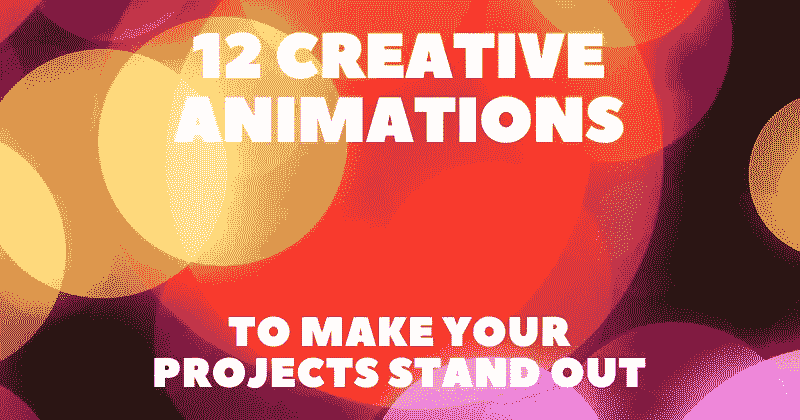

# 12 个创意动画让你的项目脱颖而出✨💯

> 原文：<https://javascript.plainenglish.io/12-creative-animations-to-make-your-projects-stand-out-d130b35bda68?source=collection_archive---------3----------------------->

## 我最喜欢的一些，为你未来的项目提供灵感。

有创意的动画总是很吸引人，能给人留下专业的印象。在这篇文章中，我整理了一些我最喜欢的，为你未来的项目提供灵感。

对于每个动画，我会提供一个直接的链接，一个交互式的预览，这样你就可以在运行中获得一个初步的印象以及作者链接，这样你也可以探索他们的更多工作。

## 1.[网飞介绍动画](https://codepen.io/claudio_bonfati/pen/mdryxPv)

作者:[克劳迪奥·邦法蒂](https://codepen.io/claudio_bonfati)

## 2.[邦戈猫代码](https://codepen.io/carolineartz/pen/qBOEzQa)

作者:[卡罗琳·阿特兹](https://codepen.io/carolineartz)

## 3.[圣诞树快乐](https://codepen.io/chrisgannon/pen/dypvKvR)

作者:[克里斯·甘农](https://codepen.io/chrisgannon)

## 4.[漫长的道路](https://codepen.io/al-ro/pen/xxxxgxK)

由:[铝-铁](https://codepen.io/al-ro)

## 5.[矩阵数字雨](https://codepen.io/yuanchuan/pen/YoqWeR)

作者:[袁川](https://codepen.io/yuanchuan)

## 6.[漂浮的心](https://codepen.io/yuanchuan/pen/wZJqNK)

[远传](https://codepen.io/yuanchuan)

## 7.[咔嗒咔嗒可惜的咔嗒声](https://codepen.io/ste-vg/pen/oKYjKV)

作者:[史蒂夫加德纳](https://codepen.io/ste-vg)

## 8.[霓虹之恋](https://codepen.io/al-ro/pen/BaaBage)

由；[铝滚](https://codepen.io/al-ro)

## 9.[动画 CSS 季](https://codepen.io/agathaco/pen/rpZoYd)

由 [agathaco](https://codepen.io/agathaco)

## 10.[低聚动物](https://codepen.io/ainalem/pen/dKLpBE)

作者:[米凯尔·艾纳勒姆](https://codepen.io/ainalem)

## 11.[土星呼啦圈](https://codepen.io/jcoulterdesign/pen/BrdPaw)

作者:[杰米·库尔特](https://codepen.io/jcoulterdesign)

## 12.[基于鼠标视差的日落](https://codepen.io/quinlo/pen/XPVmVj)

作者:[亚当·昆兰](https://codepen.io/quinlo)

写作一直是我的激情所在，帮助和激励他人给我带来了快乐。如果您有任何问题，请随时联系我们！

如果这些资源有帮助，请在 [Twitter](https://twitter.com/madzadev) 、 [LinkedIn](https://www.linkedin.com/in/madzadev/) 和 [GitHub](https://github.com/madzadev) 上联系我！

访问我的[博客](https://madza.dev/blog)获取更多类似的文章。

*更多内容请看* [***说白了就是***](https://plainenglish.io/) *。报名参加我们的* [***免费每周简讯***](http://newsletter.plainenglish.io/) *。关注我们* [***推特***](https://twitter.com/inPlainEngHQ) *和*[***LinkedIn***](https://www.linkedin.com/company/inplainenglish/)*。加入我们的* [***社区不和谐***](https://discord.gg/GtDtUAvyhW) *。*