# 每个 Web 开发人员都必须知道的 12 个重要 JavaScript 代码片段

> 原文：<https://javascript.plainenglish.io/12-important-javascript-snippets-every-web-developer-must-know-aeab46aa6f97?source=collection_archive---------5----------------------->

## 作为 web 开发人员，节省时间和优化代码的 12 个重要 JavaScript 函数

Photo by [Markus Spiske](https://unsplash.com/@markusspiske?utm_source=medium&utm_medium=referral) on [Unsplash](https://unsplash.com?utm_source=medium&utm_medium=referral)

在这篇文章中，你将了解到 **12 个重要的 JavaScript 片段**。您可以将本文作为 web 开发人员的工具箱，并在您的 JavaScript 项目中尽可能使用它们。

你在这里学到的一切都将加速你的发展，为你节省宝贵的时间！

所以不浪费更多的时间，让我们开始吧。

# 1.计数出现次数

这个 JavaScript 代码片段使用 reduce 函数计算数组中某个值的出现次数。

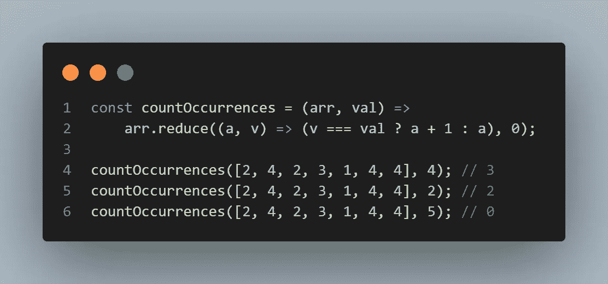

Count occurrences in JavaScript

# 2.每个

如果谓词函数为所提供的集合中的每个元素返回“true ”,则该 JavaScript 片段返回 true。省略第二个参数`fn`，将布尔值作为默认值。

Every in JavaScript

# 3.将数组转换为 CSV

这个 JavaScript 代码片段将数组中的元素转换成 CSV 格式。非常简单，没有错误处理，但从应用程序/网站导出数据可能很有用。

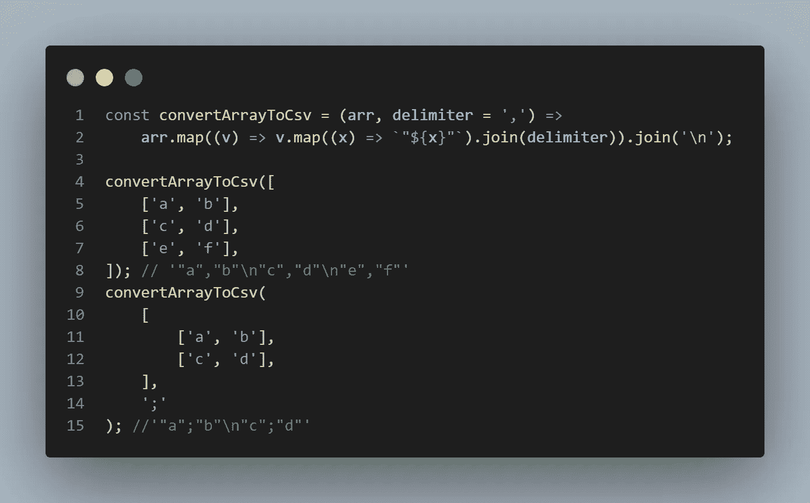

Convert Array To CSV in JavaScript

# 4.近似相等

这个 JavaScript 代码片段检查两个数字是否近似相等，有微小的差异

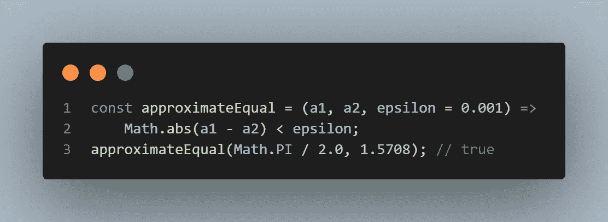

Approximate Equal in JavaScript

# 5.计算两个数组之间的交集

这个 JavaScript 代码片段通过从第二个数组创建一个集合，并使用过滤器来查找交集，从而在两个输入数组之间生成交集。

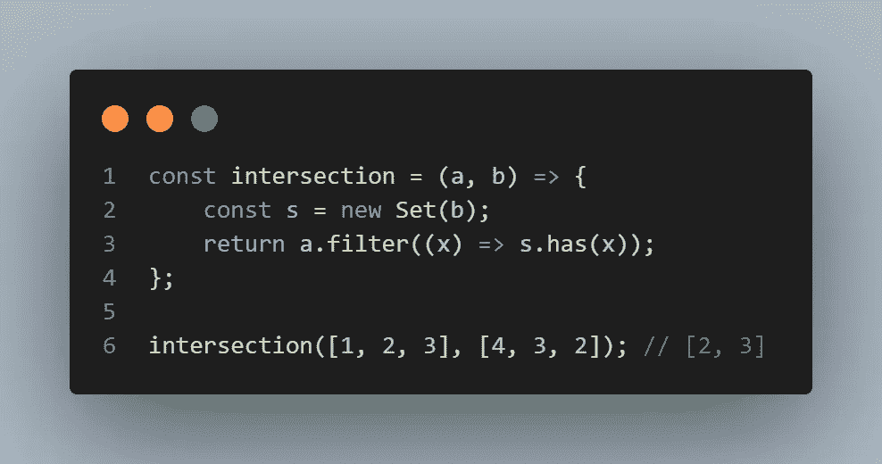

Calculate Intersection Between Two Arrays in JavaScript

# 6.检查变位词

这个 JavaScript 片段检测两个字符串是否是字谜

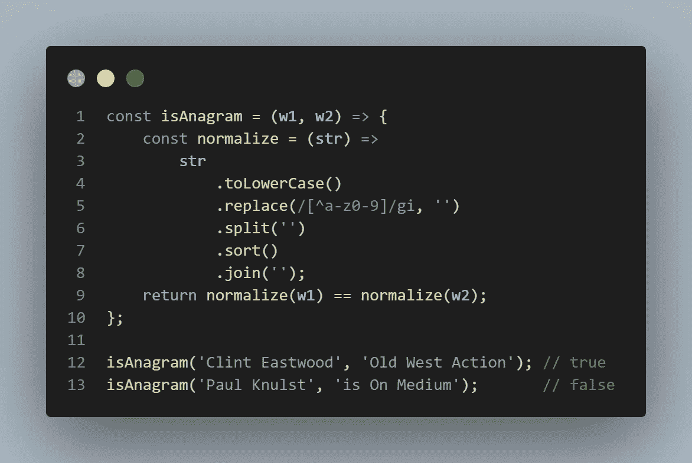

Check For an Anagram in JavaScript

# 7.isNumber

这个 JavaScript 代码片段可以用来判断一个提供的值是否是一个数字！它检查输入是否是有限的和一个数字。

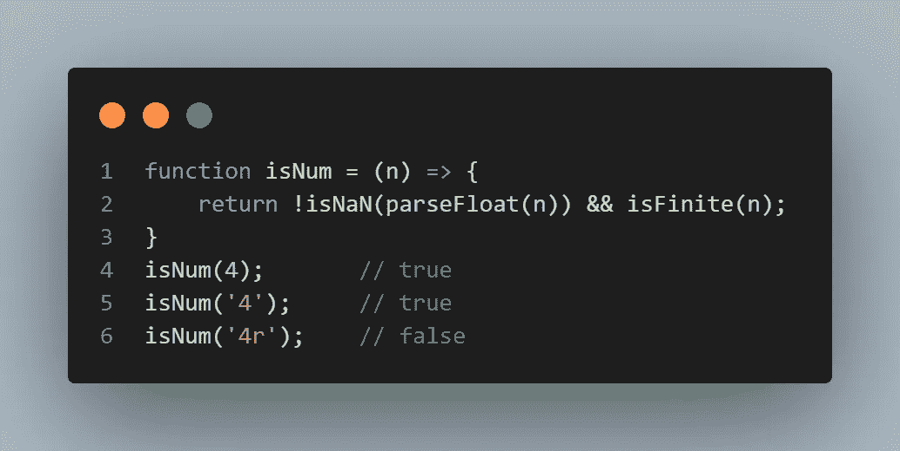

isNumber om JavaScript

# 8.平均的

这个 JavaScript 代码片段计算所有提供的数字的平均值。输入数字的数量并不重要。

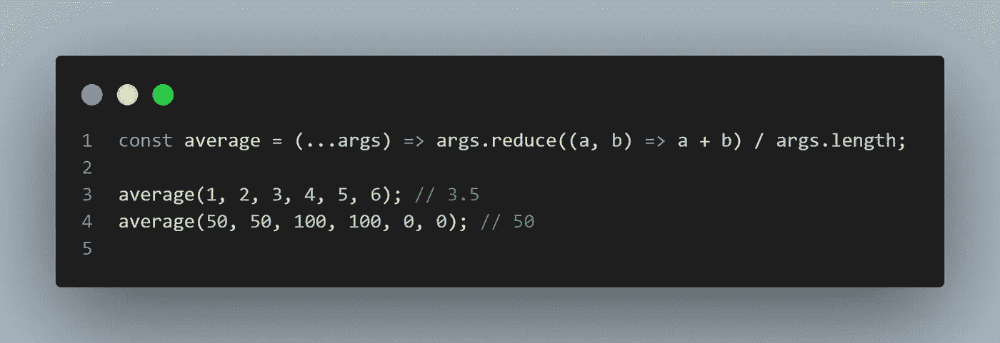

Average in JavaScript

# 9.轮次

这个 JavaScript 代码片段将一个数字舍入到指定的位数。可以在函数调用期间设置位数。

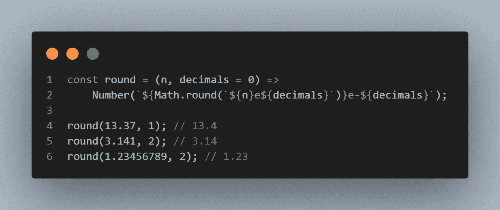

Round in JavaScript

# 10.随意

这个 JavaScript 代码片段在两个值之间生成一个随机数。它使用`Math.floor`和`Math.random`。

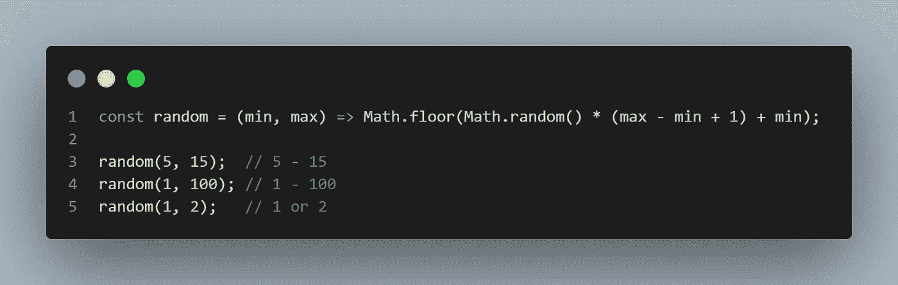

Random in JavaScript

# 11.伊斯尼尔

这个 JavaScript 代码片段检查输入属性是否为空或未定义。

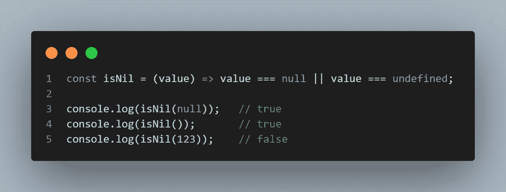

isNil in JavaScript

# 12.大写开始字符

这个 JavaScript 代码片段将大写字符串中单词的每个第一个字符。此外，如果提供了`true`，那么在仅大写起始字符之前，所有内容都将被降低。

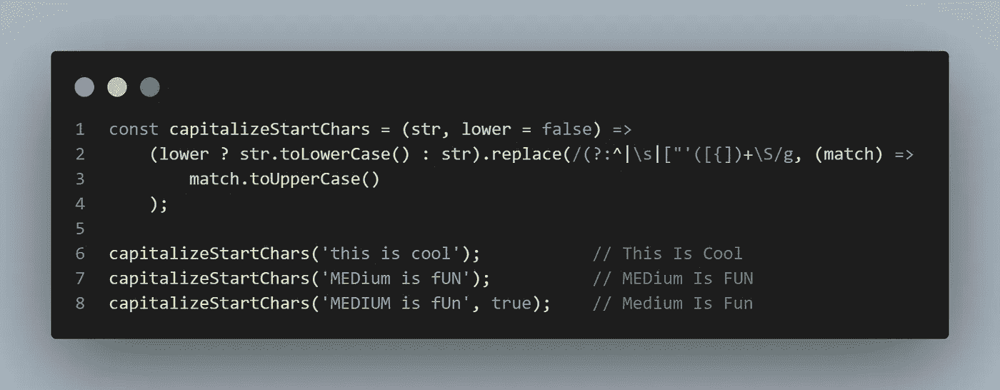

Capitalize Start Chars in JavaScript

# 结束语

希望这篇文章对你有帮助！如果你也有好的 JavaScript 函数可以分享，欢迎在这里发表评论并与其他开发者分享。

**快乐的 JavaScript 编码。**

此外，我创建了一个访问函数的要点，可以在我的 GitHub 简介中找到

请随时在我的博客、 [LinkedIn](https://www.linkedin.com/in/paulknulst/) 、 [Twitter](https://twitter.com/paulknulst) 和 [GitHub](https://github.com/paulknulst) 上与我联系。

如果这是有帮助的，如果你给这篇文章一个👏如果你还没有，关注一下会很好。

也请考虑通过下面我的[推荐](https://medium.knulst.de/membership)链接订阅 Medium。这很棒，我用它来了解技术领域的最新动态，并从其他开发人员的经验中学习。

你的订阅将直接支持我和许多其他媒体作家。

 [## 通过我的推荐链接加入媒体

### 阅读 Paul Knulst(以及媒体上成千上万的其他作家)的每一个故事。您的会员费直接支持…

medium.knulst.de](https://medium.knulst.de/membership) 

*更多内容看* [***说白了。报名参加我们的***](https://plainenglish.io/) **[***免费周报***](http://newsletter.plainenglish.io/) *。关注我们关于* [***推特***](https://twitter.com/inPlainEngHQ) ，[***LinkedIn***](https://www.linkedin.com/company/inplainenglish/)*，*[***YouTube***](https://www.youtube.com/channel/UCtipWUghju290NWcn8jhyAw)*，以及* [***不和***](https://discord.gg/GtDtUAvyhW) *。对增长黑客感兴趣？检查* [***电路***](https://circuit.ooo/) *。***