# 面向前端开发人员的 12 款强大设计工具✨💯

> 原文：<https://javascript.plainenglish.io/12-powerful-design-tools-for-front-end-developers-9547aad1c5aa?source=collection_archive---------3----------------------->

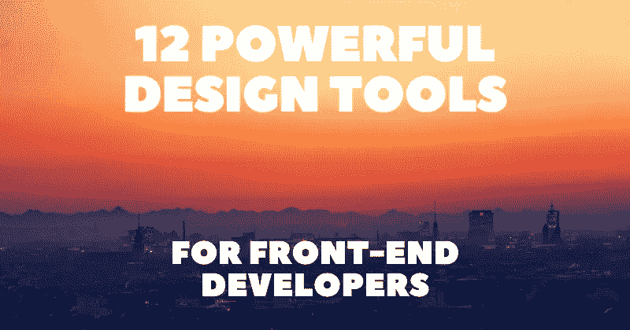

引人注目的设计是保持访问者注意力的有效方法。我收集了一些最有用的工具，可以帮助你改进设计工作流程。

有了这个集合，您将能够为您的设计制作草图，挑选调色板，创建渐变，添加阴影，制作动画，包括自定义背景，找到合适的插图，试验不同的布局系统和组件，等等。

每个工具都包括一个直接链接、一个描述和一个图像预览。

## 1. [excalidraw](https://excalidraw.com/)

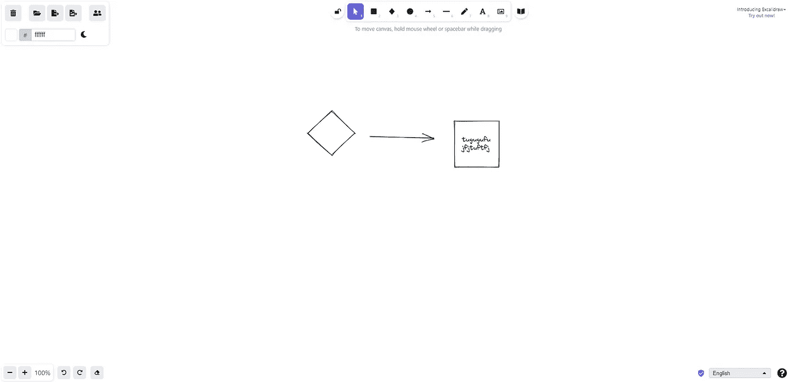

用于绘制手绘图表的虚拟白板。

## 2.[我的颜色空间](https://mycolor.space/)

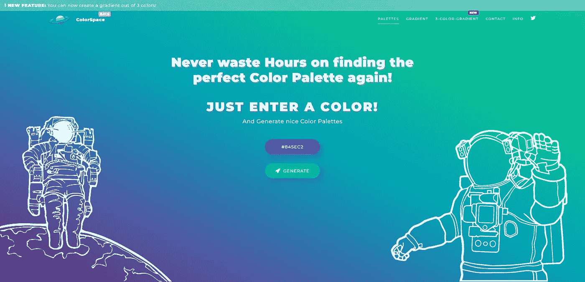

通过输入颜色并生成结果来找到完美的调色板。

## 3.[祝福](https://www.grabient.com/)

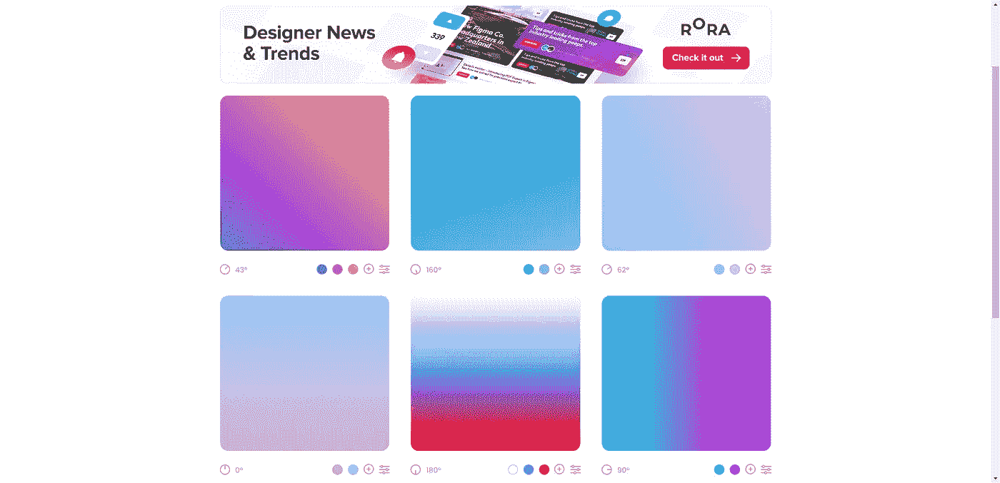

令人敬畏的 UI 工具生成线性网页渐变。

## 4.[方框阴影](https://brumm.af/shadows)

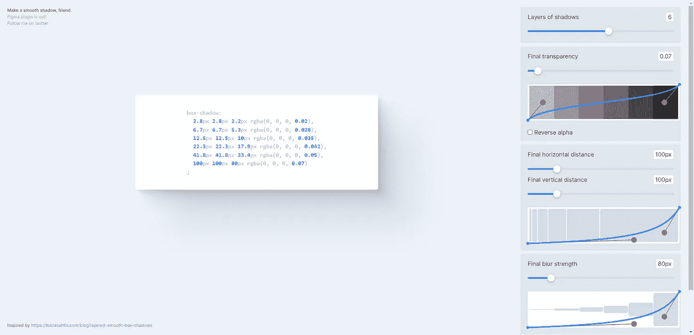

带有模糊、透明度、位置和其他参数的阴影发生器。

## 5.[电网发电机](https://cssgrid-generator.netlify.app/)

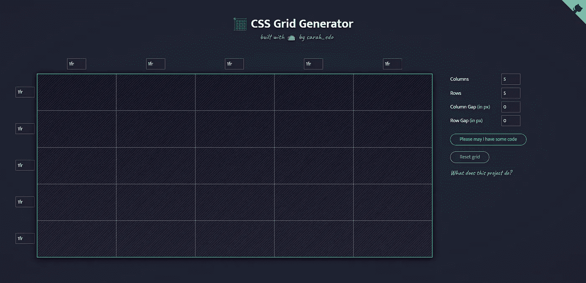

生成基本的 CSS 网格代码来制作动态布局。

## 6.[关键帧](https://keyframes.app/animate/)

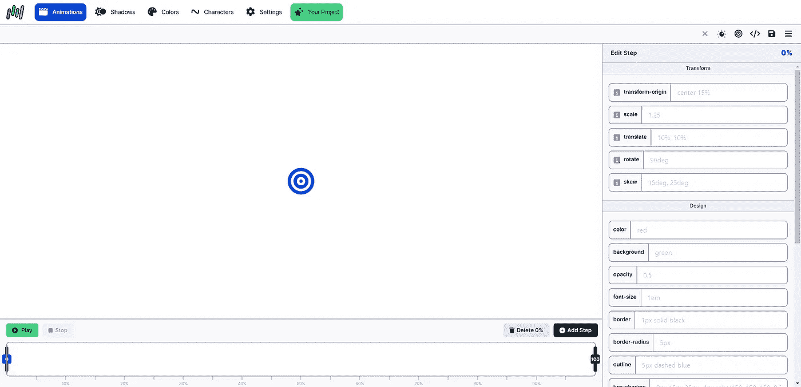

使用可视化时间轴编辑器创建 CSS @keyframe 动画。

## 7.[SVG-背景](https://www.svgbackgrounds.com/)

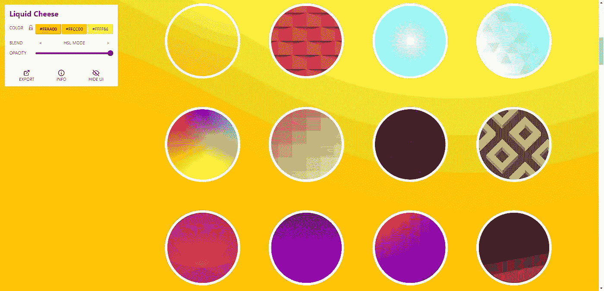

一个 SVG 背景的集合，可以很容易地在你的网站上使用。

## 8.[未绘制](https://undraw.co/)

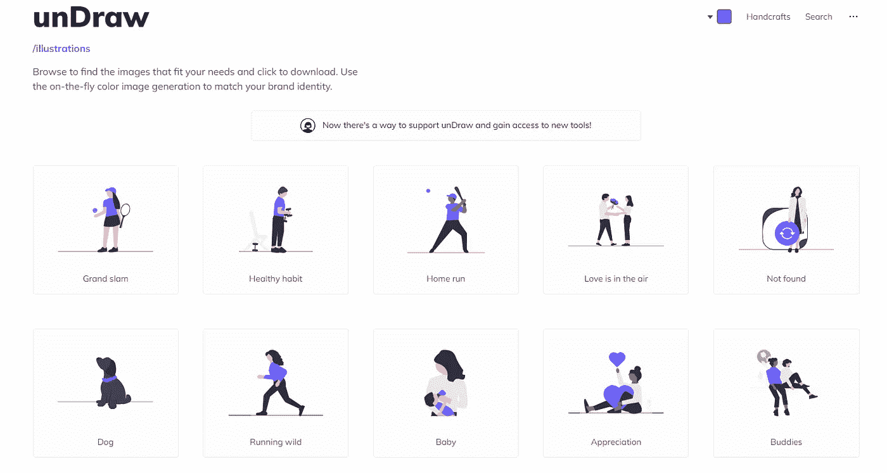

你能想象和创造的任何想法的开源插图。

## 9.[牛头刨床](https://hihayk.github.io/shaper/)

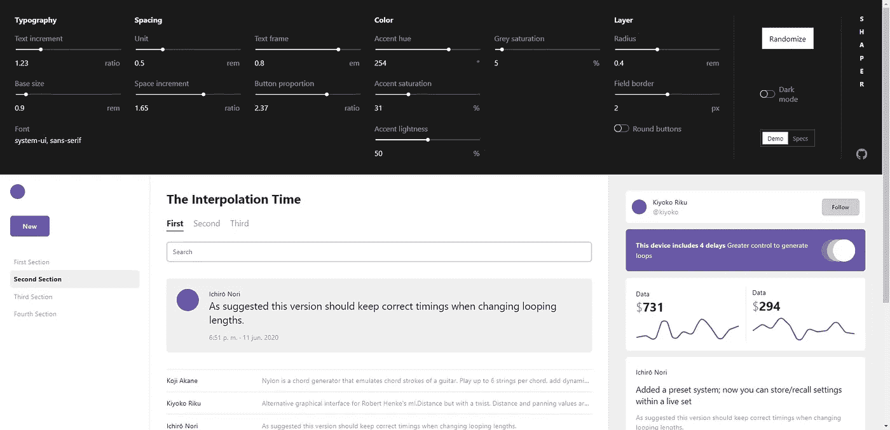

界面样式整形器。尝试排版、间距、颜色和图层。

## 10. [fontjoy](https://fontjoy.com/)

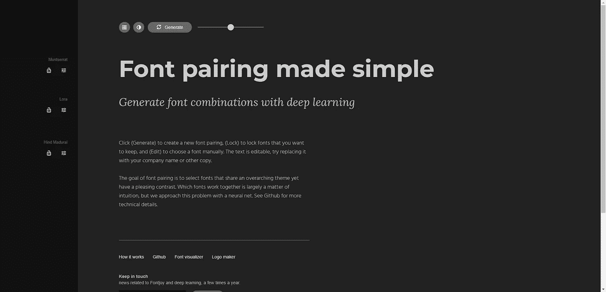

字体配对变得简单。用深度学习生成字体组合。

## 11.[无头 ui](https://headlessui.com/)

完全无样式、完全可访问的 UI 组件。

## 12.[希兹](https://sizzy.co/)

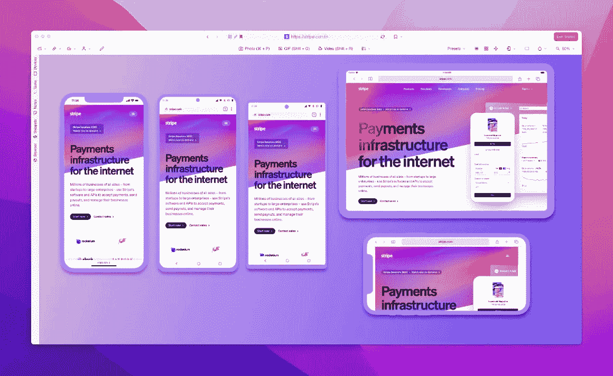

面向开发人员的浏览器，使响应式设计变得轻而易举。

写作一直是我的激情所在，帮助和激励他人给我带来了快乐。如果您有任何问题，请随时联系我们！

在[推特](https://twitter.com/madzadev)、[领英](https://www.linkedin.com/in/madzadev/)和[推特](https://github.com/madzadev)上联系我！

访问我的[博客](https://madza.dev/blog)获取更多类似的文章。

*更内容见于* [***普通英语中***](https://plainenglish.io/) *。报名参加我们的* [***免费周报***](http://newsletter.plainenglish.io/) *。* [***推特***](https://twitter.com/inPlainEngHQ)[***领英***](https://www.linkedin.com/company/inplainenglish/)*[**YouTube**和](https://www.youtube.com/channel/UCtipWUghju290NWcn8jhyAw)[**T50**](https://discord.gg/GtDtUAvyhW)*不和。**