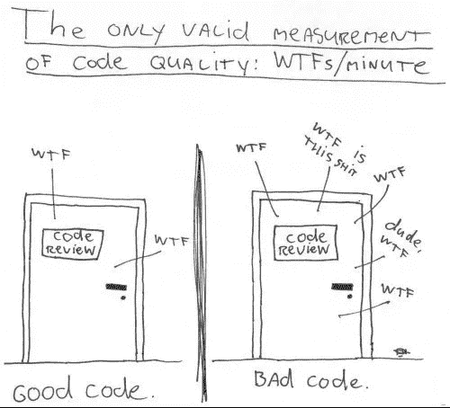
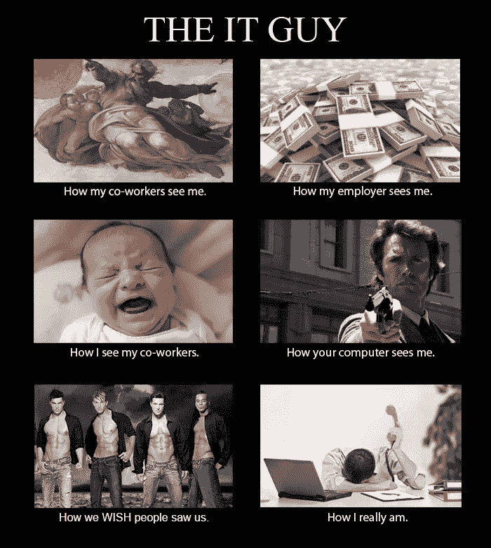
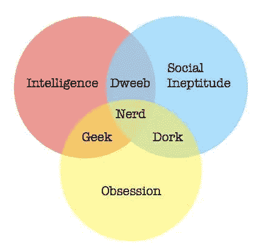
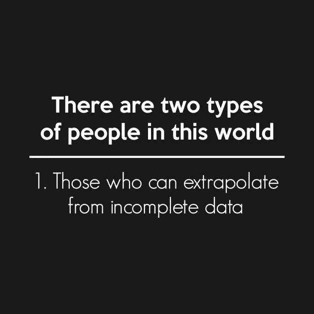
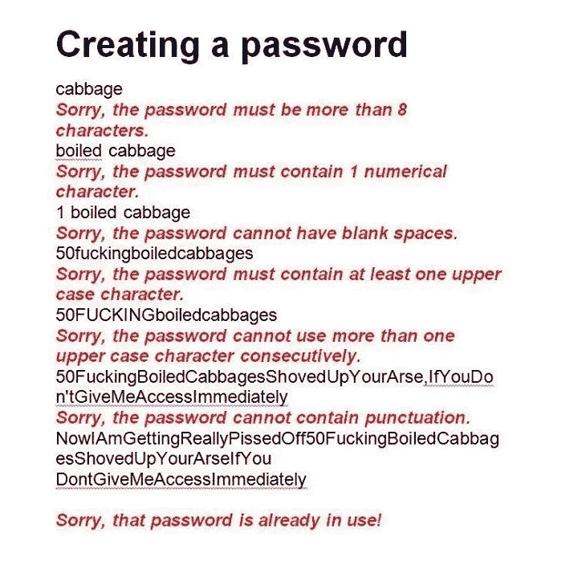
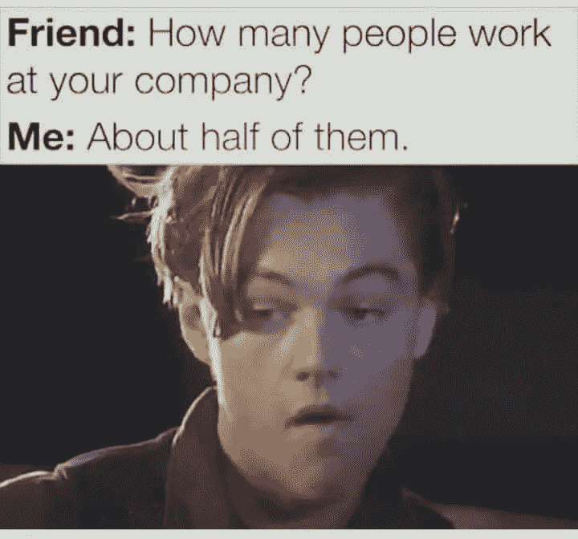

# 我们都需要的 12 个程序员迷因

> 原文：<https://javascript.plainenglish.io/12-programmer-memes-we-all-need-d2a88ee8e937?source=collection_archive---------4----------------------->

## 5 分钟休息

## 有时一张照片和一句俏皮话就能说明一切

Image by [baranq](https://depositphotos.com/portfolio-1637787.html) via DepositPhotos

我喜欢迷因。科技迷因是最好的。所以我收集了一把给你阅读享受。休息 5 分钟，随时与你的朋友和同事分享。

# 代码质量

这个迷因已经存在很长时间了，但是重温它总是很有趣，因为，嗯，这就是我们过去做代码评审的方式。现在刚搬到 GitHub。

Image creator unknown.

# IT 人员

你在生活中的某个时刻，在 IT 部门工作，或者作为一名 IT 人员(或女孩)，曾经经历过，即使那不是你工作描述的一部分。不知何故你被拉去修理每个人的机器。

Meme author unknown.

# 技术供应商

我们都在某种程度上陷入了这个奇怪的幽默却又奇怪的准确的维恩图。我们都知道中间至少有一个人…

Venn diagram author unknown.

# 我们到底知道多少？

像这样的迷因真正提醒我们，我们知道的并不像我们认为的那样多。你能制造一台内燃机吗？将原油提炼成汽油；制造一台电动机；一台发电机；一块电池；简单的电子元件，如电阻、电容，甚至是半导体，如晶体管？

Meme author unknown.

# 负责任地使用原力

这个是不言自明的。你也会的。别再骗自己了。

Meme creator unknown.

# 愚蠢的面试问题

这就是我们真正想要回答的那些愚蠢的无意义的问题。

Meme creator unknown.

# 当他们拒绝理解

你有没有在会议中遇到过这样的人，他们要么太迟钝，要么被困在自己的角落里，看不到或不想看到事情为什么会这样？是的，我们都去过那里。这个迷因是给他们的。

Meme creator unknown.

# 有两种人

我们大多数人都熟悉这个迷因的二进制版本……这一个是给所有那些数据科学人的……

Meme author unknown.

# 我们知道我们是谁

是的，当我们需要的时候，我们都是团队成员…但是有一些日子，你只需要拿出这个杯子，装满星巴克苏门答腊咖啡！

Meme author unknown.

# 密码安全性

我有一个家庭成员非常讨厌密码强度验证器。话说回来，这就是 Paypal 账户被黑的家庭成员，因为他们的密码是“drpepper”。说真的。

Meme author unknown.

# 你具体是做什么的？

有时候你会想，在你工作的办公室里，所有这些人都做什么，或者不做什么。

Meme author unknown.

# 尤达是个程序员

对我来说很有趣的是，有很多程序员不会明白这一点。别担心。只要数据包到达…或者不到达。

Image author unknown.

____________________

Beau Beauchamp 是一名 web 应用程序架构师，拥有 20 多年在云中开发企业级应用程序的经验；他是[*WebTigers*](https://webtigers.com/)*的创始人，也是虎扑平台背后的首席开发者。*

*更多内容请看*[***plain English . io***](https://plainenglish.io/)*。报名参加我们的* [***免费周报***](http://newsletter.plainenglish.io/) *。关注我们关于*[***Twitter***](https://twitter.com/inPlainEngHQ)*和**[***LinkedIn***](https://www.linkedin.com/company/inplainenglish/)*。加入我们的* [***社区***](https://discord.gg/GtDtUAvyhW) *。**