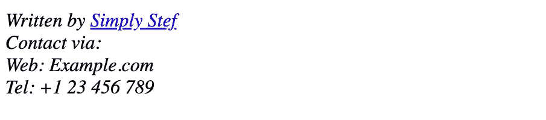
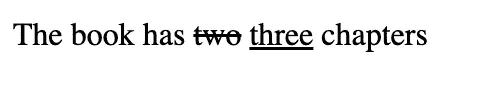

# 你应该知道的 12 个不常见的 HTML 标签

> 原文：<https://javascript.plainenglish.io/12-uncommon-html-tags-that-you-probably-should-know-df7ab66aa0c6?source=collection_archive---------7----------------------->

HTML 是网页设计的基础语言，通常在某人的旅程早期就已经学会了。我们知道在工作中使用正确的标签是多么重要。然而，在发现 HTML 之后有这么多东西要学，使用熟悉的标签很容易。

实际上有很多不同的标签可以达到你想要的效果。其中一些可能看起来有点具体，但如果使用正确，肯定会为您节省一两行代码，并带来一个非常优雅的解决方案！我在下面收集了 12 个不太为人知但非常有用的标签。

Christopher Gower via Unsplash

# **1。缩写<缩写>**

当光标悬停在缩写上时，给出缩写的解释。解释出现在一个单独的框中，这有助于保持文本看起来简洁，同时仍然便于用户访问。

# **2。元数据<元>元**

meta 标签给出了关于你正在制作的文档的信息。元数据有助于告诉浏览器如何解析内容、关键字和描述网站的描述、作者是谁或使用什么刷新率等等。事实上，我可能会很快就此发表一篇完整的文章，因为在这个 SEO 的世界里，我对元数据了解得越多，它似乎就越重要。

# **3。详细章节<详细内容>**

这样一个简单的方法来保持一个光滑的网页，同时能够解释完整的概念。details 标签给出了一个可折叠的标题，其中可以包含更多的信息。

使用一个

部分在细节标签中指定标题，然后标题中包含的任何内容都写在标题下面

# **4。计<计>计**

当想要构建一种以图形方式显示事物状态的方法时，仪表标签是一种简单的解决方案。标签本身生成一个填充到您设置的级别的栏，通过使用相应的标签选项卡，这是一个显示座位可用性或库存水平等信息的好解决方案。这个标签不用于进度，因为有一个不同的更具体的标签(…这是列表中的下一个)。

# 5.进度条

与上面的仪表标签类似，进度标签用于以图形方式显示指标。主要区别在于，这里没有设置最小参数，因为进度条假设所有进度都从 0%开始。与 meter 标签一样，结果是一个图形条，当它与 label 标签结合时，有一个解释您正在跟踪的进度项目的标题。

# **6。地址<地址>地址**

地址标签定义了联系信息，可以是电子邮件地址、物理地址、社交媒体句柄等。默认情况下，文本以*斜体、*显示，浏览器会在文本前后添加一个换行符，以清楚地显示联系人的详细信息。

# 7 .**。键盘输入<kbd>**

当创建需要键盘输入的培训内容时，这个标签非常有用。

默认情况下，它以默认的等宽字体显示内容，这看起来并不令人印象深刻，但是，通过使用几行 CSS 就可以实现更具创造性的显示，快速格式化您可能有的所有键盘快捷键。

# **8。日期时间<时间>时间**

时间标签定义了特定的时间或日期。它有一个“datetime”属性，可用于将时间转换为机器可读的格式。这非常有用，因为它允许浏览器提供日期提醒或用户日历的链接。

# **9。可选组<opt group>**

这个 optgroup 标记在创建一个有很长选项列表的表单时非常有用。它允许你将下拉列表分成几个组，并添加一些顺序和类别，这可能很快变成一个导航挑战。

# 10。插入< ins >并删除<del>

这些标签可用于显示文档中的标记。默认情况下，大多数浏览器会给文本加下划线来格式化

# **11。模板<模板>模板**

template 标签被用作一个容器，在页面加载时保存一些对用户隐藏的 HTML 内容。如果您希望稍后使用 JavaScript 呈现某些内容，或者希望在整个网页过程中引用这些内容，这将非常有用。

# **12。批量报价<批量报价>**

blockquote 标签指定了从其他来源引用的部分。对于较长的文本部分，这是一个很好的选择，因为浏览器通常默认缩进文本，以突出它是一个引用，并将其与段落的主体分开。

完全披露:其中一些标签是我在研究这篇文章时才发现的。不知何故，这对我来说更值得，因为我现在有了一些新工具来整理和改进我的 HTML，并且能够与任何正在阅读这篇文章的人分享它们——这是一个真正的双赢！如果有任何你认为我错过的标签，请在评论中告诉我！

> 如果你喜欢这篇文章，并想阅读更多，请务必查看我的个人资料中的类似内容。考虑成为一个媒体成员，以获得无限的接触最好的想法和作家。
> 
> 如果你通过这个链接加入 Medium，我会从你的费用中收取很少的一部分——而且不会花你任何额外的钱！提前感谢。 **💰**
> 
> *感谢阅读！*

*更多内容请看*[***plain English . io***](https://plainenglish.io/)*。报名参加我们的* [***免费周报***](http://newsletter.plainenglish.io/) *。关注我们关于*[***Twitter***](https://twitter.com/inPlainEngHQ)*和*[***LinkedIn***](https://www.linkedin.com/company/inplainenglish/)*。加入我们的* [***社区不和谐***](https://discord.gg/GtDtUAvyhW) *。*