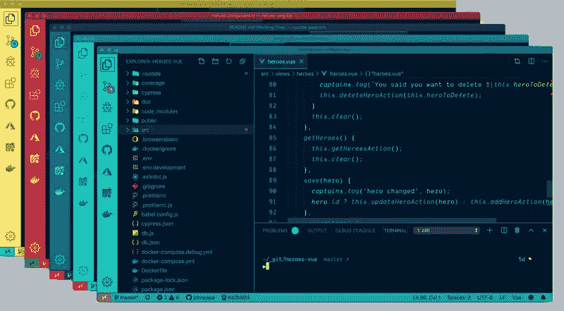
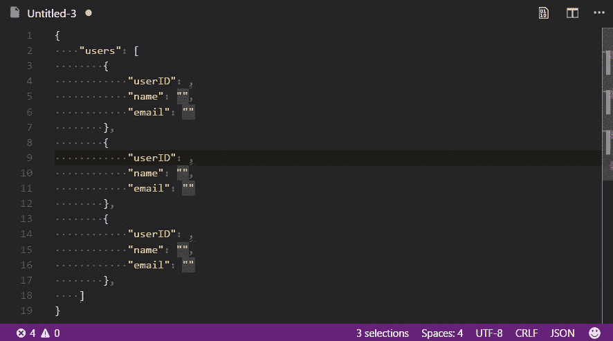
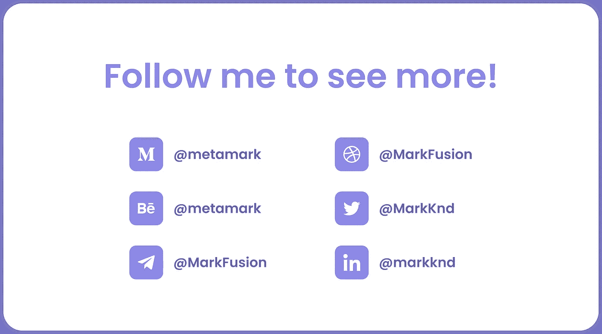

# 作为开发人员，您绝对需要的 12 个不寻常的 VS 代码扩展

> 原文：<https://javascript.plainenglish.io/12-unusual-vs-code-extensions-you-definitely-need-as-a-developer-71a7f745d5e?source=collection_archive---------1----------------------->

## 虚拟代码

## 在这些扩展的帮助下，您可以改进您的工作流程，提高您的生产率，并使 VSCode 更漂亮！

Photo by [blurrystock](https://unsplash.com/@blurrystock?utm_source=unsplash&utm_medium=referral&utm_content=creditCopyText) on [Unsplash](https://unsplash.com/?utm_source=unsplash&utm_medium=referral&utm_content=creditCopyText)

VS 代码是最流行的编程 IDE。它支持几乎每一种编程语言，而且非常强大。而且 VS Code 的一个主要好处就是可以快速安装一些很酷的扩展或者插件，对你的工作会有很大的提升。大多数程序员已经熟悉了这些基本的扩展，但是在本文中，我们不会谈论它们。我们将更好地讨论一些真正不寻常的扩展，它们将帮助您以最有效的方式完成您的特定任务！

# [1。项目仪表板](https://marketplace.visualstudio.com/items?itemName=kruemelkatze.vscode-dashboard&ref=hackernoon.com)

在着手一个新项目之前，你肯定需要组织上一个项目，让一切都井井有条。名为 VSCode Project Dashboard 的 Visual Studio 代码扩展使您能够以任何可能的方式组织项目。您可以快速访问常用的文件、文件夹和 SSH 远程设备，并将它们固定在仪表板上。

Project Dashboard

# [2。Git 图形](https://marketplace.visualstudio.com/items?itemName=mhutchie.git-graph)

如果您经常使用 GIT，那么您肯定需要安装这个扩展。使用 Git Graph，您可以很容易地查看您的历史，以及您的所有提交，并对它们进行操作。正如您在下面的示例中看到的，您可以直接在 VSCode 中访问您的存储库的每个重要方面，这非常有用。即使你还没有使用过 Git，你也应该开始使用了。这是与您的团队合作的最简单和最好的方式，它将成倍地改进您的工作流程！

Git Graph

# [3。切换禅模式](https://marketplace.visualstudio.com/items?itemName=fudd.toggle-zen-mode)

如果我知道这个扩展，我就不会如此草率地编写代码，并且可以更快地完成任务。切换 Zen 模式增加了一个新按钮。当你按下这个按钮时，它将激活 VSCode 的 Zen 模式功能，并从屏幕上删除所有不必要的混乱。换句话说，它帮助你更专注于你的代码，进入一个流语句，这将显著提高你的生产力和效率！

Toggle Zen Mode

# [4。孔雀](https://marketplace.visualstudio.com/items?itemName=johnpapa.vscode-peacock)

我们列表中的下一个扩展是孔雀，它有超过 190 万次下载；但是，很多开发者还是没有听说过。它只是改变了 Visual Studio 代码工作区的颜色。当您有多个 VS 代码实例或者使用 VS 代码的远程特性时，这是快速识别您的编辑器的理想选择。

Peacock

# [5。块菌](https://marketplace.visualstudio.com/items?itemName=trufflesuite-csi.truffle-vscode)

Web 3.0 领域和与之相关的所有技术，如加密、NFT、DeFi 和许多其他技术，现在都在蓬勃发展。我写过一篇关于 Web 3.0 在未来的重要性，以及为什么你要关注它的文章。许多在这个领域工作的开发人员正在努力编写关于 Solidity 的智能合同，Solidity 是以太坊的一种编程语言。Truffle for VS Code 简化了您在以太坊和所有 EVM 兼容的区块链和第 2 层扩展解决方案上创建、构建、调试和部署智能合约的方式。因此，如果你是区块链的开发者，你肯定需要它！

Truffle

# [6。远程— SSH](https://marketplace.visualstudio.com/items?itemName=ms-vscode-remote.remote-ssh)

**Remote — SSH** 扩展允许您使用任何带有 SSH 服务器的远程机器作为您的开发环境。这可以在各种情况下极大地简化开发和故障排除。您可以在部署到的相同操作系统上进行开发，也可以使用比本地机器更大、更快或更专用的硬件。此外，在不同的远程开发环境之间快速切换，并安全地进行更新，而不用担心影响您的本地机器。

Remote-SSH

# [7。环绕](https://marketplace.visualstudio.com/items?itemName=yatki.vscode-surround)

这是一个简单而强大的扩展，可以在代码块周围添加包装器片段。通过使用环绕扩展，您可以将代码升级到另一个级别。您可以包装已经存在的行，并将它们变成一个函数、一个循环、一个 try/catch 方法和许多其他基本方法。

Surround

# [8。彩虹 CSV](https://marketplace.visualstudio.com/items?itemName=mechatroner.rainbow-csv)

我讨厌 CSV 文件。没有什么是结构化的，我对不断搜索我需要的特定信息感到厌倦。如果你也在与这些类型的问题作斗争，并希望使你的 CSV 文件可读，那么这个扩展适合你！它突出显示不同类型的数据，并以更好的方式展示给你。

Rainbox CSV

# [9。更好的评论](https://marketplace.visualstudio.com/items?itemName=aaron-bond.better-comments)

更好的评论是一个非常流行的扩展；但是，我还是想把它加到这个列表里。正如您可能从标题中猜到的，它帮助您为代码编写更好的注释。如果你总是纠结于默认的灰色评论，并且找不到重要的评论，那么这个扩展非常适合你。这将使你的评论看起来更漂亮，并帮助其他人更容易理解你的代码！

Better Comments

# 10。随机一切

这个扩展以前包含在我的其他列表中。如果你经常与数据库打交道，或者只是需要一些测试的随机信息，它绝对适合你，尽管我认为它真的很酷。姓名，号码，甚至电子邮件地址都可以使用随机的东西随机生成。所以，是的，这对每个人来说都是非常酷和必不可少的！

Random Everything

# [11。资源监视器](https://marketplace.visualstudio.com/items?itemName=mutantdino.resourcemonitor)

列表中最新的扩展之一是 Resouce Monitor。在这个扩展中没有什么困难。它只是向您显示一些关于您的系统和使用的信息。它可以在 VSCode 状态栏中显示 CPU 频率、使用情况、内存消耗和剩余电池百分比。

# [12。紫色的阴影](https://marketplace.visualstudio.com/items?itemName=ahmadawais.shades-of-purple)

大家都厌倦了[一个暗亲](https://marketplace.visualstudio.com/items?itemName=zhuangtongfa.Material-theme)吧？我也是。所以，可能有一个更好的替代方法可以让你的 VS 代码更漂亮。它叫做“紫色阴影”，是的，你猜对了，这是你的 IDE 的紫色配色方案。但是，没有有毒的颜色，看起来还蛮好看的。我自己也换了这个主题，对结果很满意！

Shades of Purple

# 结论

感谢阅读；我试图在 VSCode marketplace 上找到最不寻常和最有趣的扩展，并告诉你它们。我经常使用其中一些，无法想象没有它们的生活。顺便说一下，这是我以前的文章的新版本，它有许多麻烦。如果你喜欢，别忘了留下掌声，跟我来！

*更多内容请看*[***plain English . io***](https://plainenglish.io/)*。报名参加我们的* [***免费周报***](http://newsletter.plainenglish.io/) *。关注我们关于*[***Twitter***](https://twitter.com/inPlainEngHQ)[***LinkedIn***](https://www.linkedin.com/company/inplainenglish/)*[***YouTube***](https://www.youtube.com/channel/UCtipWUghju290NWcn8jhyAw)*[***不和***](https://discord.gg/GtDtUAvyhW) *。对增长黑客感兴趣？检查* [***电路***](https://circuit.ooo/) *。***