# 12 个有用的 React 工具让你更有效率🚀💯

> 原文：<https://javascript.plainenglish.io/12-useful-react-tools-to-make-you-more-productive-319b28d3e63a?source=collection_archive---------5----------------------->

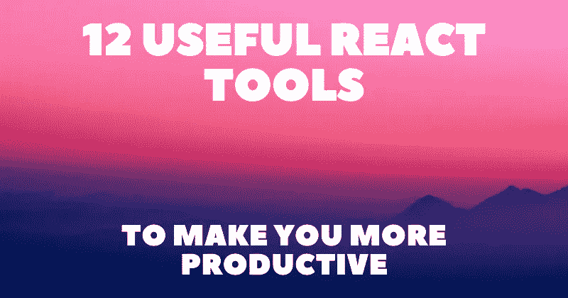

React 是一个开源的、基于组件的 JavaScript 库，用于创建用户界面。它有许多有用的功能，可以更容易地创建现代的、快速的、可访问的网站和 web 应用程序。

不幸的是，了解核心库本身可能还不够，您可能需要探索其他工具来击败竞争对手。

在本文中，我整理了一个工具和资源列表，每个 React 开发人员都应该使用这些工具和资源来提高工作效率。

## 1.[反应测试版文档](https://beta.reactjs.org/)

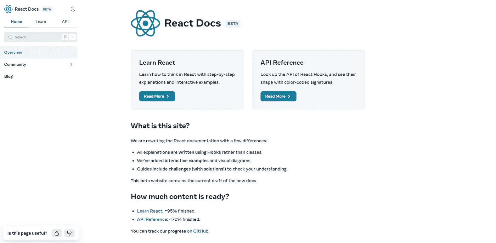

带有挂钩、交互式示例和图表的新 React 文档。

## 2.[创建 React 应用](https://create-react-app.dev/)

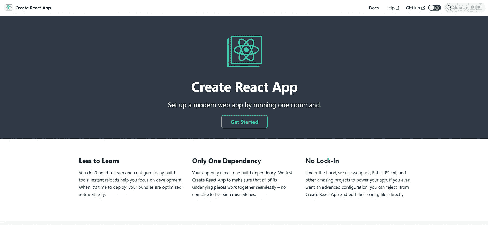

通过运行一个命令设置一个现代化的 web 应用程序。

## 3. [React 开发者工具](https://chrome.google.com/webstore/detail/react-developer-tools/fmkadmapgofadopljbjfkapdkoienihi)

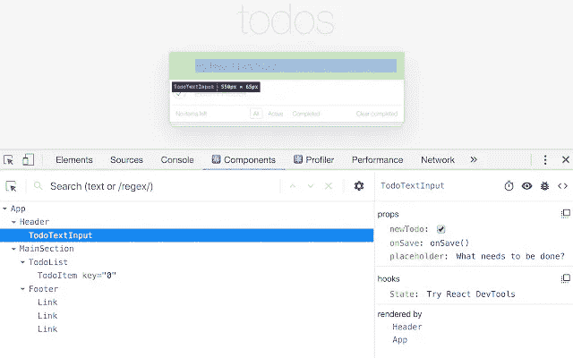

在浏览器控制台中检查 React 组件层次结构。

## 4.[常青树](https://evergreen.segment.com/)

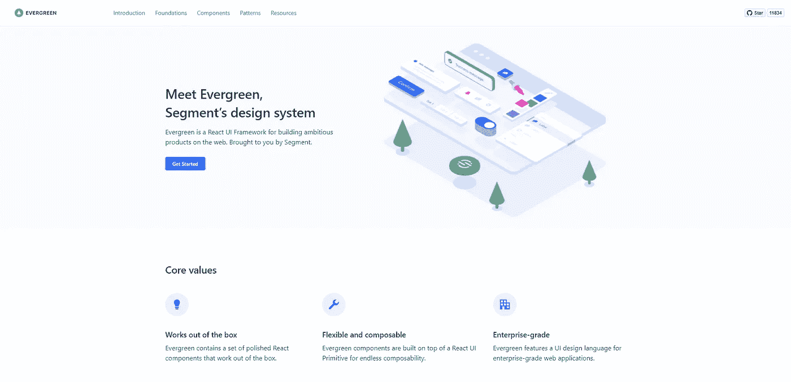

React UI 框架，用于在 web 上构建雄心勃勃的产品。

## 5.[查克拉 UI](https://chakra-ui.com/)

快速构建 React 应用的模块化组件库。

## 6.[成帧器运动](https://www.framer.com/motion/)

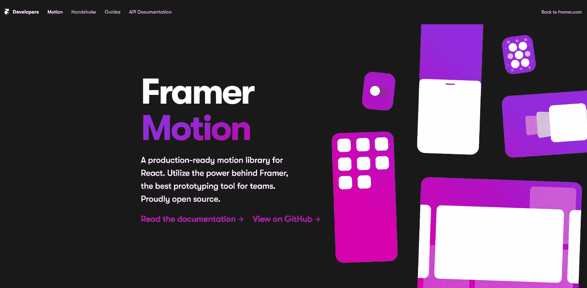

React 的生产就绪运动库。

## 7.[故事书](https://storybook.js.org/)

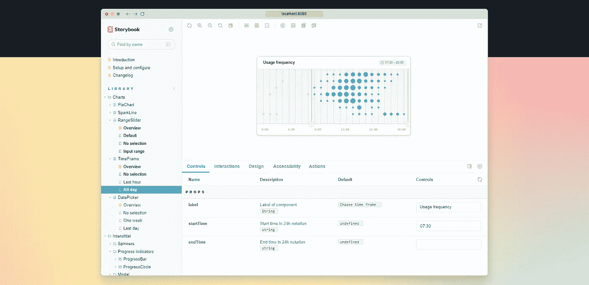

用于构建 UI 组件和页面的前端研讨会。

## 8.[位](https://bit.dev/)

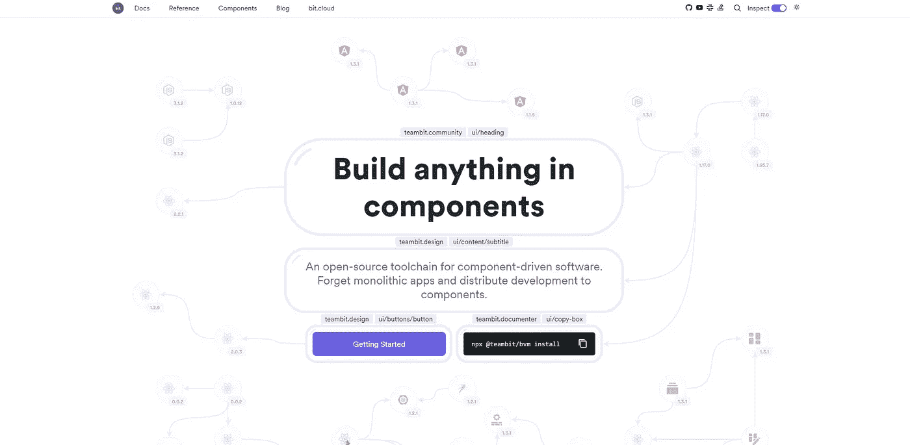

组件驱动开发的领先工具链。

## 9.[反冲](https://recoiljs.org/)

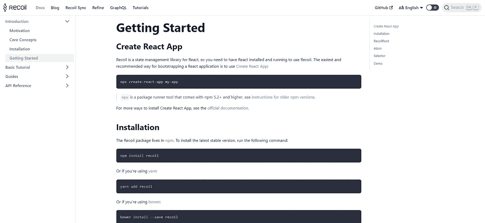

React 的状态管理库。

## 10.[反应位](https://vasanthk.gitbooks.io/react-bits)

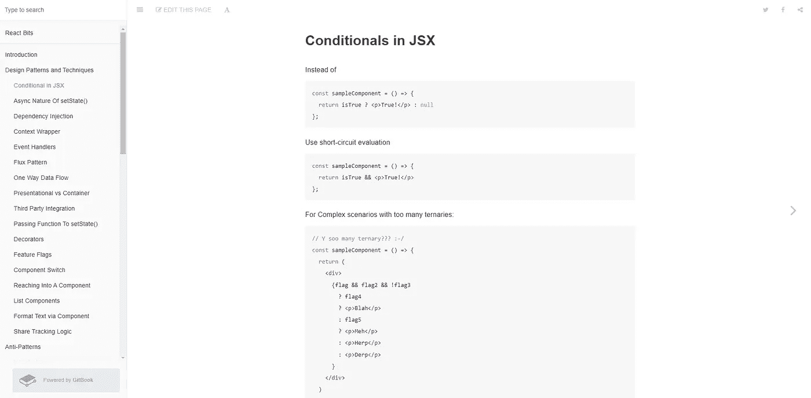

反应模式、技术、技巧和诀窍。

## 11.使用钩子

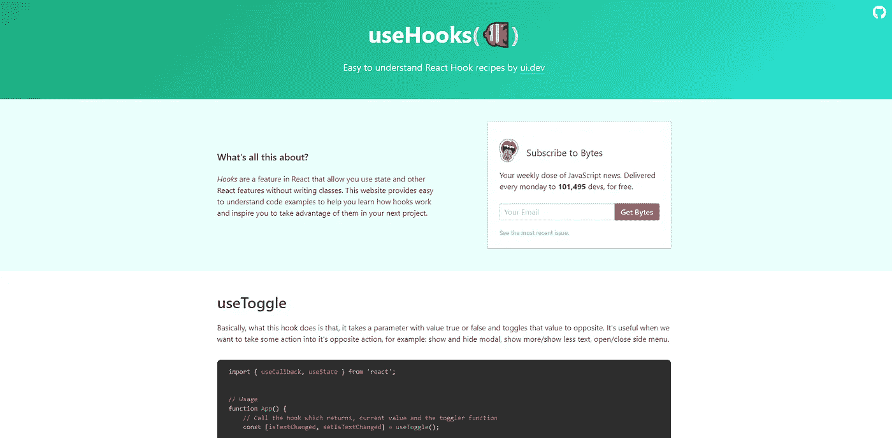

容易理解的反应钩食谱。

## 12. [CodeSandbox](https://react.new)

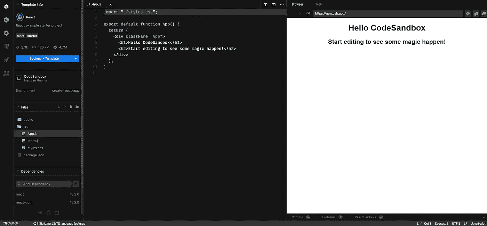

导航到 [react.new](https://react.new) 为 react 创建一个即时沙盒。

写作一直是我的激情所在，帮助和激励他人给我带来了快乐。如果您有任何问题，请随时联系我们！

在 [Twitter](https://twitter.com/madzadev) 、 [LinkedIn](https://www.linkedin.com/in/madzadev/) 和 [GitHub](https://github.com/madzadev) 上给我接通！

访问我的[博客](https://madza.dev/blog)获取更多类似的文章。

*更多内容看* [***说白了。报名参加我们的***](https://plainenglish.io/) **[***免费周报***](http://newsletter.plainenglish.io/) *。关注我们上* [***推特***](https://twitter.com/inPlainEngHQ) ，[***LinkedIn***](https://www.linkedin.com/company/inplainenglish/)***，***[***YouTube***](https://www.youtube.com/channel/UCtipWUghju290NWcn8jhyAw)***，以及****[***不和***](https://discord.gg/GtDtUAvyhW)*** *对成长黑客感兴趣？检查出* [***电路***](https://circuit.ooo/) ***。***