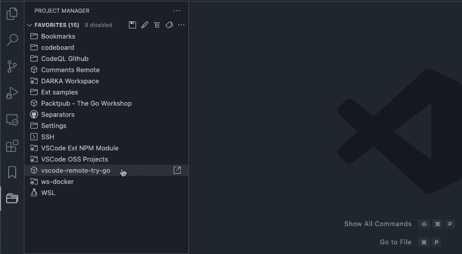
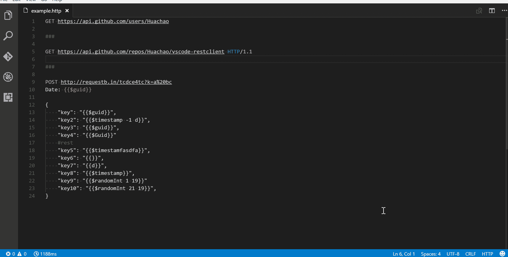

# 作为开发人员，您绝对需要 12 个 VS 代码扩展

> 原文：<https://javascript.plainenglish.io/12-vs-code-extensions-you-definitely-need-as-a-developer-be55bcdc8634?source=collection_archive---------3----------------------->

## VS 代码

## 不管你是谁，网页设计师还是机器学习程序员，它都适合你

Photo by [Muhannad Ajjan](https://unsplash.com/@isword?utm_source=unsplash&utm_medium=referral&utm_content=creditCopyText) on [Unsplash](https://unsplash.com/s/photos/programming?utm_source=unsplash&utm_medium=referral&utm_content=creditCopyText)

如果你是开发人员，VS 代码是你最好的朋友。这是一个令人惊叹的文本编辑器，具有大量的特性和扩展，使编码更容易。在这篇博文中，我们将讨论每个开发人员都应该安装的 12 个 VS 代码扩展！这些扩展将帮助您完成从代码完成到调试到管理项目文件的所有工作。所以事不宜迟，我们开始吧！

# [1。表 9](https://marketplace.visualstudio.com/items?itemName=TabNine.tabnine-vscode)

我们列表中的第一个 VS 代码扩展叫做“Tabnine AI Autocomplete for JavaScript，Python，TypeScript，PHP，Go，Java，Ruby & more”。这个扩展为几乎所有最流行的编程语言在 VS 代码中提供了代码完成功能。对于使用 VS 代码编辑代码的 web 开发人员来说非常有用。

我之前提到过 Kite，一个很棒的 VS 代码扩展，但是你们中的一些人认为 Tab9 更好，消耗的计算机资源更少，所以它在这里。

Tabnine

# [2。Chrome 的调试器](https://marketplace.visualstudio.com/items?itemName=msjsdiag.debugger-for-chrome)

我们列表中的第二个 VS 代码扩展叫做“Chrome 调试器”。这个扩展允许您使用 Google Chrome 浏览器调试 VS 代码中的 JavaScript 代码。对于想用 VS 代码调试代码的 web 开发人员来说非常有用。

Debugger for Chrome

# [3。GItLens](https://marketplace.visualstudio.com/items?itemName=eamodio.gitlens)

我们列表中的第三个 VS 代码扩展叫做“GitLens”。GitLens 是每个使用 Git 的开发者的必备扩展。它允许您在 VS 代码中查看关于 git 存储库的信息。对于希望在 VS 代码中看到自己代码变更信息的开发人员来说，这非常有用。

GitLens

# [4。Git 历史记录](https://marketplace.visualstudio.com/items?itemName=donjayamanne.githistory)

我们列表中的第四个 VS 代码扩展也是针对 Git 用户的，叫做“Git History”。Git History 允许您在 VS 代码中查看 Git 存储库的历史。对于希望在 VS 代码中看到自己代码变更历史的开发人员来说非常有用。

GIt History

# [5。项目经理](https://marketplace.visualstudio.com/items?itemName=alefragnani.project-manager)

我们列表中的第五个 VS 代码扩展叫做“项目经理”。项目管理器是每个从事多个项目的开发人员的必备扩展。它允许你在 VS 代码中管理你的项目。对于想用 VS 代码管理项目的开发人员来说非常有用。

Project Manager

# [6。代码拼写检查器](https://marketplace.visualstudio.com/items?itemName=streetsidesoftware.code-spell-checker)

我们列表中的第六个 VS 代码扩展叫做“代码拼写检查器”。代码拼写检查器是每个想要对代码进行拼写检查的开发人员的必备扩展。对于希望在 VS 代码中对代码进行拼写检查的开发人员来说，这非常有用。

Code Spell Checker

# [7。设置同步](https://marketplace.visualstudio.com/items?itemName=Shan.code-settings-sync)

我们列表中的第七个 VS 代码扩展叫做“设置同步”。设置同步允许你在多台机器上同步你的 VS 代码设置。对于希望在多台机器上保持 VS 代码设置同步的开发人员来说，这非常有用。

Settings Sync

# [8。直播服务器](https://marketplace.visualstudio.com/items?itemName=ritwickdey.LiveServer)

我们列表中的第八个 VS 代码扩展叫做“Live Server”。Live Server 允许您为静态和动态 web 应用程序运行本地开发服务器。对于希望用 VS 代码测试 web 应用程序的开发人员来说，这非常有用。

Live Server

# [9。缩进彩虹](https://marketplace.visualstudio.com/items?itemName=oderwat.indent-rainbow)

我们列表中的第九个 VS 代码扩展叫做“缩进彩虹”。Indent Rainbow 是每个希望自己的代码适当缩进的开发人员的必备扩展。对于希望确保他们的代码在 VS 代码中正确缩进的开发人员来说，这非常有用。

Indent Rainbow

# [10。一个黑暗职业](https://marketplace.visualstudio.com/items?itemName=zhuangtongfa.Material-theme)

我们名单上第十个 VS 代码扩展叫做“One Dark Pro”。One Dark Pro 是每个希望自己的 VS 代码看起来像 Atom 文本编辑器的开发人员的必备扩展。对于希望自己的 VS 代码看起来像 Atom 的开发者来说非常有用。我个人非常喜欢这个扩展，已经用了好几年了，我不能把我的美丽的 VS 代码拿掉！

One Dark Pro

# [11。更漂亮](https://marketplace.visualstudio.com/items?itemName=esbenp.prettier-vscode)

我们列表中的第 11 个 VS 代码扩展叫做“更漂亮——代码格式化程序”。更漂亮——代码格式化程序是每个想要格式化代码的开发人员的必备扩展。对于想用 VS 代码格式化自己代码的开发者来说非常有用。

Prettier: Before

Prettier: After

# [12。休息客户端](https://marketplace.visualstudio.com/items?itemName=humao.rest-client)

我们列表中的最后一个 VS 代码扩展叫做“Rest client”。Rest client 是每个想要测试 REST APIs 的开发人员的必备扩展。对于想要在 VS 代码中测试他们的 REST APIs 的开发者来说非常有用。

Rest Client

# 结论

所以你有了它，12 个最好的 VS 代码扩展！这些扩展将帮助您完成从代码完成到调试到管理项目文件的所有工作。你还在等什么？今天就安装它们并开始编码吧！

你有没有一个我们没有提到的最喜欢的 VS 代码扩展？请在下面的评论中告诉我们！如果你觉得这篇博文有帮助，一定要和你的朋友分享。还有，别忘了在 [Twitter](https://twitter.com/MarkKnd) 上关注我！

*更多内容看**[***说白了. io***](https://plainenglish.io/) *。报名参加我们的* [***免费周报***](http://newsletter.plainenglish.io/) *。关注我们关于*[***Twitter***](https://twitter.com/inPlainEngHQ)*和*[***LinkedIn***](https://www.linkedin.com/company/inplainenglish/)*。加入我们的* [***社区***](https://discord.gg/GtDtUAvyhW) *。**