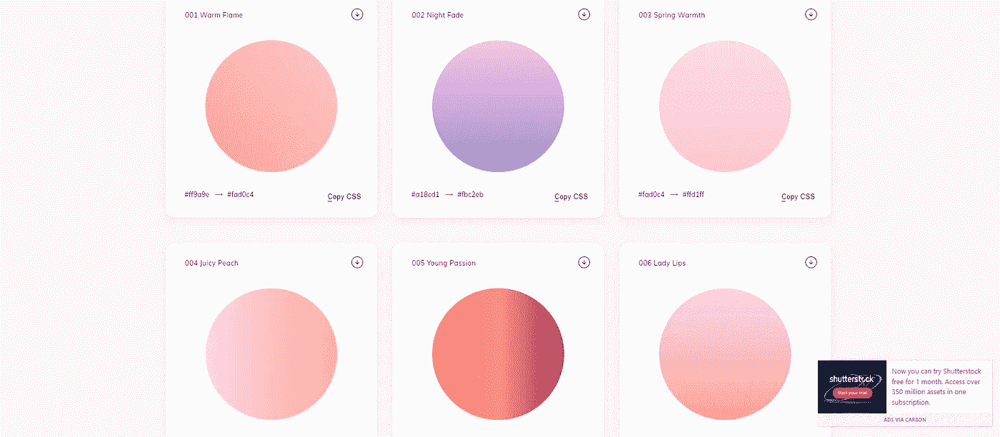

# 每个网页设计师都应该知道的 13 个漂亮的渐变工具💯👍

> 原文：<https://javascript.plainenglish.io/13-beautiful-gradient-tools-every-web-designer-should-know-e8bfcb99314b?source=collection_archive---------15----------------------->

渐变的使用在现代网页设计中很常见。从英雄背景到插图、文本颜色、边框、悬停动画等等，我们随处可见它们。

直接在 CSS 中创建它们可能会花费很多时间，并且需要一些关于不同类型的渐变是如何构造的知识。

为了在这篇文章中帮助你，我收集了一些我最喜欢的渐变工具。我将为您提供工具的直接链接，给你一个简洁的描述，包括工具的截图，这样你可以得到一个初步的印象。

## [网页渐变](https://webgradients.com/)

对于您网站的任何部分，您都可以使用这个免费的 180 线性渐变集合作为内容背景。轻松复制 CSS3 跨浏览器代码，您可以随时使用它。

## [祝福](https://www.grabient.com/)

添加多达 6 种颜色，使用外观时尚的用户界面更改渐变的角度。

## [界面渐变](https://uigradients.com/)

从图库中浏览大量预定义的渐变，并在生成器中编辑渐变方向。开源，所以通过代码添加你自己的渐变。

## [超彩色](https://hypercolor.dev/#gradients)

一个精心挑选的美丽的顺风 CSS 渐变目录，利用了整个顺风 CSS 调色板。只需复制并粘贴类名和 CSS，或将渐变保存为图像。

## [渐变王](https://gradient-king.vercel.app/)

浏览大量基于颜色主题的渐变。还包括一个基于上传的图像颜色生成渐变的选项。有一个登录和保存收藏夹的选项。

## [酷炫](https://webkul.github.io/coolhue/)

试试 Coolhue 渐变调色板插件。有了它，你可以直接从你最喜欢的原型制作工具如 Sketch App 和 Figma 中访问渐变调色板。

## [梯度搜索](https://gradienthunt.com/)

一个开放免费的平台，它有数以千计的流行手工制作的颜色渐变，用于颜色灵感。

## [CSS 渐变](https://cssgradient.io/)

具有现代外观的 UI 和许多定制选项的渐变生成器。

## [渐变 Png](https://gradient-png.netlify.app/)

支持添加多达 5 种颜色，切换它们的位置，改变它们的重量，以及其他定制选项。随机模式来实现令人敬畏的预设。

## [Mycolor.space](https://mycolor.space/gradient)

用 2 或 3 种颜色生成 CSS 颜色渐变。改变方向，准备好了就复制 CSS 代码。

## [颜色渐变](https://mybrandnewlogo.com/color-gradient-generator)

CSS 颜色生成器为酷背景和用户界面元素。

## [梯度发生器](https://www.joshwcomeau.com/gradient-generator/)

由 Josh W.Comeau 开发的高级 CSS 渐变生成器。许多自定义选项，如颜色模式，角度和缓和曲线。

## [CSS 梯度发生器](https://www.css-gradient.com/)

创建线性和径向渐变。尝试随机颜色模式和编辑渐变方向。在十六进制和 RGBA 模式之间切换。

写作一直是我的激情所在，帮助和激励他人给我带来了快乐。如果您有任何问题，请随时联系我们！

如果这些资源有帮助，请在 [Twitter](https://twitter.com/madzadev) 、 [LinkedIn](https://www.linkedin.com/in/madzadev/) 和 [GitHub](https://github.com/madzadev) 上联系我！

访问我的[博客](https://madza.dev/blog)获取更多类似的文章。

*更多内容看* [***说白了。报名参加我们的***](https://plainenglish.io/) **[***免费每周简讯***](http://newsletter.plainenglish.io/) *。关注我们* [***推特***](https://twitter.com/inPlainEngHQ) *和*[***LinkedIn***](https://www.linkedin.com/company/inplainenglish/)*。加入我们的* [***社区不和谐***](https://discord.gg/GtDtUAvyhW) *。***