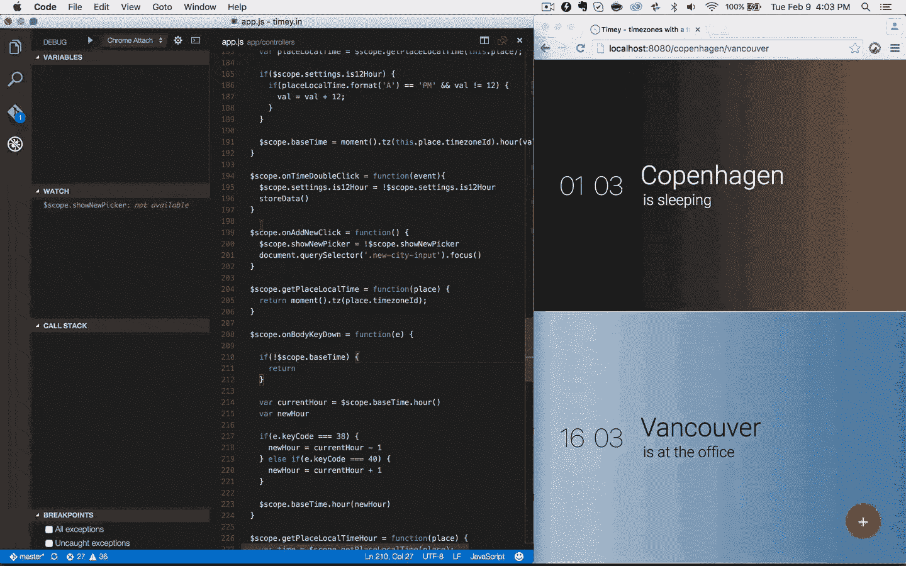
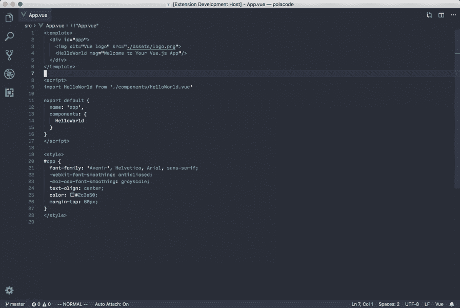
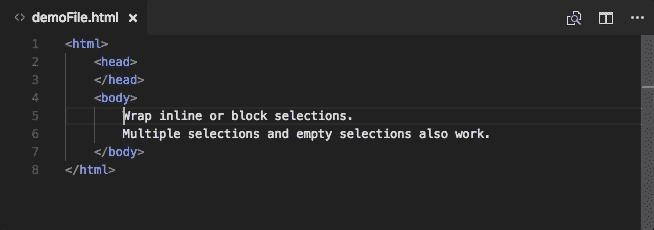
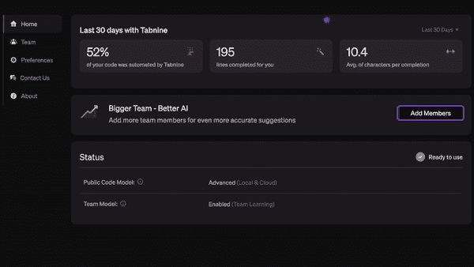
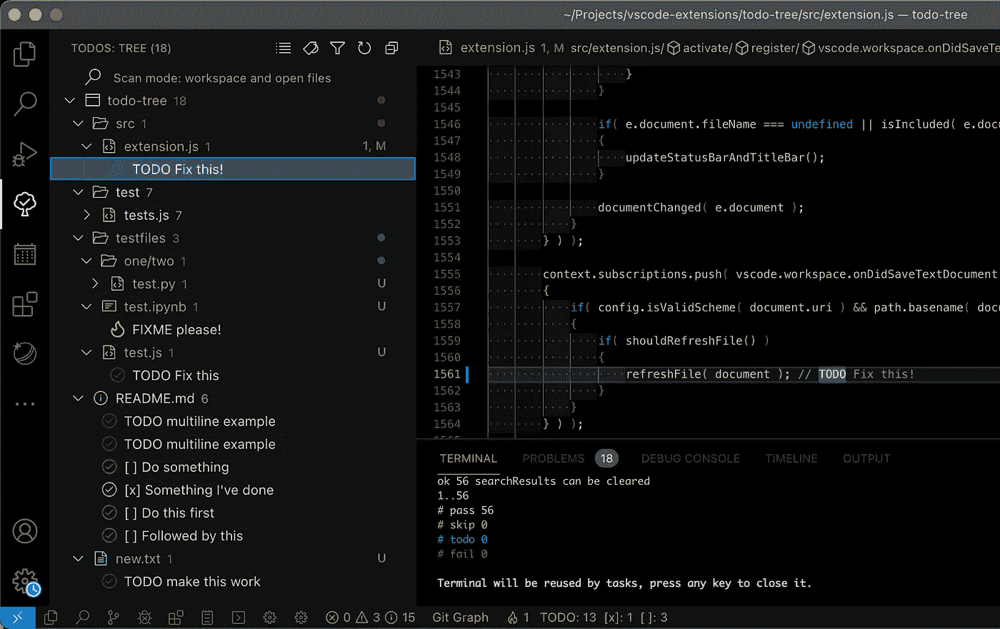
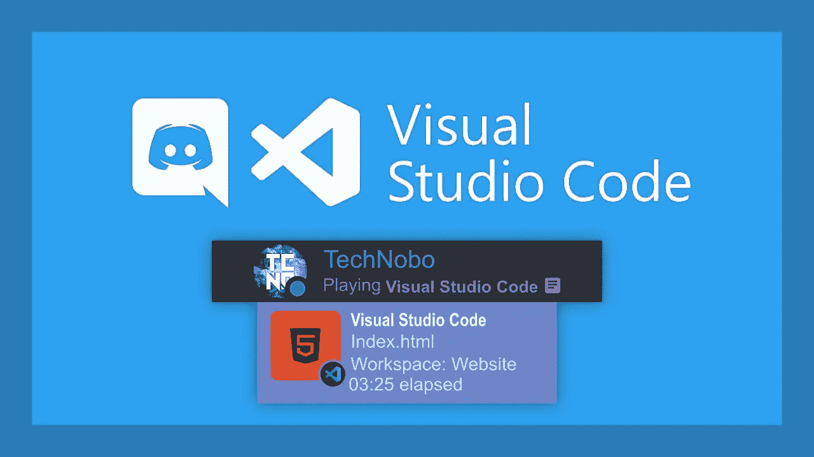

# 13 个最酷的 VS 代码扩展会让你大吃一惊

> 原文：<https://javascript.plainenglish.io/13-coolest-vscode-extensions-that-will-blow-your-mind-3af5a064a00c?source=collection_archive---------3----------------------->

## 虚拟代码

## 其中许多我自己也是第一次看到，所以看看这个列表，找到适合你的扩展。

Cark #00021 ([MetaCark — 10,000 unique Carks](https://metacark.com/))

我想你们很多人都知道什么是 VS 代码，并且使用过它。如果不是，那么它就是最棒的编程理念之一。几乎每种编程语言都可以构建项目，比如 Python、JavaScript、C++、C#、Java 等。它也有一个非常酷的设计和许多可能性，有了默认的 VS 代码，你几乎可以做任何你想做的事情。

然而，有许多免费的扩展，您可以安装到您的 IDE 中来完成一些特定的任务，如更改配色方案，使其可定制并适合您的工作流程。通过添加这些扩展，您可以更快地开始编写代码，并且现在您可以只关注编码本身。因此，如果你厌倦了阅读一些你已经看过的无聊的扩展列表，这篇文章正适合你！

# [1。Chrome 的调试器](https://marketplace.visualstudio.com/items?itemName=msjsdiag.debugger-for-chrome)

我们列表中的第一个扩展是 Chrome 的调试器。正如你可能从标题中猜到的那样，它可以帮助你通过 VS 代码在网站上调试 JavaScript 代码，并立即看到调试结果。这非常有用，尤其是如果你添加了许多使用 JavaScript 的特性，而不仅仅是使用 CSS 和 HTML。

Debugger for Chrome

# [2。波拉科德](https://marketplace.visualstudio.com/items?itemName=pnp.polacode)

Palacode 是一个很好的方法，可以把你的代码截屏，然后分享给任何你想分享的人。这确实使与您的团队合作变得更加容易，并为您的代码增加了某种独特性。我以前不知道这个扩展，但当我看到它，然后立即安装它！

Polacode

# [4。随机一切](https://marketplace.visualstudio.com/items?itemName=helixquar.randomeverything)

实际上，我已经在我的其他列表中谈到了这个扩展。然而，我认为这真的很酷，如果你经常使用某种数据库或者只是需要一些随机的测试信息，那么它绝对适合你。随机一切都可以产生绝对随机的名字、数字，甚至电子邮件。所以，是的，这是很酷的！

Random Everything

# [5。htmltagwrap](https://marketplace.visualstudio.com/items?itemName=bradgashler.htmltagwrap)

Htmltagwrap 是一个非常简单的扩展，如果你是一个 web 开发人员或者只是偶尔使用 HTML，它会给你很大的帮助。这个概念很简单，你可以突出显示你想要的任何信息块，并将其放入你需要的标签中，相信我，这将为你节省大量时间。

htmltagwrap

# [6。GItLens](https://marketplace.visualstudio.com/items?itemName=eamodio.gitlens)

Gitlens 是每个使用 GIT 的人的基本扩展。简而言之，它向您展示了对 GIT 库的所有更改的历史，以及一系列其他很酷的特性，您只需下载它就可以查看！顺便说一下，如果您不使用 GIT，那么您肯定应该使用它。

Gitlens

# [7。更好的评论](https://marketplace.visualstudio.com/items?itemName=aaron-bond.better-comments&ref=hackernoon.com)

这是一个非常酷的扩展，尤其是如果你不是一个人在做你的项目。它只是让你能够以多种方式进行评论，使用不同的颜色，并突出你所需要的。通过使用更好的注释，你的同事会说谢谢，并且能够毫不费力地阅读你的代码。甚至你会看到注释和通读代码变得多么容易！

Better Comments

# [8。Tabnine AI 自动完成](https://marketplace.visualstudio.com/items?itemName=TabNine.tabnine-vscode)

Tabnine 是一个人工智能服务或程序，随你怎么称呼它，它可以帮助你自动完成你正在编写的特定代码行，甚至向你展示你可以在那里编写的几种变体。它可以与最流行的语言一起工作，如 JavaScript、Python、Java 等。你能想象你不用花时间完成代码就能编码的速度有多快吗？

Tabnine

# [9。待办事项树](https://marketplace.visualstudio.com/items?itemName=Gruntfuggly.todo-tree)

Todo Tree 实际上是 VS 代码中的一个完整的待办事项列表应用。你可以写你想改变的或者添加你的代码，当你坐下来准备下一次编码的时候，你会看到你首先需要做什么。这将成倍地提高你的生产力，因为现在没有必要把你想用代码做的每件事都记在脑子里，你可以只写/高亮！

Todo Tree

# [10。不和谐存在](https://marketplace.visualstudio.com/items?itemName=icrawl.discord-vscode)

今天最新的延伸是不和谐的存在。它不会提供任何有用的功能，比如让你的工作流程更舒适或提高你的生产率。相反，它会向你所有不和谐的朋友显示你正忙着编辑你的 VS 代码中的文件。

Discord Presence

# 结论

所以是的，就是这样，十大最酷的 VS 代码扩展可能让你大吃一惊(或者可能没有)。我认为你应该至少安装几个，自己看看那些很酷的功能，多练习。

请在下面的评论中告诉我你的想法，同时，不要忘记在 [Twitter](https://twitter.com/MarkKnd) 上关注我。顺便说一下，我最近推出了自己的 [**NFT 系列**](https://metacark.com/) 所以别忘了也来看看哦！

*更多内容看* [***说白了就是 io***](https://plainenglish.io/) *。报名参加我们的* [***免费周报***](http://newsletter.plainenglish.io/) *。关注我们关于*[***Twitter***](https://twitter.com/inPlainEngHQ)*和*[***LinkedIn***](https://www.linkedin.com/company/inplainenglish/)*。查看我们的* [***社区不和谐***](https://discord.gg/GtDtUAvyhW) *加入我们的* [***人才集体***](https://inplainenglish.pallet.com/talent/welcome) *。*