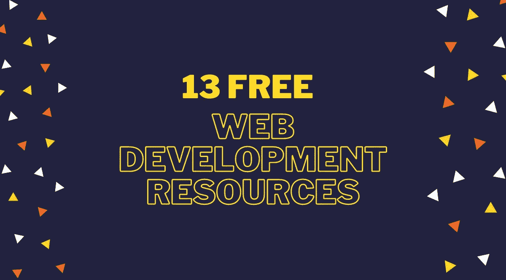

# 作为一名自学成才的 Web 开发人员，我使用的 13 个免费资源

> 原文：<https://javascript.plainenglish.io/13-free-resources-i-use-as-a-self-taught-web-developer-6205a6ebe78f?source=collection_archive---------1----------------------->

我有 6.5 年以上的经验，这些是我的 goto 网站

如果你没有选择合适的学习资源，开始你的 web 开发之旅可能会很困难。

我是一名自学成才的 web 开发人员，在 HTML、CSS、JavaScript、Sass 和样式组件方面有超过 6.5 年的经验。

以下是我一直在使用的 13 种资源

# 1.w3 学校

链接:[https://www.w3schools.com/](https://www.w3schools.com/)

*   它针对学习、测试和培训进行了优化。
*   它给出了简单的例子，以提高阅读和基本的理解。
*   教程，参考资料和所有其他必要的内容提供了详细的概念清晰。

# 2.教程要点

链接:【https://developer.mozilla.org/en-US/ 

*   这是最大的在线教程库之一。
*   它提供了关于最新技术的最佳内容，包括 C、C++、Java、Python、PHP、机器学习、数据科学、AppML 等。

# 3.MDN Web 文档

链接:【https://developer.mozilla.org/en-US/ 

*   MDN Web Docs(以前称为 Mozilla 开发者网络或 MDN)
*   这是一个免费的资源，提供关于 HTML5、CSS、JavaScript 等 web 标准的深入文档。

# 4.极客论坛

链接:[https://www.geeksforgeeks.org/](https://www.geeksforgeeks.org/)

*   这是一个面向极客的计算机科学门户网站。
*   它包含了写得很好、思考得很好、解释得很好的计算机科学和编程文章。

# 5.现场点

链接:[https://www.sitepoint.com/](https://www.sitepoint.com/)

*   它是一个为网络开发者提供书籍、课程和文章的出版商。
*   它为全世界的设计师和网站开发者发布教育网站开发资源。

# 6.CSS 作者

链接:[https://cssauthor.com/](https://cssauthor.com/)

*   这是一个为网页设计者和开发者的日常资源设计和开发相关的博客。
*   他们提供免费的 PSD 设计资源、灵感文章、工具综述、关于最新网络趋势和技术的教程。

# 7.哈希节点

链接:[https://hashnode.com/](https://hashnode.com/)

*   这是免费的开发者博客平台。
*   它允许你在自己的领域发表文章，并帮助你与全球开发者保持联系。

# 8.戴夫。到

链接:[https://dev.to/](https://dev.to/)

*   这是一个软件开发人员的社区，他们聚在一起互相帮助。
*   它依赖于协作和网络学习。

# 9.中等

链接:[https://medium.com/](https://medium.com/)

*   这是一个开放的平台。
*   Medium 是一个向所有人开放的社交发布平台，是各种故事、想法和观点的家园。

# 10.Traversy 媒体(YouTube 频道)

链接:【https://www.youtube.com/c/TraversyMedia 

*   所有最新 web 技术的教程，从 HTML、CSS 和 JavaScript 到 React 和 Vue 等前端框架，再到 Node.js、Python 和 PHP 等后端技术

# 11.发展教育(YouTube 频道)

链接:【https://www.youtube.com/c/DevEd 

学习 web 开发、web 设计、3d 建模、Figma 等工具，不要感到无聊！

# 12.火船(Youtube 频道)

链接:[https://www.youtube.com/c/Fireship](https://www.youtube.com/c/Fireship)

*   高强度的⚡代码教程，帮助您更快地构建和发布您的应用程序。

# 13.聪明的程序员(YouTube 频道)

链接:[https://www.youtube.com/c/CleverProgrammer](https://www.youtube.com/c/CleverProgrammer)

*   将您的编码技能提升到一个新水平的编程技巧和诀窍。
*   构建顶级应用和网站的克隆

如果你喜欢这篇文章，你可能也有兴趣看看我的博客文章[***【13 件简单的事，网站开发者应该做的事，成为前 10%***](/13-easy-things-web-developers-should-do-to-be-in-the-top-10-4ff0dfcfb3c5)

感谢您停下来查看这些资源，我相信在某个时间点它会对您有所帮助。

如果你喜欢我的内容，我在 Twitter 上很活跃。我在推特上发布关于 web 开发、无代码和低代码的信息，让开发人员的生活变得简单。

快乐学习！💻 😄

*更多内容看* [***说白了。报名参加我们的***](http://plainenglish.io/) **[***免费每周简讯***](http://newsletter.plainenglish.io/) *。在我们的* [***社区不和谐***](https://discord.gg/GtDtUAvyhW) *获得独家获得写作机会和建议。***