# 14 款基本开发工具，让您的工作效率提高 10 倍🚀✨

> 原文：<https://javascript.plainenglish.io/14-essential-developer-tools-to-10x-your-productivity-7ff779ec55de?source=collection_archive---------0----------------------->

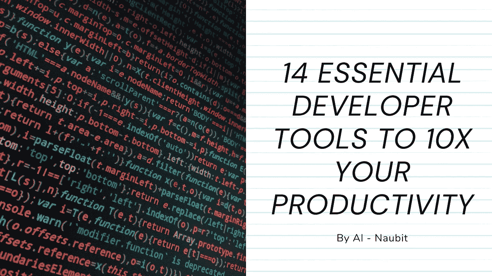

在这样一个快节奏、有严格期限的环境中，开发一个好的工作流程是至关重要的。因此，生产率是要考虑的最重要的指标之一。

在这篇文章中，我将与**分享一些最好的开发工具**，帮助你更高效地工作。

每个工具都包括一个直接链接、一个描述和一个图像预览。

# 1. [justgetflux](https://justgetflux.com/)

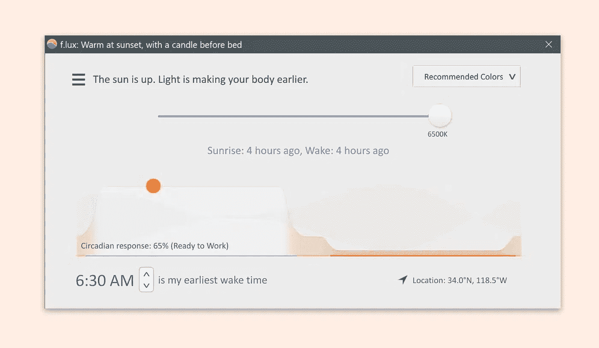

它使您的电脑显示器的颜色适应一天中的时间。

# 2.[ilovepdf.com](http://www.ilovepdf.com/)

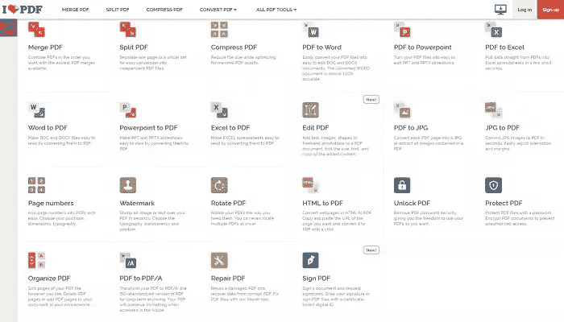

在一个地方处理 pdf 所需的所有工具。

# 3.[世界时间伙伴](https://www.worldtimebuddy.com/)

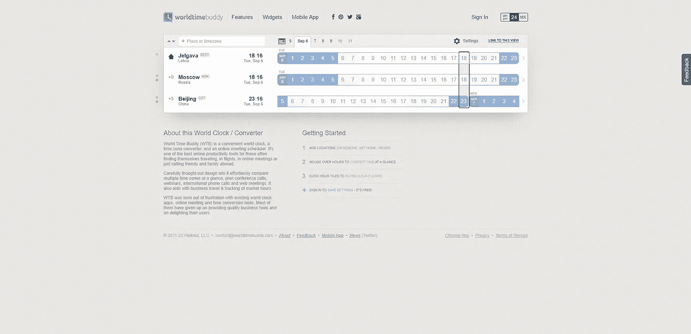

一个方便的世界时钟，一个时区转换器和一个在线会议日程安排。

# 4. [ihateregex](https://ihateregex.io/)

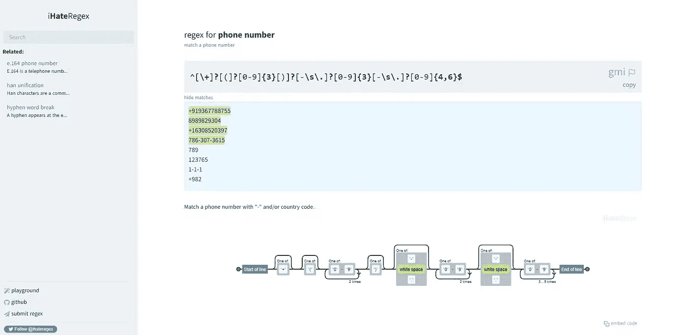

一个正则表达式备忘单，也解释了常用的表达式。

# 5.10 分钟邮件

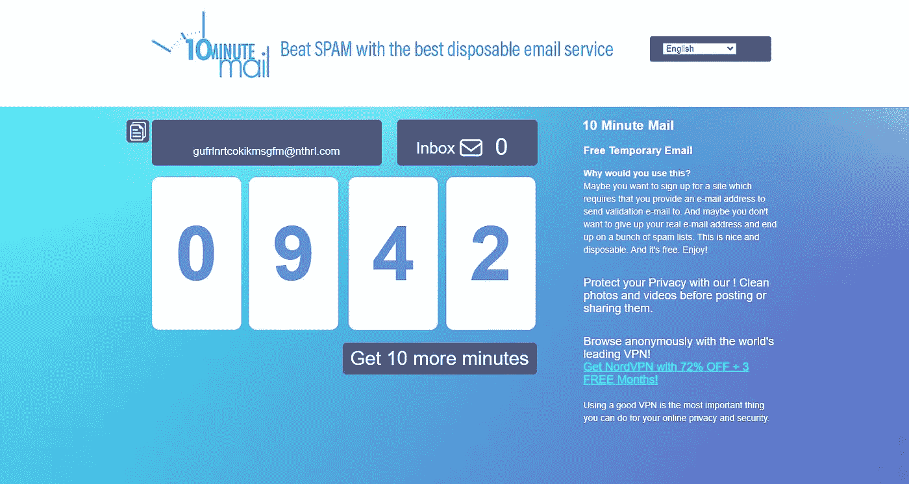

10 分钟后过期的临时电子邮件地址。

# 6. [squoosh.app](https://squoosh.app/)

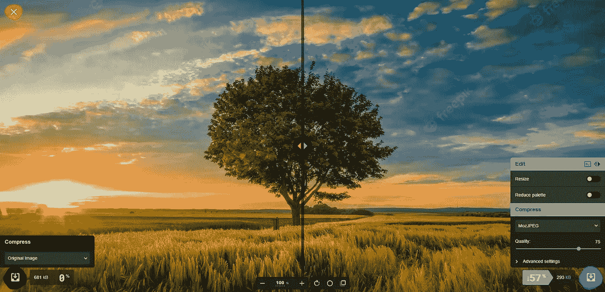

在浏览器中使用同类最佳的编解码器缩小图像。

# 7.[无声无息](https://www.screely.com/)

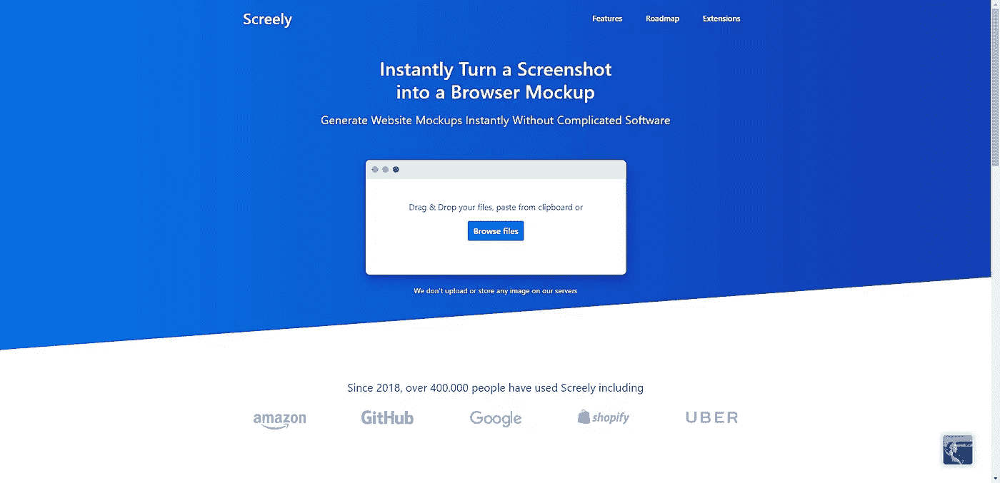

将任何截图变成浏览器模型。

# 8.[猴子型](https://monkeytype.com/)

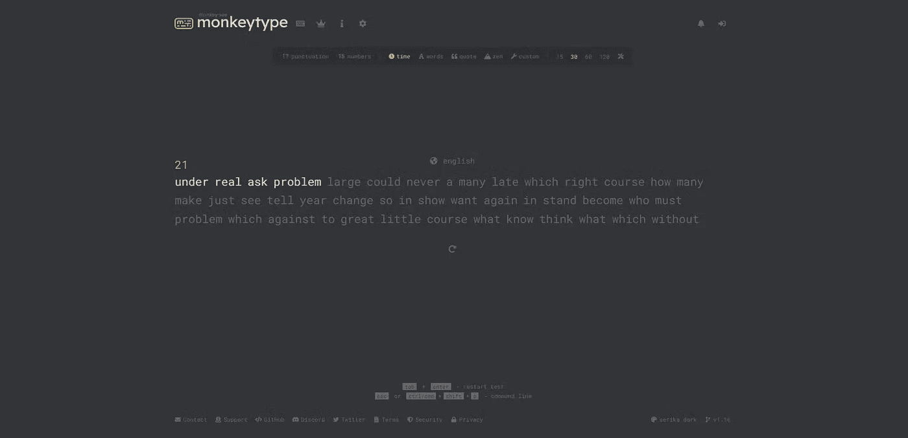

一个极简的打字测试，有许多测试模式。

# 9.[威望](https://prestige.dev/)

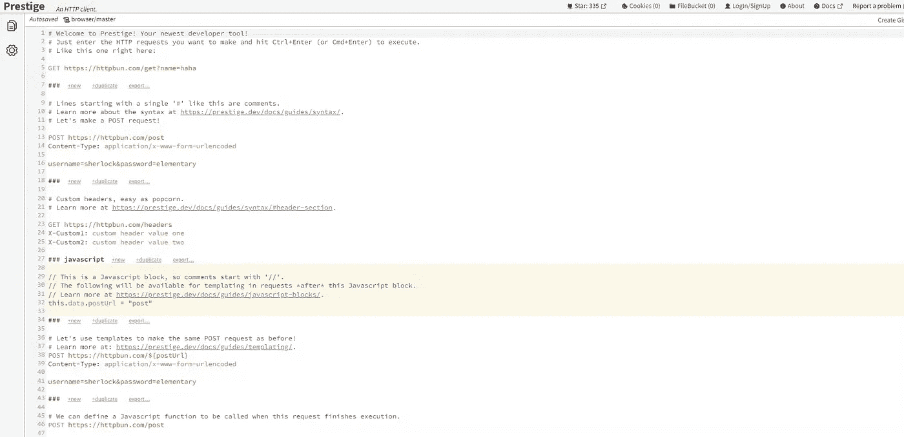

web 浏览器中的 HTTP 客户端。

# 10.商标制作人

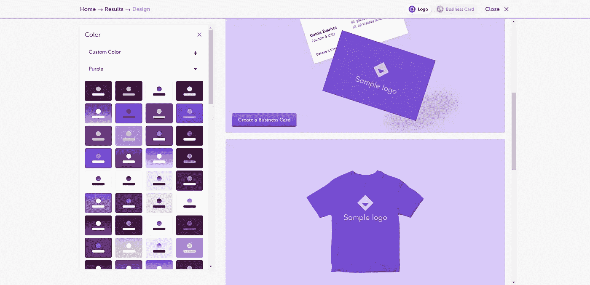

使用完美的字体、图标和配色方案创建徽标。

# 11.[制作缩略图](http://makethumbnails.com/#dropzone)

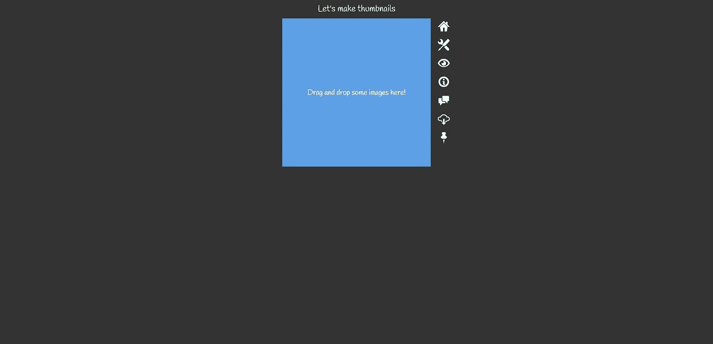

拖放一些图像，你会得到一个包含缩略图的 zip 文件。

# 12.[升级器](https://icons8.com/upscaler)

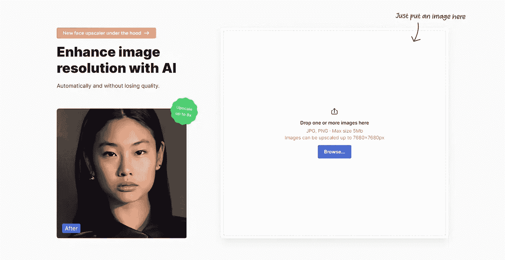

用 AI 增强图像分辨率而不损失质量。

# 13.[看板](https://github.com/madzadev/kanboard)

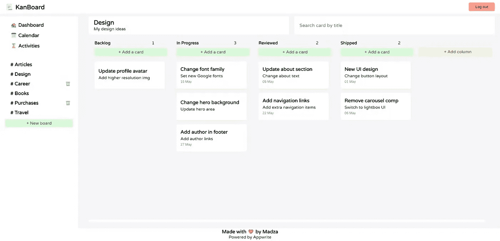

开源和自托管的 kanboard 风格的项目经理。

# 14.[瓦卡时间](https://wakatime.com/)

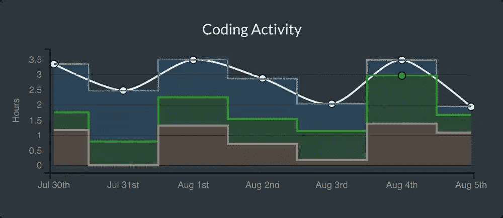

关于你的编程的开源插件。

我热爱写作，能够帮助人们在我的内容中找到灵感给我带来了如此多的快乐。如有疑问，**随时联系！**

在 [Twitter](https://twitter.com/thenaubit) 和[上联系我，点击](https://coderpreneurs.substack.com/)查看我的博客了解更多内容！

*更多内容看* [***说白了就是***](https://plainenglish.io/) *。*

*报名参加我们的* [***免费每周简讯***](http://newsletter.plainenglish.io/) *。关注我们关于*[***Twitter***](https://twitter.com/inPlainEngHQ)，[***LinkedIn***](https://www.linkedin.com/company/inplainenglish/)*，*[***YouTube***](https://www.youtube.com/channel/UCtipWUghju290NWcn8jhyAw)*[***不和***](https://discord.gg/GtDtUAvyhW) ***。****

****对缩放您的软件启动感兴趣*** *？检查出* [***电路***](https://circuit.ooo?utm=publication-post-cta) *。**