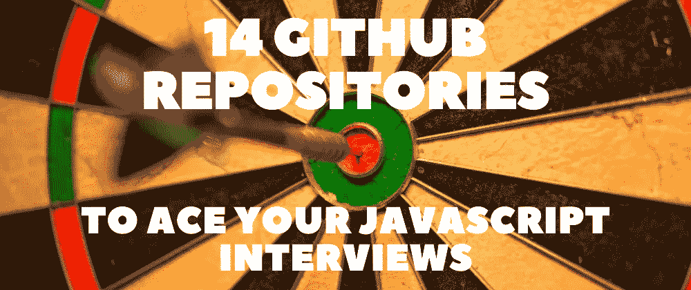

# 14 个 GitHub 存储库帮助您轻松应对 JavaScript 面试🎯 🚀

> 原文：<https://javascript.plainenglish.io/14-github-repositories-to-ace-your-javascript-interviews-4dc266ab961b?source=collection_archive---------11----------------------->

## 准备面试最有用的 GitHub 库。

在当前的科技市场中，找一份开发人员的工作可能是一个挑战，尤其是对新手来说。在准备面试的时候不知道该学什么和该用什么资源会导致进一步的困惑和绝望。

为了在求职阶段帮助你，我精心挑选了一些最有用的 GitHub 库来准备面试。这些资源是面向 JavaScript 的，但是许多编程概念也可以移植到其他语言中。

本文由几个部分组成，涵盖了您需要准备的一切，学习数据结构和算法，练习示例问题，检查您的答案，以及研究一些特定于 JavaScript 环境的框架和库问题。

# 💡常识

## 1.[网络工作原理](https://github.com/vasanthk/how-web-works)

> ⭐ GitHub stars: 4k+

 [## GitHub - vasanthk/how-web-works:当我们在一个…

### 当我们在浏览器中输入 google.com 时，幕后发生了什么？目录当你只按“g”的时候…

github.com](https://github.com/vasanthk/how-web-works) 

当我们在浏览器中输入 www.google.com[时，幕后会发生什么？](http://www.google.com/)

## 2.[开发者路线图](https://github.com/kamranahmedse/developer-roadmap)

> ⭐ GitHub stars: 184k+

 [## GitHub-kamranahmedse/开发者路线图:2022 年成为开发者的路线图

### 面向开发人员的社区驱动的路线图、文章和资源路线图正在变得可交互，并且已经…

github.com](https://github.com/kamranahmedse/developer-roadmap) 

2022 年成为开发者的路线图。

# 📚准备手册

## 3.[技术面试手册](https://github.com/yangshun/tech-interview-handbook)

> ⭐ GitHub stars: 63k+

 [## GitHub -阳顺/科技-采访-手册:💯为忙碌的…

### 💯为忙碌的工程师策划面试准备材料-GitHub-yang shun/tech-interview-handbook:💯策划…

github.com](https://github.com/yangshun/tech-interview-handbook) 

帮助你准备下一次面试的最佳资料库之一。

## 4.[前端面试手册](https://github.com/yangshun/front-end-interview-handbook)

> ⭐ GitHub stars: 32k+

 [## github-yang shun/前端-面试-手册:⚡️前端面试准备资料…

### ⚡️前端面试忙碌工程师准备资料-github-yang shun/前端-面试-手册:⚡️…

github.com](https://github.com/yangshun/front-end-interview-handbook) 

忙碌工程师的前端面试准备资料。

# 🕸数据结构和算法

## 5. [algorithms.js](https://github.com/felipernb/algorithms.js)

> ⭐ GitHub stars: 3k+

 [## GitHub - felipernb/algorithms.js:应用于 CS101 的阿特伍德定律-经典算法和数据…

### 用 JavaScript 实现的经典算法和数据结构，你懂的...为了科学。

github.com](https://github.com/felipernb/algorithms.js) 

阿特伍德定律适用于 cs 101——用 JavaScript 实现的经典算法和数据结构。

## 6.[JavaScript-数据结构-算法](https://github.com/loiane/javascript-datastructures-algorithms)

> ⭐ GitHub stars: 3k+

 [## GitHub-loiane/javascript-数据结构-算法:JavaScript 和类型脚本数据的集合…

### 书籍:用于教育目的的 JavaScript 和 TypeScript 数据结构和算法的集合。源代码…

github.com](https://github.com/loiane/javascript-datastructures-algorithms) 

用于教育目的的 JavaScript 和 TypeScript 数据结构和算法的集合。JavaScript 算法和数据结构书的源代码包。

## 7.[DSA . js-数据-结构-算法-javascript](https://github.com/amejiarosario/dsa.js-data-structures-algorithms-javascript)

> ⭐ GitHub stars: 6k+

 [## GitHub-amejiarosario/DSA . js-数据-结构-算法-javascript:🥞数据结构和…

### 这是 DSA.js 书和 NPM 包的 repo 的编码实现。在该存储库中，您可以…

github.com](https://github.com/amejiarosario/dsa.js-data-structures-algorithms-javascript) 

JavaScript + eBook 中解释和实现的数据结构和算法。

## 8.[带 ES6 的数据结构和算法](https://github.com/Crizstian/data-structure-and-algorithms-with-ES6)

> ⭐ GitHub 星:650+分

 [## GitHub-Crizstian/Data-structure-and-Algorithms-with-ES6:使用 ES6 的数据结构和算法

### Num 类型练习描述 10。-图数据结构 2 图由一组顶点和一组边组成。一个…

github.com](https://github.com/Crizstian/data-structure-and-algorithms-with-ES6) 

使用 ES6 的数据结构和算法。

# ❓面试问题

## 9.[牛逼-JavaScript-访谈](https://github.com/rohan-paul/Awesome-JavaScript-Interviews)

> ⭐ GitHub stars: 1k+

 [## GitHub-rohan-Paul/Awesome-JavaScript-访谈:流行的 JavaScript / React / Node / Mongo 栈…

### 流行的 JavaScript / React / Node / Mongo 栈面试问题及其答案。他们中的许多人，我实际上面对…

github.com](https://github.com/rohan-paul/Awesome-JavaScript-Interviews) 

一个超级流行的面试问题的集合，以及解释和实现示例。

## 10.[JavaScript-面试-提问](https://github.com/sudheerj/javascript-interview-questions)

> ⭐ GitHub stars: 7k+

 [## GitHub-sudheerj/javascript-Interview-Questions:1000 个 JavaScript 面试问题列表

### 1000 个 JavaScript 面试问题列表。通过以下方式为 sudheerj/JavaScript-面试-问题开发做出贡献…

github.com](https://github.com/sudheerj/javascript-interview-questions) 

1000 个 JavaScript 面试问题列表。

## 11. [30 秒采访](https://github.com/30-seconds/30-seconds-of-interviews)

> ⭐ GitHub stars: 9k+

 [## GitHub - 30 秒/30 秒面试:一个常见面试问题精选集…

### 常见面试问题精选，帮助你准备下一次面试。本自述文件构建于…

github.com](https://github.com/30-seconds/30-seconds-of-interviews) 

常见面试问题精选，帮助你准备下一次面试。

# ⚡框架联合国图书馆

## 12.[反应-面试-提问](https://github.com/sudheerj/reactjs-interview-questions)

> ⭐ GitHub stars: 18k+

 [## GitHub-sudheerj/react js-Interview-Questions:react js 面试问题 500 强名单

### 500 强面试问答列表....编码练习题即将推出！！- GitHub …

github.com](https://github.com/sudheerj/reactjs-interview-questions) 

前 500 名 React 面试问答列表。

## 13.[vuejs-面试-提问](https://github.com/sudheerj/vuejs-interview-questions)

> ⭐ GitHub stars: 1k+

 [## GitHub-sudheerj/vuejs-面试-问题:300 个 vue js 面试问题和答案的列表

### 300 个 VueJS 面试问题的列表 Vue.js 是一个开源的渐进式 Javascript 框架，用于构建用户…

github.com](https://github.com/sudheerj/vuejs-interview-questions) 

300 个 Vue 面试问答列表。

## 14.nodejs-面试-问题

> ⭐ GitHub stars: 1k+

 [## GitHub-learning-zone/nodejs-Interview-Questions:常见的 Node.js 面试问题

### 常见的 Node.js 面试问题。通过以下方式为学习区/节点面试问题的开发做出贡献…

github.com](https://github.com/learning-zone/nodejs-interview-questions) 

常见的 Node.js 面试问题。

希望这些资源能帮助你准备面试，你会得到一份工作。如果你有任何来自你个人学习经验的建议，请随意贡献出来，因为所有的库都是开源的。

写作一直是我的激情所在，帮助和激励他人给我带来了快乐。如果您有任何问题，请随时联系我们！

*在* [*Twitter*](https://twitter.com/madzadev) *，*[*LinkedIn*](https://www.linkedin.com/in/madzadev/)*，以及*[*GitHub*](https://github.com/madzadev)*！*

*访问我的* [*博客*](https://madza.dev/blog) *获取更多此类文章。*

*更多内容请看*[***plain English . io***](http://plainenglish.io/)*。报名参加我们的**[***免费周报***](http://newsletter.plainenglish.io/) *。在我们的* [***社区获得独家访问写作机会和建议***](https://discord.gg/GtDtUAvyhW) *。**