# 每个 Web 开发人员都应该知道的 14 个重要 JavaScript 函数

> 原文：<https://javascript.plainenglish.io/14-important-javascript-functions-every-web-developer-should-know-e34169ae91c8?source=collection_archive---------6----------------------->

## 作为 web 开发人员，节省时间和优化代码的 14 个重要 JavaScript 函数

Photo by [Joan Gamell](https://unsplash.com/@gamell?utm_source=unsplash&utm_medium=referral&utm_content=creditCopyText) on [Unsplash](https://unsplash.com/s/photos/javascript?utm_source=unsplash&utm_medium=referral&utm_content=creditCopyText)

在这篇文章中，你将了解对每个 web 或前端开发人员有用的 **14 个重要的 JavaScript 函数**。

请随意将本文用作 web 开发人员的工具箱，并在您的 JavaScript 项目中尽可能地应用它们。

你在这里学到的一切都将加速你的发展，为你节省宝贵的时间！

所以不浪费更多的时间，让我们开始吧

# 1.最大数量

这个 JavaScript 代码片段将从一个数组中找到并返回 n 个最大的元素。

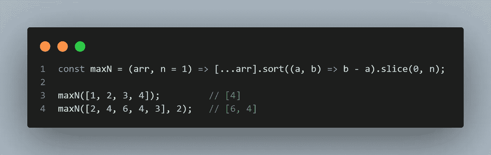

# 2.三元运算符

三元运算符非常有用。你可以避免难看的、复杂的、嵌套的条件 ***如果...埃尔塞夫...elseif* 使用三元运算符。**

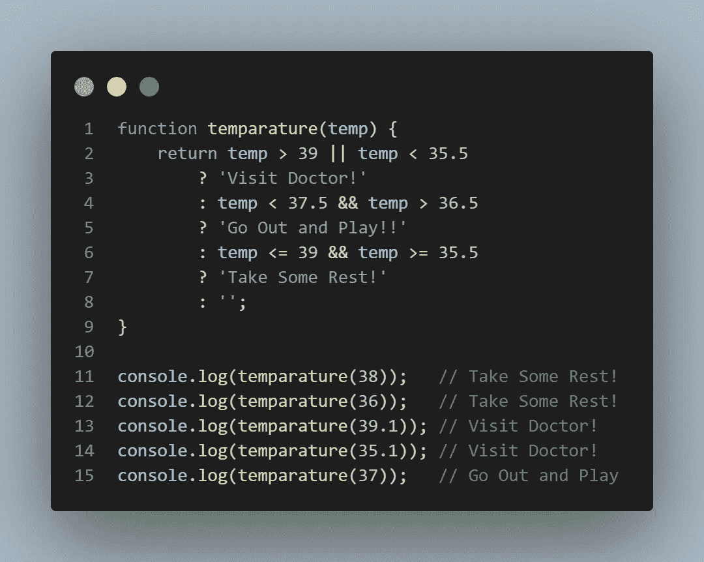

# 3.从数组中删除重复项

我们经常遇到数组中有多个重复的数据，并使用循环来删除这些重复的数据。但是，有了 JavaScript 和 Set 类型，我们可以用一种简单的方式删除重复项，而不用使用循环。

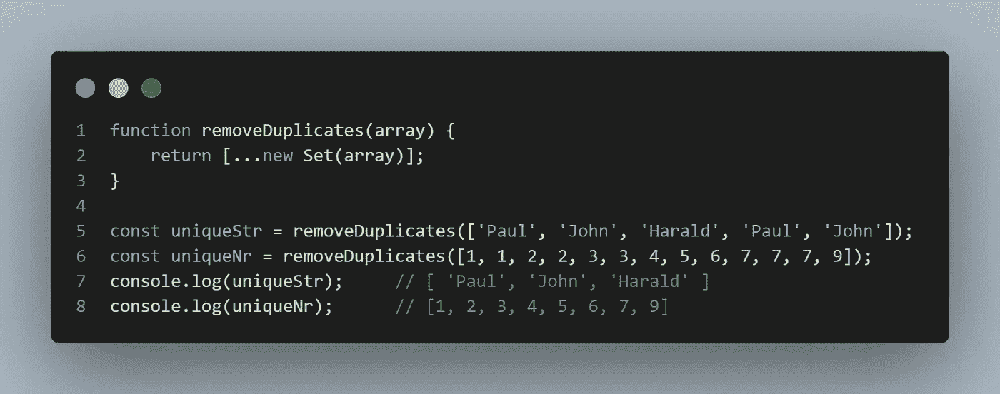

# 4.在数组中查找特定的对象

这个 JavaScript 片段展示了通过使用`Array.find()`函数并在其中提供属性比较，我们可以多么容易地在数组中找到一个特定的对象。

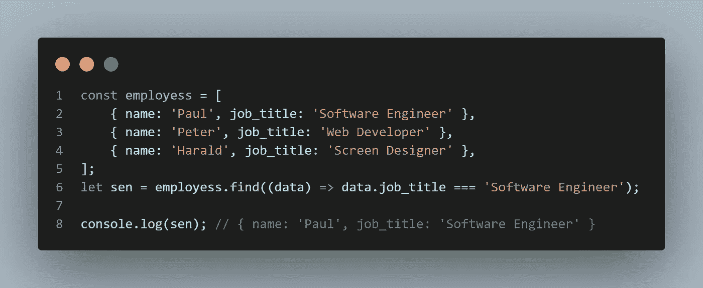

# 5.取消资本化

这个 JavaScript 代码片段展示了一种简单的方法来对任何字符串进行反大写。但是，它只会对第一个字符进行反大写！

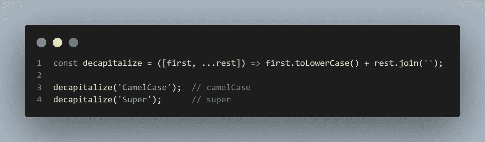

# 6.反转一根绳子

在 JavaScript 中，我们可以通过将任何字符串`split`转换成数组、`reverse`转换成数组，然后`join`转换成字符串来轻松地反转它。

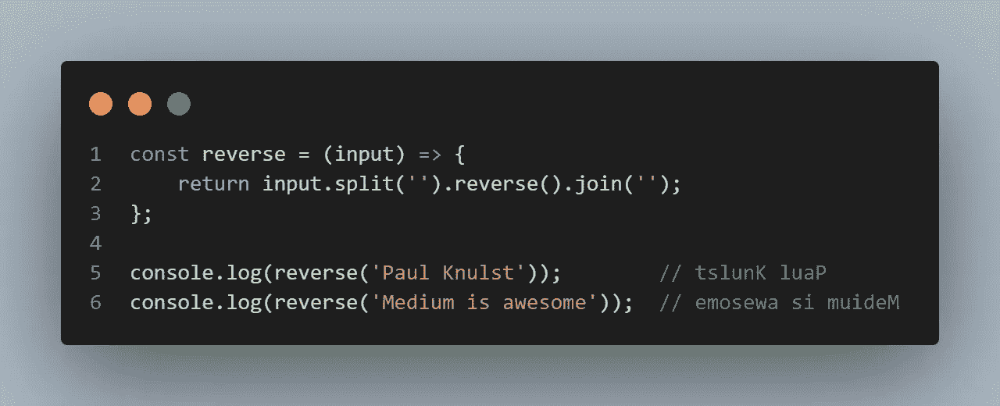

# 7.计算一年中的第几天

这个 JavaScript 代码片段计算一年中的某一天。如果我们想在网站或日历中显示当天，这个函数会很有用。

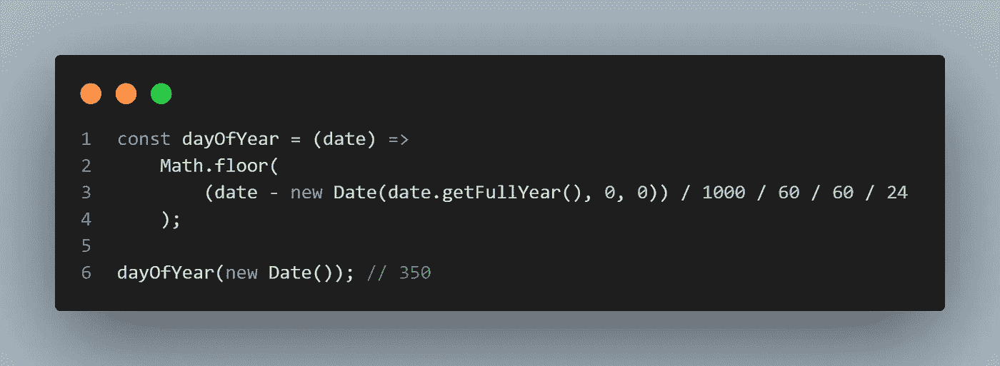

# 8.将数组转换为 HTML 列表元素

这个 JavaScript 代码片段从一个数组中生成一个 HTML 列表，并将其放入给定的 HTML 元素中。如果我们想在网页上显示数组中的数据，并且我们只使用简单的普通 JavaScript 而没有很酷的框架，这可能会很有用。

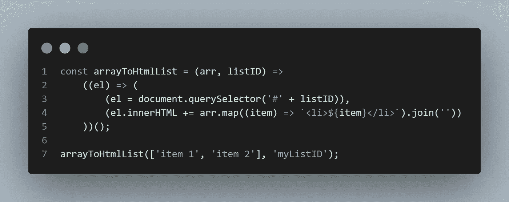

# 9.缩短控制台日志

如果我们在代码中反复使用 console.log()，我们应该考虑缩短它。幸运的是，在 JavaScript 中，这可以通过使用 bind 函数轻松完成。它将加快开发过程！

还有，每个函数都可以！

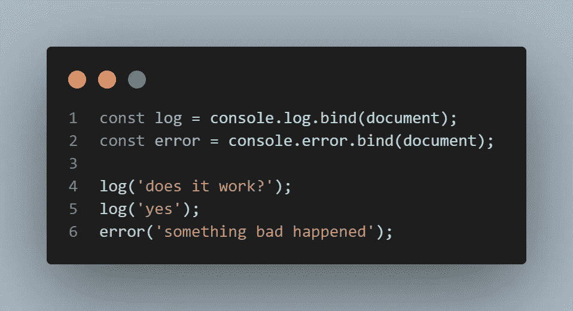

# 10.从输入数组中获取样本大小

这个 JavaScript 函数将接受任何数组，并创建一个只包含原始数组中的值的新数组。还可以提供新数组的大小。

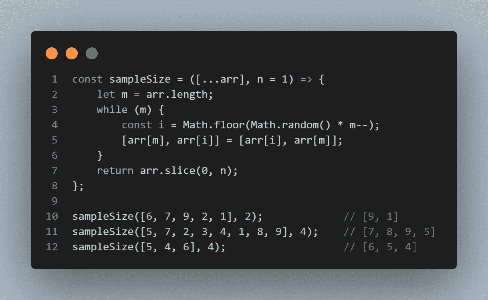

# 11.JavaScript 中的析构

下面的 JavaScript 代码片段展示了每个 JavaScript 开发人员都应该知道的一项技术:JavaScript 析构。

在 JavaScript 中可以使用析构赋值语法将数组中的属性解包到不同的变量中。

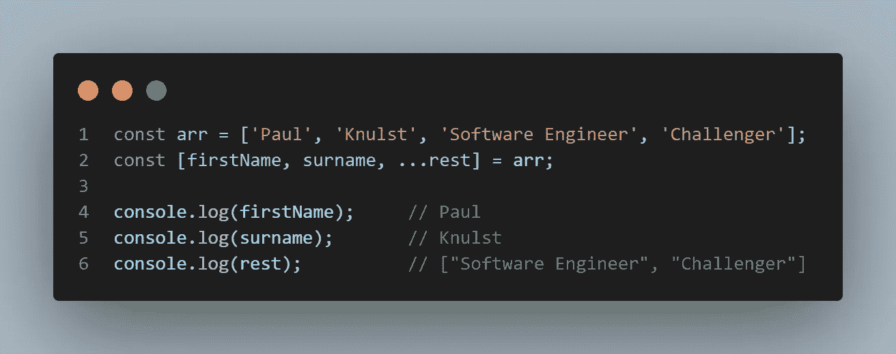

事实上，我们可以使用它与任何 iterable，而不仅仅是数组！

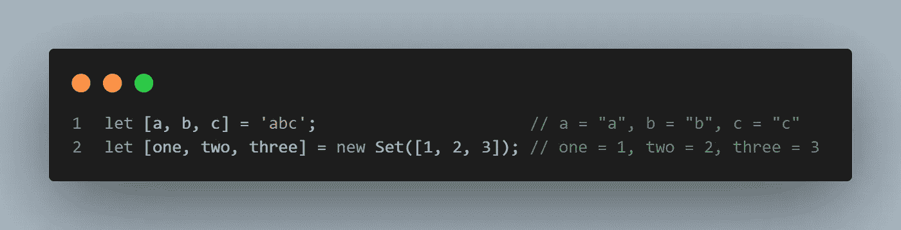

# 12.深度展平数组

这个 JavaScript 代码片段将展平每个数组。此外，它会将数组彻底拉平，这意味着它不在乎原始数组中有多少个子数组。

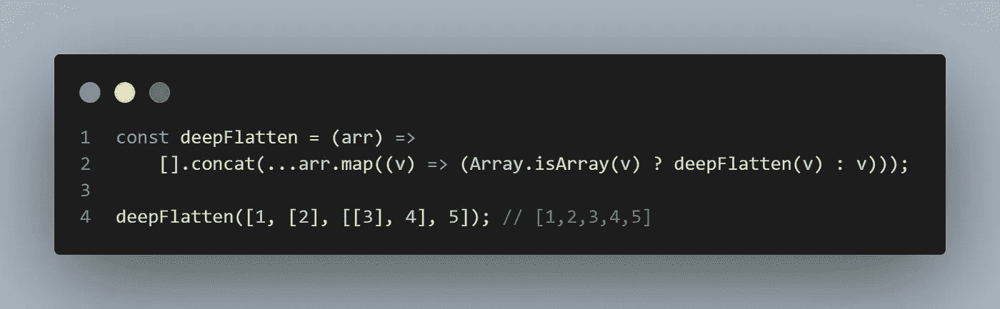

# 13.在一个数组中查找多个索引

为了在数组中找到一个索引，我们可以使用`indexOf`函数。但是，如果一个值出现多次，那么`indexOf`函数将只返回第一个值。

这个 JavaScript 片段将遍历整个数组，并产生一个包含找到的每个索引的输出数组。

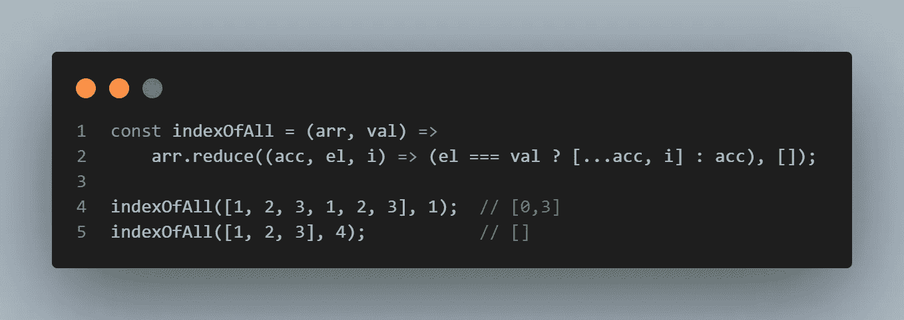

# 14.检查对象是否是特定类型

几乎每个 JavaScript 开发人员都知道，我们不能通过使用`==`来正确地比较两个 JavaScript 对象。

幸运的是，这个 JavaScript 函数可以用来比较两个 JavaScript 对象，并检查它们是否具有相同的类型。

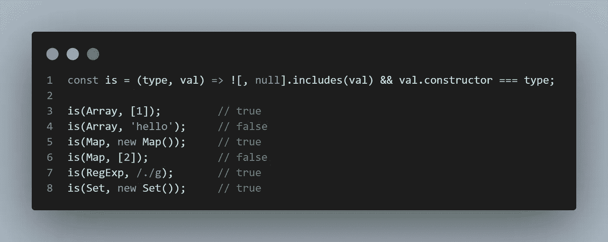

# 结束语

希望这篇文章对你有帮助！如果你也有好的 JavaScript 函数可以分享，欢迎在这里发表评论并与其他开发者分享。

**快乐 JavaScript 编码。**

为了在您的项目中轻松使用这些 JavaScript 片段，我创建了一个访问函数的要点，可以在我的 GitHub 简介中找到

欢迎在[我的博客](https://www.paulsblog.dev/)、 [LinkedIn](https://www.linkedin.com/in/paulknulst/) 、 [Twitter](https://twitter.com/paulknulst) 和 [GitHub](https://github.com/paulknulst) 上与我联系。

如果这是有帮助的，如果你给这篇文章一个👏如果你还没有，关注一下会很好。

也请考虑通过下面我的[推荐](https://medium.knulst.de/membership)链接订阅 Medium。这很棒，我用它来了解技术领域的最新动态，并从其他开发人员的经验中学习。

你的订阅将直接支持我和许多其他媒体作家。

 [## 通过我的推荐链接加入媒体

### 阅读 Paul Knulst(以及媒体上成千上万的其他作家)的每一个故事。您的会员费直接支持…

medium.knulst.de](https://medium.knulst.de/membership) 

*更多内容请看*[***plain English . io***](https://plainenglish.io/)*。报名参加我们的* [***免费周报***](http://newsletter.plainenglish.io/) *。关注我们关于*[***Twitter***](https://twitter.com/inPlainEngHQ)[***LinkedIn***](https://www.linkedin.com/company/inplainenglish/)*[***YouTube***](https://www.youtube.com/channel/UCtipWUghju290NWcn8jhyAw)*[***不和***](https://discord.gg/GtDtUAvyhW) ***。*****

*****对缩放您的软件启动感兴趣*** *？检查* [***电路***](https://circuit.ooo?utm=publication-post-cta) *。***