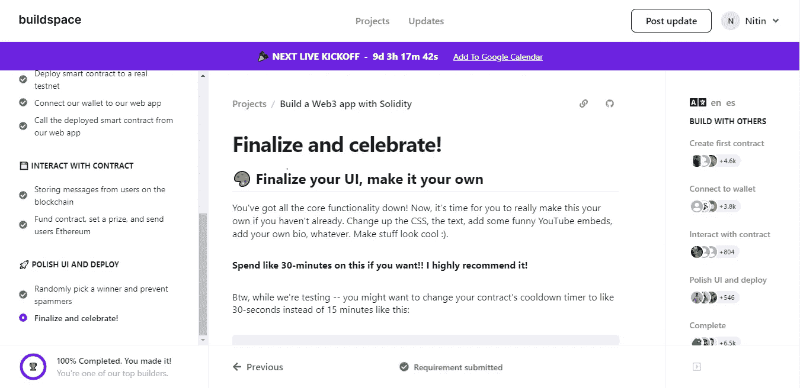

# 14 个免费教程帮助您开始使用 Web3

> 原文：<https://javascript.plainenglish.io/14-insanely-free-web3-tutorials-youll-ever-find-on-the-internet-no-bs-7e07e8690ced?source=collection_archive---------6----------------------->

## 我愿意为这样的教程支付 1000 美元或更多。

Src: [Pexels](https://www.pexels.com/photo/a-shocked-man-holding-a-smartphone-8790937/)

你可能听过这句话——当每个人都在挖金子的时候，从事镐和铲业务是件好事。

币安、比特币基地和其他加密货币交易所以这种方式获利。类似地，各种各样的公司涌现出来，在为消费者提供价值的同时也在赚钱。

人们也对投资加密货币感兴趣。是的，我们大多数人都专注于购买更多的比特币和以太坊，因为我们相信加密货币在未来会飙升。

我无法预测加密货币的未来价值，但我可以自信地说，如果你学习了 Web3 并用它创造了任何东西，你无疑会变得富有。

你所需要的是学习 Web3 的最佳指南。现在你可以免费得到它。

**注**:这些课程绝对免费，我也没有拿过推广的报酬。我在 [GitHub](https://github.com/bkrem/awesome-solidity) 上找到了它们(没有版权)，因此所有的荣誉归于创作者。

此外，我尝试了一些课程，非常喜欢。

Source: Buildspace

这是我参加并完成的课程之一。要继续，你必须在每个阶段上传你的提交，因此你必须研究和建立的东西。

是不是很酷？

让我们开始吧。

1.  [**build space . so**](https://buildspace.so/)**—专为新手设计的 Web3 实训。这是完全免费的，完成后，你将获得一个 NFT。**

****

**Source: Buildspace**

**这是我用来上这门课的第一个网站。更具体的说，有几门课是可以上的，比如用 solidity 创建 web3 app，甚至用 Solana，用 JavaScript 创建 DAO 等等。**

**并且该材料是非常优越的。他们也有一个不和谐的渠道，你可以在那里提问。**

**此外，在您完成一门课程后，您将获得一个 NFT 作为结业礼物。**

****2。**[**Cadena**](https://cadena.dev/)—创建智能合同、dapps 和获得 Cadena NFT 证书的教程。**

****

**Source: Cadena**

**它可以与 Buildspace 相媲美。**

**他们提供关于智能合约、NFT、代币和其他相关主题的各种课程。完成后，您将获得一份 NFT 证书。**

**上述两个网站都提供了就业机会。**

****3。****—构建自己的密码收藏品游戏，在交互式编码学校学习如何设计智能合同。****

********

****这是互联网上最优秀的资源。****

****如果你喜欢玩游戏或者想自己制作游戏，你会喜欢这个网站和它教 Web3 的方法。****

********

****这里有一张截图展示了他们是如何教学生的。****

****这难道不是真的疯狂吗？****

******4。**[**cryptodevhub . io**](https://cryptodevhub.io/)**——一项由社区主导的倡议，旨在将对区块链和加密技术感兴趣的人聚集在一起。******

************

********5。** [**发现以太坊&稳固性**](https://www.ludu.co/course/ethereum)——完成一门课程，引导你按照最佳实践构建一个去中心化的 Twitter 克隆体，这是必须的。******

********

****我看了这个网站上的东西，很简单。我在几分钟内学会了从基础知识到使用 node.js 和 truffle 建立合同的一切。****

****简单地试一试。****

******6。**[**ExtropyIO/defi-bot**](https://github.com/ExtropyIO/defi-bot)—构建 DeFi 套利机器人教程。****

****7。[**karma coma-eth/sending-Ether-cheat-sheet**](https://gist.github.com/karmacoma-eth/4f206a46dedc6da6808c1ccdef3262d0)—发送乙醚的技巧和最佳实践。****

****8。[**Learn xiny**](https://learnxinyminutes.com/docs/solidity/)—15 分钟学会扎实(针对有经验的开发者)。****

******9。**[**【manojpramesh/solidity-cheat sheet**](https://github.com/manojpramesh/solidity-cheatsheet)**—cheat sheet 和最佳实践。******

********10。** [**Solidity 和 Vyper 备忘单**](https://reference.auditless.com/cheatsheet)**——并排复习两种语言的语法。********

************

********11。** [**自学 Web3**](https://www.teachyourselfweb3.com/)**——加入一个由 Web3 工程师&教育者组成的社区，帮助你快速进入 web 3 开发。********

************

******Source: TeachYourSelfWeb3******

******除了 solidity，你还将学习智能合同安全、智能合同审计和各种其他主题。******

********12。** [**状元╱实固 _ 快 _ ref**](https://topmonks.github.io/solidity_quick_ref/)**——语法概述。********

************

******这是一个坚实的备忘单，将帮助你只是修改你的概念。******

********13 .** [**规模/学习稳固性**](https://github.com/willitscale/learning-solidity)——关于入门、创建自己的加密货币、ico 和部署的完整指南。******

********

****创造者创建了 YouTube 视频来教 Web3 新手。****

******14 .**[useweb3.xyz/tutorials](https://www.useweb3.xyz/tutorials)**——一份基于特定项目、任务或挑战的免费社区教程的精选列表。******

************

******Src: useWeb3******

******希望你喜欢。******

******这就对了——谢谢。******

******如果你愿意，你可以和我一起免费赶集。******

******[*如果你喜欢阅读这样的故事，并且想帮助我成为一名作家，那么考虑成为*](https://nitinfab.medium.com/membership) *中型会员。每月只需 5 美元，你就可以无限制地访问流媒体内容* *。如果你通过我的链接注册，我会得到一点佣金。*******

****** [## 11 个愚蠢的业余程序员

### 没有 BS，请不要期待博客，YouTube，自由职业者或媒体。

javascript.plainenglish.io](/11-stupidly-simple-side-hustles-to-earn-extra-money-as-a-programmer-23fd30ca5cda)****** 

*******更多内容请看*[***plain English . io***](https://plainenglish.io/)*。报名参加我们的* [***免费周报***](http://newsletter.plainenglish.io/) *。关注我们关于*[***Twitter***](https://twitter.com/inPlainEngHQ)**和*[***LinkedIn***](https://www.linkedin.com/company/inplainenglish/)*。查看我们的* [***社区不和谐***](https://discord.gg/GtDtUAvyhW) *加入我们的* [***人才集体***](https://inplainenglish.pallet.com/talent/welcome) *。********