# 14 个黑仔网络应用程序提高您的工作效率🚀💯

> 原文：<https://javascript.plainenglish.io/14-killer-web-applications-to-boost-your-productivity-78aa3935af6f?source=collection_archive---------4----------------------->

## 一些最有用的网络应用程序，可以用来提高你的工作效率。

在这篇文章中，我整理了一些最有用的网络应用程序，你可以用它们来提高你的工作效率。

这些包括你可能需要的任何东西，从优先化、自动化、计划任务到处理视频、降价和正则表达式。

每个工具都包括一个直接链接、一个描述和一个图像预览。

## 1.[优先](https://prioritize.songthamtung.com/)

在具有不同优先级板的拖放界面上创建、可视化和优先化任务。

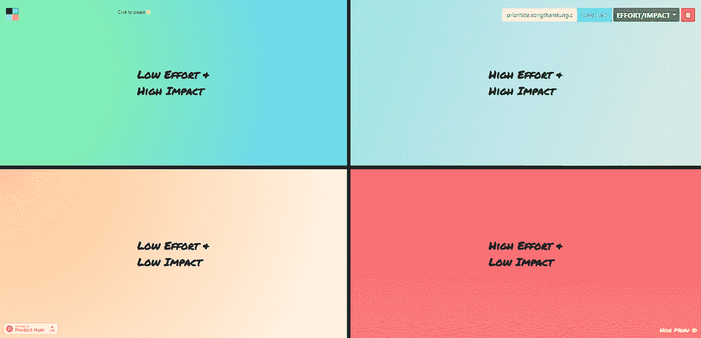

## 2.[我能用](https://caniuse.com/)吗

桌面和移动浏览器上前端 web 技术的最新浏览器支持表。

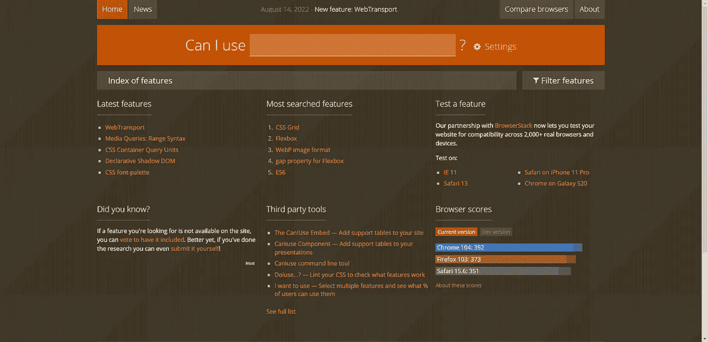

## 3.[吸气剂](https://getterms.io/)

轻松为您的网站或应用程序生成隐私策略。

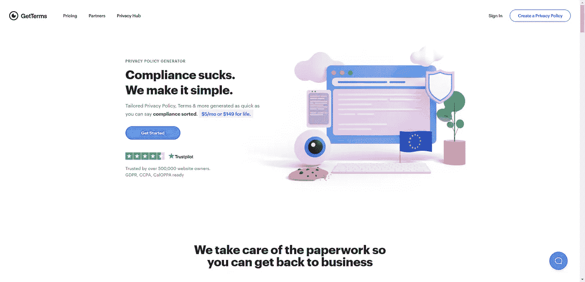

## 4. [Namae](https://namae.dev/)

立即在所有主要注册中心检查您的新应用名称创意的可用性。

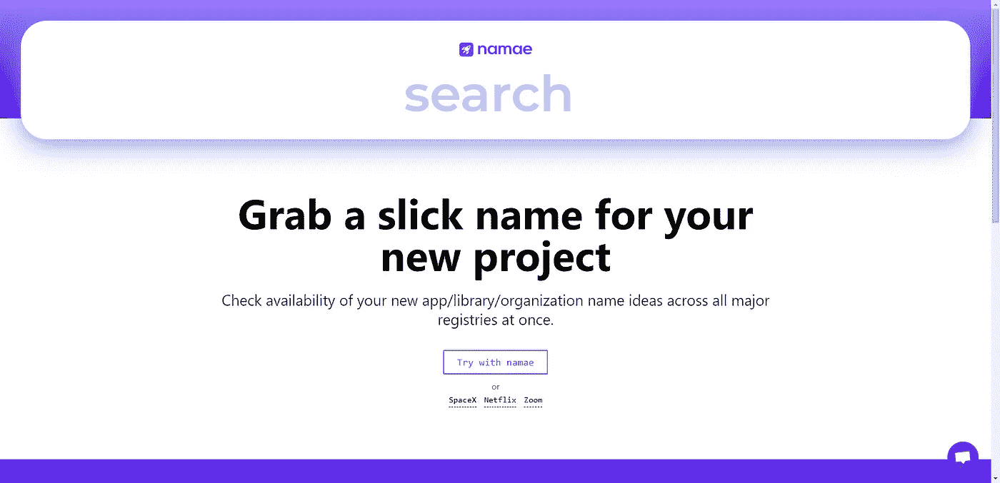

## 5. [Regex101](https://regex101.com/)

带有语法高亮、解释、备忘单等的正则表达式测试器。

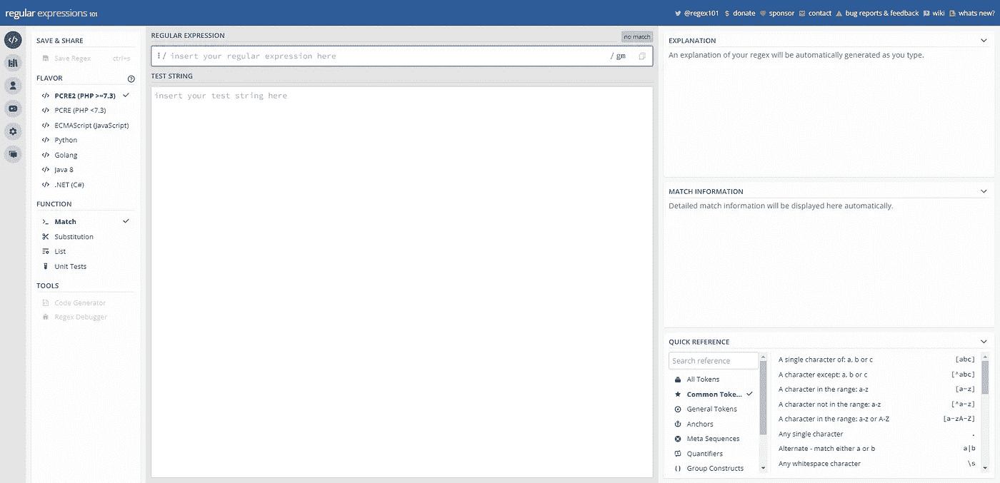

## 6.[取消筛选](https://www.unscreen.com/)

自动移除任何视频的背景。

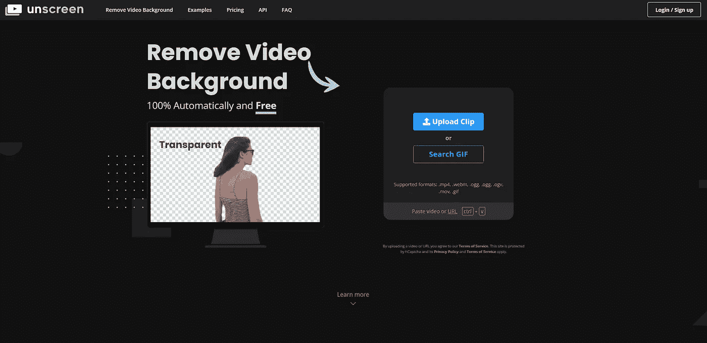

## 7.[恐束症](https://bundlephobia.com/)

查找将 npm 软件包添加到您的软件包的成本。

## 8.[forthebadge.com](https://forthebadge.com/)

为你的 Github readme 添加徽章，让它更有吸引力。

## 9. [EpochConverter](https://www.epochconverter.com/)

将纪元转换为人类可读的日期，反之亦然。

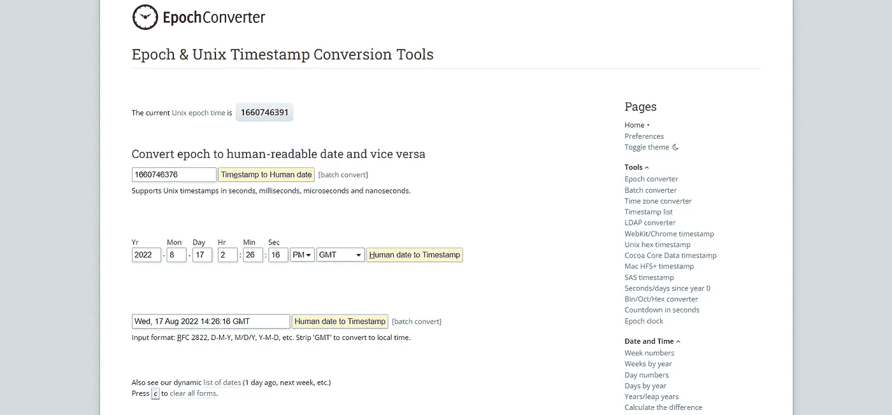

## 10.[克朗](https://crontab.cronhub.io/)

在没有任何基础工作的情况下安排和监控工作。

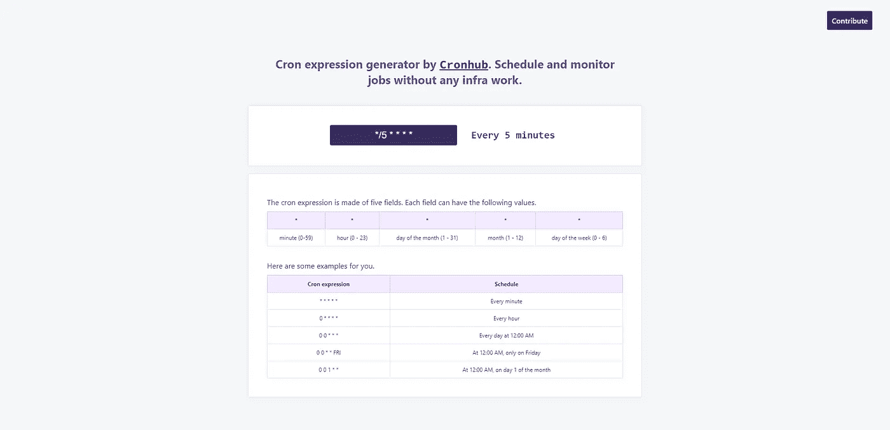

## 11.Gitignore.io

创造有用。gitignore 几秒钟内为您的项目文件。

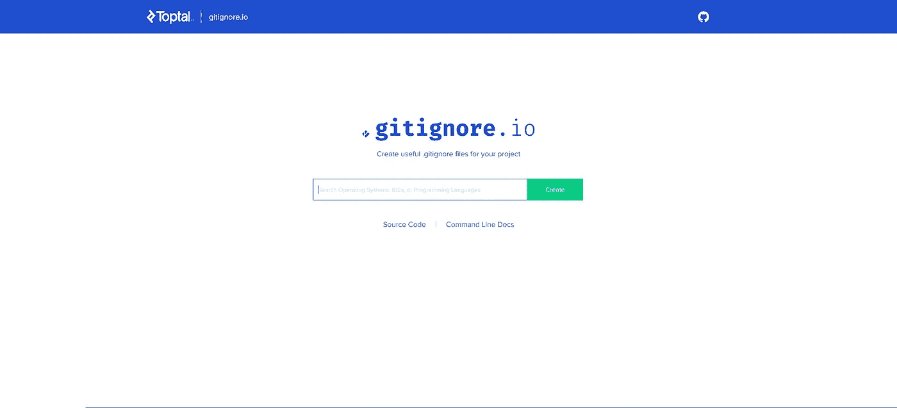

## 12. [Ngrok](https://ngrok.com/)

把任何东西放到互联网上最快的方法就是用一个简单的命令。

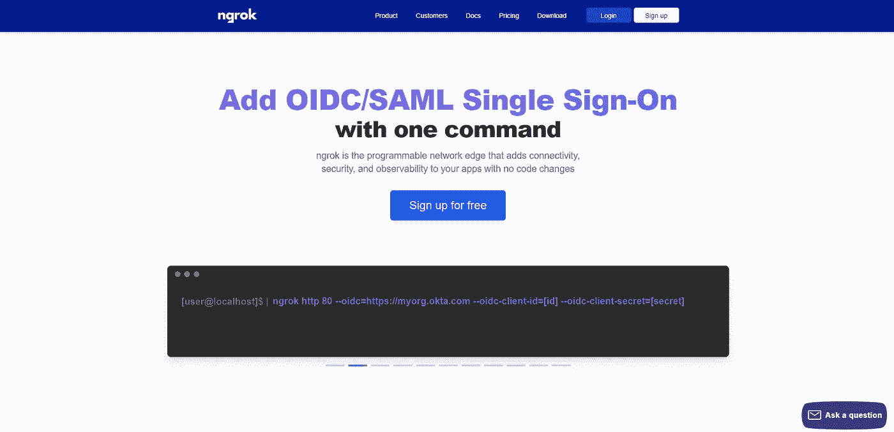

## 13.[文本比较](https://text-compare.com/)

一个在线 diff 工具，可以发现两个文本文档之间的差异。

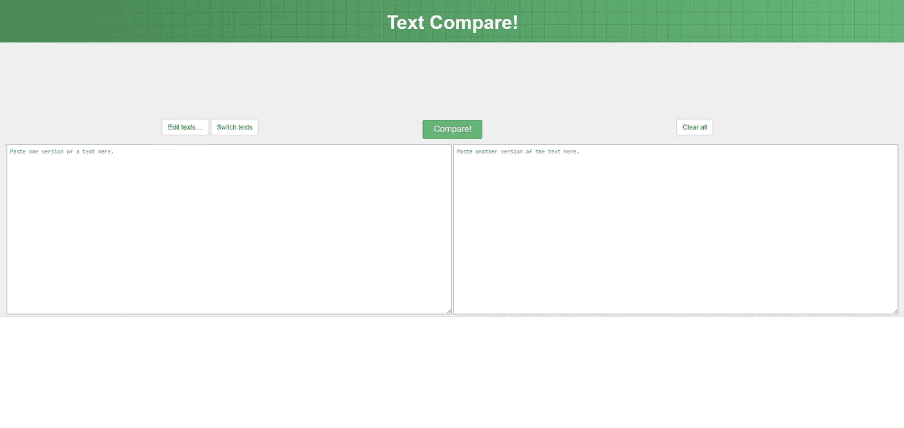

## 14.[扭动](https://twist.com/)

一个异步消息应用程序，通过使用线程来组织您的对话，使协作变得容易。

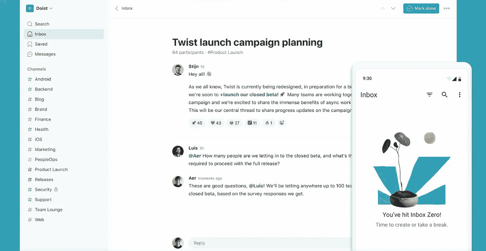

写作一直是我的激情所在，帮助和激励他人给我带来了快乐。如果您有任何问题，请随时联系我们！

在 [Twitter](https://twitter.com/madzadev) 、 [LinkedIn](https://www.linkedin.com/in/madzadev/) 和 [GitHub](https://github.com/madzadev) 上给我接通！

访问我的[博客](https://madza.dev/blog)获取更多类似的文章。

*更多内容看* [***说白了。报名参加我们的***](https://plainenglish.io/) **[***免费周报***](http://newsletter.plainenglish.io/) *。关注我们关于* [***推特***](https://twitter.com/inPlainEngHQ) ，[***LinkedIn***](https://www.linkedin.com/company/inplainenglish/)*，*[***YouTube***](https://www.youtube.com/channel/UCtipWUghju290NWcn8jhyAw)*，以及* [***不和***](https://discord.gg/GtDtUAvyhW) *。***