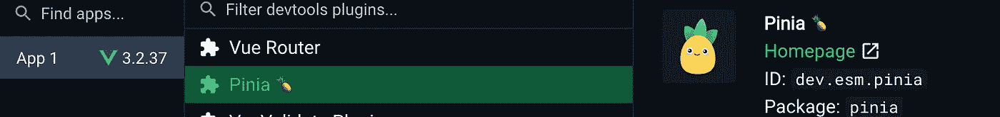
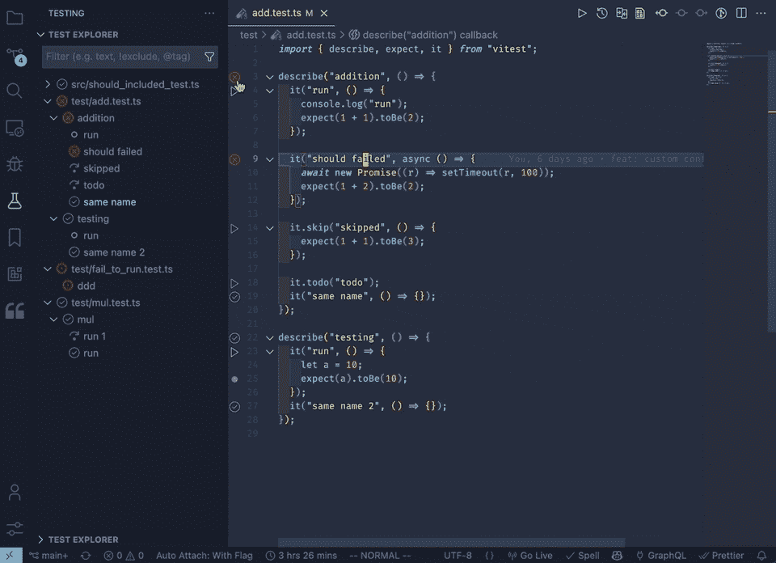
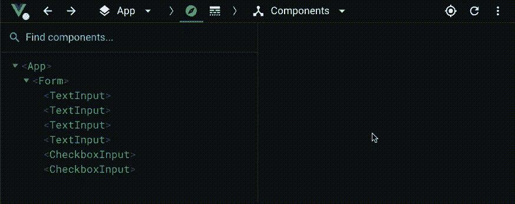

# Vue 3 生态系统中的 15 个改变游戏规则的工具

> 原文：<https://javascript.plainenglish.io/15-game-changing-tools-in-vue-3-ecosystem-2998f117bae7?source=collection_archive---------5----------------------->

## 一些你可以在 Vue 3 生态系统中使用的杀手级工具。

Top 15 Game-Changing Tools in Vue Ecosystem by Ejiro Asiuwhu

Vue.js 生态系统在过去几年中不断发展，特别是随着 Vue 3 成为[*2022 年 2 月 7 日星期一*](https://blog.vuejs.org/posts/vue-3-as-the-new-default.html) *的默认版本。*这篇文章将主要关注围绕 Vue 3 生态系统的工具。

# **简介**

Vue.js 生态系统中有许多工具，通过增强的开发人员体验，使使用 Vue.js 构建应用程序变得更加容易。Vue 组合 API 由 Vue 反应系统(ref & reactive)、生命周期挂钩和依赖注入机制(如 provide 和 inject)组成，为开发人员提供了为 Vue.js 生态系统构建更强大工具的灵活性。

事不宜迟，让我们来看看 Vue.js 生态系统中的一些杀手级工具。

# **1。Vue 3**

我们名单上的第一名是 Vue 3 本身。Vue 3 引入了许多令人难以置信的便捷特性、概念和 API，如[传送](https://vuejs.org/guide/built-ins/teleport.html)，这对于创建[模态](https://vuejs.org/examples/#modal)、[反应变量](https://vuejs.org/guide/essentials/reactivity-fundamentals.html)与`ref`和`reactive`、[状态驱动 CSS](https://vuejs.org/api/sfc-css-features.html#v-bind-in-css) 、 [CSS 模块支持](https://vuejs.org/api/sfc-css-features.html#css-modules)、[槽式选择器](https://vuejs.org/api/sfc-css-features.html#slotted-selectors)、[多 v 模型绑定](https://vuejs.org/guide/components/events.html#usage-with-v-model)、[片段](https://v3-migration.vuejs.org/new/fragments.html#fragments)、

# 2.武尤斯

由 [Anthony Fu](https://antfu.me/) 创建的 VueUse 是 Vue 2 和 Vue 3 的基本 Vue 合成工具的集合。VueUse 背后的想法是创建一个 web 应用程序 Vue 中常用函数的集合，并将它们捆绑到一个用 Vue.js 反应系统构建的完整树可摇动包中。截至撰写本文时，有超过 [200+](https://github.com/vueuse/vueuse) 个可组合函数可用。VueUse 的一个吸引人的特点是文档写得非常好，有打字稿示例和交互式演示。

# 3.轻快地

Vite 是一个改变游戏规则的前端构建工具，对整个前端生态系统产生了重大影响。它是一个构建工具。这旨在提供更快和更精简的开发体验。它提供了一个具有超快的 HMR 的开发服务器和一个基于 [rollup](https://rollupjs.org) 的捆绑器。它已经变得越来越受欢迎，成为近年来采用率最高的游戏之一。

像 [Nuxt](https://nuxtjs.org) 、 [Vue.js](https://github.com/vuejs/create-vue/) 和 [Svelte](https://svelte.dev/) 这样的框架已经将 Vite 作为它们的官方捆绑器。由于采用了 Vite，Nuxt 3 dev server 已经变得非常快，并且在使用 Nuxt 构建 web 应用程序时，它改善了开发人员的体验

# 4.Nuxt3

在撰写本文时， [Nuxt3](https://v3.nuxtjs.org/) 目前正在 RC 中。它建立在 Vue 3 之上，并采用了 Vite 作为快如闪电的 HMR 的捆绑器。与 Nuxt 2 相比，它更轻、更快，并且提供了更好的开发者体验。Nuxt 团队还投入了大量时间来构建一个名为 [Nitro](https://v3.nuxtjs.org/guide/concepts/server-engine/) 的新服务器引擎，这创造了许多可能性，包括用 Nuxt 构建全栈 web 应用程序。引入的概念和功能包括:

*   [服务器路由](https://v3.nuxtjs.org/guide/features/server-routes) : Nuxt3 会通过读取`[~server/api/](https://v3.nuxtjs.org/guide/directory-structure/server#api-routes)` `~/server/routes`、`~/server/middleware`目录下的文件生成服务器 API。
*   [混合渲染模式](https://v3.nuxtjs.org/guide/concepts/rendering/#hybrid-rendering)(即将推出):在一个站点中结合静态和无服务器模式。
*   具有热模块重载的开发服务器。
*   [useState](https://v3.nuxtjs.org/guide/features/state-management) : Nuxt3 提供了一个`useState`组件，用于管理跨 Nuxt 应用的 SSR 友好共享状态。

# 5.皮尼亚

本质上 [Pinia](https://pinia.vuejs.org/) 就是 [Vuex 5](https://github.com/vuejs/rfcs/discussions/270) 。它是 Vue 2 和 3 的官方状态管理库，具有更好的类型脚本支持和 DevTool 支持。这意味着您可以从 Vue DevTools 中更好地调试有状态逻辑，即状态、getter 和动作。

Vue DevTools

从设计上来说，Pinia 是模块化的，这使得开发者维护他们的商店变得很容易。与 Vuex 相比，Pinia 的突变状态就像是一件轻而易举的事情。您不需要创建像 Vuex 这样的动作或突变来改变您在 Pinia 中的状态。您可以使用`*$*[*patch*](https://pinia.vuejs.org/core-concepts/state.html#mutating-the-state)` 方法直接改变状态。它还提供了状态管理和反应的组合 API 风格。更好的是，您可以将可组合功能与 Pinia 商店相结合。🔥

# 6.手掌的

[Volar](https://github.com/johnsoncodehk/volar) 是 [Vetur](https://github.com/vuejs/vetur) 的推荐 IDE 扩展替代品。虽然还没有在 v1 中，Volar 为 Vue SFC 提供了强大和优秀的 VS 代码支持。现在有了更好的语法高亮显示，完整的模板类型脚本支持和 Vue 模板中的注释，VitePress 支持等等。
如果你积极使用 Vue 3，可以考虑看看这个 [GitHub 讨论](https://github.com/johnsoncodehk/volar/discussions/471)。

# 7.Vitest

由 Anthony Fu 创建的 [Vitest](https://vitest.dev/) 是一个由 [Vite](https://vitejs.dev/) 支持的超快的单元测试框架。它使用了与 [Jest](https://jestjs.io/) 类似的 API，但它的速度非常快，并且在 Vue.js 生态系统之外越来越受欢迎。它有仅用于测试文件的 HMR，还有一个 VS 代码扩展，这使得在代码编辑器中运行、调试和可视化测试结果变得容易。

Vitest VS Code in action. ([source](https://github.com/vitest-dev/vscode#--vitest-for-vscode))

# 8.VeeValidate

由 Abdelrahman Awad 创建的 [VeeValidate](https://vee-validate.logaretm.com/v4/) 版本 4 是 Vue 3 的一个表单验证库。它验证输入的声明性方法使它变得强大而灵活，并且可以与组合 API 完美地协作。它有两种表单验证方法，基于组件的方法和组合 API 方法。作为使用过这两种方法的人，我更喜欢并推荐组合 API 方法，因为它提供了更大的灵活性，非常适合构建复杂的表单。

VeeValidate 的另一个令人印象深刻的特性是 4.5 版中的 Devtools 插件。它与新的 Vue DevTools 挂钩，并提供一个 GUI 来可视化和以编程方式访问输入字段中的状态。💣 🚀

VeeValidate Inspector ([source](https://vee-validate.logaretm.com/v4/guide/devtools#the-inspector))

# 9.武德米

Anthony Fu[创造的另一个工具](https://github.com/antfu)🔥，VueDemi 提供了一组 API、函数和实用程序，用于为 Vue 2 和 3 创建通用库。如果您是一个库作者，希望为您的 Vue.js 项目提供向后兼容性，并且也支持 Vue 3 而不维护两个代码库，VueDemi 在 Vue 3 反应系统的帮助下使这成为可能。

# 10.Vue 查询

[Vue Query](https://github.com/DamianOsipiuk/vue-query) 基于 [React Query](https://tanstack.com/query/v4/docs/adapters/react-query) ，现命名为 [Tanstack Query](https://twitter.com/tannerlinsley/status/1549785943837515776) ，是一个非官方的适配器，通过 Vue composition API 提供钩子，用于在 Vue.js 中获取、缓存、更新异步状态管理，支持 Vue 2 & 3。目前， [Tanstack](https://twitter.com/tannerlinsley/status/1549785943837515776) 团队正在开发@ **tanstack/vue-query** 适配器。这个简单的 Vue.js 会有官方支持。😸

# 11.Vue 店面

如果您正在使用 Vue.js 或 Nuxt 构建一个电子商务 web 应用程序，您应该考虑插入 [Vue Storefront](https://vuestorefront.io/) ，这是一个基于 Vue.js 构建的无头商务的快速前端。除了使用 Vue.js 构建的 Vue Storefront，它还解决了大多数电子商务网站存在的关键业务问题。大多数电子商务网站都很慢，可能导致转化率低，VSF 非常快，它通过采用 PWA 方法做到了这一点，它具有离线购物功能，能够建立一个强大的定制电子商务网站，而无需过多考虑前端架构，因为 VSF 提供了一个坚实的基础。一个[演示](https://demo.vuestorefront.io/)可以在这里找到。

# 12.无头用户界面

[Headless UI](https://headlessui.com/vue/menu) 是由 Tailwind Labs 创建的一个项目，由完全无样式、完全可访问的 UI 组件组成，旨在与 Tailwind CSS 完美集成。虽然有几个组件，但是这些组件都是经过精心制作的，具有很好的可访问性支持。

# 13.离子 Vue

Ionic Vue 是迄今为止 Vue.js 生态系统中构建移动应用程序最有效的工具。Ionic 提供了一组常用的 UI 组件，可以与 Vue.js 完美集成，还可以通过 Capacitor 提供本地功能

# 14.创建-vue

Create-vue 是官方推荐的搭建 Vue 2 和 3 项目的方式。它创建了一个基于 Vite 的 Vue.js 项目，你可以选择添加 TypeScript、Pinia、Vue router、Eslint 和 appellister。它也可能是 Vue CLI 的替代品，Vue 3 和 Vite 已经是启动新 Vue.js 项目的推荐方式。

# 15.Vue《火影忍者》

Vue 2.7 被称为 [Vue 鸣人](https://blog.vuejs.org/posts/vue-2-7-naruto.html)将是 Vue 2 的最后一个版本，它有一些关键功能，这些功能对我们如何用“现代”方法构建 Vue.js 应用程序很重要。Vue.js 团队已经反向移植了一些最重要的功能，如 Composition API、SFC <脚本设置>、SFC CSS v-bind 和 defineComponent，为 Vue 2 提供了更好的类型脚本支持。关于所有发布的 API 的完整列表，请点击这里查看官方发布的帖子[。](https://blog.vuejs.org/posts/vue-2-7-naruto.html)

暂时就这样吧！请在下面的评论区告诉我你对这篇文章的看法。我在 [Twitter](https://twitter.com/ejirocodes) 和 [LinkedIn](https://www.linkedin.com/in/ejiro-asiuwhu/) 上社交。感谢您的阅读，敬请期待更多内容。

*更多内容看* [***说白了。报名参加我们的***](https://plainenglish.io/) **[***免费周报***](http://newsletter.plainenglish.io/) *。关注我们关于* [***推特***](https://twitter.com/inPlainEngHQ) ，[***LinkedIn***](https://www.linkedin.com/company/inplainenglish/)*，*[***YouTube***](https://www.youtube.com/channel/UCtipWUghju290NWcn8jhyAw)*，以及* [***不和***](https://discord.gg/GtDtUAvyhW) *。***