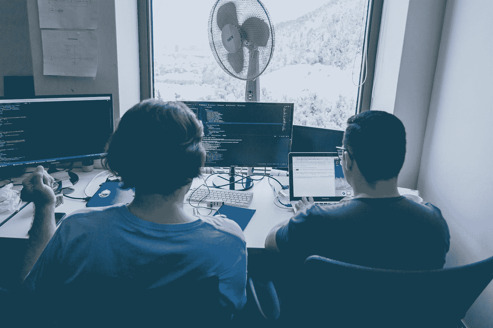

# 减少代码中出现错误的 15 个好方法

> 原文：<https://javascript.plainenglish.io/15-good-practices-that-reduce-the-chance-of-bugs-appearing-in-your-code-b5ee486feb7b?source=collection_archive---------11----------------------->

## 遵循这些建议，你不会后悔的。

Photo by [Alvaro Reyes](https://unsplash.com/@alvarordesign?utm_source=medium&utm_medium=referral) on [Unsplash](https://unsplash.com?utm_source=medium&utm_medium=referral)

作为程序员，你要知道软件的 bug 一直都在。程序员的错误导致了一些由于不可能预测所有的变量，其他的由于程序的环境。

本文将指导您如何避免代码出现问题。

1.  **使用成熟的解决方案**——即由社区创建的框架和库——积极参与消除错误。你自己写出同样好的答案的可能性很小。此外，通过使用良好的实践、架构或设计模式来借鉴前人的成果也是值得的。
2.  **结对编程**——两个或更多人一起编写代码的编程技术。三个臭皮匠顶个诸葛亮，多一双眼睛也有帮助。
3.  **自动测试**——当我们修改现有代码时，他们允许你快速检查我们是否破坏了什么。它们也是很好的代码文档。
4.  **代码评审** —一种方法，在将编写的代码包含到主项目中之前，将它交给团队中的其他开发人员进行评审。它让你消除潜在的错误，学习新的东西。
5.  **编码标准** —应用相同的原则和良好的代码编写实践(命名方法等)。).这使得其他程序员在修改代码时能够更好地理解我们的代码。
6.  **测试你的代码**——通常，程序员不会这样做，或者检查他们编写的解决方案在实际项目中是如何工作的。程序员永远不会很好地测试他的代码，但即使是粗略的“点击”也能让你捕捉到最重要的错误。持续测试也不错——一个小变化——>检查效果。
7.  **自动代码检查** —静态代码分析，测试覆盖，捕捉所谓的代码气味。
8.  **简单干净的代码**——小类/模块只做一件它们应该做的事情。
9.  **有限信任原则的应用**——不要假设外部数据总是正确的，不要假设外部系统总是工作的。
10.  **思考** —在按键之前，想想你要写的代码会对系统产生怎样的影响，以及在运行过程中会暴露在哪些潜在的极端条件和场景下。
11.  **理解需求** —最大的错误发生在这个阶段，这个阶段是最难消除的，也是最昂贵的。如果有必要的话，与人交谈——更多地交谈。使用 BDD 场景、用户故事或事件风暴来确保您对底层概念有相同的理解。
12.  编写需求——在开始编写代码之前，根据需求创建自动测试。您可以使用上面提到的小黄瓜，或者，例如，使用测试驱动的设计方法。
13.  **检查是否有人已经做过**——为什么要重新发明轮子？有时候用一个比我们更聪明的人写的，经过成千上万用户测试的现成工具更好。
14.  **尽量少写代码**。平均来说，每 1000 行代码有 15-50 个错误。所以你限制了代码的数量——你限制了错误的数量。如果可能的话——删除不必要的法规，代之以外部库、服务等。
15.  让其他人参与计划、开发和测试过程。虽然三个臭皮匠胜过一个诸葛亮，但是不同的观点可以颠覆整个概念。

还有很多技术，但我相信我提到的是最广泛使用的。值得考虑将代码质量构建到您的开发和团队流程中。这种态度在你需要快速做出不确定的改变时会有回报。

*更多内容看* [***说白了。报名参加我们的***](http://plainenglish.io/) **[***免费周报***](http://newsletter.plainenglish.io/) *。在我们的* [***社区不和谐***](https://discord.gg/GtDtUAvyhW) *获得独家获取写作机会和建议。***