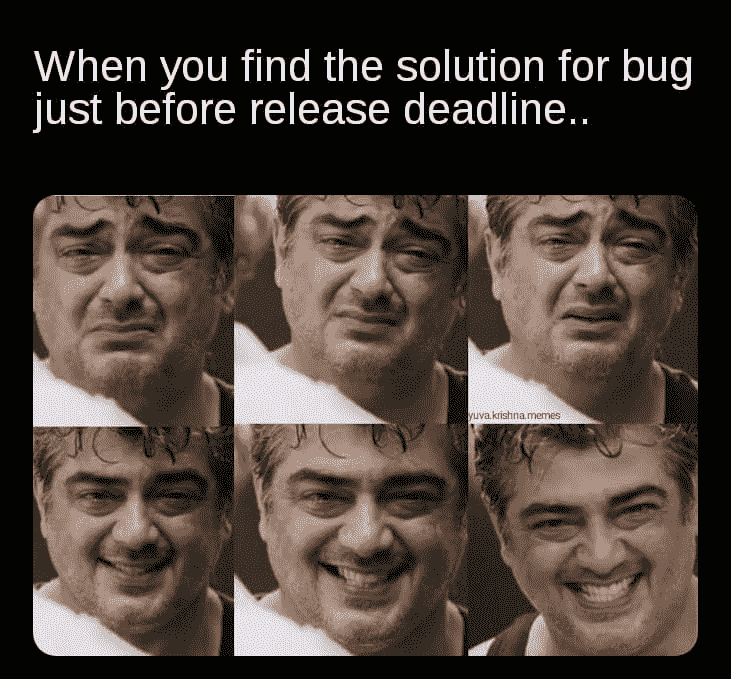

# 任何程序员都能理解的 15 个幽默模因

> 原文：<https://javascript.plainenglish.io/15-humorous-memes-any-programmer-can-relate-to-f2226c358b0?source=collection_archive---------2----------------------->

## 程序员幽默模因汇编。

Photo by [Amanda Sofia Pellenz](https://unsplash.com/@amanda_sofia_?utm_source=medium&utm_medium=referral) on [Unsplash](https://unsplash.com?utm_source=medium&utm_medium=referral)

***笑话和快乐有什么联系吗？*** 如果你是我这种类型的人，那么你可能也爱在下班后查看手机。猜猜我在那里看到了什么？

我主要是在网上看到**的视频、抖音和笑话**。我不知道为什么，但这有助于我提神醒脑，减轻工作压力。

# 这就是为什么我相信笑是人类最好的刷新按钮。

在这篇文章中，我收集了一些我喜欢的网络迷因。

# 哪个数字你看不到？我看不到 0 号，哈哈

Picture Credit:[https://www.facebook.com/jokesvala/](https://www.facebook.com/jokesvala/)

# 部署前对错误进行优先级排序

Picture Credit:[https://www.monkeyuser.com/](https://www.monkeyuser.com/)

# 哪一个与你有关？

Picture Credit:[https://www.monkeyuser.com/](https://www.monkeyuser.com/)

# 有时候，人们关心的是纠正别人。我在堆栈溢出时试过这个。

Picture Credit:[https://www.reddit.com/r/ProgrammerHumor/](https://www.reddit.com/r/ProgrammerHumor/)

# 我不知道，有些事情对我隐瞒了…

Picture Credit:[https://programmerhumor.io/](https://programmerhumor.io/)

# 我总是遇到这种情况…可能是因为缺少堆栈溢出支持

Picture Credit: [https://www.reddit.com/r/ProgrammerHumor/](https://www.reddit.com/r/ProgrammerHumor/)

# 我做了同样的功能，但仍然没有使用…

Picture Credit: [https://www.reddit.com/r/ProgrammerHumor/](https://www.reddit.com/r/ProgrammerHumor/)

# 总是关注 UI 问题的客户…

Picture Credit: [https://www.reddit.com/r/ProgrammerHumor/](https://www.reddit.com/r/ProgrammerHumor/)

# 我知道这是一个梦，但做梦总是更好…

Picture Credit: [https://www.reddit.com/r/ProgrammerHumor/](https://www.reddit.com/r/ProgrammerHumor/)

# 警告？！那是什么？只显示错误。

Picture Credit: [https://www.reddit.com/r/ProgrammerHumor/](https://www.reddit.com/r/ProgrammerHumor/)

# 对于较早开始编程的孩子来说…

Picture Credit: [https://www.reddit.com/r/ProgrammerHumor/](https://www.reddit.com/r/ProgrammerHumor/)

# 有时候文件更好…但是谁有时间呢？

Picture Credit: [https://www.reddit.com/r/ProgrammerHumor/](https://www.reddit.com/r/ProgrammerHumor/)

# 像他这样的人存在吗？

Picture Credit:[https://programmerhumor.io/](https://programmerhumor.io/)

# 看了太多解决方案…

Picture Credit: [https://www.facebook.com/yuva.krishna.memes](https://www.facebook.com/yuva.krishna.memes)

# 没错。他们想要一个有 2 年经验的初级开发人员…

Picture Credit:[https://programmerhumor.io/](https://programmerhumor.io/)

# 额外内容

# 当我开始调试时…哈哈

[https://programmerhumor.io/programming-memes/why-dont-you-just-step-over-2/](https://programmerhumor.io/programming-memes/why-dont-you-just-step-over-2/)

# 当开发人员错过时，意味着没有适当的单元测试，当 QA 错过时…

[https://www.facebook.com/yuva.krishna.memes](https://www.facebook.com/yuva.krishna.memes)

# 这种感觉…

[https://www.facebook.com/yuva.krishna.memes](https://www.facebook.com/yuva.krishna.memes)

# 好建议…

[https://www.facebook.com/yuva.krishna.memes](https://www.facebook.com/yuva.krishna.memes)

# 希望这个梦想成真…

[https://www.facebook.com/yuva.krishna.memes](https://www.facebook.com/yuva.krishna.memes)

# 这是谁写的？我们来玩一个指责游戏吧… LOL

[https://www.facebook.com/yuva.krishna.memes](https://www.facebook.com/yuva.krishna.memes)

# 让我们有一个强制性的 PJ…

[https://www.reddit.com/r/ProgrammerHumor/](https://www.reddit.com/r/ProgrammerHumor/)

# 为什么免费试用会询问信用卡详细信息？

[https://www.facebook.com/codewithK.K](https://www.facebook.com/codewithK.K)

# 程序员练习…

[https://www.facebook.com/techindustan](https://www.facebook.com/techindustan)

# 周五解决 bugs

[https://www.facebook.com/techindustan](https://www.facebook.com/techindustan)

# 希望你喜欢这篇文章。祝你有美好的一天。

*更多内容看* [***说白了。报名参加我们的***](https://plainenglish.io/) **[***免费周报***](http://newsletter.plainenglish.io/) *。关注我们关于*[***Twitter***](https://twitter.com/inPlainEngHQ)*和*[***LinkedIn***](https://www.linkedin.com/company/inplainenglish/)*。加入我们的* [***社区***](https://discord.gg/GtDtUAvyhW) *。***