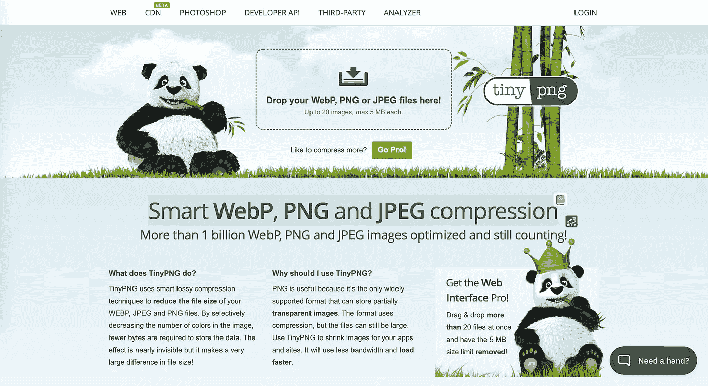
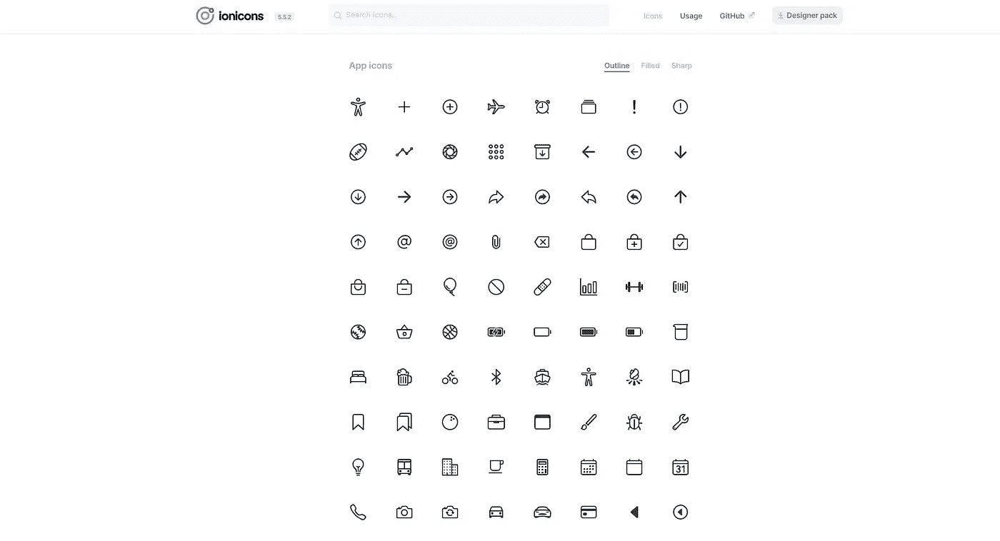
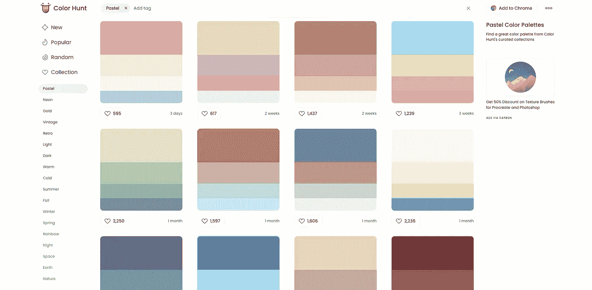
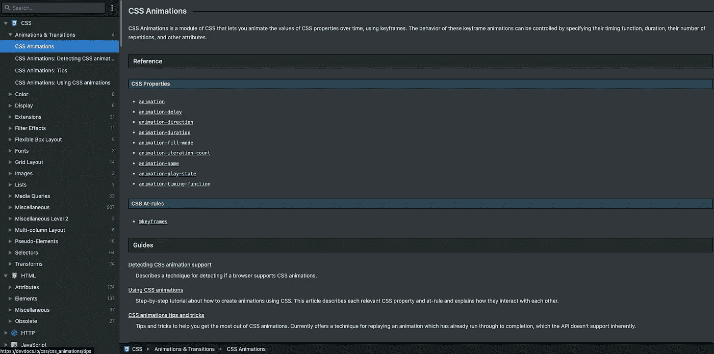
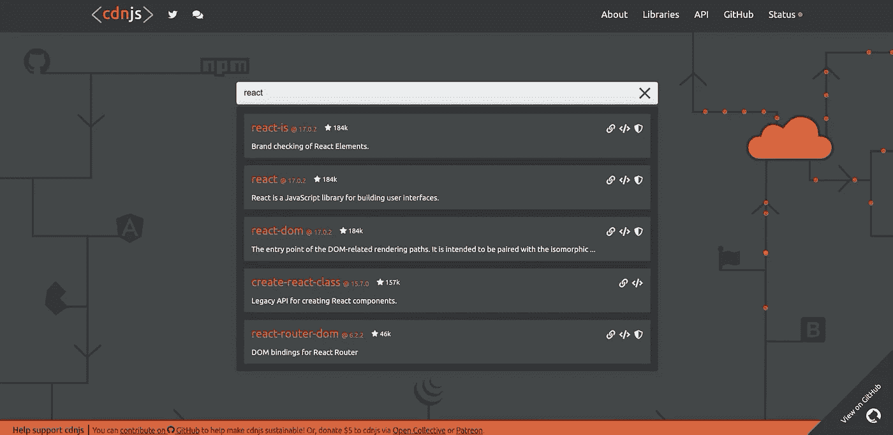
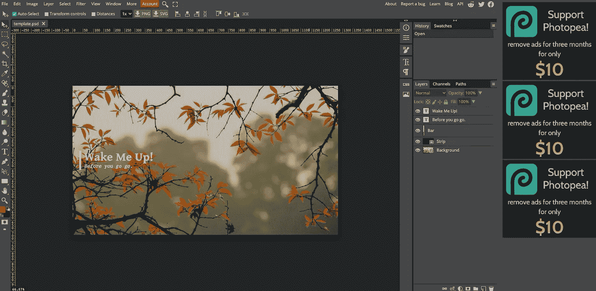

# 面向网络开发人员的 15 个黑仔网站

> 原文：<https://javascript.plainenglish.io/15-killer-websites-for-web-developers-35a4c007942a?source=collection_archive---------0----------------------->

## 99.9%的开发者都不知道。

Photo by [KOBU Agency](https://unsplash.com/@kobuagency?utm_source=medium&utm_medium=referral) on [Unsplash](https://unsplash.com?utm_source=medium&utm_medium=referral)

# 前言

我想和大家分享一些有用的网站，有些可以提高你的生产力，有些可以帮你写文章，有些可以帮你做设计。现在让我们来看看。

# 1.为您的源代码创建和共享美丽的图像

[链接](https://carbon.now.sh/)

使用 [Carbon](https://carbon.now.sh/) 来创建和分享你的源代码的美丽图像。它提供了多种代码风格和主题。

# 2.JavaScript 正则表达式可视化工具

[链接](https://jex.im/regulex/#!flags=&re=(((%3F%3D.*%5Cd)((%3F%3D.*%5Ba-z%5D)%7C(%3F%3D.*%5BA-Z%5D)))%7C(%3F%3D.*%5Ba-z%5D)(%3F%3D.*%5BA-Z%5D))%5E%5Ba-zA-Z%5Cd%5D%7B6%2C12%7D%24)

你是那种因为看起来复杂而不想学习正则表达式的人吗？别担心，我以前也是这样，但现在不是了。可视化工具让正则表达式更容易理解。

# 3.随机图像

[链接](https://unsplash.com/)

互联网上免费使用的图片来源。由各地的创造者提供动力。

# 4.智能 WebP、PNG 和 JPEG 压缩

[链接](https://tinypng.com/)

您可能经常需要压缩图像， [tinypng](https://tinypng.com/) 免费使用，压缩后的图像清晰度高。

# 5.密码笔

[链接](https://codepen.io/)

使用 CodePen 可以非常方便地在介质上嵌入演示代码，就像这个例子一样。

# 6.开源图标

[链接](https://ionic.io/)

你可以从 Ionic 上找到你需要的任何图标，包括用于 web、iOS、Android 和桌面应用程序的高级设计图标。支持 SVG 和网络字体。完全开源，[离子](https://ionic.io/)。

# 7.超级实用的调色板

[链接](https://colorhunt.co/palettes/pastel)

设计时找不到合适的颜色？[色彩狩猎](https://colorhunt.co/palettes/pastel)可以帮助我们。

# 8.我能用吗？

[链接](https://caniuse.com/)

前端工程师经常需要检查浏览器兼容性，[我能用吗](https://caniuse.com/)是一个可以查询 CSS 和 JavaScript 在各种流行浏览器中的特性和兼容性的网站。

# 9.DevDocs

[链接](https://devdocs.io/)

这个[网站](https://devdocs.io/)有各种项目的文档，也支持离线使用。

# 10.cdnjs

[链接](https://cdnjs.com/)

有时候我们需要在线资源进行编程练习。 [cdnjs](https://cdnjs.com/) 可以帮助我们找到几乎所有的开源库。

# 11.移除图像背景

[链接](https://www.remove.bg/)

这个网站可以免费帮我们 100%自动删除图片背景。

# 12.自述文件

[链接](https://readme.so/editor)

这是创建自述文件的最简单方法，这个简单的编辑器允许您快速添加和自定义项目自述文件所需的所有部分。

# 13.你的网站加载速度有多快？

[链接](https://gtmetrix.com/)

查看您的网站运行情况，揭示速度缓慢的原因，并找出优化机会。

# 14.在线编辑图片

[链接](https://www.photopea.com/)

写文章需要图片吗？图像可以通过这个网站在线设计。

# 15.免版税插图

[链接](https://www.manypixels.co/gallery)

2500 多幅免版税插图，让您的设计锦上添花。

# 最后

谢谢你的阅读，以后我会和你分享更多新的有用的网站。

*更多内容请看*[***plain English . io***](https://plainenglish.io/)*。报名参加我们的* [***免费周报***](http://newsletter.plainenglish.io/) *。关注我们关于*[***Twitter***](https://twitter.com/inPlainEngHQ)*和*[***LinkedIn***](https://www.linkedin.com/company/inplainenglish/)*。加入我们的* [***社区不和谐***](https://discord.gg/GtDtUAvyhW) *。*