# 开发人员必备的 15 个备忘单🚀

> 原文：<https://javascript.plainenglish.io/15-must-have-cheatsheets-for-developers-514cec7d380c?source=collection_archive---------0----------------------->

## 有些语言和框架非常复杂，以至于你可能记不住所有的语法或方法。备忘单是易于获取的笔记。

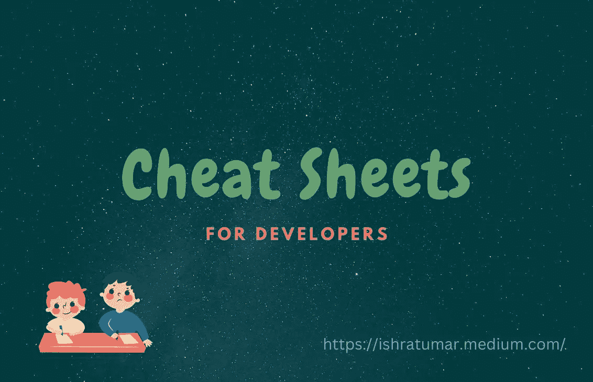

Cheat Sheets for Developers!

随着 web 编程技术的快速发展，我们必须学习很多新的东西。有些语言和框架非常复杂，以至于你可能记不住所有的语法或方法。备忘单是易于获取的笔记。

当有人看到过去任何有帮助或有价值的事情时，包括我自己，我们都会做笔记。然而，你不再需要对你在一本书、研讨会或文章中看到的每个细节做笔记。

我不想劝阻你记笔记；你应该这样做，因为你知道有时你只理解你自己写的笔记。😂

然而，如果你不想做笔记，我理解。在这种情况下，你不必担心，因为网上任何科目都有小抄。为了帮助你的学习，我整理了一份清单。

说够了；让我们言归正传。

## HTML、CSS 和 JavaScript Cheatsheet

您可以在这里找到 HTML、CSS 和 JavaScript 代码示例。每个例子都有解释。像这样的小抄是我的最爱之一。

链接:[https://htmlcheatsheet.com/js/](https://htmlcheatsheet.com/js/)

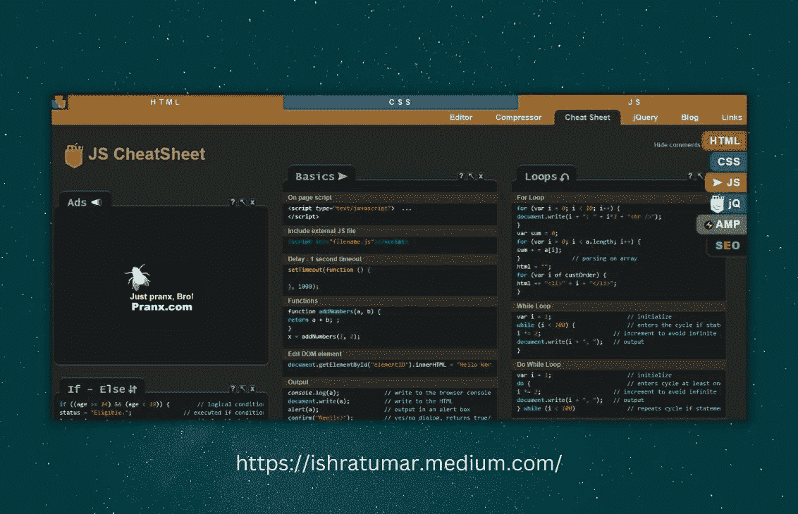

## JavaScript 备忘单

这是一个完整、快速的 JavaScript 初学者入门。值得一查。

链接:【https://quickref.me/javascript 

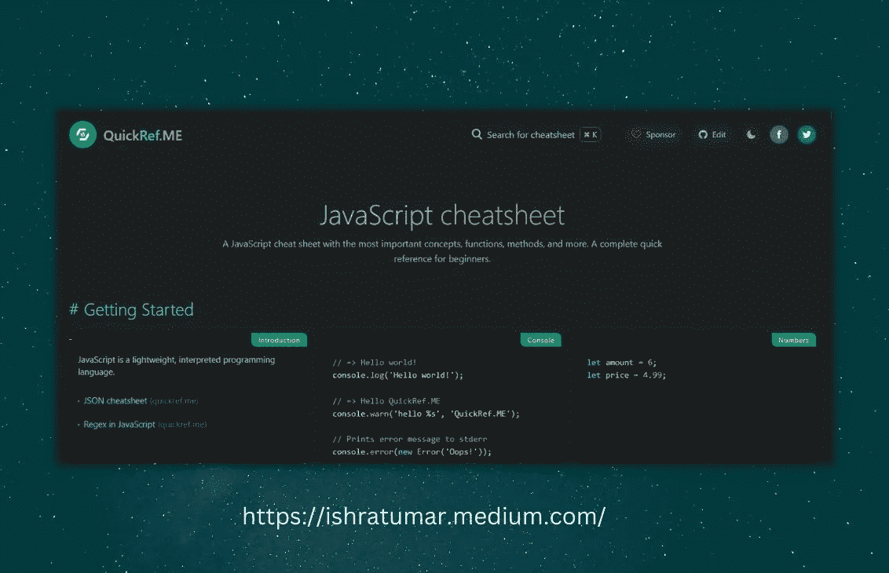

## React.js 备忘单

React 是最流行的 JavaScript 库。对于 React 爱好者来说，这是一个简单但有用的备忘单。一定要把它加入书签，这样你就可以快速查阅了。

链接:https://devhints.io/react/

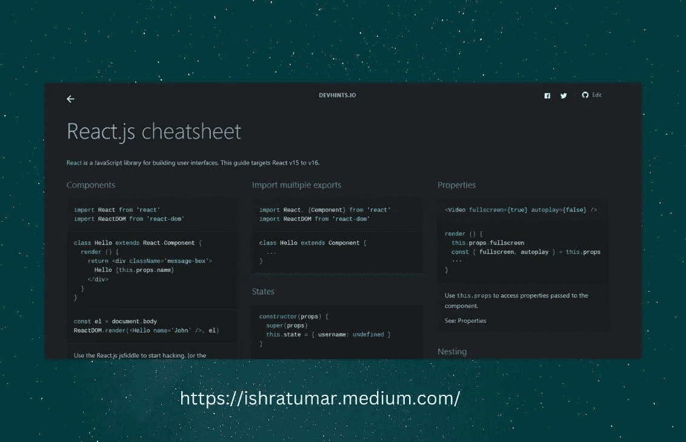

## 全息照相术

没有比这更好的资源了。它有超过 5000 张小抄、复习辅助工具和快速参考资料！每个人都可以在这里得到自己需要的一切，不仅仅是程序员。在这里你可以找到网页开发、商业、游戏、健康、数字营销等等的备忘单。

链接:【https://cheatography.com/ 

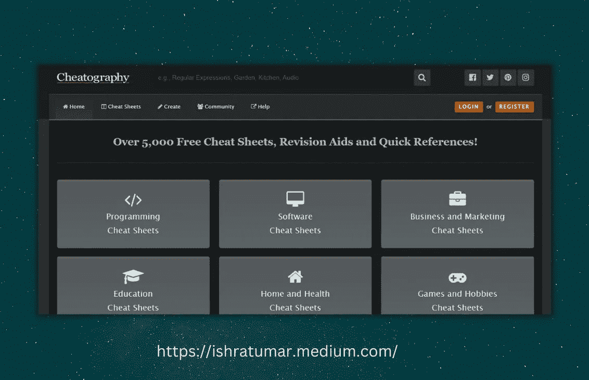

## Java 备忘单

这里简单列出了教科书中最常用的 Java 语言特性和 API。这是一个很好的快速参考。

链接:[https://introcs.cs.princeton.edu/java/11cheatsheet/](https://introcs.cs.princeton.edu/java/11cheatsheet/)

## OverAPI

Over API 是一个了不起的资源。对于大多数编程语言，您可以在这里找到一个备忘单。

链接:[https://overapi.com/](https://overapi.com/)

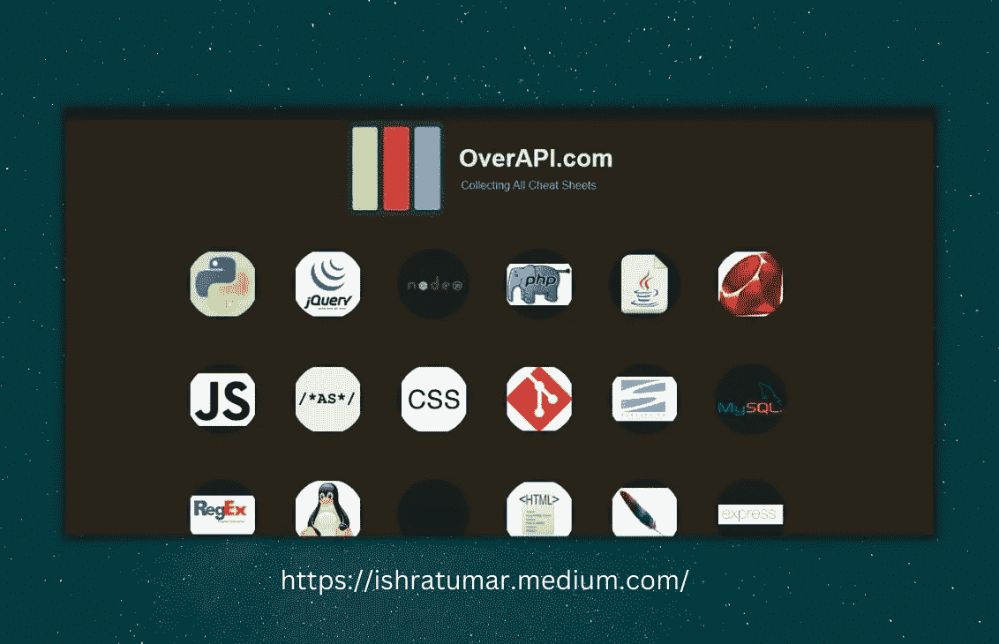

## 开发提示

这里有一些例子、链接、片段等等，让你对这门语言的基础有一个简明的概述。在一页上，你会找到详细的说明。这是值得研究的。

链接:[https://devhints.io/](https://devhints.io/)

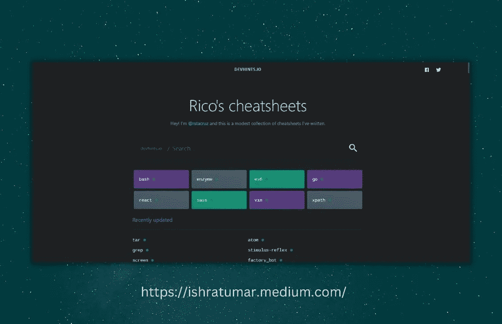

## Gitsheet

Git 是开发人员最重要的技能。这是一个非常简单的 git 命令备忘单。如果你有这个 Gitsheet，你不需要记住所有的命令。

链接:【https://gitsheet.wtf/ 

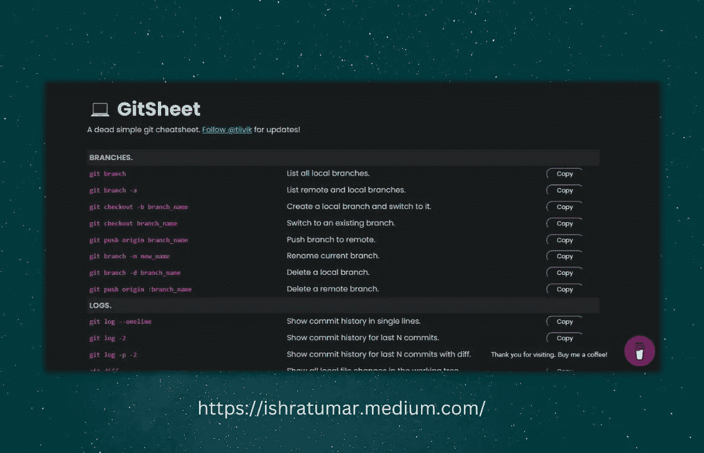

## Vue.js 备忘单

这个备忘单包含了 Vue.js 的详细代码片段和解释。它包括与属性、DOM、数据、事件、生命周期、API 等相关的片段。如果你正在寻找 Vue.js 的快速参考，请查看一下。

链接:【https://marozed.com/vue-cheatsheet/ 

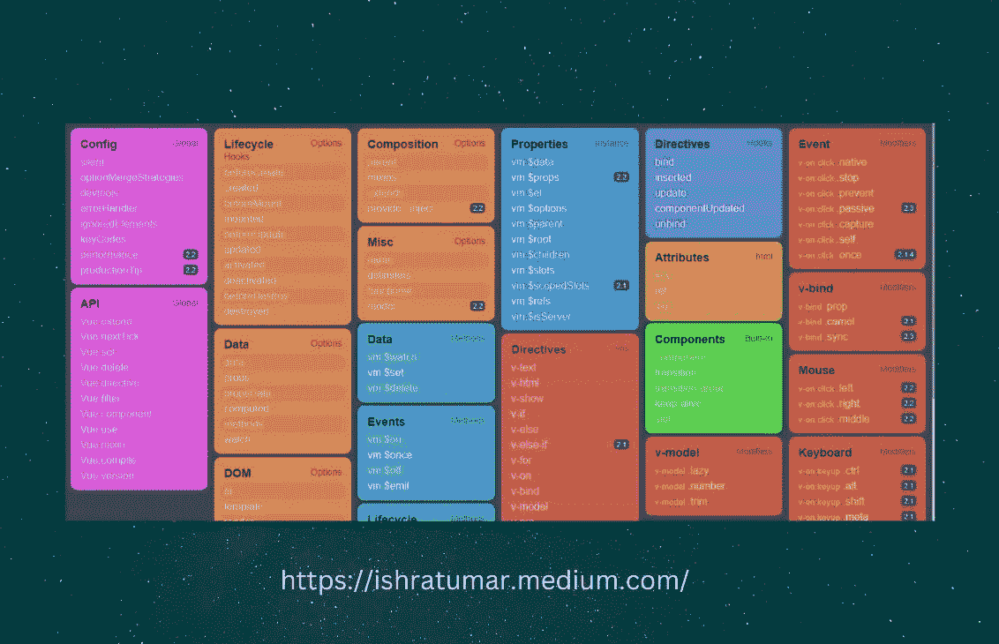

# HTML5 画布备忘单

HTML5 Canvas 的代码示例，包括它的元素、2D 上下文、线条样式、颜色、阴影等等，都可以在这里找到。在这里了解关于 HTML 画布的一切。

链接:[https://simon.html5.org/dump/html5-canvas-cheat-sheet.html](https://simon.html5.org/dump/html5-canvas-cheat-sheet.html)

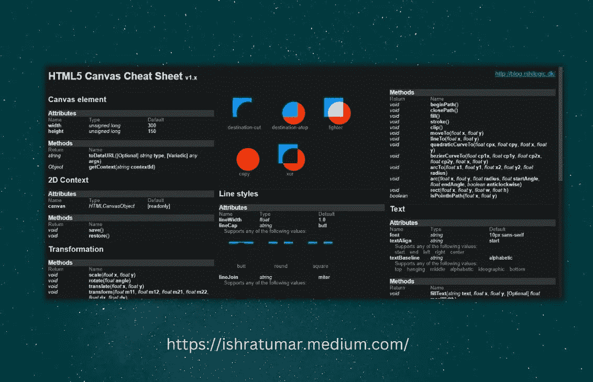

# Web 开发人员的 SEO 备忘单

这个网站是所有关于 SEO(搜索引擎优化)。在最有效的搜索引擎优化技巧中，这是最有帮助的快速参考之一。Web 开发人员和软件工程师也受益于容易获得 SEO 技术标准。

链接:[https://moz.com/learn/seo](https://moz.com/learn/seo)

## **缓解功能**

使用缓动功能，您可以调整动画的速度来创建各种效果，如弹跳、减速、放大等。有关更多信息，请参见本[微软](https://learn.microsoft.com/en-us/dotnet/desktop/wpf/graphics-multimedia/easing-functions?view=netframeworkdesktop-4.8)文档。

此外，参数随时间变化的速率由缓动函数指定。现实世界中的物体几乎不会以一致的速度运动，也很少突然开始和结束。使用此页面，您可以选择理想的缓动功能。

链接:[https://easings.net/en#](https://easings.net/en#)

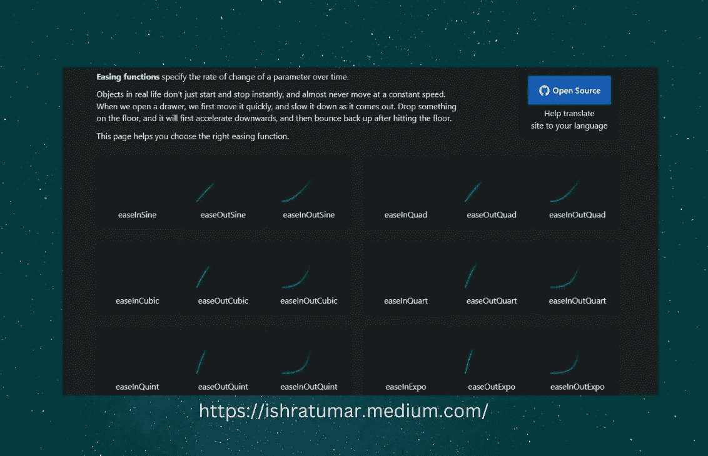

## CSS3 动画

这个网站有一些惊人的动画效果，你可以在你的下一个项目中使用。

链接:[http://www.justinaguilar.com/animations/#](http://www.justinaguilar.com/animations/#)

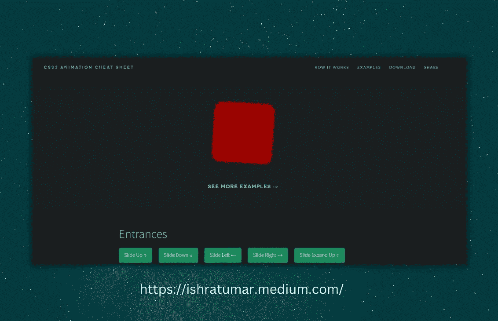

# CSS 网格

CSS 网格可能有点挑战性。因此，很难记住它的所有属性。您可以将此备忘单添加到您的书签中，以便快速参考。

链接:[https://grid.malven.co/](https://grid.malven.co/)

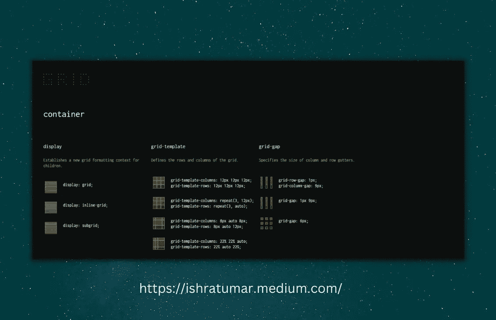

看看我最近发表的其他一些有用的文章:

 [## 你需要知道的 14 个可怕的 CSS 属性🎯

### 让我们来学习一些最好的 CSS 技巧和窍门，来改进你的工作流程和设计。这些 CSS 属性将帮助任何…

ishratumar.medium.com](https://ishratumar.medium.com/14-awesome-css-properties-you-need-to-know-9cee5b364990)  [## 对 React 开发者非常有帮助的 7 个 GitHub 库🚀🎯

### 帮助你学习和寻找灵感的资源

javascript.plainenglish.io](/7-really-helpful-github-repositories-for-react-developers-21d9692c0be2) 

## 包裹

感谢您的阅读！

希望对你有帮助。如果你喜欢，一定要关注[伊什拉特·乌马尔](https://medium.com/u/598701dcfe04?source=post_page-----514cec7d380c--------------------------------)，订阅并在你的收件箱中接收这些故事。

快乐学习！

你也可以在[***Twitter***](https://twitter.com/ishratUmar18)*[***GitHub***](https://github.com/ishratUmar18/)*[***hash node***](https://hashnode.com/@ishratUmar18)***和***[***dev . to***](https://dev.to/ishratumar)**

***更多内容请看*[***plain English . io***](https://plainenglish.io/)*。报名参加我们的* [***免费周报***](http://newsletter.plainenglish.io/) *。关注我们关于*[***Twitter***](https://twitter.com/inPlainEngHQ)[***LinkedIn***](https://www.linkedin.com/company/inplainenglish/)*[***YouTube***](https://www.youtube.com/channel/UCtipWUghju290NWcn8jhyAw)*[***不和***](https://discord.gg/GtDtUAvyhW) ***。*******

*****对缩放您的软件启动感兴趣*** *？检查* [***电路***](https://circuit.ooo?utm=publication-post-cta) *。***