# Web 开发人员必备的 15 个以上 VS 代码扩展

> 原文：<https://javascript.plainenglish.io/15-must-have-vs-code-extensions-for-web-developers-7d3d41a1165?source=collection_archive---------0----------------------->

## 扩展提供了附加的特性和工具，让我们在提高生产力的同时定制和增强开发体验。

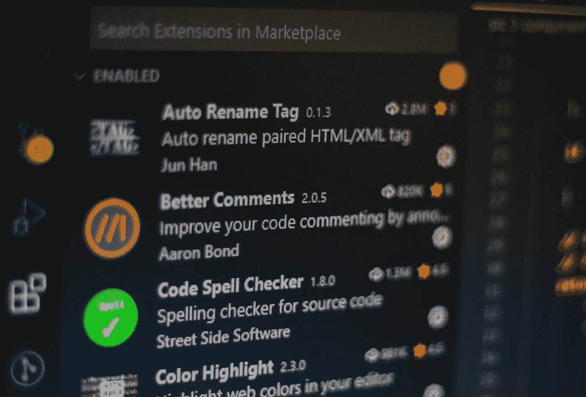

Photo by [Ferenc Almasi](https://unsplash.com/@flowforfrank?utm_source=unsplash&utm_medium=referral&utm_content=creditCopyText) on [Unsplash](https://unsplash.com/s/photos/vscode-extensions?utm_source=unsplash&utm_medium=referral&utm_content=creditCopyText)

VS 代码是开发人员社区中使用最多的 ide 之一，市场上的扩展使得它更受欢迎。 [**VS 代码扩展**](https://marketplace.visualstudio.com/) **提供附加功能&工具，允许定制和增强体验**但是安装正确的扩展集并有效地使用它们可以显著提高您的整体生产力。所以，我们来看看我个人用 VS 代码必备的扩展。

## 自动重命名标签


Source: [Auto Rename Tag](https://marketplace.visualstudio.com/items?itemName=formulahendry.auto-rename-tag)

厌倦了在处理 HTML/JSX 时一个接一个地手动改变开始和结束标签，自动重命名标签来拯救你了。只要安装它，让它处理重命名开始/结束标签，而你改变他们中的任何一个，每当你重命名一个开始或结束标签，另一个将通过这个扩展得到更新。

[](https://marketplace.visualstudio.com/items?itemName=formulahendry.auto-rename-tag) [## 自动重命名标记- Visual Studio 市场

### Visual Studio 代码扩展-自动重命名成对的 HTML/XML 标记

marketplace.visualstudio.com](https://marketplace.visualstudio.com/items?itemName=formulahendry.auto-rename-tag) 

## 更好的评论


Highlighting code comments using Better Comments ([Source](https://github.com/aaron-bond/better-comments/raw/HEAD/images/better-comments.PNG))

你是否发现阅读代码注释并将其分类成待办事项、查询、提醒等很困难？这个扩展允许你有效地识别基于这些类别的评论，并且猜测它允许你定义你自己的类别。

[](https://marketplace.visualstudio.com/items?itemName=aaron-bond.better-comments) [## 更好的评论- Visual Studio 市场

### 更好的注释扩展将帮助您在代码中创建更加人性化的注释。有了这个扩展，你…

marketplace.visualstudio.com](https://marketplace.visualstudio.com/items?itemName=aaron-bond.better-comments) 

## 彩色高光

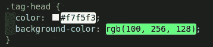

Highlighting color codes using [Color Highlight](https://marketplace.visualstudio.com/items?itemName=naumovs.color-highlight)

简单而强大的扩展，可以用实际的颜色边框或背景实时突出显示所有文件的颜色值，这样下次你就不需要花时间计算特定值的颜色了。

[](https://marketplace.visualstudio.com/items?itemName=naumovs.color-highlight) [## 颜色突出显示- Visual Studio 市场

### Visual Studio 代码扩展-在编辑器中突出显示 web 颜色

marketplace.visualstudio.com](https://marketplace.visualstudio.com/items?itemName=naumovs.color-highlight) 

## 代码拼写检查器

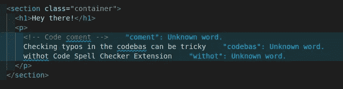

Highlighted Typos in Code

确保代码没有任何拼写错误对开发人员和评审人员来说是一种噩梦，因为我们倾向于忽略代码中各处的小拼写错误，无论是在代码、内容还是注释中，但这个扩展实时突出了这些拼写错误，并支持 **camelCase** 和 **snake_case** 。它还支持添加自定义单词列表，你可能会觉得像**误报**。

[](https://marketplace.visualstudio.com/items?itemName=streetsidesoftware.code-spell-checker) [## 代码拼写检查器- Visual Studio 市场

### Visual Studio 代码扩展-源代码拼写检查器

marketplace.visualstudio.com](https://marketplace.visualstudio.com/items?itemName=streetsidesoftware.code-spell-checker) 

## 代码快照

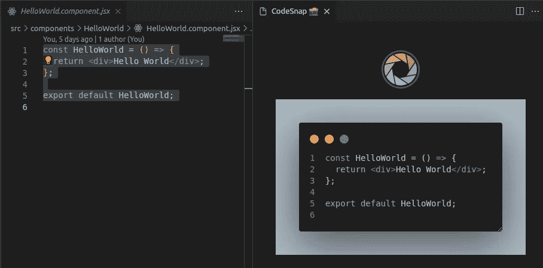

Screenshot by selecting code

从 VS 代码本身截取一个漂亮的代码截图怎么样？你只需要安装这个扩展，点击`Ctrl + Shift + P`，搜索 CodeSnap，选择你想要截图的代码，你的**截图就可以分享给**了！你可以从那里复制/下载文件。

[](https://marketplace.visualstudio.com/items?itemName=adpyke.codesnap) [## CodeSnap - Visual Studio 市场

### 📸在 VS 代码中对你的代码进行漂亮的截图！快速保存您的代码截图复制截图到您的…

marketplace.visualstudio.com](https://marketplace.visualstudio.com/items?itemName=adpyke.codesnap) 

## 误差透镜

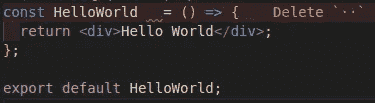

Error Highlighting With Error Lens

这是我个人最喜欢的列表之一，我无法解释这个扩展在调试代码时有多大帮助，只需在编辑器上突出显示错误和警告(用颜色代码),而无需将鼠标悬停在红线上。

[](https://marketplace.visualstudio.com/items?itemName=usernamehw.errorlens) [## 错误镜头- Visual Studio 市场

### Visual Studio 代码扩展-改进错误、警告和其他语言诊断的突出显示。

marketplace.visualstudio.com](https://marketplace.visualstudio.com/items?itemName=usernamehw.errorlens) 

## 埃斯林特

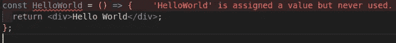

Linting using ESLint

作为 JavaScript 开发人员中最受欢迎的扩展之一，ESLint 可以帮助您删除未被注意到的错误和警告，否则只需进行一个小的设置。

[](https://marketplace.visualstudio.com/items?itemName=dbaeumer.vscode-eslint) [## ESLint - Visual Studio 市场

### 将 ESLint 集成到 VS 代码中。如果您是 ESLint 的新手，请查看文档。扩展使用 ESLint 库…

marketplace.visualstudio.com](https://marketplace.visualstudio.com/items?itemName=dbaeumer.vscode-eslint) 

## Git 镜头


Blame using [Git Lens](https://marketplace.visualstudio.com/items?itemName=eamodio.gitlens)

Git Lens 提供了对谁、为什么以及何时更改了一行或代码块的快速浏览。它提供了**文件注释**(责备和修改)和**侧边栏视图**以及许多其他有用的功能。

[](https://marketplace.visualstudio.com/items?itemName=eamodio.gitlens) [## GitLens - Git 增压版- Visual Studio 市场

### Visual Studio 代码的扩展——在 VS 代码中为 Git 增压——通过 Git 使代码作者身份一目了然

marketplace.visualstudio.com](https://marketplace.visualstudio.com/items?itemName=eamodio.gitlens) 

## Github 拉请求查看器

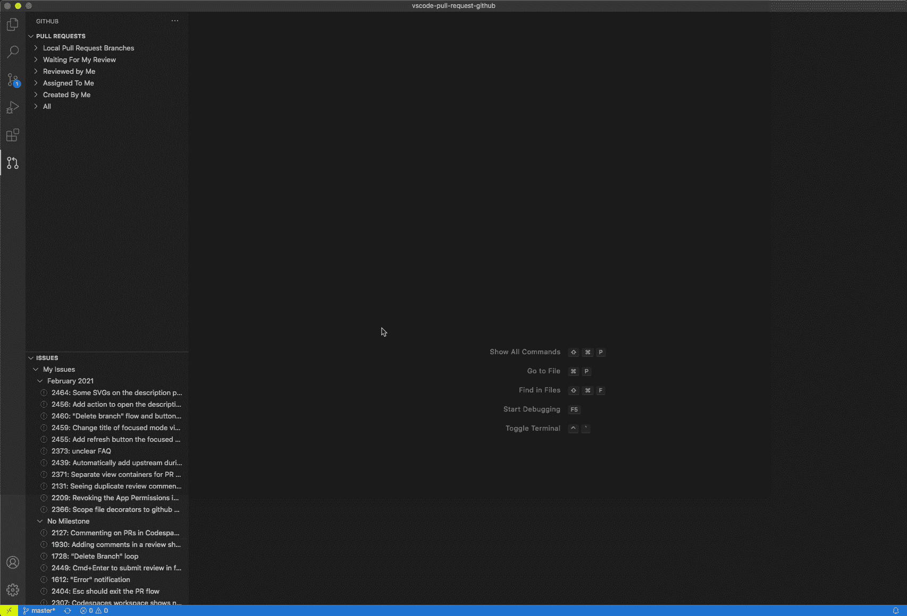

Github Pull Request and Issues into the action ([Source](https://github.com/Microsoft/vscode-pull-request-github/raw/HEAD/.readme/demo.gif))

如果我告诉你，你可以从你的 VS 代码(由于无缝的 VS 代码+ Github 集成)监控和审查 Github 上的 PRs，你所要做的就是安装这个扩展，并通过登录提供对你的 Github 帐户的访问，你很好地监控，审查 PRs 以及一堆来自你的 VS 代码的东西。

[](https://marketplace.visualstudio.com/items?itemName=GitHub.vscode-pull-request-github) [## GitHub 拉请求和问题- Visual Studio 市场

### 直接在 VS 代码中查看和管理你的 GitHub pull 请求和问题

marketplace.visualstudio.com](https://marketplace.visualstudio.com/items?itemName=GitHub.vscode-pull-request-github) 

## 突出显示匹配的标签


VS Code Highlight Matching Tag ([Source](https://images2.imgbox.com/71/2a/zIA1XCzK_o.gif))

你是否也为在 HTML/JSX 中寻找开始/结束标签的互补标签而感到困惑，有了这个扩展就不会有困惑了。只需将光标移动到标签上，这个扩展就会突出显示标签的补充开/关部分。

[](https://marketplace.visualstudio.com/items?itemName=vincaslt.highlight-matching-tag) [## 突出显示匹配标记- Visual Studio 市场

### 每个人偶尔都会羡慕他们的同事，他们似乎以惊人的速度在他们的 IDE 中移动。我们…

marketplace.visualstudio.com](https://marketplace.visualstudio.com/items?itemName=vincaslt.highlight-matching-tag) 

## 缩进彩虹

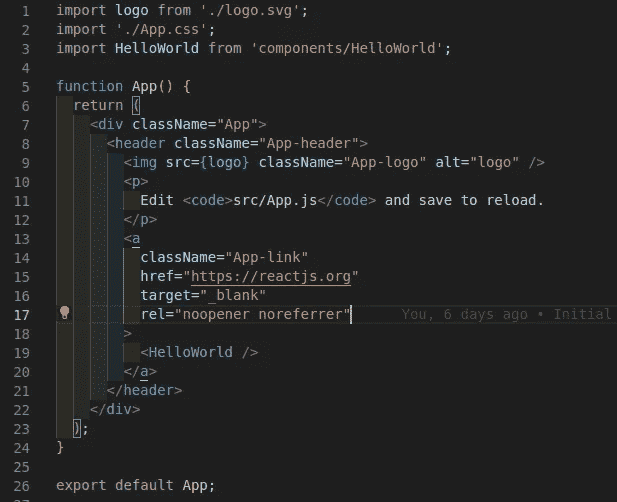

Colorful multi-step indentation using Indent Rainbow

这个扩展通过在每一步添加交替的不同颜色，使多步缩进更容易阅读。这对依赖缩进的语言特别有用，比如 Python 和 Yaml，但对不依赖缩进的语言也同样有效。

[](https://marketplace.visualstudio.com/items?itemName=oderwat.indent-rainbow) [## 缩进-彩虹- Visual Studio 市场

### 如果你经常使用这个插件，请考虑捐赠:这个扩展将你的…

marketplace.visualstudio.com](https://marketplace.visualstudio.com/items?itemName=oderwat.indent-rainbow) 

## 笑话赛跑者

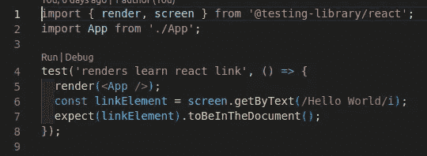

Run | Debug buttons added by Jest Runner on Test Suite

Jest Runner 帮助您通过点击一个按钮，直接从编辑器中的文件运行特定的测试套件/案例。除此之外，它还支持直接从编辑器中调试测试用例。

[](https://marketplace.visualstudio.com/items?itemName=firsttris.vscode-jest-runner) [## Jest Runner - Visual Studio 市场

### VisualStudio Marketplace 开放 VSX 注册表 vscode-jest-runner 专注于运行或调试特定的测试或…

marketplace.visualstudio.com](https://marketplace.visualstudio.com/items?itemName=firsttris.vscode-jest-runner) 

## 实时服务器


Live Server into the action ([Source](https://github.com/ritwickdey/vscode-live-server/raw/HEAD/images/Screenshot/vscode-live-server-animated-demo.gif))

这是我第一次使用 VS 代码的扩展，我喜欢使用它，因为它为本地开发提供了便利。它允许您为静态和动态页面启动带有热重载的本地开发服务器。

[](https://marketplace.visualstudio.com/items?itemName=ritwickdey.LiveServer) [## 实时服务器- Visual Studio 市场

### 直播服务器爱💘您的多根 workspace Live 服务器，用于 PHP 之类的服务器端页面。点击此处启动本地…

marketplace.visualstudio.com](https://marketplace.visualstudio.com/items?itemName=ritwickdey.LiveServer) 

## SVG 预览


SVG Live Preview ([Source](https://github.com/SimonSiefke/vscode-svg-preview/raw/master/demo_images/demo.gif))

这个扩展支持 SVG 的实时预览以及 SVG 的实时编辑，所有这些都来自 VS 代码本身。

[](https://marketplace.visualstudio.com/items?itemName=SimonSiefke.svg-preview) [## Svg 预览- Visual Studio 市场

### svg 文件的实时编辑和 svg 的内部文件的预览平移和缩放(高达 32767%)命令键绑定…

marketplace.visualstudio.com](https://marketplace.visualstudio.com/items?itemName=SimonSiefke.svg-preview) 

## 结尾空白

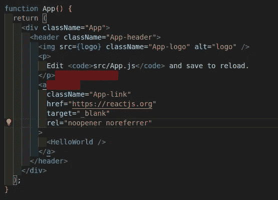

Trailing Spaces Extension

尾随空格扩展，顾名思义，帮助您识别代码中的尾随空格，方法是突出显示它们，如附图所示，并支持一次性删除尾随空格。

[](https://marketplace.visualstudio.com/items?itemName=shardulm94.trailing-spaces) [## 尾随空格- Visual Studio 市场

### 一个 VS 代码扩展，允许您...突出尾部空格，瞬间删除！这个扩展是一个…

marketplace.visualstudio.com](https://marketplace.visualstudio.com/items?itemName=shardulm94.trailing-spaces) 

## 涡轮控制台日志


Adding logs using Turbo Console Log ([Source](https://image.ibb.co/dysw7p/insert_log_message.gif))

这是 JavaScript & TypeScript 开发人员的必备工具**，它支持通过选择变量并点击键盘快捷键( **Ctrl + Alt + L** )来添加有意义的日志消息，从而使调试变得更加容易。此外，它还支持注释/取消注释当前文档中由扩展添加的所有日志消息。告别手动添加日志消息。**

[](https://marketplace.visualstudio.com/items?itemName=ChakrounAnas.turbo-console-log) [## Turbo 控制台日志- Visual Studio 市场

### 这个扩展通过自动化编写有意义的日志消息的操作，使调试变得更加容易。I)插入…

marketplace.visualstudio.com](https://marketplace.visualstudio.com/items?itemName=ChakrounAnas.turbo-console-log) 

## 类型脚本错误转换器

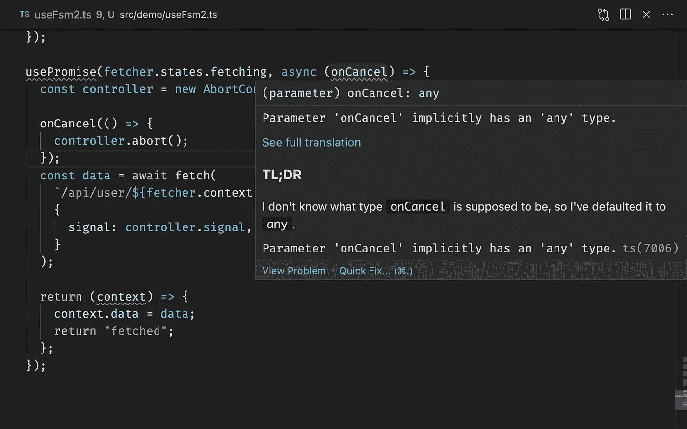

Translating Errors using TypeScript Error Translator ([Source](https://raw.githubusercontent.com/mattpocock/ts-error-translator/main/assets/screenshot.png))

TypeScript 生成的错误有时会令人困惑和沮丧，但是这个扩展将错误直接从 IDE 本身转换为人类可读的形式。

[](https://marketplace.visualstudio.com/items?itemName=mattpocock.ts-error-translator) [## TypeScript 错误转换器- Visual Studio 市场

### Visual Studio 代码类型脚本错误的扩展，为人类翻译

marketplace.visualstudio.com](https://marketplace.visualstudio.com/items?itemName=mattpocock.ts-error-translator) 

*感谢阅读。如果你觉得这篇文章有用，请务必考虑* [*跟我上*](https://medium.com/@eshank.vaish) *！另外，请在评论中分享你最喜欢的 VS 代码扩展。*

```
Want to connect?
Reach out on [Twitter](https://twitter.com/eshankvaish), [LinkedIn](https://www.linkedin.com/in/eshankvaish/) or in the comments below!
```

*更多内容看* [***说白了。报名参加我们的***](https://plainenglish.io/) **[***免费周报***](http://newsletter.plainenglish.io/) *。关注我们关于*[***Twitter***](https://twitter.com/inPlainEngHQ)*和*[***LinkedIn***](https://www.linkedin.com/company/inplainenglish/)*。查看我们的* [***社区不和谐***](https://discord.gg/GtDtUAvyhW) *加入我们的* [***人才集体***](https://inplainenglish.pallet.com/talent/welcome) *。***