# 2023 年开始自由职业生涯的 15 个播客

> 原文：<https://javascript.plainenglish.io/15-podcasts-to-jumpstart-your-freelancing-career-in-2023-637d70145e1f?source=collection_archive---------4----------------------->

Photo by [mohamed_hassan](https://pixabay.com/users/mohamed_hassan-5229782/) on [Pixabay](https://pixabay.com/?utm_source=medium&utm_medium=referral)

自由职业很棒！

它提供了很多额外的好处，比如**成为自己的老板**、**可以自由选择自己想做的事情**、**可以随时休假**等等。

但它也有不利的一面。当你为别人工作时，你被迫学习新东西，这是你工作的一部分。

但是自由职业者的情况就不一样了。即使你学习新的东西，你也没有同样的动力去做。

有时候，你没有时间在应付多个客户、市场营销、在非正常时间、非正常地点工作以及努力跟上行业发展之间学习新事物。

听播客是从不同领域的专家那里学习数十年宝贵知识的好方法。有了合适的播客，无论你是在火车上、外出跑步还是被困在高速公路上，你都可以继续学习和发展。

如果你以播客、视频、文章等形式关注正确的人和正确的内容，你的自由职业生涯将会加速。

这里有 15 个播客供自由职业者不断学习新事物和保持更新:

# 1.做自由职业者

做自己生活和事业的老板可能会很艰难，也会让人孤立。但这也是完全值得的。通过听其他自由职业者分享他们的经验，获得如何成为自由职业者的技巧、建议和想法。

 [## 做自由播客-和史蒂夫·福兰德一起做自由撰稿人

### 但是独自工作逐渐让罗宾变得保守起来。所以现在，她再次主动寻找联系…

www.beingfreelance.com](https://www.beingfreelance.com/the-best-freelance-podcast) 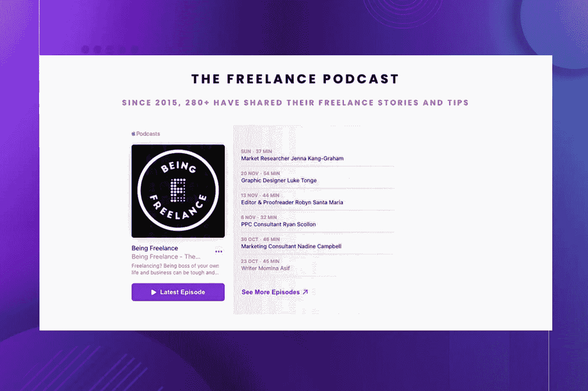

Being Freelance Podcast Screenshot

# 2.失业:给自由职业者和个体创业者的建议

布莱恩为雄心勃勃的自由职业者和创意企业家提供了可行的策略，让他们过上“7 位数的小生活”。

[**布莱恩·克拉克**](https://unemployable.com/about/) 是一位连续的数字企业家，他创办了几个 7 位数的企业，还有一个最近被收购的 8 位数的企业。

在本期播客中，布莱恩讲述了自己 20 年来从单飞到首席执行官(然后又回来)的经历。

 [## 播客档案

### 点击此处查看 Unemployable 播客的完整列表。

unemployable.com](https://unemployable.com/podcast/) 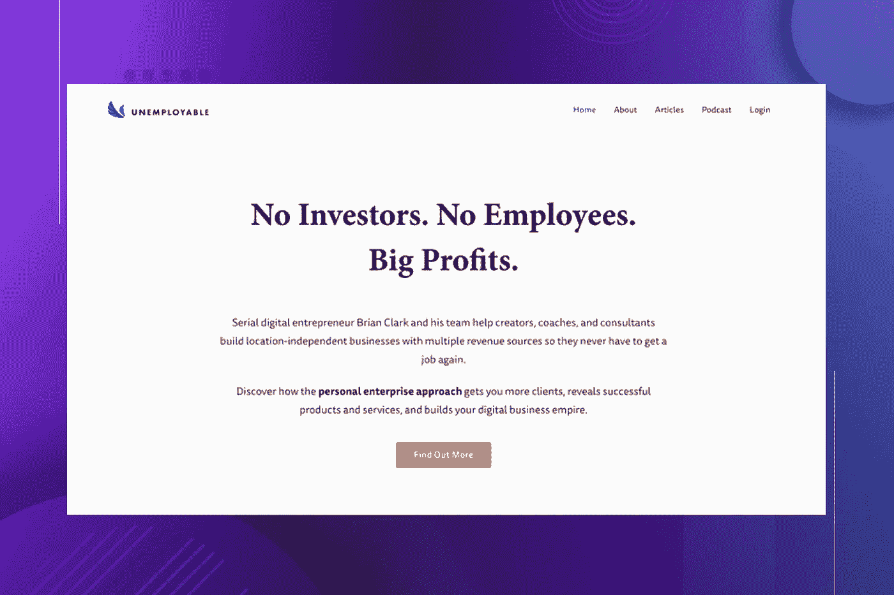

Unemployable Podcast Screenshot

# 3.帕特·弗林的智能被动收入播客

由最好的博主之一 Patt Flynn 主持。

在本期播客中，你将向成功的企业主学习，以及他们是如何建立自己的企业的。

这些节目包括与著名的独唱企业家和专家的深入讨论，例如蒂姆·费里斯、迈克尔·凯悦和加里·韦内丘克。

这几集的主题集中在这些专家在创业世界中遇到的困难以及他们是如何克服这些困难的。帕特·弗林无与伦比的洞察力可以帮助你找到副业，这样你就可以为你的激情找到时间。

 [## 智能被动收入在线业务和博客播客

### 帕特弗林从智能被动收入博客揭示了他所有的在线业务和博客策略，收入来源…

podcasts.google.com](https://podcasts.google.com/feed/aHR0cHM6Ly93d3cuc21hcnRwYXNzaXZlaW5jb21lLmNvbS9wb2RjYXN0LXJzcw?sa=X&ved=0CAMQ4aUDahcKEwj46Oqpud37AhUAAAAAHQAAAAAQAQ&hl=en-IN) 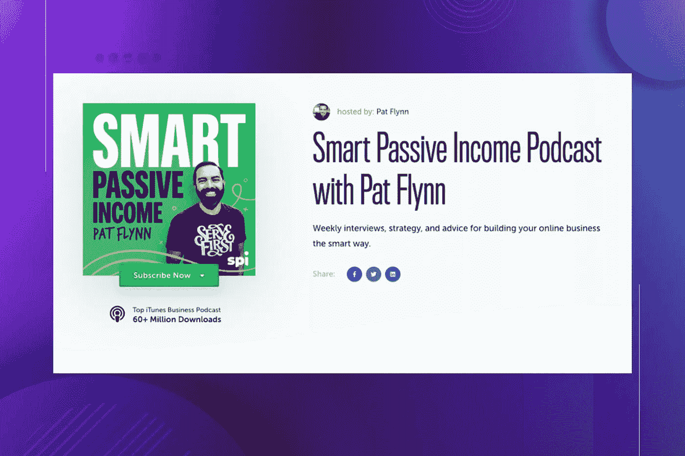

Smart Passive Income Podcast Screenshot

# 4.自由职业者到创始人

您的每周剂量的现实世界，实用，可行的建议，以采取您的服务为基础的业务到一个新的水平，偶尔惊喜嘉宾专家或深入探讨必须具备的成功技能。

 [## 自由职业者到创始人播客-Millo.co

### 自由职业者到创始人是一个独特的每周播客，由克莱和普雷斯顿共同主持，两个…

millo.co](https://millo.co/podcasts/freelancetofounder) 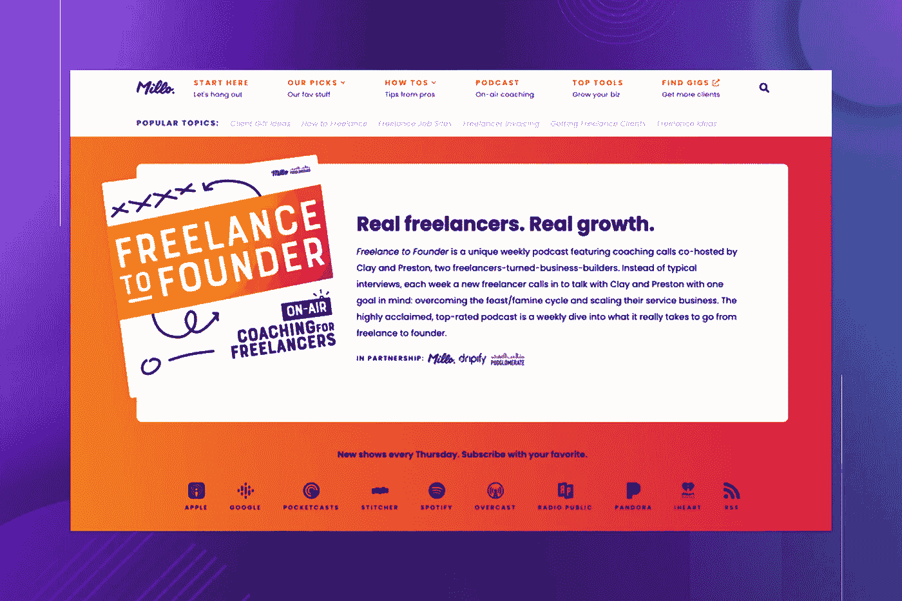

Freelance to Founder Podcast Screenshot

# 5.外出播客

这个播客是为那些想做自由职业者或者已经在做自由职业者的人准备的。由自由作家和《离开办公室:抛弃朝九晚五，做你自己的老板》一书的作者菲奥娜·托马斯主持。

无论你是开始副业还是寻找职业改变，收听学习如何让自我雇佣为你工作。

 [## 外出播客

### 这个播客是为想做自由职业者或者已经在做自由职业者的人准备的。由自由作家和《Out…的作者主持

pod.link](https://pod.link/Outofoffice) 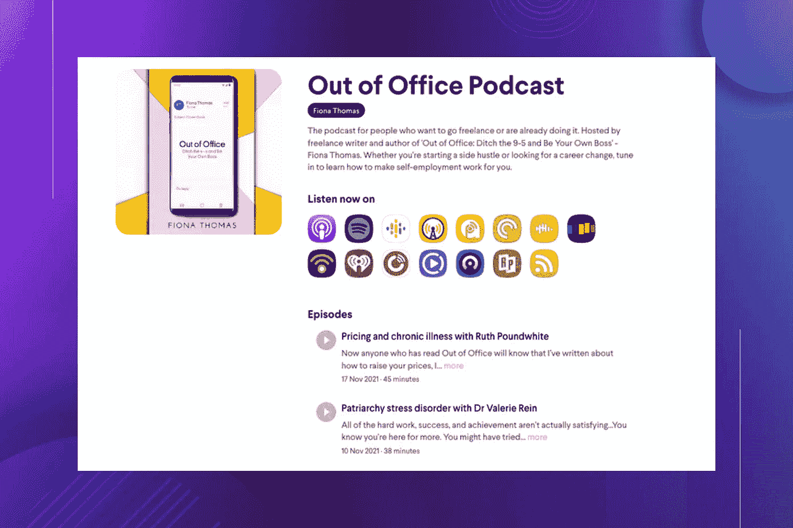

Out of Office Podcast Screenshot

# 6.自由职业者项目

了解他们如何赢得客户，收取更高的费用，停止被欺骗，环游世界，并通过他们的业务建立一种自由的生活方式。

 [## 自由职业者项目

### 学习如何赢得客户，建立你一直想要的自由职业生涯。k·埃纳戈尼奥，电影制作人，摄影师…

projectfreelance.podbean.com](https://projectfreelance.podbean.com/) 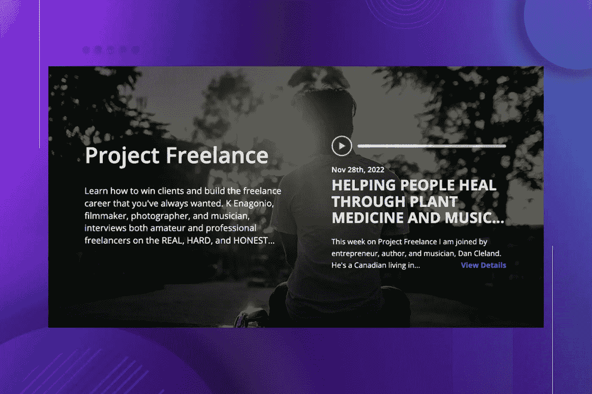

Project Freelance Podcast Screenshot

# 7.自由职业者的茶歇时间

自由茶歇是每周一次的 bitesize 播客，当你等着水壶烧开的时候，你可以听听！充满了自由职业者的技巧、新闻和讨论。

 [## 自由职业者的茶歇时间

### 自由茶歇是一个每周一次的播客，当你等着水壶烧开的时候你可以听听…

freelancelifestyle.libsyn.com](https://freelancelifestyle.libsyn.com/) 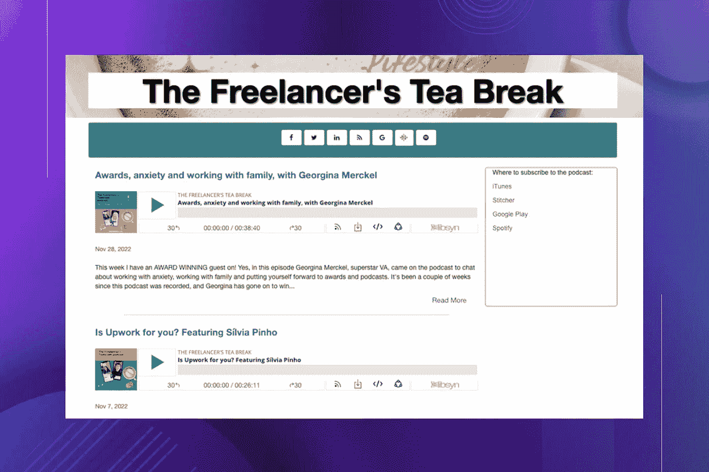

The Freelancer’s Tea break Podcast Screenshot

# 8.自由职业者快速启动电视

经营一个企业和经营一个成功的企业是有区别的，但是你从哪里开始呢？

你的服务应该收取多少费用？你如何让客户重视你的工作？你如何营销你的服务？你的网站上应该有哪些信息？

如果你是一个企业家，自由职业者，或者有创意的人，希望利用数字营销来发展你的业务，那么这个节目就是为你准备的。

**获取节目笔记，永不错过任何一集**

 [## 自由职业者快速启动电视

### 经营一个企业和经营一个成功的企业是有区别的，但是你从哪里开始呢？什么应该…

nathanallotey.com](https://nathanallotey.com/freelance-jumpstart-tv/) 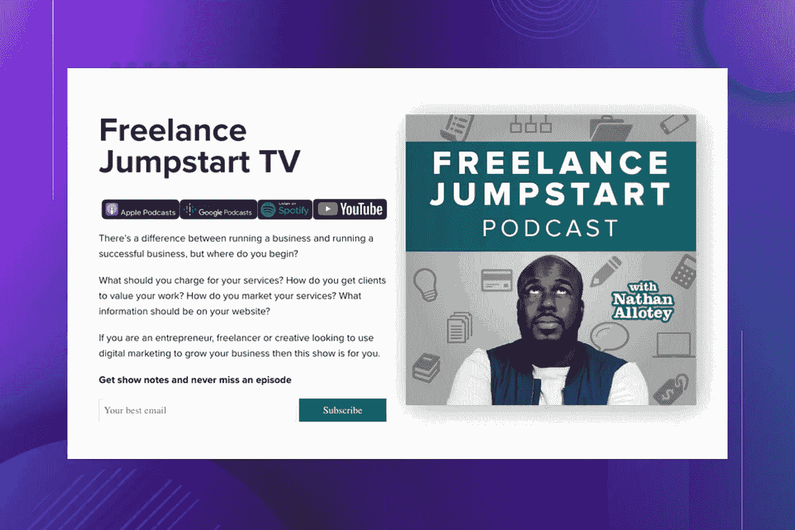

Freelance Jumpstart TV Podcast Screenshot

# 9.自由星期五播客

拉塔莎·詹姆斯主持的自由职业者星期五播客是对自由职业者世界的一次内部观察，包括一些技巧、窍门和对那些做得好的人的采访。

 [## 自由星期五播客

### 一个旅程社会是一个全面的在线培训计划，为侧皮条客，自由职业者，和有抱负的企业…

podcasts.google.com](https://podcasts.google.com/feed/aHR0cHM6Ly9hbmNob3IuZm0vcy83ZWZmZDc0L3BvZGNhc3QvcnNz) 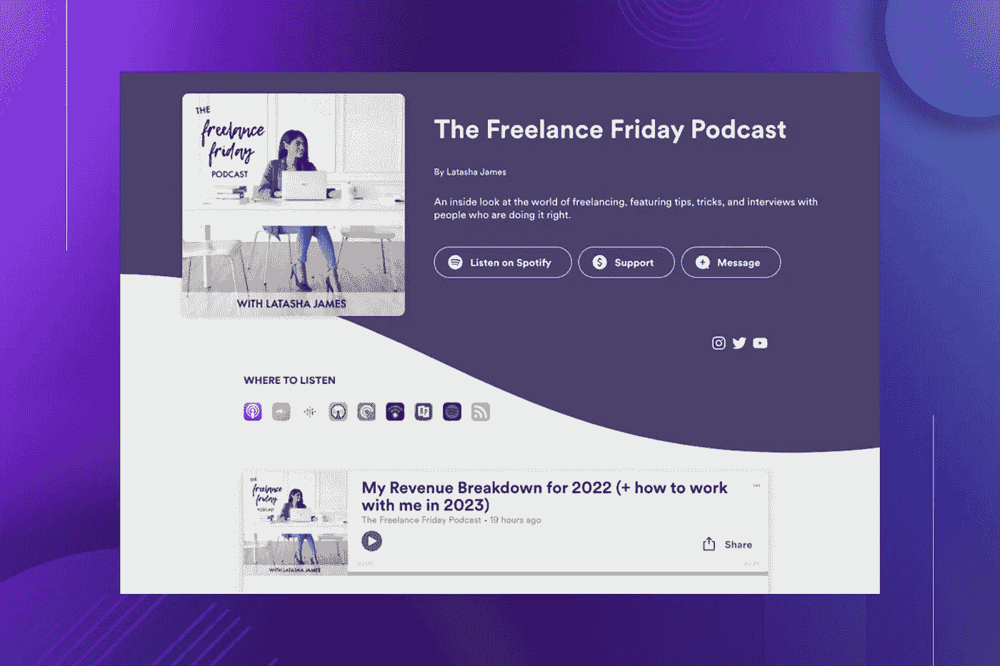

The Freelance Friday Podcast Podcast Screenshot

# 10.侧面拥挤秀

Side Hustle Show 是一个收视率最高的播客，展示了你需要启动和发展成功业务的想法、行动和结果。

主持人尼克·洛珀(Nick Loper)向成功企业家讲述了他们的历程，并摘录了一些你可以应用的可行技巧。

每周你都会得到新的商业想法、额外的机会和高价值的内容，帮助你赚更多的钱和充分利用你的时间。

 [## Side Hustle Show:你可以实际应用的商业播客

### 加入 10 万+听众。因为你的朝九晚五可能让你谋生，但你的朝五晚九让你活着！侧推秀是…

www.sidehustlenation.com](https://www.sidehustlenation.com/side-hustle-show/) 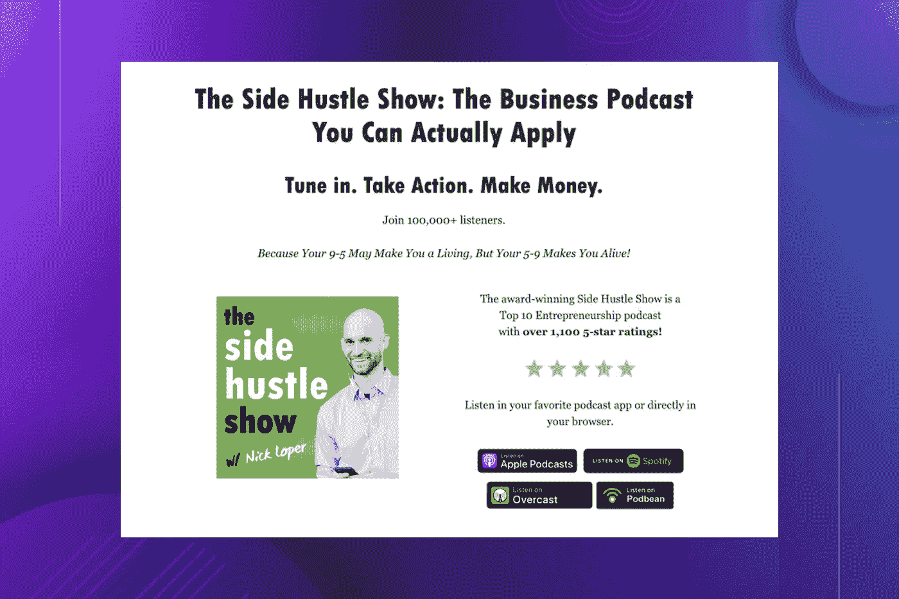

The Side Hustle Show Podcast Screenshot

# 11.自由童话

如果你想放弃朝九晚五的工作，赚点外快，或者实现完全的财务独立，那么自由童话已经准备好在你的生活中加入一点小小的童话元素。

 [## 自由童话播客-自由仙女

### 重组你的想法，改变你的观点，并学会相信财务自由是一个真正的可能性…

www.alexfasulo.com](https://www.alexfasulo.com/the-freelance-fairytales-podcast) 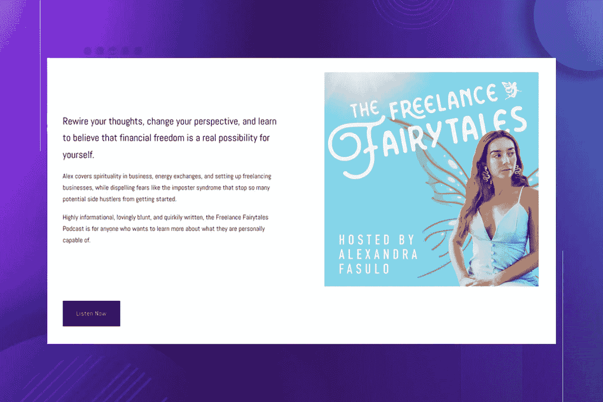

The Freelance Fairytales Podcast Screenshot

# 12.自由单眼播客

一个镜头走进自由职业者的运动设计生活。深入探讨自由职业者细微差别的对话旨在教育和授权现代自由职业者。

 [## 自由单眼播客

### 在这一集里，我们坐下来和 Workbench 的团队聊天。我们了解他们的起源故事，以及…

thefreelancemonocle.libsyn.com](https://thefreelancemonocle.libsyn.com/) 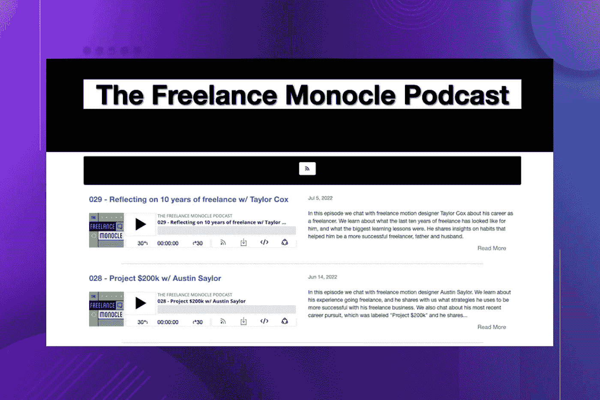

The Freelance Monocle Podcast Screenshot

# 13.忙乱的播客

与不平凡的人的平凡对话，提醒我们所有的故事都值得讲述，只要我们只要求去听。

 [## 忙乱播客|忙乱

### 与不平凡的人的平凡对话，提醒我们所有的故事都值得讲述，只要我们要求…

www.hecticapp.com](https://www.hecticapp.com/resources/freelancer-podcast) 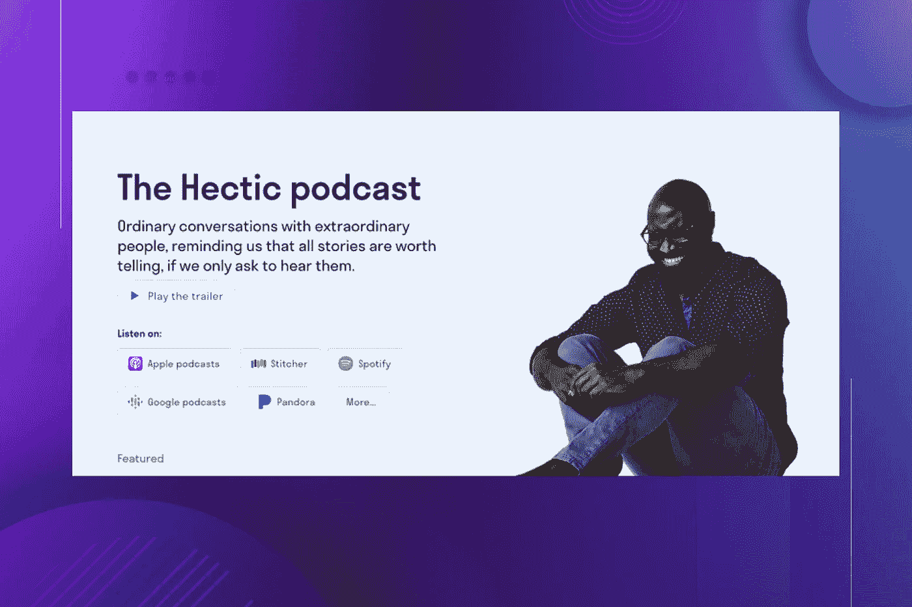

The Hectic Podcast Screenshot

# 14.做老板

“成为老板”播客探讨了创办和运营一家成功的创意自由职业企业的意义和条件。

 [## 成为企业家、自由职业者和兼职者的老板播客

### 《成为老板》不仅探索了它的意义，还探索了作为一个有创造力的企业主，成为老板需要什么…

beingboss.club](https://beingboss.club/podcast) 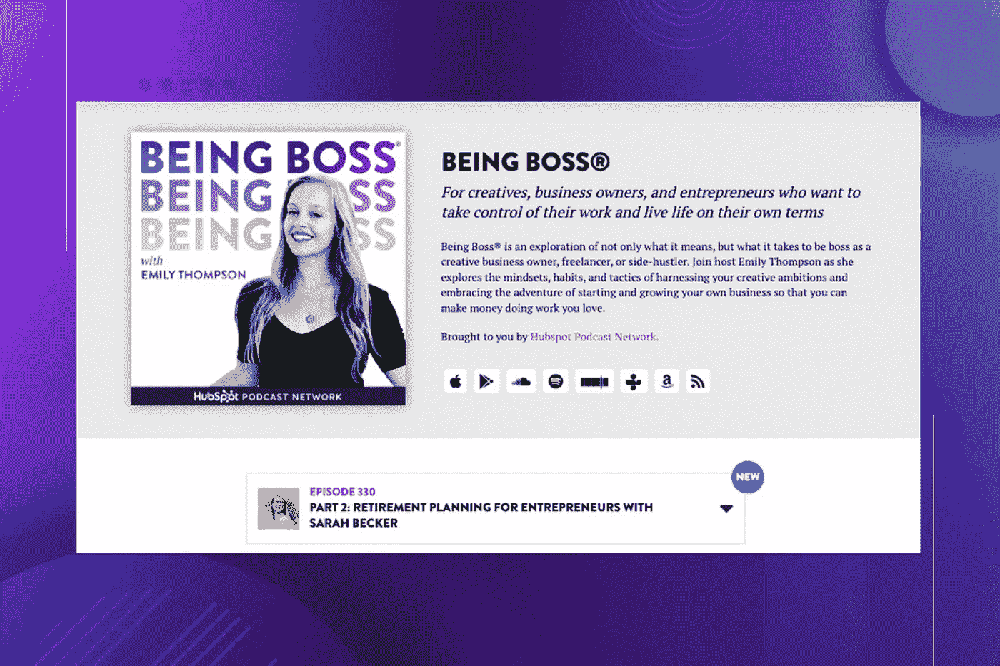

Being Boss Podcast Screenshot

# 15.创意元素

由 Jay Clouse 主持的“创意元素”是一个面向自由职业者和创意者的播客，它在艺术和商业之间架起了一座桥梁。

 [## 创意元素

### 创意元素与您最喜爱的创作者一起走到幕后。通过叙事采访，了解如何…

www.creativeelements.fm](https://www.creativeelements.fm/) 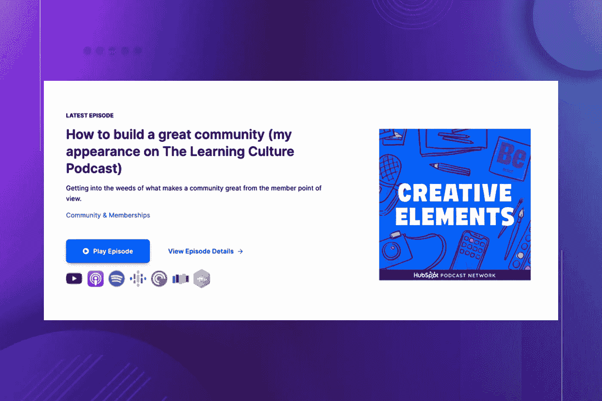

Creative Elements Podcast Screenshot

# 最终想法:

当然，不可能跟踪这个列表中提到的所有播客。

我听播客的方式是听这里提到的所有播客中我感兴趣的剧集。你不需要听一个播客的所有片段。

我希望这篇文章是有用的，并向你介绍了一些你不知道的播客。

# 相关文章:

1.  在过去的两年里，写作帮助我赚了比 10K 更多的美元
2.  [我作为软件开发人员赚钱的 6 种不同方式(2022)](https://medium.com/javascript-in-plain-english/6-different-ways-i-make-money-as-a-software-developer-you-can-too-d88aa31dd537)
3.  [我花了 35 个小时写了一本电子书，前 6 个月赚了 2723 美元](https://medium.com/javascript-in-plain-english/i-spent-35-hours-writing-an-ebook-and-earned-2-723-in-the-first-6-months-b7b2ead44f5f)
4.  [如何通过发展在线业务赚钱](https://medium.com/javascript-in-plain-english/how-to-make-money-by-growing-an-online-presence-3c99cb9eabf3)
5.  [帮助我的 Twitter 账户增长到 49K 粉丝的 6 个策略](https://medium.com/javascript-in-plain-english/6-strategies-that-helped-me-grow-my-twitter-account-to-22k-followers-8010933400b6)

*更多内容看* [***说白了。***](https://plainenglish.io/)

*报名参加我们的* [***免费每周简讯***](http://newsletter.plainenglish.io/) *。关注我们关于* [***推特***](https://twitter.com/inPlainEngHQ) ，[***LinkedIn***](https://www.linkedin.com/company/inplainenglish/)*，*[***YouTube***](https://www.youtube.com/channel/UCtipWUghju290NWcn8jhyAw)*，以及* [***不和***](https://discord.gg/GtDtUAvyhW) ***。***

***有兴趣缩放你的软件启动*** *？检查出* [***电路***](https://circuit.ooo?utm=publication-post-cta) *。*