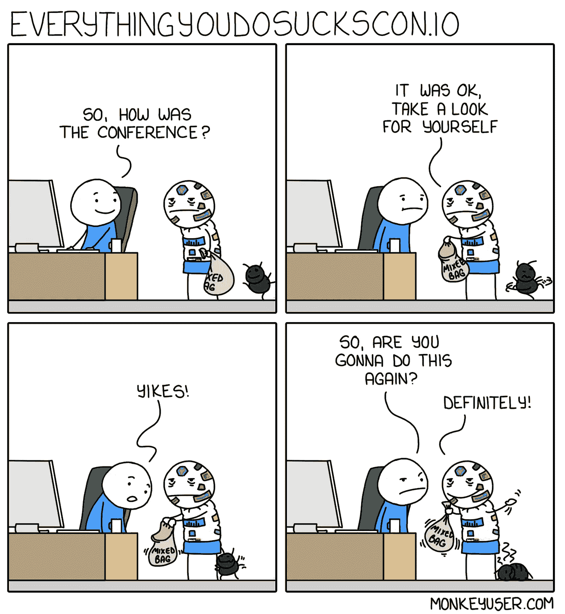
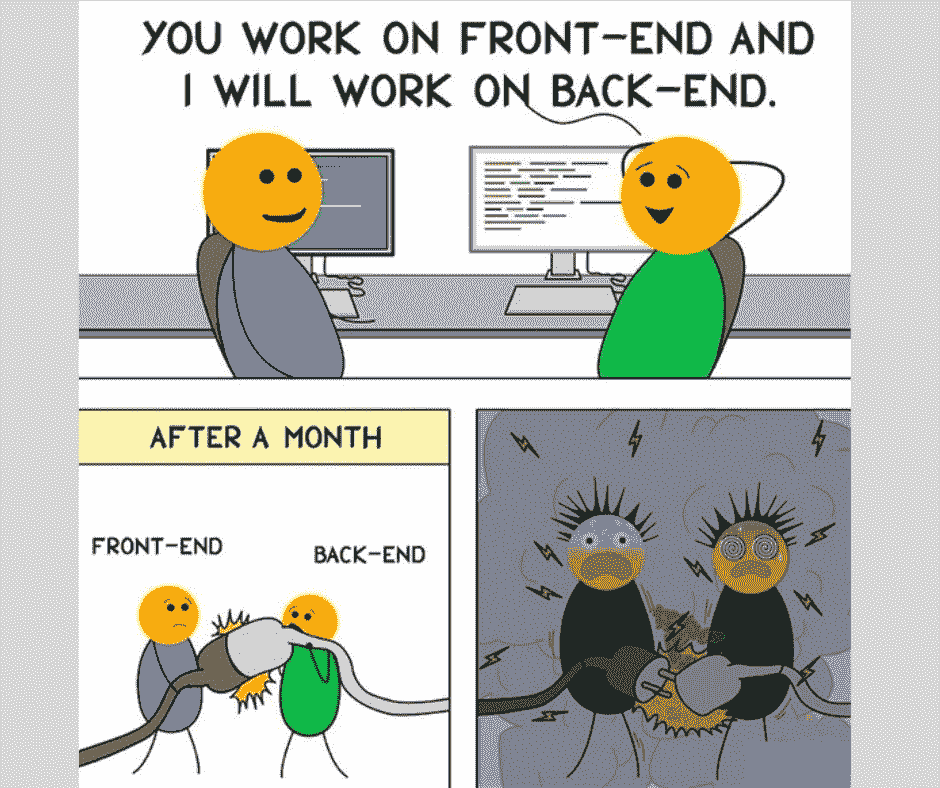
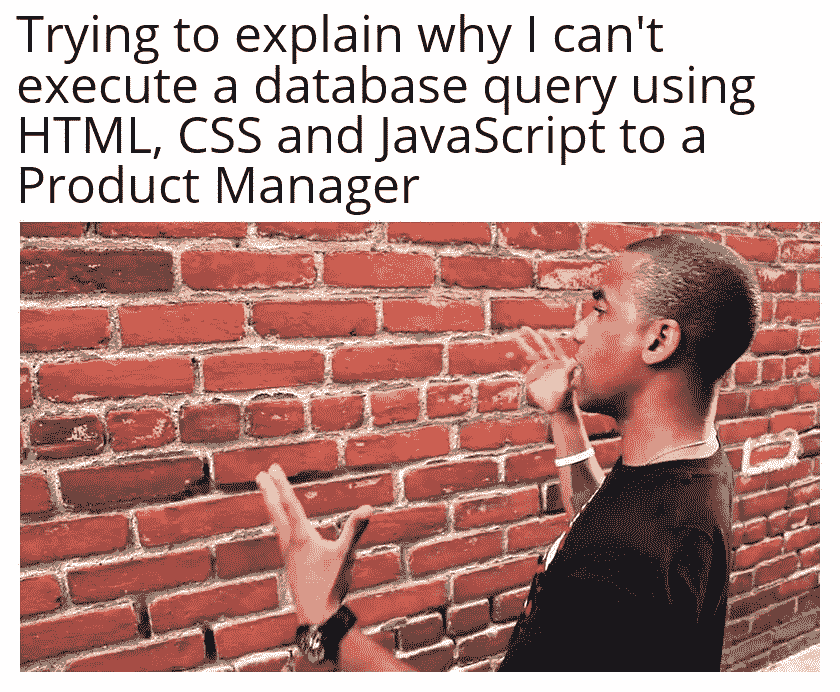

# 15 个编程迷因让你的一天精彩

> 原文：<https://javascript.plainenglish.io/15-programming-memes-to-make-your-day-6e895c49c447?source=collection_archive---------0----------------------->

## 趋势软件工程相关模因的汇编。

Photo by [Anastasia Vityukova](https://unsplash.com/@anastasiavitph?utm_source=medium&utm_medium=referral) on [Unsplash](https://unsplash.com?utm_source=medium&utm_medium=referral)

我们很多人都有打开脸书或 Instagram 开始新一天的习惯。像我这样的一些人喜欢在忙碌了一天后恢复心情，或者我们只是喜欢脸上带着微笑。

在这里，我正在创建一个每日文章系列，可能需要 1-2 分钟来阅读，但保证会让你脸上带着微笑。

# 我们开始吧

# 最佳用户界面奖授予…

Picture Credit: [https://www.reddit.com/r/ProgrammerHumor](https://www.reddit.com/r/ProgrammerHumor)

# 我会继续…因为你没有伤害任何人

Picture Credit: [https://programmerhumor.io/](https://programmerhumor.io/)

# 他们写的和他们想表达的意思…

Picture Credit: [https://www.reddit.com/r/ProgrammerHumor](https://www.reddit.com/r/ProgrammerHumor)

# 当你准备好爆发的时候…

Picture Credit: [https://www.reddit.com/r/ProgrammerHumor](https://www.reddit.com/r/ProgrammerHumor)

# 等等…还没结束…

Picture Credit: [https://programmerhumor.io/](https://programmerhumor.io/)

# 以前有人面临过这种情况吗？

Picture Credit: [https://www.reddit.com/r/ProgrammerHumor](https://www.reddit.com/r/ProgrammerHumor)

# 代码之间的社会距离…

Picture Credit: [https://www.reddit.com/r/ProgrammerHumor](https://www.reddit.com/r/ProgrammerHumor)

# 当我的朋友说我使用的框架可以在两周内学会时…

Picture Credit: [https://www.monkeyuser.com/](https://www.monkeyuser.com/)

# 当你去参加一个会议…对不起，错过了 2-3 年…

Picture Credit: [https://www.monkeyuser.com/](https://www.monkeyuser.com/)

# 我的完美伴侣…

Picture Credit: [https://www.reddit.com/r/ProgrammerHumor](https://www.reddit.com/r/ProgrammerHumor)

# 当运气有利于程序员的时候…

Picture Credit: [https://www.reddit.com/r/ProgrammerHumor](https://www.reddit.com/r/ProgrammerHumor)

# 啊…

Picture Credit:[https://www.facebook.com/groups/programmer.wey](https://www.facebook.com/groups/programmer.wey)

# 你有那个朋友吗？

Picture Credit:[https://www.facebook.com/groups/programmer.wey](https://www.facebook.com/groups/programmer.wey)

# 我们都一样…

Picture Credit:[https://www.facebook.com/groups/programmer.wey](https://www.facebook.com/groups/programmer.wey)

# 请安静

Picture Credit:[https://www.facebook.com/groups/programmer.wey](https://www.facebook.com/groups/programmer.wey)

# 奖励内容:

# 如何避免线头问题？用任何…LOL

[https://www.facebook.com/photo/?fbid=507053803737120&set=gm.2892947247639492](https://www.facebook.com/photo/?fbid=507053803737120&set=gm.2892947247639492)

# 让我们与模拟响应并行工作，稍后我们将集成它

[https://www.facebook.com/101406868766057/photos/a.111476934425717/152664723640271/](https://www.facebook.com/101406868766057/photos/a.111476934425717/152664723640271/)

# 确切地说是我，现在

[https://www.facebook.com/101406868766057/photos/a.111476934425717/152664863640257/](https://www.facebook.com/101406868766057/photos/a.111476934425717/152664863640257/)

# 什么是文档？我了解 StackOverflow。

[https://www.facebook.com/photo?fbid=3878936845549373&set=gm.944860159405928](https://www.facebook.com/photo?fbid=3878936845549373&set=gm.944860159405928)

# 为什么它不起作用？嗯，哦…这就是原因。

[https://www.facebook.com/CodersPhilippines/photos/a.103712541841220/150585230487284/](https://www.facebook.com/CodersPhilippines/photos/a.103712541841220/150585230487284/)

# 找不到相同的结果，但是的，这是完美的定义

[https://www.facebook.com/photo/?fbid=4637136529652355&set=gm.6513183998707329](https://www.facebook.com/photo/?fbid=4637136529652355&set=gm.6513183998707329)

# 行内注释就像…

[https://www.reddit.com/r/ProgrammerHumor/comments/oxpi0x/inline_comments_be_like/](https://www.reddit.com/r/ProgrammerHumor/comments/oxpi0x/inline_comments_be_like/)

# 当你需要向你的经理解释某事时

[https://www.reddit.com/r/ProgrammerHumor/comments/oxr93p/how_why/](https://www.reddit.com/r/ProgrammerHumor/comments/oxr93p/how_why/)

# 任何人都不应该碰一个功能…即使它没有用

[https://www.reddit.com/r/ProgrammerHumor/comments/ox51s7/tf_does_it_even_do/](https://www.reddit.com/r/ProgrammerHumor/comments/ox51s7/tf_does_it_even_do/)

# 自动化脚本正在运行，但没有人更新它们…

[https://www.monkeyuser.com/2019/the-superficial-high/?sc=true&dir=random](https://www.monkeyuser.com/2019/the-superficial-high/?sc=true&dir=random)

希望你喜欢。祝你有快乐的一天。

*更多内容请看*[***plain English . io***](https://plainenglish.io/)*。报名参加我们的* [***免费周报***](http://newsletter.plainenglish.io/) *。关注我们关于*[***Twitter***](https://twitter.com/inPlainEngHQ)*和*[***LinkedIn***](https://www.linkedin.com/company/inplainenglish/)*。加入我们的* [***社区不和谐***](https://discord.gg/GtDtUAvyhW) *。*