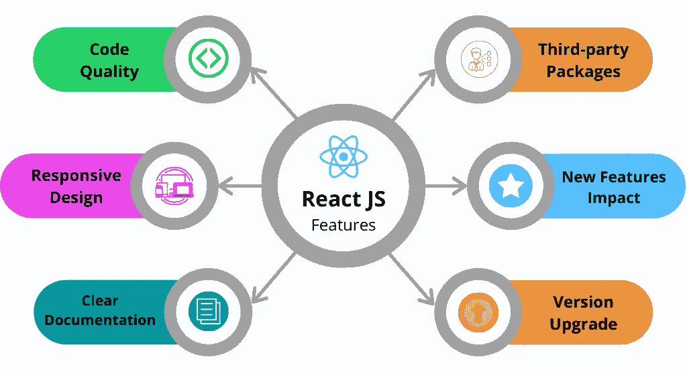
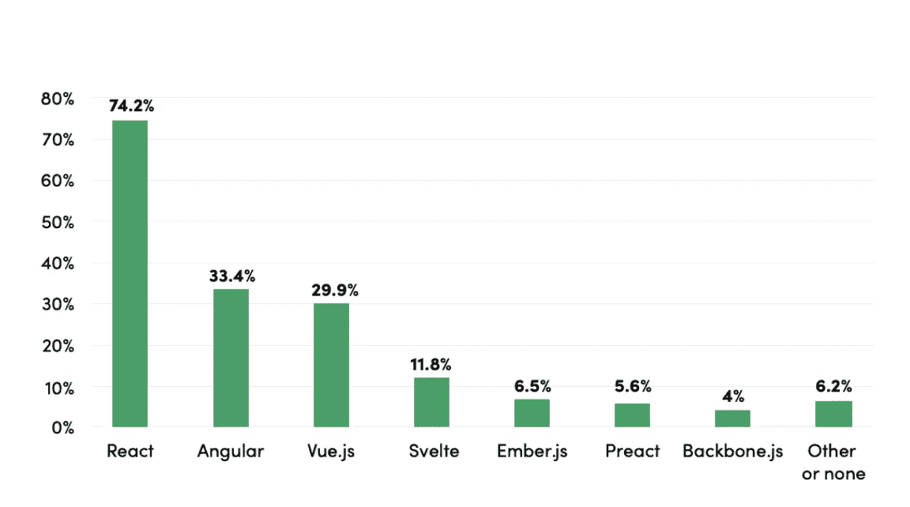
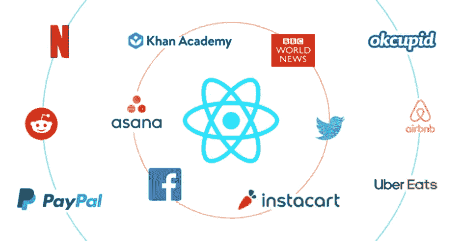
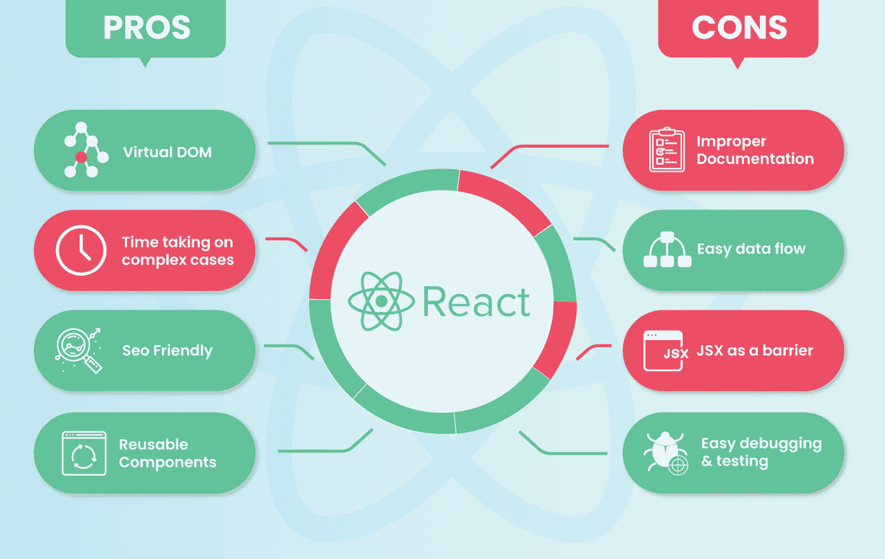

# 您应该为您的 Web 开发项目选择 React 的 15 个以上理由

> 原文：<https://javascript.plainenglish.io/15-reasons-why-you-should-pick-react-for-your-web-development-project-f710b47482a5?source=collection_archive---------11----------------------->

[Image source](https://www.reactjsindia.com/blog/everything-to-know-about-reactjs-application-development-service/)

毫不奇怪，React 正在接管 web 和应用程序开发市场。StackOverflow 最近的调查将它列为 2020 年第二受欢迎的框架，全球许多开发人员都更喜欢使用它。

还有！以下是 2021 年顶级前端框架，显示 React 最受欢迎，全球需求 74.2%。

[**Image source**](https://webxsoftware.com/insights/blog/frameworks-2021)

此外，它不仅受到开发人员的喜爱，还受到企业主、创业爱好者和技术专家的广泛推崇。从 2013 年到 2019 年，React 在渲染性能方面一直处于领先地位。

与 Vue 的 70%份额和[ASP.NET](http://asp.net)内核的 71%相比，我们看到这个 JavaScript 库提供了出色的单一组件，同时对大型应用程序也很有效！

如果您正在寻求一种高性能前端技术，可以帮助您创建流畅无缝的用户体验，您必须选择 React。

在这里，我们将看看为 web 开发项目选择 React 的一些好处。但是！在此之前，我们先了解一下 React 是什么。

**什么是反应？**

React 是一个著名的 JavaScript 库，由脸书在 2013 年创建，作为 AngularJS 的替代品，他们之前一直在自己的项目(脸书和 Instagram)中使用 AngularJS。

最初的想法来自 Jordan Walke，他在雅虎工作时开发了 React。

事实上，这个框架已经变得如此受欢迎，以至于 Instagram 在 2015 年就不再使用 AngularJS 来进行反应。React 专注于构建用户界面，并且做得非常好。

它允许您创建可重用的组件，使您的代码易于阅读和维护。您还可以在这些组件中使用 JavaScript 函数，这使得它们更加强大。

总的来说，React 是 web 开发项目的一个很好的选择，并且它正在迅速成为最流行的框架。

**让我们来看看 15 个以上你应该为 Web 开发项目选择 React 的理由:**

**原因#01:很简单**

React 简单易学，这使得它成为初学者的一个不错的选择。你不需要知道很多不同的功能或工具来开始。然而，简单意味着它在某些方面受到限制。

例如，你不能用 React 构建高度定制的主题，并且像 CSS 过渡这样的东西不支持开箱即用**。**

**原因#02:速度快**

React 不依赖于 jQuery 或任何其他库，这使得它比一些替代方案更快。事实上，React 是如此之快，以至于脸书专门为移动应用程序创建了一个名为 React Native 的独立渲染引擎。

**原因#03:它有一个庞大的社区**

React 变得非常受欢迎，因此有一个庞大的开发人员社区在使用和支持它。这意味着，如果您需要，您可以轻松找到帮助和支持。

此外，你还可以在世界任何一个角落轻松地 [**雇佣拥有所需专业知识的 React 开发者**](https://www.valuecoders.com/hire-developers/hire-reactjs-developers?utm_source=medium&utm_medium=Ang_N12&utm_id=15reasonsreactmed) 。

**理由#04:它是多功能的**

React 是通用的，因为它可以用于 web 和移动开发项目。事实上，React Native 使用与 React 相同的代码库，因此如果您想同时从事这两种类型的项目，您不必学习任何新技能。

**原因#05:被大公司使用**

React 正在被世界上一些最大的公司使用，包括脸书、Instagram、网飞、Airbnb 和沃尔玛。如果这些公司正在使用它，那么它一定非常有潜力。

此外，每一个 [**React 开发公司**](https://www.valuecoders.com/react-js-development-services-company) 都努力以无与伦比的创新来迎合创意产品，激发其使用。

[image source](https://www.simform.com/blog/websites-use-react/)

**原因#06:易于维护**

React 最受赞赏的一点是易于维护。这是因为您的代码被分成了小的组件，这使得它易于理解和更新。

**原因#07:你可以使用 JavaScript 函数**

React 允许您在组件中使用 JavaScript 函数，这给了您很大的灵活性。这是你在其他一些框架中很难找到的特性。

对于 React 开发者来说，这是一种极大的解脱。总之，您可以享受节省时间的高效开发过程。

**原因#08:它被用于实时应用**

React 已经被用来创建一些流行的实时应用程序，包括 Facebook Messenger 和网飞。如果您需要一个框架来处理这种类型的应用程序，那么 React 是一个不错的选择。

然而，雇佣具有相关专业知识的 react 开发人员是至关重要的，因为这可以将你从难以想象的金钱和时间的斗争中解救出来。

理由#09:它提供可重复使用的组件

使用 React，您可以创建可重用的组件，如果其他开发人员需要，可以使用这些组件。这些组件使得代码更容易阅读和理解，因为所有的东西都被分成了小部分。

总之，如果您需要进行任何更改，您也可以轻松地更新您的代码。

source: [CodersDaddy](https://www.codersdaddy.com/)

**理由#10:它正被用于大规模应用**

React 也用于大规模应用，如网飞、UberEats、Skype 等。如果你需要一个框架来处理这种类型的项目，那么 React 是一个很好的难以置信的解决方案。

**理由#11:它对搜索引擎优化友好**

React 是对 SEO 最友好的 JavaScript 框架之一，因为它可以处理常见的搜索引擎故障，以读取虚拟 DOM 中包含大量代码的应用程序。

为了解决这个问题，你可以在你的服务器上运行 react，这样当用户通过 Google 或 Bing 访问网页时，他们将会看到一个网页。然而，iframes 并不适合所有的意图和目的！

**理由#12:它提供了一套有用的工具**

ReactJS 有许多其他框架没有的优点。它包括用于调试和设计的工具，包括 React 开发人员工具，可以用来观察带有子组件的层次结构树。

此外，您可以在会话期间随时检查状态或道具。总之，它还允许您访问这些被称为“交易对手”的小块内部的情况。

这意味着，如果发生错误，可能仍然会保留一些关于错误发生原因的信息，因为通过这个有用的可视化工具，他们的所有数据都在我们面前。

**原因 13。它产生了一个稳定的代码库**

React 使用数据绑定来确保即使很小的变化也不会影响它们的父代码。

父对象是自动调整的，因为它是一个面向内部的结构，所有组件都会立即更新，而不仅仅是一些单独的组件经过特定的例程。

除此之外，这些物体之后还会出现。此外，开发人员可以确信，即使很小的更改也不会影响父对象。

简而言之，数据绑定保证了应用程序的稳定性和持续性能，因为它只在单个组件上运行。因此，你应该[雇佣 React 开发人员](https://www.codersdaddy.com/hire-developer-engineer-programmer/react-js)或者[雇佣印度的 Angular 开发人员](https://www.codersdaddy.com/hire-developer-engineer-programmer/angular-js)在这项技术上有专长。

**理由#14:它迎合了更快的用户界面**

开发人员喜欢使用 React 的第二个原因是它能够在不牺牲可伸缩性或可维护性的情况下实现快速 ui。React JS 是快速构建界面的最佳 UI 库。

用一行代码就可以很容易地改变应用程序中任何元素的外观或行为！

**原因#15:它支持自定义组件编写**

组件使反应如此惊人！你可以编写自己的组件，这真的很酷，因为你可以从头开始创建任何东西。它还产生了更小的客户端代码库，需要更少的外部资源。

这一切都归功于 JSX 作为 JavaScript 原型继承模型的扩展的能力(这是大多数其他框架所不具备的)。

此外，关于我们是否应该称这些小比特为“组件”或者仅仅是布局，已经有了很大的争论；然而，我认为在这一点上，每个人都同意它们非常有用。

**原因#16:启用模板设计**

模板设计有助于节省开发人员的时间，这对业余爱好者和专业人士来说意义重大。在让 React 自己创建一个合适的工作环境后，他们不必花费数小时编写应用程序。

他们所需要的只是一些基本的变量，如数据库名或服务器 IP 地址。

所以，如果你想利用所有这些额外的好处，你可以**雇佣印度的 React 开发者**，他们可以帮助你在适度的时间内制作出色的网络应用。

**什么时候做出选择的反应？**

如果你正在开发一个单页面的应用程序，并且想让它变得更快、响应更快或者用户友好，React 是一个很好的库。然而，这个 JS 框架不能被称为“万灵药”

[Image source](https://medium.com/@thinkwik/why-reactjs-is-gaining-so-much-popularity-these-days-c3aa686ec0b3)

在项目中添加新特性时，总会有不必要的工作，特别是对于像 NodeJS 这样的 React 数据库伙伴。

此外，从 React 的迁移过程可能会变得相当困难，导致企业考虑其他替代方案，如 VueJS。

## **包装完毕**

在您的下一个项目中使用 React 有很多好处。简单性、速度和社区规模使它成为任何能够快速构建东西的开发人员的好选择。

总的来说，由于该框架是通用的并且易于维护，您不必担心将来在维护或更新上投入时间。而且，你可以很容易地借助一个[**React app 开发公司**](https://www.valuecoders.com/react-js-development-services-company?utm_source=medium&utm_medium=Ang_N12&utm_id=15reasonsreactmed) 来构建非凡的解决方案。

如果这些原因还没有说服你，毫无疑问，像脸书这样的大公司现在广泛使用 React！

你怎么想呢?我们是否给了你足够的理由，为什么这可能是你下一个 web 应用程序的完美工具？在考虑 React 是否能很好地满足贵公司的需求时，请在下面写下您的评论，让我知道您还有什么其他想法！

## 进一步阅读

 [## 帮助您在 React 中更快开发的 5 种工具和实践

### React 工具、技巧和最佳实践将帮助您更快地构建应用

javascript.plainenglish.io](/5-tools-practices-to-help-you-develop-faster-in-react-b884c1b20fc2) 

*更多内容请看*[***plain English . io***](https://plainenglish.io/)*。报名参加我们的* [***免费周报***](http://newsletter.plainenglish.io/) *。关注我们关于*[***Twitter***](https://twitter.com/inPlainEngHQ)[***LinkedIn***](https://www.linkedin.com/company/inplainenglish/)*[***YouTube***](https://www.youtube.com/channel/UCtipWUghju290NWcn8jhyAw)*[***不和***](https://discord.gg/GtDtUAvyhW) *。***