# 计算机专业学生的 15 本推荐书籍

> 原文：<https://javascript.plainenglish.io/15-recommended-books-for-computer-science-students-50235bfc1b27?source=collection_archive---------9----------------------->

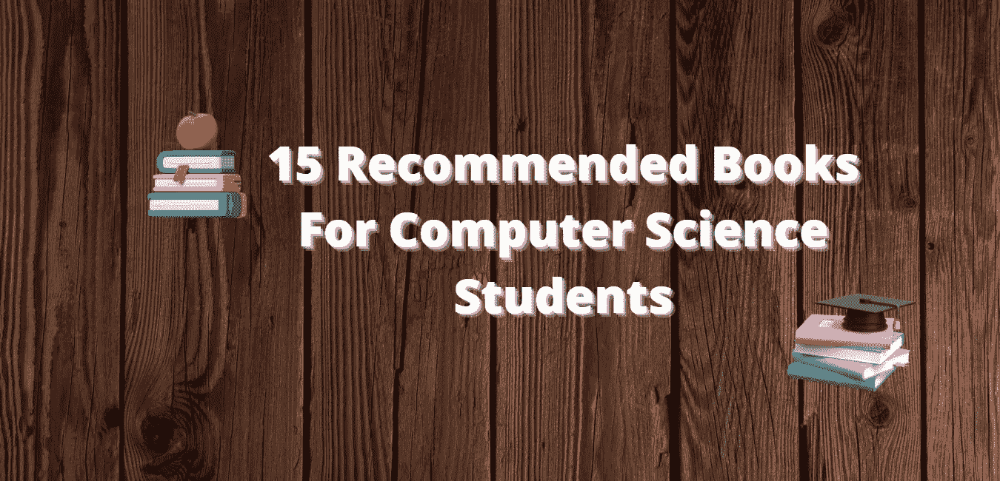

我们处在一个教育数字化已经开始的现代世界。现在互联网上有很多博客和文章可供学习。但是一本书有它自己的价值，作者把他们所有的知识经验和时间写成一整本书。你从一本书里获得的知识和细节是非常珍贵的。

在这篇文章中，我将讨论 15 本推荐给计算机专业学生的书。

# 1.[干净代码:敏捷软件技术手册](https://amzn.to/3F96hkA)

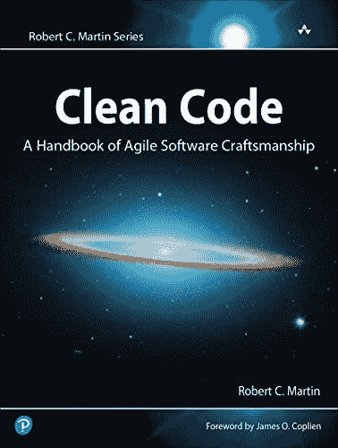

因为它更加平易近人，尤其是对于没有经验的开发人员来说，《干净的代码》是程序员桌上最常看到的书籍之一。干净的代码侧重于战术思想，例如如何构建类和函数，而不是高级过程。

# 2.[头头 Java](https://amzn.to/3Fem9Ct)

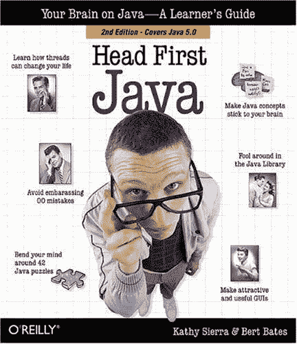

学习一门困难的新语言，尤其是像 Java 这样的面向对象的计算机编程语言，不是一件简单的事情。你可以相信问题出在你的思想上。它似乎有自己的头脑，不总是想吸收你需要学习的枯燥的技术信息。这本书就像 Java 初学者的圣经。

# 3. [Java:完整参考](https://amzn.to/3GCVnF8)

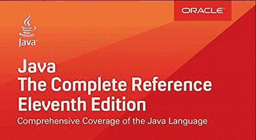

在“Java:完整参考，第八版”中，受欢迎的编程作者 Herb Schildt 涵盖了您需要了解的关于编写、构建、调试和运行 Java 程序的所有内容。这本内容全面的书涵盖了整个 Java 语言，包括语法、关键字和核心编程概念，并且针对 Java Platform，Standard Edition 7 (Java SE 7)进行了更新。您还将了解 Java API 库的关键组件。Swing、JavaBeans、servlets 和 applets 都涉及到了，并通过真实的例子展示了它们是如何工作的。Try-with-resources、switch 中的字符串、diamond 操作符的类型推断、NIO.2 和 Fork/Join 框架都有详细介绍。

# 4.[破解编码面试](https://amzn.to/3ftNW7l)

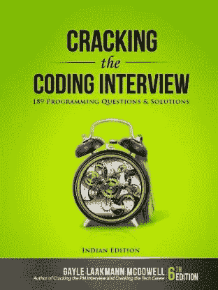

如果你准备开始面试 FAANG 公司，破解编码面试是非常值得的。从面试程序到独特的场景，面试前的准备到行为问题，大 O 到技术问题，以及 189 个真实世界的编程问题都涵盖在内。

# 5.[算法介绍](https://amzn.to/3I8MDqM)

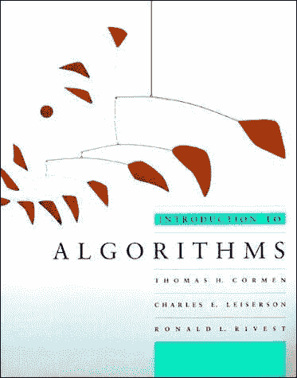

这本书深入地检查了广泛的算法，同时使他们的创造和分析对所有水平的读者可接近。每一章都是独立的，可以单独作为一个学习单元来使用。算法用英语和伪代码给出，任何做过一些编程的人都可以理解。在不丧失信息深度或数学严谨性的情况下，解释一直保持简单。

# 6.[数据结构和算法变得简单](https://amzn.to/3GEnUKs)

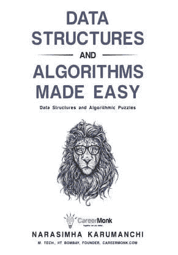

“数据结构和算法变得简单:数据结构和算法难题”解决了关于复杂数据结构和算法的问题。因为每个问题都有几个解，而且这本书是用 C/C++写的，所以它可能会被用作计算机科学家的面试和备考工具。简单的数据结构和算法:数据结构和算法难题是一个解决各种涉及数据结构和算法的难题的集合。任何计算机科学专家都会发现它很有用。它可以作为计算机科学专业人员的参考手册。这本书将帮助你准备校园面试、考试和就业。总之，这本书提出了广泛的具有挑战性的数据结构的解决方案。

# 7.[算法设计手册](https://amzn.to/3qzqrA1)

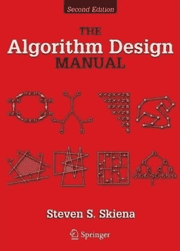

构建算法和测量它们的有用性和效率的“神秘”在这本畅销经典的第三版中被移除。这本书目前是算法设计课程的基础教材，同时也是程序员、研究人员和学生最重要的算法实用参考指南，并更新了第一版和第二版。

算法设计手册的用户友好的格式使组合算法技术对任何人可接近，集中于设计而不是分析。第一部分，技术，解释了如何以清晰易懂的方式开发和分析计算机算法。第二部分，资源，有一个算法资源库，实现，和一个广泛的参考书目供浏览和参考。

# 8.[雄辩的 JavaScript](https://amzn.to/3A7p6DR)

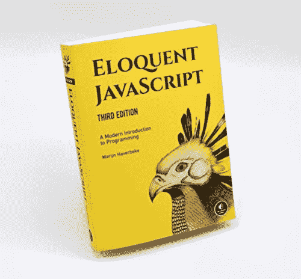

雄辩的 JavaScript 超越了食谱书中的剪切粘贴脚本，教你如何编写优雅而有效的代码。变量、控制结构、函数和数据结构是你要学习的第一批编程概念。之后，您将深入 JavaScript 的高阶函数、闭包和面向对象编程。

您将学习如何:理解编程的原则和最佳实践。通过结合函数式编程和面向对象编程的能力，正则表达式可用于快速分析和编辑文本。错误和浏览器不兼容应该被同情地处理。处理浏览器事件和 DOM 修改。

# 9.[让我们 C](https://amzn.to/3nzuWsx)

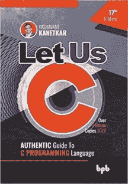

这本书的简单性和讲故事的风格使它从 C 编程书籍的书架上脱颖而出。这两个特点在本书之前的六个版本中都有体现。今天的 C 程序员不仅要学习语言的复杂性和细微差别，还要处理它在 Windows 和 Linux 等系统中的使用。这本书很好地涵盖了 C 编程的所有三个领域。

# 10.[头先设计图案](https://amzn.to/3qyzxNo)

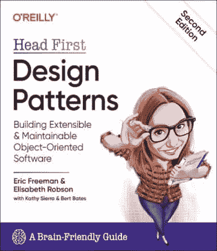

这本书教你重要的模式，何时以及为什么使用它们，如何将它们应用到你自己的想法中，以及支撑它们的面向对象的设计概念。加入成千上万使用 Head First 设计模式来增强面向对象设计能力的开发人员的行列。

# 11.[比特币和区块链的基础知识](https://amzn.to/3FExyeS)

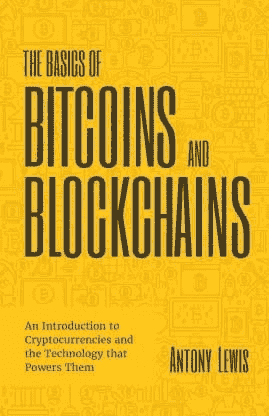

了解加密货币和区块链的历史和基本原理:有大量关于比特币和区块链的信息。然而，这些信息中的大部分对于未受过训练的人来说可能是不可理解的。《比特币和区块链的基础》试图对这种新货币及其背后的突破性技术进行简单易懂的介绍。

# 12.[数据库系统概念](https://amzn.to/3nxBat8)

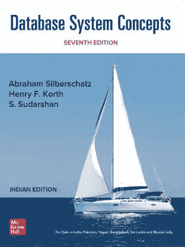

《数据库系统概念》是数据库教育中一部经典而重要的著作。它以一种易于理解的方式介绍了数据库管理的基本概念，允许学生直接开始使用数据库。

该文本面向大三/大四本科生数据库课程或一年级研究生数据库课程。它还包括额外的信息，可作为更高级课程的补充或前奏。

# 13. [Python 速成班](https://amzn.to/3A6wXkT)

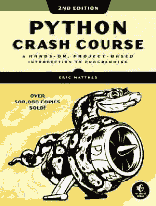

如果你需要尽快学习 Python，那就别再找了。Python 速成课程旨在让 Python 编程新手快速上手并运行。使用基于项目的方法快速学习编程的基础，这样您就可以专注于您想要构建的东西:网站、数据可视化、在线应用程序，甚至编写一个 Raspberry Pi。Python 速成课是世界上最畅销的 Python 书籍。

# 14.设计数据密集型应用程序:可靠、可伸缩和可维护系统背后的重要理念

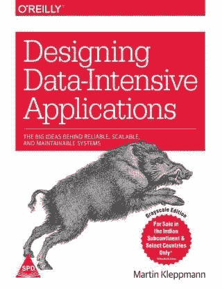

“数据系统的基础”对数据系统做了很好的概述。本节首先讨论期望的数据库质量，如可靠性、可伸缩性和可维护性。数据库的概念，如经典的关系模型，文档模型和基于图形的模型进行了调查。然后详细解释了数据库中数据存储和检索的实现。您将了解表、LSM 树和 B 树，以及它们在数据库中的应用。深入讨论了数据仓库和面向列的数据库。OLTP 和 OLAP 之间的区别以表格的形式呈现。对消息代理、protocolbuf、thrift 和 avro 有很好的介绍。

# 15.[用 C++进行面向对象编程](https://amzn.to/3GE7SjP)

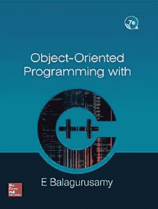

本书的目标是使用 C++作为实现语言，在面向对象编程领域提供全面丰富的知识。作者利用简单的语言来传达面向对象编程的重要原则，并帮助读者理解。在用 C++编程语言编写的已解决的例子中也实现了相同的思想。这本书保留了其直截了当的写作风格，并包括大量解决的例子，编程练习和额外的实践问题。

## 如果你❤️我的内容！在推特[上联系我](https://mobile.twitter.com/Astrodevil_)或者通过[请我喝咖啡](https://www.buymeacoffee.com/Astrodevil) ☕来支持我！您也可以在我位于 [Gumroad](https://astrodevil.gumroad.com/) 的商店购买数码产品

*更多内容看* [***说白了。报名参加我们的***](http://plainenglish.io/) **[***免费周报***](http://newsletter.plainenglish.io/) *。在我们的* [***社区不和谐***](https://discord.gg/GtDtUAvyhW) *获得独家获取写作机会和建议。***