# 每个开发人员都应该知道的 15 个正则表达式技巧

> 原文：<https://javascript.plainenglish.io/15-regular-expression-tricks-tips-for-you-bd7785c9a881?source=collection_archive---------3----------------------->

## 正则表达式可以大大提高你的效率

Photo by [Jexo](https://unsplash.com/@jexo?utm_source=medium&utm_medium=referral) on [Unsplash](https://unsplash.com?utm_source=medium&utm_medium=referral)

# 前言

你对正则表达式有什么看法？我猜你会说**太晦涩**，**我对它一点兴趣都没有**。是的，我曾经和你一样，以为这辈子都学不会。

但是我们不能否认它真的很强大，我在工作中用的很多，并且**我总结了 15 个小技巧和大家分享。**

如果你对它们是如何实现的感兴趣，非常欢迎你在评论区告诉我，我会另写一篇文章单独分析。

# 1.格式化货币

我经常需要格式化货币，它需要遵循以下规则:

1.  `123456789` = > `123,456,789`
2.  `123456789.123` = > `123,456,789.123`

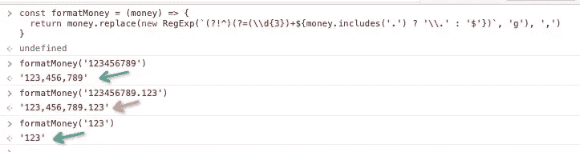

你能想象如果没有正则表达式我们会怎么做吗？

# 2.实现微调功能的两种方法

有时我们需要删除字符串的前导和尾随空格，使用正则表达式会非常方便，我想和你分享至少两种方法。

**方式 1**

很好，我们已经删除了字符串“string”的前导空格和尾随空格。

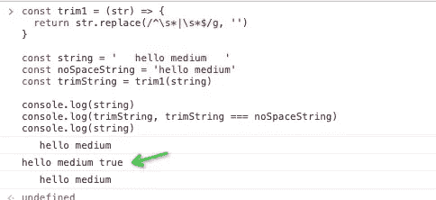

**方式二**

第二种方式，我们也达到了目的。

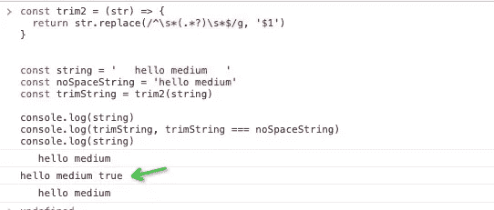

# 3.解析链接上的搜索参数

您一定也经常需要从链接中获取参数，对吗？

用正则表达式解决这个问题真的很简单。

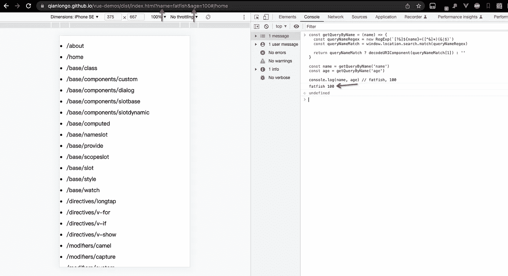

# 4.骆驼盒绳子

请将字符串转换为骆驼大小写，如下所示:

我的朋友们，没有什么比正则表达式更好的了。

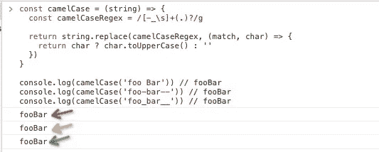

# 5.将字符串的第一个字母转换为大写

请将`hello world`转换为`Hello World`。

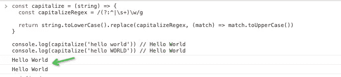

# 6.转义 HTML

防止 XSS 攻击的方法之一是进行 HTML 转义。转义规则如下:

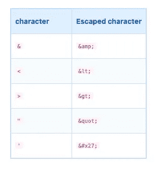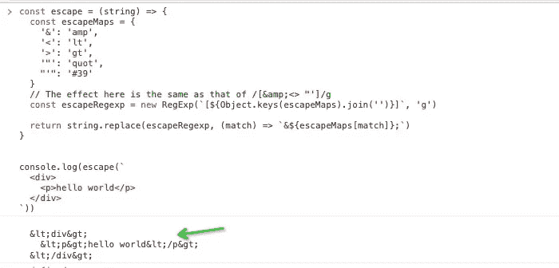

# 8.Unescape HTML

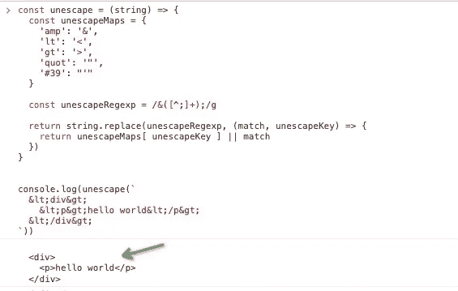

# 9.24 小时格式的匹配时间

请判断时间是否符合 24 小时格式。匹配规则如下:

1.  01:14
2.  1:14
3.  1:1
4.  23:59

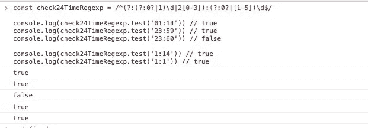

# 10.匹配日期格式

请匹配类似(yyyy-mm-dd，yyyy.mm.dd，yyyy/mm/dd)的日期格式，例如 2021–08–22，2021.08.22，2021/08/22。

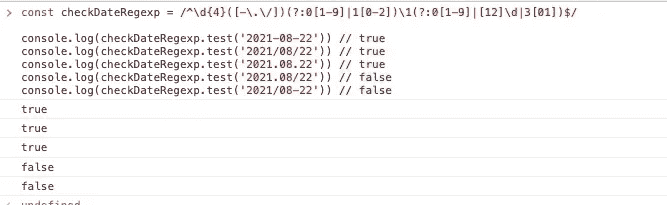

# 11.以十六进制匹配颜色值

请从字符串中获取十六进制颜色值。

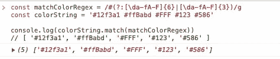

# 12.检查 URL 的前缀是 HTTPS 还是 HTTP

# 13.请检查版本号是否正确

版本号必须采用 x.y.z 格式，其中 XYZ 至少是一位数字。

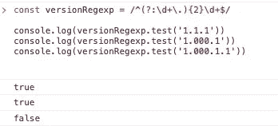

# 14.获取网页上所有 img 标签的图片地址

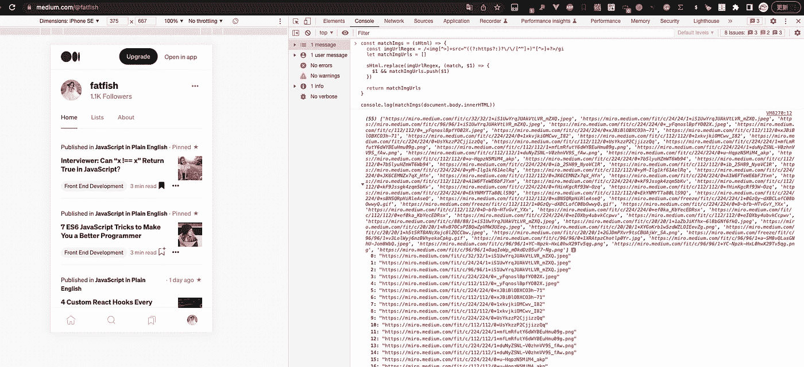

# 15.根据 3–4–4 格式划分电话号码

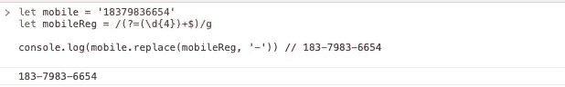

# 最后

**感谢阅读。**我期待期待您的关注和阅读更多高质量的文章。

 [## 采访者:“npm 跑 xxx”怎么了？

### 一个大多数人都不知道的秘密。

javascript.plainenglish.io](/interviewer-what-happened-to-npm-run-xxx-cdcb37dbaf44)  [## 我老板:你根本不知道反应！😠

### 你必须知道的 React 的 3 种错误用法。

javascript.plainenglish.io](/my-boss-you-dont-know-react-at-all-f493970f1807)  [## 让你看起来像高级开发人员的 8 个很酷的 GitHub 技巧

### 使用 GitHub 可以做的 8 件很酷的事情

javascript.plainenglish.io](/8-cool-github-tricks-to-make-you-look-like-a-senior-developer-ab8fe9ae9b14)  [## 面试官:可以“x！== x "在 JavaScript 中返回 True？

### 你可能不知道的五个神奇的 JavaScript 知识点！

javascript.plainenglish.io](/interviewer-can-x-x-return-true-in-javascript-7e1d1fa7b5cd)  [## 123['toString']。length + 123)用 JavaScript 打印出来？

### 95%的前端开发者回答错误的问题。

javascript.plainenglish.io](/what-does-123-tostring-length-123-print-out-in-javascript-2c804a414325) 

*更多内容请看*[***plain English . io***](https://plainenglish.io/)*。报名参加我们的* [***免费周报***](http://newsletter.plainenglish.io/) *。关注我们关于*[***Twitter***](https://twitter.com/inPlainEngHQ)*和*[***LinkedIn***](https://www.linkedin.com/company/inplainenglish/)*。查看我们的* [***社区不和谐***](https://discord.gg/GtDtUAvyhW) *加入我们的* [***人才集体***](https://inplainenglish.pallet.com/talent/welcome) *。*