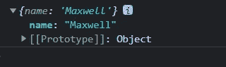
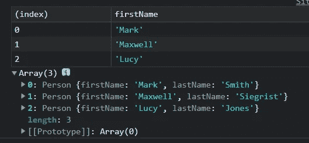

# 15 个有用的 JavaScript 技巧

> 原文：<https://javascript.plainenglish.io/15-useful-javascript-tips-814eeba1f4fd?source=collection_archive---------0----------------------->

## 提高开发效率的 15 个有用的 JavaScript 技巧


本文从网上收集了一些常见的 JavaScript 技巧。我已经在我的项目中使用了所有这些技巧，并在今天推荐它们。

## 1.数字分隔符

为了提高数字的可读性，可以使用下划线作为分隔符。

```
const largeNumber = 1_000_000_000;

console.log(largeNumber); // 1000000000
```

## 2.事件侦听器只运行一次

如果您想添加一个事件监听器并只运行一次，可以使用 once 选项。

```
element.addEventListener('click', () => console.log('I run only once'), {
    once: true
}); 
```

## 3.console.log 变量包装

在`console.log()`中，用花括号将参数括起来，这样就可以看到变量名和变量值。

```
 const name = "Maxwell";
    console.log({ name });
```



## 4.检查大写锁定是否打开

您可以使用`KeyboardEvent.getModifierState()`来检测 Caps Lock 是否打开。

```
const passwordInput = document.getElementById('password');

passwordInput.addEventListener('keyup', function (event) {
    if (event.getModifierState('CapsLock')) {
        // CapsLock is open
    }
}); 
```

## 5.从数组中获取最小值/最大值

您可以将`Math.min()` 或`Math.max()`与扩展操作符结合使用来查找数组中的最小值或最大值。

```
const numbers = [5, 7, 1, 4, 9];

console.log(Math.max(...numbers)); // 9
console.log(Math.min(...numbers)); // 1 
```

## 6.获取鼠标位置

您可以使用`MouseEvent` 对象的`clientX` 和`clientY` 属性的值来获取当前鼠标位置的坐标信息。

```
document.addEventListener('mousemove', (e) => {
    console.log(`Mouse X: ${e.clientX}, Mouse Y: ${e.clientY}`);
}); 
```

## 7.复制到剪贴板

您可以使用剪贴板 API 来创建“复制到剪贴板”功能。

```
function copyToClipboard(text) {
    navigator.clipboard.writeText(text);
} 
```

## 8.简而言之，写出条件判断语句

如果该函数仅在条件为真时执行，您可以使用&&简写。

```
// Common writing method
if (condition) {
    doSomething();
}

// Abbreviations
condition && doSomething(); 
```

## 9.console.table()以特定格式打印表格

语法:

```
console.table(data [, columns]);
```

参数:

*   `data` 表示要显示的数据。它必须是数组或对象。
*   `columns` 表示包含列名的数组。

```
 function Person(firstName, lastName) {
        this.firstName = firstName;
        this.lastName = lastName;
    }

    const p1 = new Person("Mark", "Smith");
    const p2 = new Person("Maxwell", "Siegrist");
    const p3 = new Person("Lucy", "Jones");

    console.table([p1, p2, p3], ["firstName"]);
```



## 10.将字符串转换为数字

```
const str = '508';

console.log(+str) // 508; 
```

## 11.阵列重复数据消除

```
const numbers = [2, 3, 5, 5, 2];

console.log([...new Set(numbers)]); // [2, 3, 5] 
```

## 12.从数组中过滤所有虚拟值

```
const myArray = [1, undefined, NaN, 2, null, '@maxwell', true, 5, false];

console.log(myArray.filter(Boolean)); // [1, 2, "@maxwell", true, 5]
```

## 13.伟大的用途包括

```
const myTech = 'JavaScript';
const techs = ['HTML', 'CSS', 'JavaScript'];

// Common writing method
if (myTech === 'HTML' || myTech === 'CSS' || myTech === 'JavaScript') {
    // do something
}

// includes writing method
if (techs.includes(myTech)) {
    // do something 
} 
```

## 14.大量使用归约求和数组

```
const myArray = [10, 20, 30, 40];
const reducer = (total, currentValue) => total + currentValue;

console.log(myArray.reduce(reducer)); // 100 
```

## 15.元素的数据集

使用 dataset 属性访问元素的自定义数据属性(data-*)。

```
<div id="user" data-name="Maxwell" data-age="32" data-something="Some Data">
    Hello Maxwell
</div>

<script>
    const user = document.getElementById('user');

    console.log(user.dataset); 
    // { name: "Maxwell", age: "32", something: "Some Data" }

    console.log(user.dataset.name); // "Maxwell"
    console.log(user.dataset.age); // "32"
    console.log(user.dataset.something); // "Some Data"
</script> 
```

*更多内容请看*[***plain English . io***](https://plainenglish.io/)*。报名参加我们的* [***免费周报***](http://newsletter.plainenglish.io/) *。关注我们关于*[***Twitter***](https://twitter.com/inPlainEngHQ)[***LinkedIn***](https://www.linkedin.com/company/inplainenglish/)*[***YouTube***](https://www.youtube.com/channel/UCtipWUghju290NWcn8jhyAw)*[***不和***](https://discord.gg/GtDtUAvyhW) ***。*****

*****对缩放您的软件启动感兴趣*** *？检查* [***电路***](https://circuit.ooo?utm=publication-post-cta) *。***