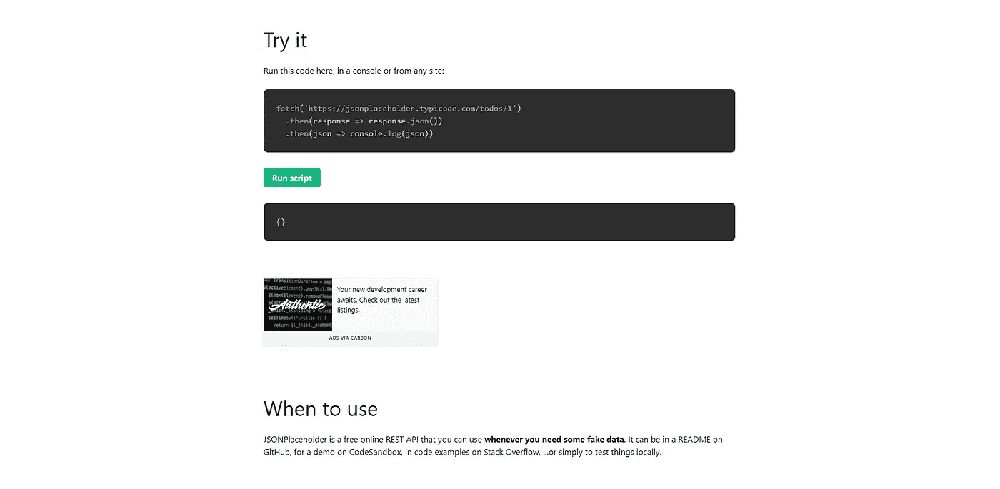

# 设计师和开发人员的 15 个有用的占位符工具🤩🚀

> 原文：<https://javascript.plainenglish.io/15-useful-placeholder-tools-for-designers-and-developers-deea3c410b6b?source=collection_archive---------19----------------------->

你有没有从事过布局设计，并且想过如果我知道一些生成器来为我创建一些临时样本就好了？这可以归因于任何东西——样本文本、图像、品牌徽标、个人资料图片、JSON 数据等等。

在本文中，我编译了一个有用的占位符生成器列表，这样您可以加快开发工作流。您所要做的就是复制生成的示例数据，并将其粘贴到您的项目中您想要使用它的地方。

为了方便您，我将它们按类别进行了分类，为每个类别提供了直接链接、简明描述和预览图像，因此您可以即时获得初步印象。

## 文本

## 1. [Lorem Ipsum](https://www.lipsum.com/)

行业标准的虚拟文本生成器。

## 2.Loripsum.net

Lorem Ipsum 的改进版本，具有包括链接、列表、代码块、标题、添加文本样式和其他定制选项的选项。

## 形象

## 3. [Picsum 照片](https://picsum.photos/)

提供随机或特定的图像。在请求 URL 的末尾指定所需的图像大小。灰度和模糊效果也可以应用于任何图像。

## 4.[Placeholder.com](https://placeholder.com/)

为布局生成占位符框。通过将背景颜色、使用的文本和其他参数直接包含在 URL 中来设置它们。

## 逻各斯圣语

## 5.[标识 Ipsum](https://logoipsum.com/)

准备在您的设计中使用各种风格和组合的替换标志。自动生成 SVG 代码，只需点击它们。

## 神使

## 6.[双氰胺](https://avatars.dicebear.com/)

面向设计者和开发者的头像库。你可以选择可爱的设计角色。提供您可以立即使用的 API。

## 7.[人物角色](https://personas.draftbit.com/)

一个有趣的现代头像生成器。

## 8. [Avataaars](https://getavataaars.com/)

允许通过提供特定参数或使用随机选项来创建自定义头像，直到你找到你喜欢的东西。

## JSON 数据

## 9.[随机用户](https://randomuser.me/)

一个用于生成随机用户数据的开源 API。

## 10. [JSON 占位符](http://jsonplaceholder.typicode.com/)

REST API，当你需要一些假数据时，你可以使用它。

## 11.[假 JSON](https://fakejson.com/)

使用内置的高级 JSON 编辑器创建您需要的 JSON 响应。

## 代码块

## 12.[假代码](http://knutsynstad.com/fauxcode/?ref=undesign)

把实码(Github Gist)变成伪码(SVG image)。

## 有趣的

## 13.[放置小猫](https://placekitten.com/)

一种获取小猫图片的服务，用作你设计中的占位符。

## 14.[纸杯蛋糕 Ipsum](http://www.cupcakeipsum.com/)

糖衣 Lorem Ipsum 发电机。

## 15. [RoboHash](https://robohash.org/)

为任何文本提供独特的，机器人/外星人/怪物/任何图像。

写作一直是我的激情所在，帮助和激励他人给我带来了快乐。如果您有任何问题，请随时联系我们！

如果这些资源有帮助，请在 [Twitter](https://twitter.com/madzadev) 、 [LinkedIn](https://www.linkedin.com/in/madzadev/) 和 [GitHub](https://github.com/madzadev) 上联系我！

访问我的[博客](https://madza.dev/blog)获取更多类似的文章。

*更多内容看* [***说白了。报名参加我们的***](http://plainenglish.io/) **[***免费每周简讯***](http://newsletter.plainenglish.io/) *。在我们的* [***社区不和谐***](https://discord.gg/GtDtUAvyhW) *获得独家获得写作机会和建议。***