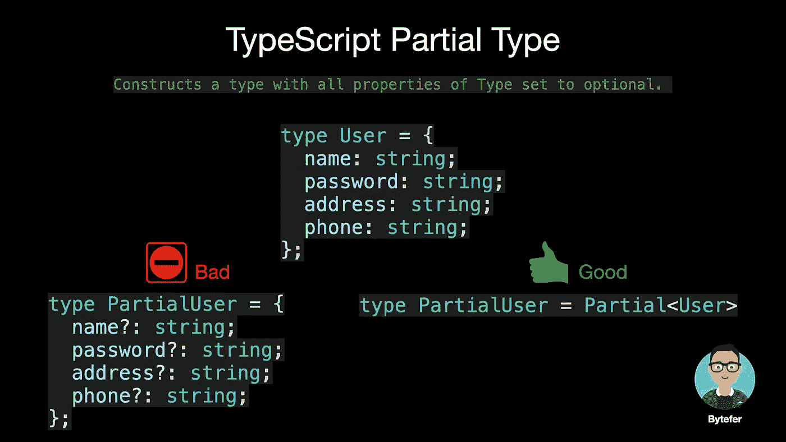
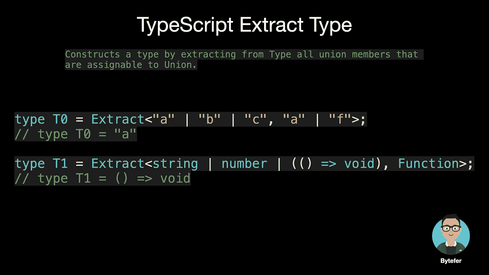
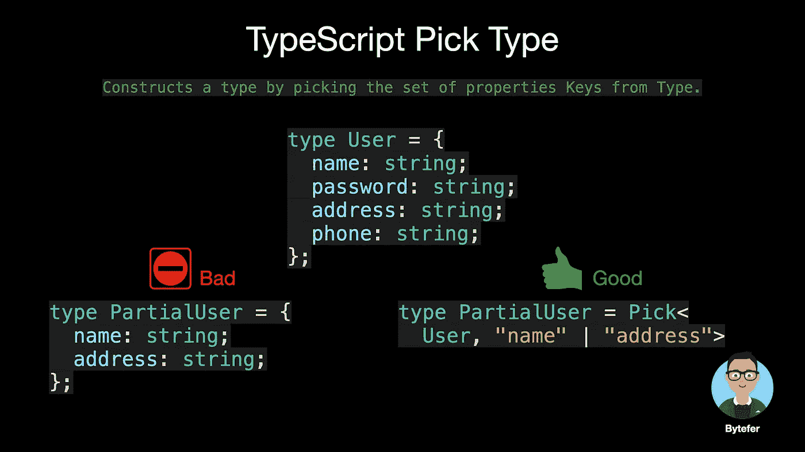

# 可视化的类型脚本:15 种最常用的实用程序类型

> 原文：<https://javascript.plainenglish.io/15-utility-types-that-every-typescript-developer-should-know-6cf121d4047c?source=collection_archive---------1----------------------->

## 实用程序类型—用动画解释。掌握 TypeScript 实用工具类型，并了解 TypeScript 的内置实用工具类型是如何工作的。


欢迎来到**掌握打字稿**系列。本系列将以动画的形式介绍打字稿**的核心知识和技巧。让我们一起学习吧！以前的文章如下:**

*   [**TypeScript 泛型中的 K，T，V 是什么？**](https://medium.com/frontend-canteen/what-are-k-t-and-v-in-typescript-generics-9fabe1d0f0f3)
*   [**使用 TypeScript 像 Pro 一样映射类型**](/using-typescript-mapped-types-like-a-pro-be10aef5511a)
*   [**使用 TypeScript 条件类型像亲**](/use-typescript-conditional-types-like-a-pro-7baea0ad05c5)
*   [**使用 TypeScript 交集类型像亲**](/using-typescript-intersection-types-like-a-pro-a55da6a6a5f7)
*   [**利用打字稿像专家一样推断**](https://levelup.gitconnected.com/using-typescript-infer-like-a-pro-f30ab8ab41c7)
*   [**使用 TypeScript 模板字面类型像亲**](https://medium.com/javascript-in-plain-english/how-to-use-typescript-template-literal-types-like-a-pro-2e02a7db0bac)
*   [**可视化打字稿:15 种最常用的实用类型**](/15-utility-types-that-every-typescript-developer-should-know-6cf121d4047c)
*   [**关于类型脚本类你需要知道的 10 件事**](https://levelup.gitconnected.com/10-things-you-need-to-know-about-typescript-classes-f58c57869266)
*   [](/purpose-of-declare-keyword-in-typescript-8431d9db2b10)**中‘declare’关键字的用途**
*   **[**如何在 TypeScript**](/how-to-define-objects-type-with-unknown-structures-in-typescript-c35e7b8462b0) 中定义未知结构的对象类型**

**在使用 TypeScript 的过程中，我们是面向类型的编程。为了满足不同的工作场景，我们需要对已知类型进行转换。为了方便 TypeScript 用户，TypeScript 开发团队为我们提供了许多有用的内置实用工具类型。有了这些实用程序类型，**我们可以很容易地转换类型、提取类型、排除类型，或者获得函数的参数类型或返回值类型。****

**在本文中，我从 TypeScript 的内置实用工具类型中挑选了 15 种非常有用的类型，并以图片或动画的形式介绍了它们的用法和内部工作原理。看完这篇文章，相信你能真正掌握这些内置实用工具类型的用法。**

# **1.部分**

**构造一个类型，将`Type`的所有属性设置为可选。**

****

```
/**
 * Make all properties in T optional. 
 * typescript/lib/lib.es5.d.ts
 */
type Partial<T> = {
    [P in keyof T]?: T[P];
};
```

********

# **2.必需的**

**构造一个由设置为 required 的`Type`的所有属性组成的类型。偏科的反义词。**

****

```
/**
 * Make all properties in T required.
 * typescript/lib/lib.es5.d.ts
 */
type Required<T> = {
    [P in keyof T]-?: T[P];
};
```

********

# **3.只读**

**构造一个类型，将`Type`的所有属性设置为`readonly`，这意味着构造的类型的属性不能被重新分配。**

****

```
/**
 * Make all properties in T readonly.
 * typescript/lib/lib.es5.d.ts
 */
type Readonly<T> = {
    readonly [P in keyof T]: T[P];
};
```

********

# **4.记录**

**构造一个对象类型，其属性键为`Keys`，属性值为`Type`。该实用工具可用于将一种类型的属性映射到另一种类型。**

****

```
/**
 * Construct a type with a set of properties K of type T.
 * typescript/lib/lib.es5.d.ts
 */
type Record<K extends keyof any, T> = {
    [P in K]: T;
};
```

# **5.排除**

**通过从`UnionType`中排除所有可分配给`ExcludedMembers`的联合成员来构造类型。**

****

```
/**
 * Exclude from T those types that are assignable to U.
 * typescript/lib/lib.es5.d.ts
 */
type Exclude<T, U> = T extends U ? never : T;
```

********

# **6.摘录**

**通过从`Type`中提取所有可分配给`Union`的联合成员来构造类型。**

****

```
/**
 * Extract from T those types that are assignable to U.
 * typescript/lib/lib.es5.d.ts
 */
type Extract<T, U> = T extends U ? T : never;
```

********

# **7.选择**

**通过从`Type`中挑选一组属性`Keys`(字符串或字符串的并集)来构造类型。**

****

```
/**
 * From T, pick a set of properties whose keys are in the union K.
 * typescript/lib/lib.es5.d.ts
 */
type Pick<T, K extends keyof T> = {
    [P in K]: T[P];
};
```

********

# **8.省略**

**通过从`Type`中选取所有属性，然后移除`Keys`(字符串文字或字符串文字的联合)来构造类型。**

****

```
/**
 * Construct a type with the properties of T except for those 
 * in type K. 
 * typescript/lib/lib.es5.d.ts
 */
type Omit<T, K extends keyof any> = Pick<T, Exclude<keyof T, K>>;
```

********

# **9.不可空**

**通过从`Type`中排除`null`和`undefined`来构造类型。**

****

```
/**
 * Exclude null and undefined from T.
 * typescript/lib/lib.es5.d.ts
 */
type NonNullable<T> = T extends null | undefined ? never : T;
```

# **10.参数**

**从函数类型`Type`的参数中使用的类型构建一个元组类型。**

****

```
/**
 * Obtain the parameters of a function type in a tuple.
 * typescript/lib/lib.es5.d.ts
 */
type Parameters<T extends (...args: any) => any> = T extends 
  (...args: infer P) => any ? P : never;
```

# **11.ReturnType**

**构造一个由函数`Type`的返回类型组成的类型。**

****

```
/**
 * Obtain the return type of a function type.
 * typescript/lib/lib.es5.d.ts
 */
type ReturnType<T extends (...args: any) => any> = T extends (...args: any) => infer R ? R : any;
```

# **12.大写**

**将字符串文字类型转换为大写。**

****

# **13.小写**

**将字符串文字类型转换为小写。**

****

# **14.大写**

**将字符串类型的第一个字符转换为大写。**

****

# **15.不资本化**

**将字符串类型的第一个字符转换为小写。**

****

**除了上述这些实用工具类型之外，其他常用的 TypeScript 内置实用工具类型如下:**

*   **ConstructorParameters <type>:从构造函数类型的类型中构造一个元组或数组类型。它生成一个包含所有参数类型的 tuple 类型(如果`Type`不是函数，则生成类型`never`)。</type>**
*   **InstanceType <type>:构造一个由`Type`中构造函数的实例类型组成的类型。</type>**
*   **thiparametertype<type>:提取函数类型的 [this](https://www.typescriptlang.org/docs/handbook/functions.html#this-parameters) 参数的类型，如果函数类型没有`this`参数，则提取 [unknown](https://www.typescriptlang.org/docs/handbook/release-notes/typescript-3-0.html#new-unknown-top-type) 。</type>**

**本文中介绍的实用程序类型在内部使用了关于映射类型、条件类型和推断类型推理的知识。**如果你不熟悉** [**映射类型**](/using-typescript-mapped-types-like-a-pro-be10aef5511a) **和** [**条件类型**](/use-typescript-conditional-types-like-a-pro-7baea0ad05c5) **，我强烈推荐阅读以前的文章。我将在以后的文章中介绍推断类型推断。****

**如果你喜欢学习动画形式的 TypeScript，可以在 [Medium](https://medium.com/@bytefer) 或者 [Twitter](https://twitter.com/Tbytefer) 上关注我，了解更多关于 TS 和 JS 的内容！**

# **资源**

**[](https://www.typescriptlang.org/docs/handbook/utility-types.html) [## 文档-实用程序类型

### TypeScript 提供了几种实用工具类型来促进常见的类型转换。这些实用程序可用…

www.typescriptlang.org](https://www.typescriptlang.org/docs/handbook/utility-types.html) [](/using-typescript-mapped-types-like-a-pro-be10aef5511a) [## 像专业人员一样使用 TypeScript 映射类型

### 映射类型—用动画解释。掌握 TypeScript 映射类型并理解 TypeScript 的内置…

javascript.plainenglish.io](/using-typescript-mapped-types-like-a-pro-be10aef5511a) [](/use-typescript-conditional-types-like-a-pro-7baea0ad05c5) [## 像专家一样使用 TypeScript 条件类型

### 用动画解释。掌握 TypeScript 条件类型并理解 TypeScript 的内置实用工具如何类型化…

javascript.plainenglish.io](/use-typescript-conditional-types-like-a-pro-7baea0ad05c5) [](https://medium.com/frontend-canteen/what-are-k-t-and-v-in-typescript-generics-9fabe1d0f0f3) [## TypeScript 泛型中的 K，T，V 是什么？

### 用动画讲解，让你轻松掌握 TypeScript 泛型类型参数。

medium.com](https://medium.com/frontend-canteen/what-are-k-t-and-v-in-typescript-generics-9fabe1d0f0f3) 

*更多内容请看*[***plain English . io***](https://plainenglish.io/)*。报名参加我们的* [***免费周报***](http://newsletter.plainenglish.io/) *。关注我们关于*[***Twitter***](https://twitter.com/inPlainEngHQ)[***LinkedIn***](https://www.linkedin.com/company/inplainenglish/)*，以及* [***不和***](https://discord.gg/GtDtUAvyhW) *。***