# 99.9%的开发者不知道的 15 个奇怪的谷歌技巧

> 原文：<https://javascript.plainenglish.io/15-weird-googling-tricks-99-9-of-developers-dont-know-about-c97e9f1ee71f?source=collection_archive---------2----------------------->

## 让自己成为一名出色的谷歌人

Photo by [Mitchell Luo](https://unsplash.com/@mitchel3uo?utm_source=medium&utm_medium=referral) on [Unsplash](https://unsplash.com?utm_source=medium&utm_medium=referral)

我们的日常工作要求我们善于谷歌搜索。

我们开发人员疯狂地搜索。

有时候我们会用谷歌搜索一些东西，比如:

*   如何用 Python 写变量？
*   如何用 JavaScript 写一个函数？

这些都是编程的基础，然而我们却用谷歌搜索它们。

这就是为什么知道在谷歌上搜索的所有技巧在我们的职业生涯中起着重要作用。

这里我提到了作为程序员的你可能不知道的十五招。

# 1.使用减号(-)排除术语

如果要从搜索结果中排除某个术语，必须使用减号。

这个减号(-)需要出现在您不想包含在搜索查询中的词之前。

## 一个例子

如果你想寻找最好的前端开发课程，但不想要任何与 React 相关的课程。

您可以像这样编写查询:

“最佳前端开发课程-React”

一旦您点击搜索这个查询，您将得到包括短语“最佳前端开发课程”的结果，而不是单词 React。

This screenshot was taken by the author

# 2.使用双引号(" ")来搜索精确短语

搜索精确短语时，可以使用双引号(" ")。

当你写一些代码，得到一个奇怪的错误信息。把整个信息复制下来放到谷歌上就行了。之后，用双引号将错误消息括起来，并按 enter 键。

您将获得该错误的搜索结果。

## 一个例子

如果你搜索“如何在 JavaScript 中创建一个对象”，你只会看到以正确的顺序包含这个短语的结果。

通过使用双引号(" ")，您可以轻松缩小搜索范围。

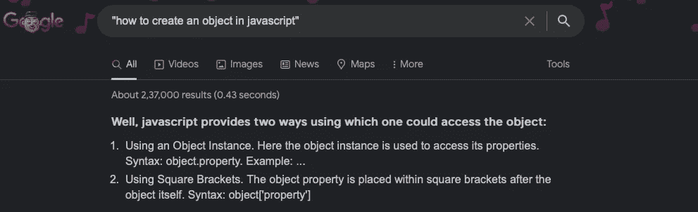

This screenshot was taken by the author

# 3.使用 site:关键字在网站内搜索

如果你想在一个网站中搜索一些特定的东西，你可以在谷歌上搜索时使用 site:关键字。

您必须将 site:关键字放在搜索查询之前。

## 一个例子

如果你像这样输入你的搜索查询“site:stack overflow . com JavaScript”。

它将显示所有提到 JavaScript 的 StackOverflow 页面。

作为开发者，我们疯狂地推出新网站。

有时我们写一些博客只是为了确保网站在谷歌搜索中显示出来。

你可以使用 site:关键字来检查谷歌是否索引了你的网站。

写一个类似“site:xyz.com”的查询，如果这个查询没有结果，你的网站没有被索引。

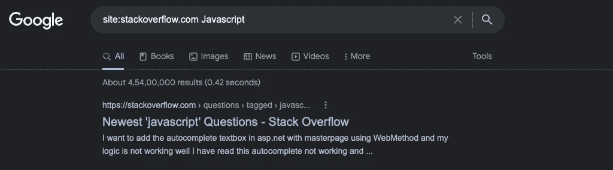

# 4.使用关键字 define:搜索任何术语的定义

有时候作为开发人员，我们会遇到一些我们不知道的单词。我们需要有人来定义这个词。

没有人能比谷歌更好地定义一个词。

如果您想要任何术语的定义，您可以使用 define:关键字。

## 一个例子

如果你输入一个类似“定义:oops 中的抽象”的搜索查询。

“oops 中的抽象”的定义就出现了。搜索还会返回许多包含 oops 抽象定义的网页。

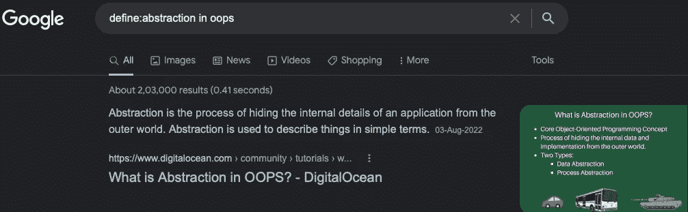

# 5.使用关键字相关:查找类似的网站

相关:关键字在搜索类似类型的网站时起着关键作用。

如果你想找到一些与你事先了解的网站相似的网站，你可以使用 related:关键字。

## 一个例子

如果你输入类似“related:stackoverflow.com”的搜索查询。

你将拥有一个和 stackoverflow.com 一样的网站。

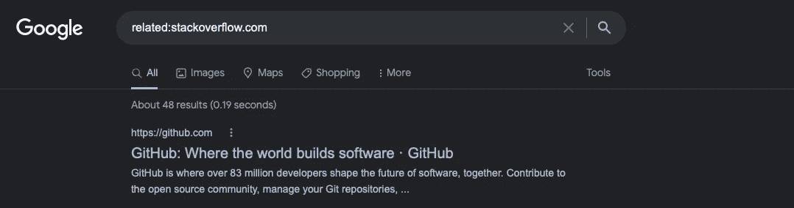

# 6.使用 OR 运算符组合不同的搜索查询

如果你想同时搜索几样东西。您可以使用 OR 运算符来简化这一过程。

使用 OR 运算符，可以一次搜索多个查询。每次只需在每个搜索查询之间使用 OR 运算符。

## 一个例子

如果你输入这样的搜索查询“Angular 或 React courses”。

在这种情况下，您将获得既有角度路线又有反应路线的搜索结果。

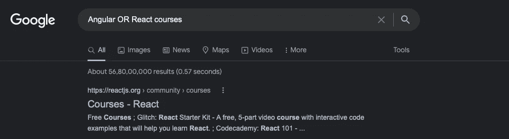

# 7.使用星号(*)替换缺失的单词

如果你有在输入搜索查询时忘记单词的习惯。在这种情况下，星号符号可能是对你的祝福。

用星号代替你忘记的单词。

## 一个例子

如果你写一个类似“JavaScript 中的 function *”的搜索查询。将*替换为相关关键词，您将获得搜索结果。

在这种情况下，我们得到的第一个结果是“函数表达式— JavaScript”。

您可以使用*运算符来查找包含特定短语的搜索结果，这些短语可能包含也可能不包含其他单词。

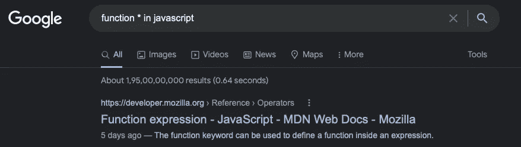

# 8.使用 filetype:关键字在特定文件类型中搜索结果

如果你想搜索任何特定格式的文件。

您可以使用 filetype: keyword 来查找这样的搜索结果。

## 一个例子

如果你输入一个类似“井字游戏程序文件类型:py”的搜索查询。

您将获得具有相同文件格式的搜索结果。

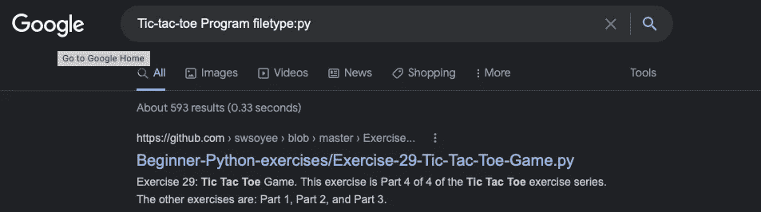

# 9.使用 before:和 after:关键字搜索特定的日期范围

如果要搜索特定日期范围内的内容，可以使用 before:和 after:关键字。

这允许您检查在特定日期之后或之前发布的网页。

格式如下所示:

之前:YYYY-MM-DD

之后:年月日

## 一个例子

如果你输入一个类似“React tutorial after:2022–01–01”的搜索查询。

搜索查询将返回 2022 年 1 月 1 日之后所有 React 教程网页的搜索结果。

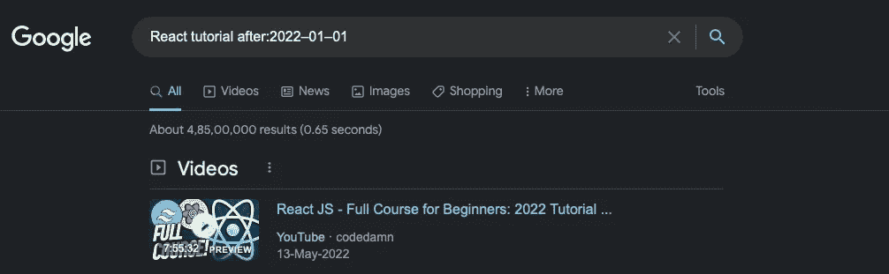

# 10.使用谷歌搜索进行计算

谷歌搜索可以帮你做数学计算。

谷歌不能帮你做非常难的数学计算，但是会帮你做很多简单的计算。

在浏览网站的时候，我们经常要做一些计算，你可以用谷歌计算器来帮你做。

## 一个例子

如果写“100+200”。

谷歌一下会给你的计算一个直接的答案。

见下图。

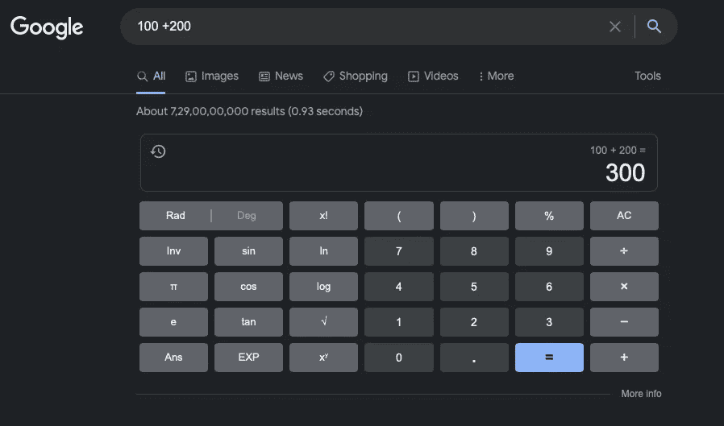

# 11.使用波浪号运算符(~)来搜索相似的术语

如果你只是在任何单词前放上波浪符号，你就告诉 Google search 你想搜索这个单词及其同义词。

你想用多少词都可以。

## 一个例子

如果你输入类似“python ~courses”的搜索查询。

它将为您提供课程及其同义词的搜索结果。

# 12.使用 cache:关键字查看任何网站的谷歌缓存版本

您可以使用 cache:关键字来访问任何网站的缓存版本。

你应该使用关键词缓存:在你想查看的网站地址前面。

## 一个例子

如果你输入一个类似“cache:wikipedia.com”的搜索查询。

您将看到搜索结果，其中会显示该网站的缓存版本。

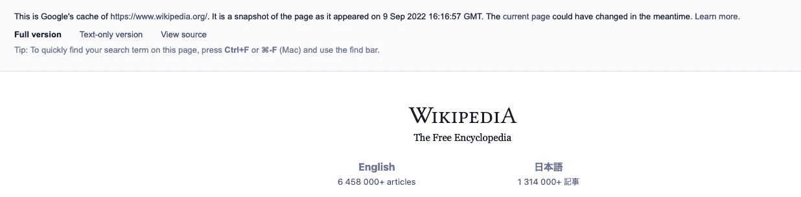

Screenshot by author

# 13.使用..(两个句点)在 2 个数字之间搜索

如果你想在谷歌中搜索两个数字..(两个时期)可以帮助你。

如果你正在寻找范围内的东西，比如预算内的课程价格，你可以很容易做到。

# 一个例子

如果您键入类似“JavaScript 课程 100 美元”的搜索查询..200".

这个搜索查询将向您显示售价在 100-200 美元之间的 JavaScript 课程的页面。

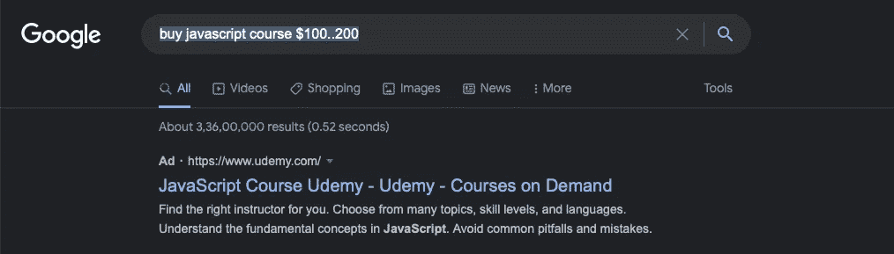

# 14.将数字转换成单词

谷歌可以帮你把数字转换成文字。

当我们作为开发人员处理大量需要以 word 形式编写的内容时。

为此你可以使用谷歌。

## 一个例子

如果您键入类似“8906450 in English”或“8906450 = English”的搜索查询。

谷歌会把它转换成简单的英语。

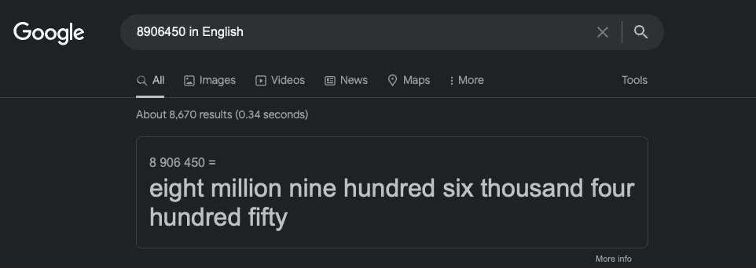

# 15.转换时区、单位和货币

使用关键字“convert ”,您可以将单位、时区和货币从一种转换为另一种。

如果你是一名为另一个国家的公司远程工作的开发人员，关键字“convert”可以帮助你区分时区。

## 一个例子

如果您键入类似“将 1 美元兑换成英镑”的搜索查询。

这将显示一美元兑换成一英镑的结果。

类似地，你可以把不同的单位从一个转换到另一个。你可以写“把 1 厘米转换成 1 米”。

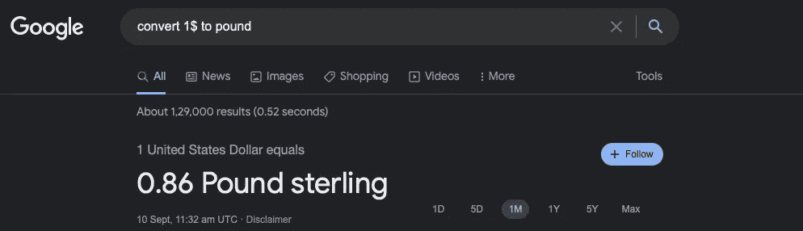

# 你想加速你的程序员生涯吗

加入一群热爱编程和技术的人。

你可以在这里加入。

在我们社区的帮助下，我们将解决程序员生活中的主要问题，并讨论前端和后端工程。

我们将帮助你重新规划你对科技中各种事物的理解。

*更多内容请看*[***plain English . io***](https://plainenglish.io/)*。报名参加我们的* [***免费周报***](http://newsletter.plainenglish.io/) *。关注我们关于*[***Twitter***](https://twitter.com/inPlainEngHQ)[***LinkedIn***](https://www.linkedin.com/company/inplainenglish/)*[***YouTube***](https://www.youtube.com/channel/UCtipWUghju290NWcn8jhyAw)*[***不和***](https://discord.gg/GtDtUAvyhW) *。对增长黑客感兴趣？检查* [***电路***](https://circuit.ooo/) *。***