# 16 款基本开发工具，让您的工作效率提高 10 倍🚀✨

> 原文：<https://javascript.plainenglish.io/16-essential-developer-tools-to-10x-your-productivity-5741cc4c8eaf?source=collection_archive---------1----------------------->

## 一些最有用的开发工具列表，可以帮助你加快日常工作流程。

如今，在一个快节奏、有严格期限的环境中，开发一个有效的工作流程至关重要。生产率已经成为提高竞争力的最重要的指标之一。

在本文中，我编译了一些最有用的开发工具，它们将帮助您加快日常工作流程。

每个工具都包括一个直接链接、一个描述和一个图像预览。

## 1. [justgetflux](https://justgetflux.com/)

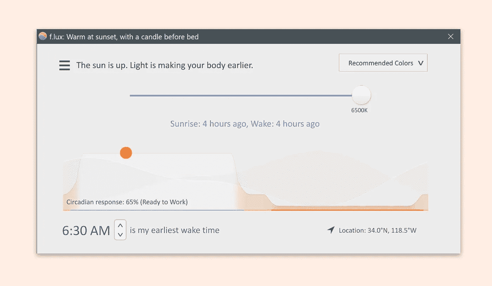

使电脑显示器的颜色适应一天中的时间。

## 2.ilovepdf.com

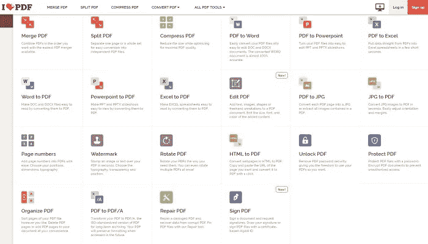

在一个地方处理 pdf 所需的所有工具。

## 3.[世界时间伙伴](https://www.worldtimebuddy.com/)

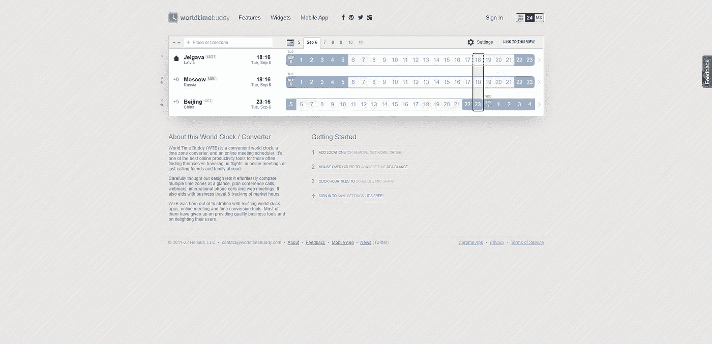

一个方便的世界时钟，一个时区转换器和一个在线会议日程安排。

## 4. [ihateregex](https://ihateregex.io)

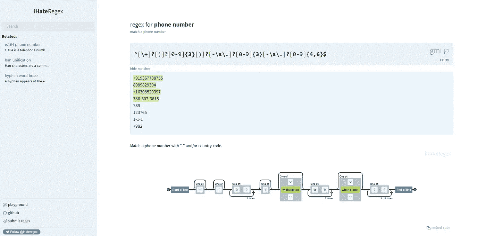

一个正则表达式备忘单，也解释了常用的表达式。

## 5. [10 分钟邮件](http://www.10minutemail.com/)

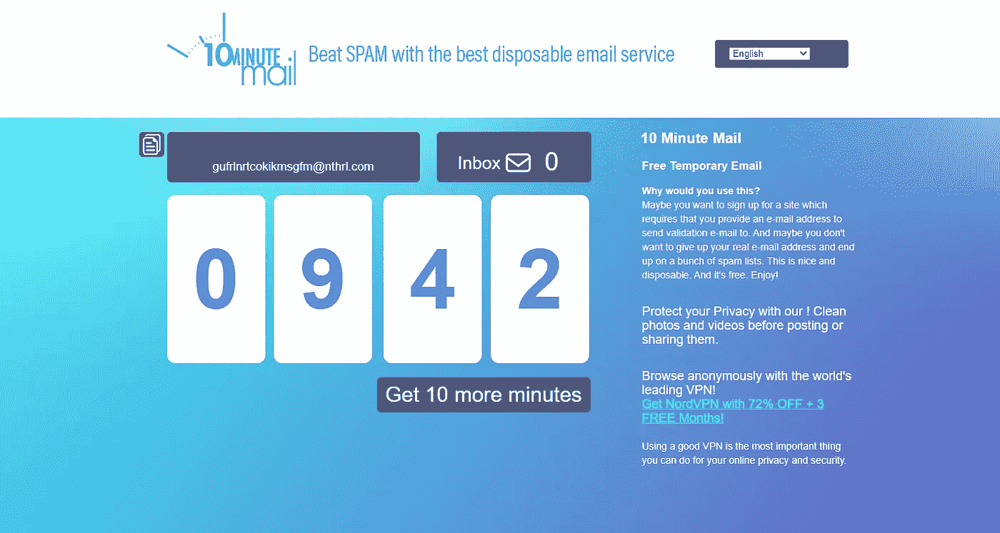

临时电子邮件地址，10 分钟后过期。

## 6. [squoosh.app](https://squoosh.app/)

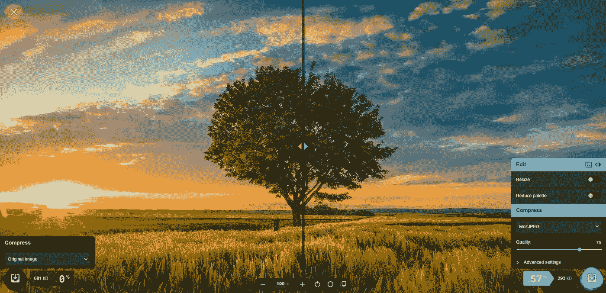

在浏览器中使用同类最佳的编解码器缩小图像。

## 7.[无声无息](https://www.screely.com/)

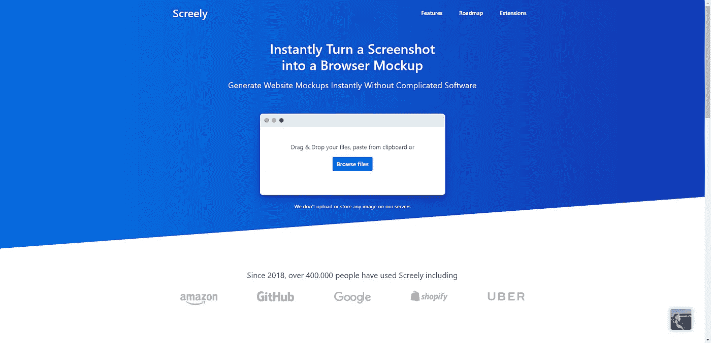

把任何截图变成浏览器模型。

## 8.[猴子型](https://monkeytype.com/)

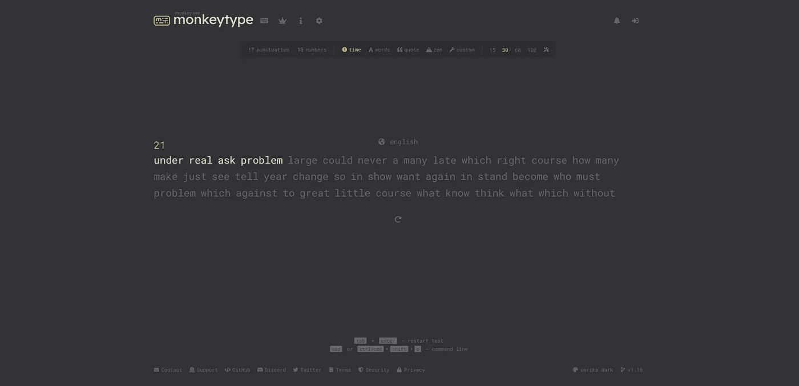

一个极简的打字测试，有许多测试模式。

## 9.[威望](https://prestige.dev)

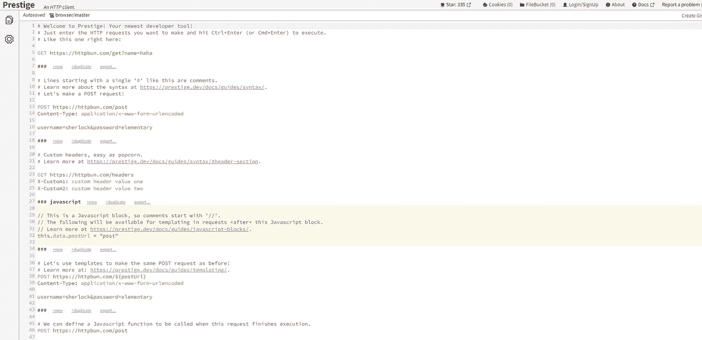

web 浏览器中的 HTTP 客户端。

## 10.[商标制作者](https://www.namecheap.com/logo-maker/)

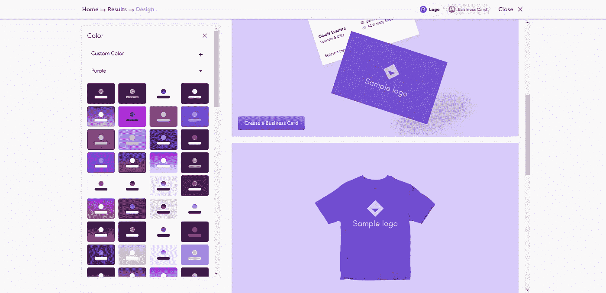

使用完美的字体、图标和配色方案创建徽标。

## 11.[制作缩略图](http://makethumbnails.com/#dropzone)

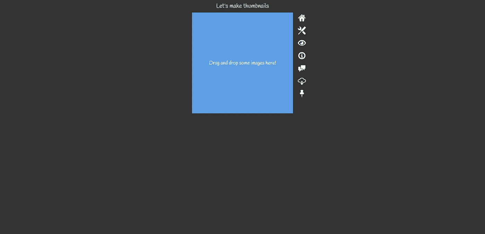

拖放一些图像，你会得到一个包含缩略图的 zip 文件。

## 12.[升级器](https://icons8.com/upscaler)

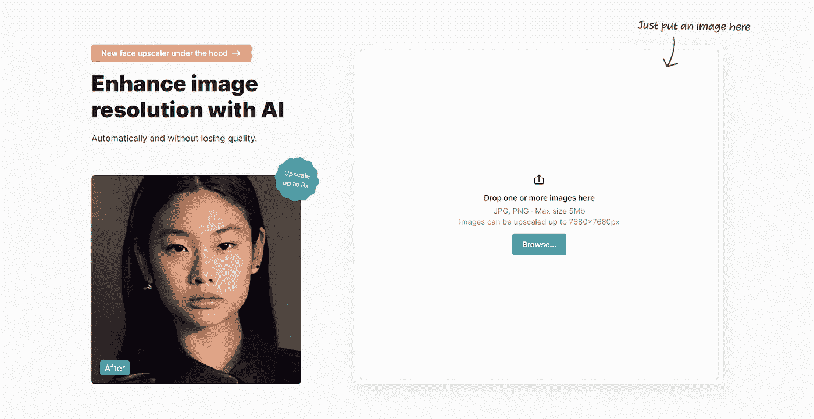

用 AI 增强图像分辨率而不损失质量。

## 13. [cropscore](https://cropper.madza.dev/)

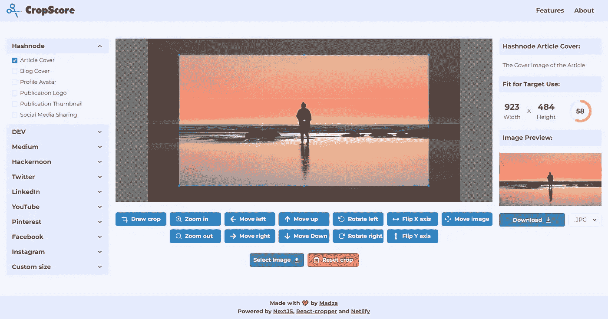

为您所有的社交媒体网站预设图像裁剪器。

## 14. [devtunes-fm](https://radio.madza.dev/)

面向忙碌的开发者的在线电台，28 个不同类型的电台。

## 15.[看板](https://github.com/madzadev/kanboard)

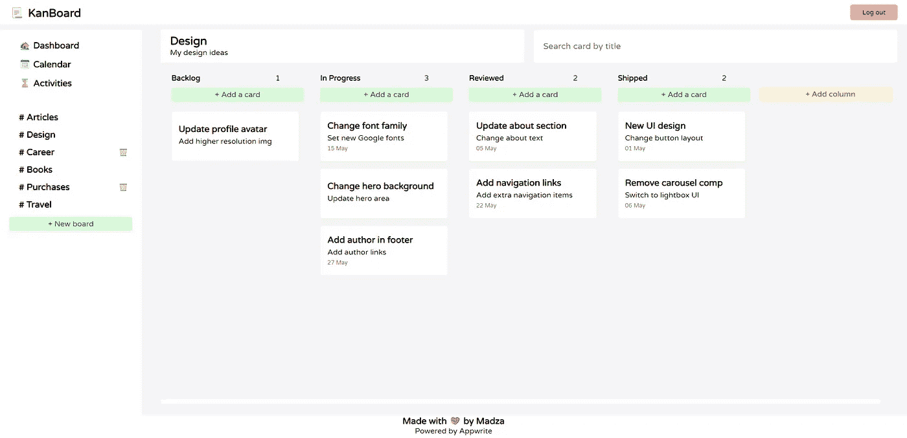

开源和自托管的 kanboard 风格的项目经理。

## 16.[瓦卡时间](https://wakatime.com/)

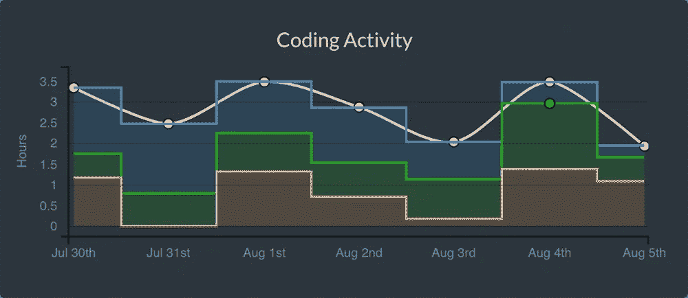

关于你的编程的开源插件。

写作一直是我的激情所在，帮助和激励他人给我带来了快乐。如果您有任何问题，请随时联系我们！

在 [Twitter](https://twitter.com/madzadev) 、 [LinkedIn](https://www.linkedin.com/in/madzadev/) 和 [GitHub](https://github.com/madzadev) 上给我连线！

访问我的[博客](https://madza.dev/blog)获取更多类似的文章。

*更多内容看* [***说白了。报名参加我们的***](https://plainenglish.io/) **[***免费周报***](http://newsletter.plainenglish.io/) *。关注我们关于* [***推特***](https://twitter.com/inPlainEngHQ) ，[***LinkedIn***](https://www.linkedin.com/company/inplainenglish/)*，*[***YouTube***](https://www.youtube.com/channel/UCtipWUghju290NWcn8jhyAw)*，以及* [***不和***](https://discord.gg/GtDtUAvyhW) *。***