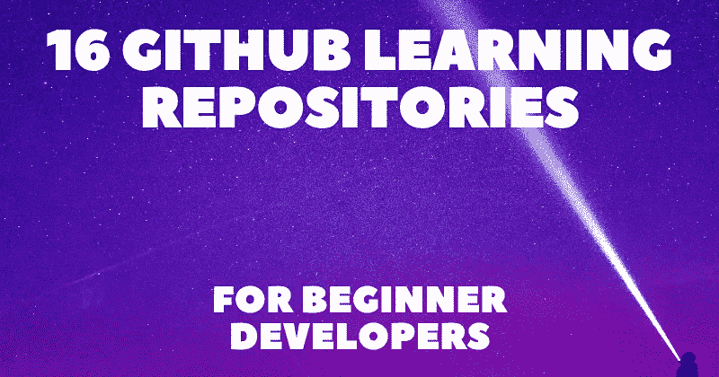

# 面向初级开发人员的 16 个 GitHub 学习资源库💖👍

> 原文：<https://javascript.plainenglish.io/16-github-learning-repositories-for-beginner-developers-1adc13b12389?source=collection_archive---------9----------------------->

## 了解通用 web、学习路线图、计算机科学原理、面试准备指南、附加书籍、网站等。

我经常被初级开发人员联系，询问什么是最好的学习资源，他们是否需要一个学位或申请训练营来获得这份工作。

在这篇文章中，我决定精选一些最好的免费 GitHub 库，它们可能涵盖的内容比课堂或在线课程所教授的更多。

你会发现关于一般网络的知识、学习路线图、计算机科学原理、面试准备指南、额外的书籍和网站等等。

## 1.[网络工作原理](https://github.com/vasanthk/how-web-works)

> ⭐ GitHub stars 9k+

 [## GitHub - vasanthk/how-web-works:当我们在一个…

### 当我们在浏览器中输入 google.com 时，幕后发生了什么？目录当你只按“g”的时候…

github.com](https://github.com/vasanthk/how-web-works) 

当我们在浏览器中输入 www.google.com[时，幕后会发生什么？](http://www.google.com/)

## 2.[开发者路线图](https://github.com/kamranahmedse/developer-roadmap)

> ⭐ GitHub stars 212k+

 [## GitHub-kamranahmedse/开发人员-路线图:社区努力创建路线图、指南和其他…

### 社区努力创建路线图、指南和其他教育内容，以帮助开发人员了解…

github.com](https://github.com/kamranahmedse/developer-roadmap) 

面向开发者的社区驱动的路线图、文章和资源。

## 3.免费编程书籍

> ⭐ GitHub stars 249k+

 [## GitHub-ebook foundation/免费编程书籍:免费提供的编程书籍

### 在 https://ebook foundation . github . io/free-programming-books-search/搜索列表。此页面可作为…

github.com](https://github.com/EbookFoundation/free-programming-books) 

免费提供的编程书籍。

## 4.[ossu-计算机-科学](https://github.com/ossu/computer-science)

> ⭐ GitHub stars 124k+

 [## GitHub - ossu/computer-science:计算机科学免费自学教育之路！

### 通往计算机科学的免费自学教育之路！OSSU 课程是一个完整的计算机教育…

github.com](https://github.com/ossu/computer-science) 

计算机科学免费自学教育之路。

## 5.[系统设计入门](https://github.com/donnemartin/system-design-primer)

> ⭐ GitHub 明星 197k+

 [## GitHub-donne Martin/system-design-primer:学习如何设计大型系统。准备…

### 学习如何设计大型系统。准备系统设计面试。学习如何设计可扩展的系统…

github.com](https://github.com/donnemartin/system-design-primer) 

学习如何设计大型系统。准备系统设计面试。

## 6.[编码-面试-大学](https://github.com/jwasham/coding-interview-university)

> ⭐ GitHub stars 234k+

 [## GitHub-jwasham/编码-面试-大学:一个完整的计算机科学学习计划成为一个…

### 我最初把它作为成为一名软件工程师的学习主题的一个简短清单，但是它发展到…

github.com](https://github.com/jwasham/coding-interview-university) 

一个完整的计算机科学学习计划成为一名软件工程师。

## 7.[技术-面试-手册](https://github.com/yangshun/tech-interview-handbook)

> ⭐ GitHub stars 78k+

 [## GitHub -阳顺/科技-采访-手册:💯为…策划编码面试准备材料

### 不是每个人都有时间做几百道 LeetCode 题。这里有免费的和策划的技术面试…

github.com](https://github.com/yangshun/tech-interview-handbook) 

为软件工程师策划编码面试准备材料。

## 8.[前端-面试-手册](https://github.com/yangshun/front-end-interview-handbook)

> ⭐ GitHub stars 35k+

 [## github-yang shun/前端-面试-手册:⚡️前端面试准备资料…

### ⚡️前端面试忙碌工程师准备资料-github-yang shun/前端-面试-手册:⚡️…

github.com](https://github.com/yangshun/front-end-interview-handbook) 

忙碌工程师的前端面试准备资料。

## 9. [javascript 算法](https://github.com/trekhleb/javascript-algorithms)

> ⭐ GitHub stars 151k+

 [## GitHub-trek Hleb/JavaScript-算法:📝用…实现的算法和数据结构

### 🇺🇦乌克兰正在被俄罗斯军队攻击。平民正在被杀害。住宅区正在被轰炸…

github.com](https://github.com/trekhleb/javascript-algorithms) 

用 JavaScript 实现的算法和数据结构，并附有解释。

## 10.[JavaScript-问题](https://github.com/lydiahallie/javascript-questions)

> ⭐ GitHub stars 47k+

 [## GitHub-lydiahallie/javascript-questions:一长串(高级)JavaScript 问题，以及…

### 我在我的 Instagram 故事上发布了多项选择 JavaScript 问题，我也会在这里发布！最后更新时间:6 月 12 日…

github.com](https://github.com/lydiahallie/javascript-questions) 

JavaScript 问题列表及其解释。

## 11. [freecodecamp](https://github.com/freeCodeCamp/freeCodeCamp)

> ⭐ GitHub stars 353k+

 [## GitHub-freeCodeCamp/freeCodeCamp:freeCodeCamp . org 的开源代码库和课程。学习…

### freeCodeCamp.org 是一个友好的社区，在这里你可以免费学习编程。它是由一个捐助者支持的 501(c)(3)…

github.com](https://github.com/freeCodeCamp/freeCodeCamp) 

一个友好的社区，每个人都可以免费学习编码。

## 12.[精彩学习资源](https://github.com/lauragift21/awesome-learning-resources)

> ⭐ GitHub stars 4k+

 [## GitHub-lauragift 21/awesome-学习资源:🔥关于 Web 开发的令人敬畏的资源列表。

### 🔥关于 Web 开发的令人敬畏的资源列表。通过以下方式为 Laura gift 21/awesome-学习资源开发做出贡献…

github.com](https://github.com/lauragift21/awesome-learning-resources) 

关于 web 开发的令人敬畏的资源列表。

## 13.[基于项目的学习](https://github.com/practical-tutorials/project-based-learning)

> ⭐ GitHub stars 77k+

 [## GitHub -实践-教程/基于项目的学习:基于项目的教程的精选列表

### 一系列编程教程，有抱负的软件开发人员在其中学习如何从头开始构建应用程序…

github.com](https://github.com/practical-tutorials/project-based-learning) 

基于项目的教程的精选列表。

## 14.[项目指南](https://github.com/elsewhencode/project-guidelines)

> ⭐ GitHub stars 27k+

 [## GitHub-elsewhencode/project-guidelines:JavaScript 项目的一组最佳实践

### 中文版 | 日本語版 | 한국어 | Русский | Português | Italiana While developing a new project is like rolling on a green field for…

github.com](https://github.com/elsewhencode/project-guidelines) 

JavaScript 项目的一组最佳实践。

## 15.[专业编程](https://github.com/charlax/professional-programming)

> ⭐ GitHub 明星 20k+

 [## GitHub-charlax/professional-programming:好奇软件学习资源集…

### 专业编程-关于此列表促成此列表必读书籍必读文章其他一般…

github.com](https://github.com/charlax/professional-programming) 

为好奇的软件工程师收集的学习资源。

## 16.[秘密知识之书](https://github.com/trimstray/the-book-of-secret-knowledge)

> ⭐ GitHub stars 77k+

 [## GitHub-trimstray/the-book-of-secret-knowledge:一系列鼓舞人心的清单、手册…

### “知识是强大的，小心你如何使用它！”一系列鼓舞人心的清单、手册、备忘单、博客…

github.com](https://github.com/trimstray/the-book-of-secret-knowledge) 

一系列鼓舞人心的手册、备忘单、博客、cli/web 工具等。

写作一直是我的激情所在，帮助和激励他人给我带来了快乐。如果您有任何问题，请随时联系我们！

在 [Twitter](https://twitter.com/madzadev) 、 [LinkedIn](https://www.linkedin.com/in/madzadev/) 和 [GitHub](https://github.com/madzadev) 上连接我！

访问我的[博客](https://madza.dev/blog)获取更多类似的文章。

*更多内容请看*[***plain English . io***](https://plainenglish.io/)*。报名参加我们的* [***免费周报***](http://newsletter.plainenglish.io/) *。关注我们关于*[***Twitter***](https://twitter.com/inPlainEngHQ)[***LinkedIn***](https://www.linkedin.com/company/inplainenglish/)*[***YouTube***](https://www.youtube.com/channel/UCtipWUghju290NWcn8jhyAw)*[***不和***](https://discord.gg/GtDtUAvyhW) *。对增长黑客感兴趣？检查* [***电路***](https://circuit.ooo/) *。***