# React 开发人员应该知道的 16 个库💯🔥

> 原文：<https://javascript.plainenglish.io/16-libraries-you-should-know-as-a-react-developer-c9c595c8d25e?source=collection_archive---------1----------------------->

## 一些最有用的 React 组件库可以用来加速开发人员的工作流程。

作为一名现代 React 开发人员，不仅仅是了解 React 本身。为了保持竞争力，强烈建议探索整个生态系统。

在本文中，我编译了一些最有用的 React 组件库，您可以用它们来加快开发人员的工作流程。

这些将包括任何形式的工作，图表，日历，表格，指南，弹出窗口，颜色，动画，音乐，图像等等。

## 1.[反应钩形](https://react-hook-form.com/)

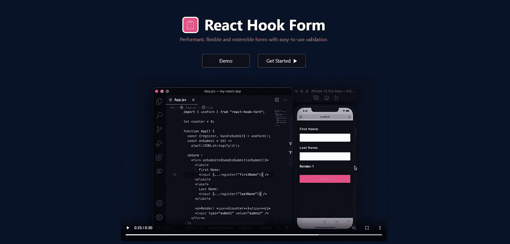

用于表单状态管理和验证的 React 钩子。

## 2.[充值](https://recharts.org/en-US/)

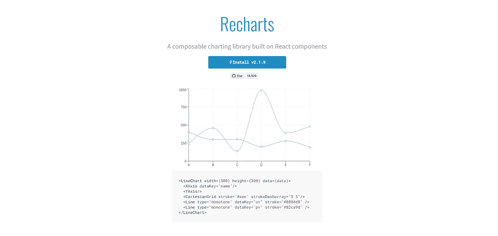

重新定义了用 React 和 D3 构建的图表库。

## 3.[反应-大-历](https://github.com/intljusticemission/react-big-calendar)

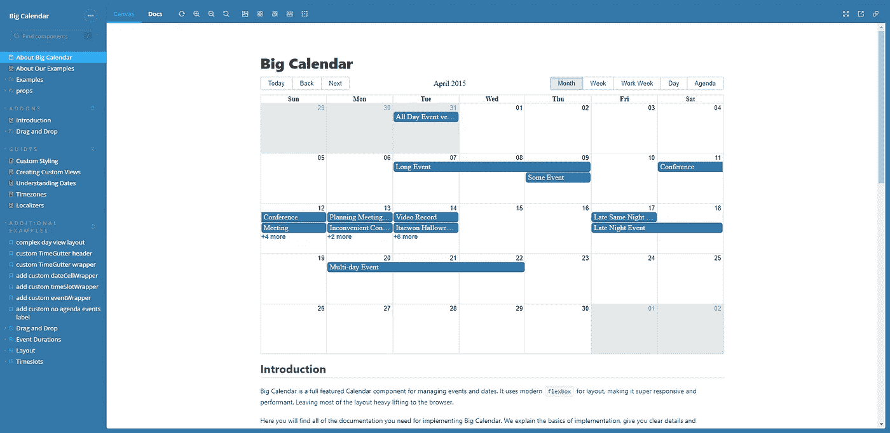

为 React 和现代浏览器构建的事件日历。

## 4. [react-beautiful-dnd](https://github.com/atlassian/react-beautiful-dnd)

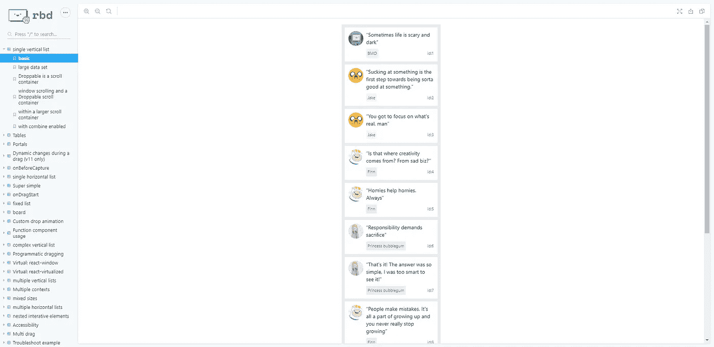

美丽和可访问的拖放列表与反应。

## 5.[反应表](https://github.com/tannerlinsley/react-table/)

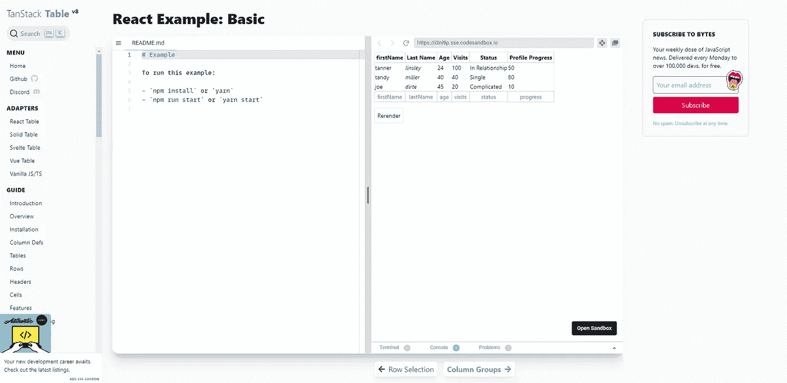

用于构建健壮的表和数据网格的库。

## 6. [react-joyride](https://github.com/gilbarbara/react-joyride)

为您的应用程序创建导游。

## 7.[反应-高级-裁剪](https://github.com/Norserium/react-advanced-cropper)

为您的设计创建定制的作物。

## 8.[反应-丰富多彩](https://github.com/omgovich/react-colorful)

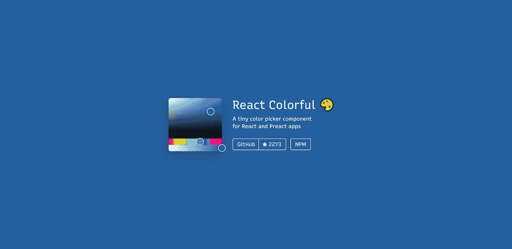

一个微小的，不依赖，快速和可访问的颜色选择器组件。

## 9.[反作用弹簧](https://github.com/pmndrs/react-spring)

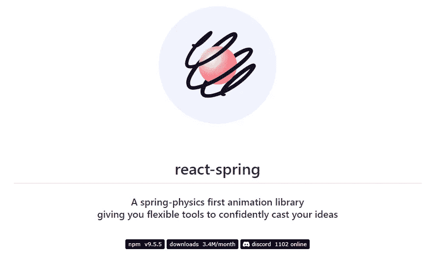

基于 Spring-physics 的 React 应用动画库。

## 10.[反应粒子](https://github.com/matteobruni/tsparticles)

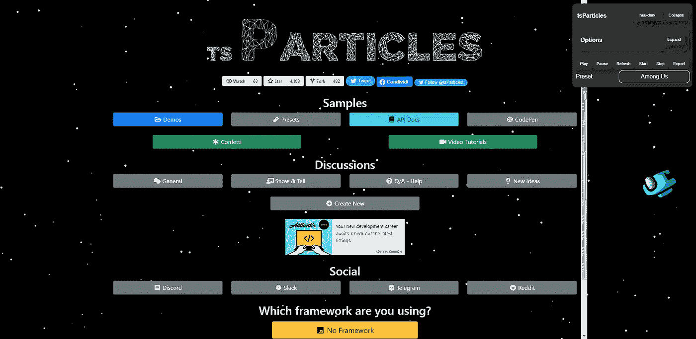

轻松创建高度可定制的粒子动画。

## 11.[反应-波普](https://github.com/popperjs/react-popper)

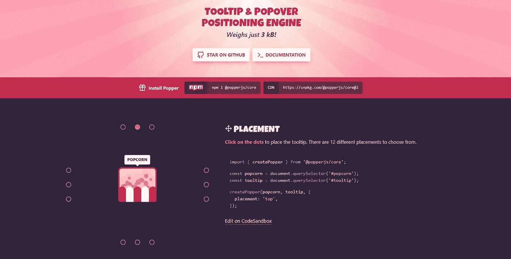

以优雅的、表演性的方式放置工具提示和弹出框。

## 12. [react-pdf-viewer](https://github.com/phuoc-ng/react-pdf-viewer)

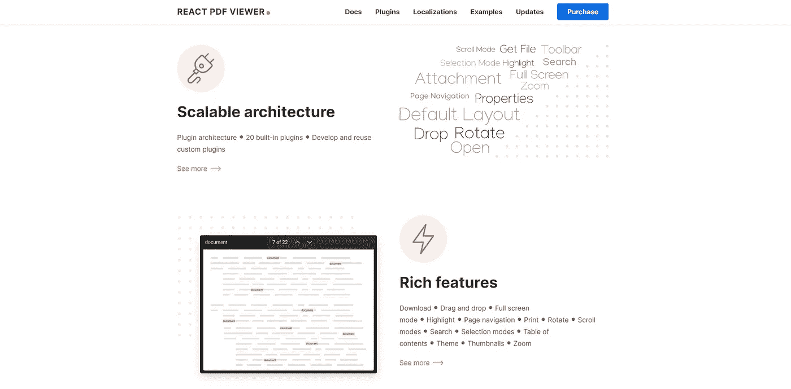

为 React 设计的 PDF 浏览器。

## 13.[react-i18 下一步](https://github.com/i18next/react-i18next)

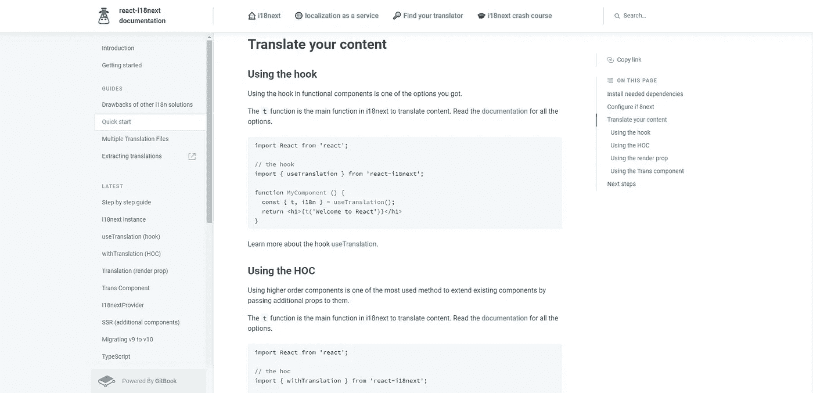

React 的国际化做对了。

## 14.[反应图标](https://github.com/gorangajic/react-icons)

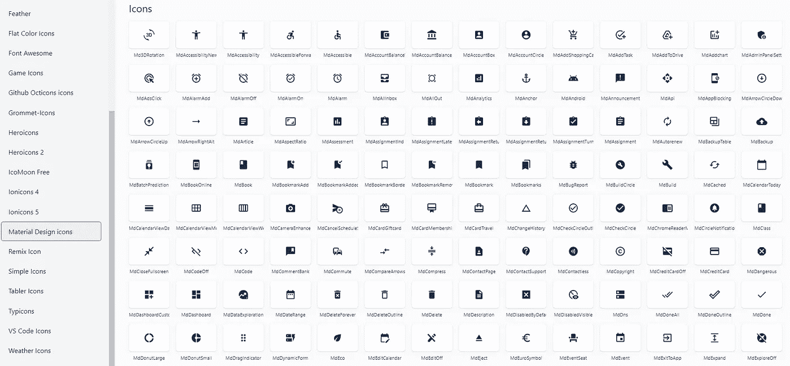

SVG 反应流行图标包的图标。

## 15.[音频播放器](https://github.com/madzadev/audio-player)

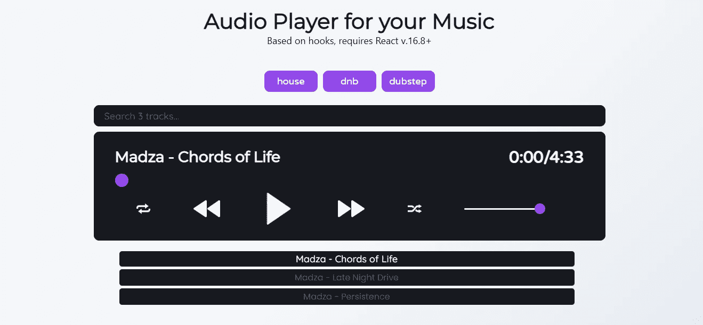

带有自定义控件、播放列表、过滤器和搜索的音乐播放器。

## 16.[图像滑块](https://github.com/madzadev/image-slider)

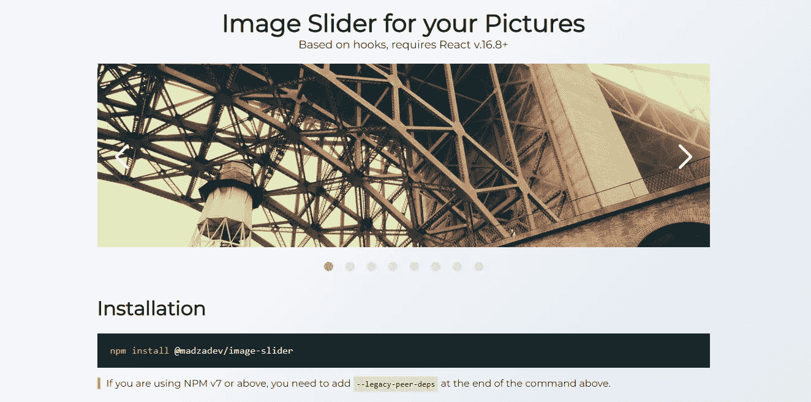

图片的图像滑块组件。

写作一直是我的激情所在，帮助和激励他人给我带来了快乐。如果您有任何问题，请随时联系我们！

在 [Twitter](https://twitter.com/madzadev) 、 [LinkedIn](https://www.linkedin.com/in/madzadev/) 和 [GitHub](https://github.com/madzadev) 上连接我！

访问我的[博客](https://madza.dev/blog)获取更多类似的文章。

*更多内容看* [***说白了就是***](https://plainenglish.io/) *。报名参加我们的* [***免费周报***](http://newsletter.plainenglish.io/) *。关注我们* [***推特***](https://twitter.com/inPlainEngHQ) ，[***LinkedIn***](https://www.linkedin.com/company/inplainenglish/)*，*[***YouTube***](https://www.youtube.com/channel/UCtipWUghju290NWcn8jhyAw)*，*[*不和*](https://discord.gg/GtDtUAvyhW) *。对增长黑客感兴趣？检查出* [***电路***](https://circuit.ooo/) *。*