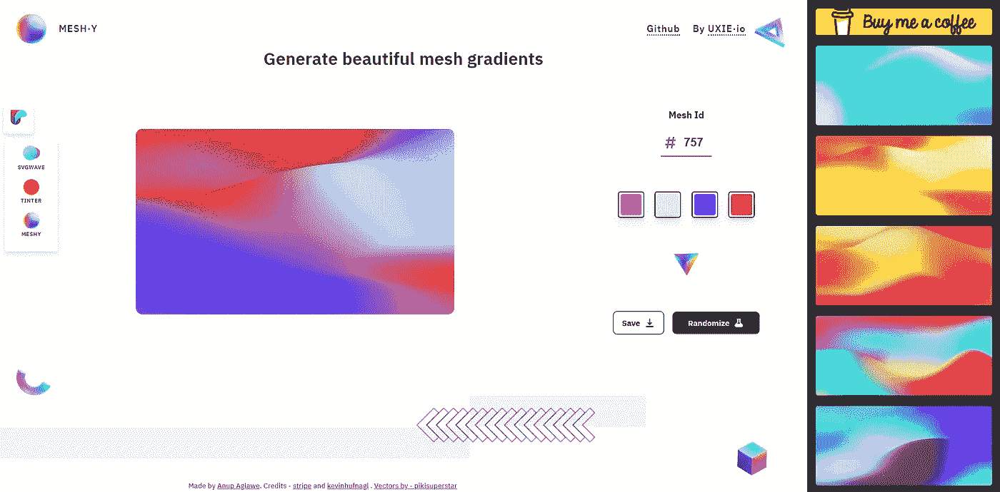

# 为你的网站设计提供 16 个有用的背景生成器🎨✨

> 原文：<https://javascript.plainenglish.io/16-useful-background-generators-for-your-website-designs-e53da679eeec?source=collection_archive---------6----------------------->

你曾经努力为产品、品牌和界面创造引人入胜的视觉效果吗？你在 UI 策展网站上看到的设计通常需要专业的设计技能或大量的实践。使用合适的工具，你也可以得到独特的、高质量的背景。

在本文中，我编译了一些我最喜欢的背景生成器。我将它们进一步分类，如全能工具、渐变生成器、SVG 背景、图案等等，这样更容易导航，你可以在不同的选项中进行选择。

对于每个工具，我将提供一个直接的链接，一个简短的描述，和一个预览图像，这样您就可以得到每个生成器及其特性的初步印象。

## 全方位工具

## 1. [haikei.app](https://app.haikei.app/)

一个全面的发生器，具有斑点、波浪、渐变、低多边形和其他模式，可以进一步单独定制。

## 2.bgjar.com

一个免费的生成器，具有多边形、斑点、彩色形状、曲线、叠加等模式，可以选择改变每层的宽度、高度和颜色。

## 3.[cool background . io](https://coolbackgrounds.io/)

为博客、社交媒体和网站创建引人注目的彩色图像的工具集。包括抽象三角形、粒子、渐变、地形和图像模式。

## 梯度

## 4.[网格渐变](https://meshgradient.in)

一个设计工具，产生美丽和丰富多彩的网格梯度。生成网格渐变的多种随机变化以及冷色调定制。

## 5.[网格渐变](https://products.ls.graphics/mesh-gradients/)

免费，手工网格渐变为您的下一个项目。渐变。素描，。png，。艾，。下载并在你的商业和个人项目中使用。

## 6. [gradienta.io](https://gradienta.io/)

个人和商业项目的轻量级、色彩丰富、反应灵敏的背景。这是一个免费使用的开源项目。

## SVG 背景

## 7.[svgbackgrounds.com](https://www.svgbackgrounds.com/)

使用 5KB 以下的全屏图形轻松创建令人惊叹的网站。点按背景以开始自定颜色和其他属性，如不透明度、缩放和描边。

## 8. [SVG 模式](https://philiprogers.com/svgpatterns/)

21 个免费 SVG 背景模式的集合。单击预设以查看预览，并单击获取代码以在 JSbin 编辑器中生成 SVG 代码。

## 9. [SVG 梯度波](https://www.outpan.com/app/9aaaf27303/svg-gradient-wave-generator)

生成自己喜欢的 SVG 波。使用梯度，随机性和其他参数来生成华丽的 SVG 波，用于您的下一个设计！

## 模式

## 10.patternpad.com

创建漂亮设计模式的工具。附带一系列预设和许多自定义选项，如列和行大小、密度、形状等。

## 11.[妖怪](https://pattern.monster/)

一个简单的在线模式生成器来创建可重复的 SVG 模式。完美的网站背景，服装，品牌，包装设计，等等。

## 12.[visiwig.com](https://www.visiwig.com/patterns/)

一个免费的矢量图形生成器。定制无缝模式，并导出为网络或您最喜爱的矢量软件。

## 13.[heropatterns.com](http://www.heropatterns.com/)

一组可重复的背景图案，供您在 web 项目中使用。许多预置可供选择，背景和前景颜色的定制选项。

## 其他工具

## 14.[tabied.com](https://tabbied.com/select-artwork)

艺术画廊。用户需要选择预设，然后编辑调色板颜色、列数、行数以及形状频率。

## 15.[动画 css](https://wweb.dev/resources/animated-css-background-generator/)

动画背景发生器。带有三个预置选项，可以定制背景颜色、元素数量、大小和速度。

## 16.[模式-css](https://bansal.io/pattern-css)

CSS 唯一的库，用美丽的图案填充你的空白背景。易于阅读的文档，带有使用说明和很好的入门模板。

写作一直是我的激情所在，帮助和激励他人给我带来了快乐。如果您有任何问题，请随时联系我们！

帮我在 [Twitter](https://twitter.com/madzadev) 、 [LinkedIn](https://www.linkedin.com/in/madzadev/) 和 [GitHub](https://github.com/madzadev) 上联系！

更多类似的文章，请访问我的博客。

*更多内容请看*[***plain English . io***](https://plainenglish.io/)*。报名参加我们的* [***免费周报***](http://newsletter.plainenglish.io/) *。关注我们关于*[***Twitter***](https://twitter.com/inPlainEngHQ)*和*[***LinkedIn***](https://www.linkedin.com/company/inplainenglish/)*。查看我们的* [***社区不和谐***](https://discord.gg/GtDtUAvyhW) *加入我们的* [***人才集体***](https://inplainenglish.pallet.com/talent/welcome) *。*