# 你应该用来提高工作效率的 17 个黑仔网络应用🚀💯

> 原文：<https://javascript.plainenglish.io/17-killer-web-apps-you-should-use-to-increase-productivity-f3642d5d3905?source=collection_archive---------8----------------------->

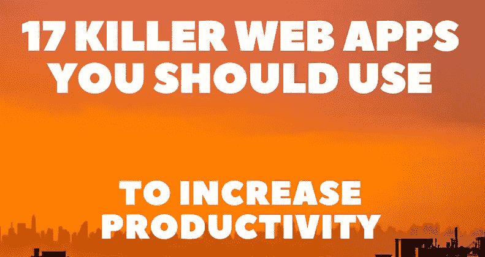

今天，速度是击败竞争对手的主要标准之一。我精心挑选了一些有用的生产力应用程序，它们可能会在你的开发人员工作流程中派上用场。

这些包括您可能需要的任何东西，从处理图像、动画和字体，到为社交媒体创建内容。每个工具将包括一个直接链接，描述以及图像预览。

## 1. [Lorem Picsum](https://picsum.photos/)

Lorem Picsum 是一个图片占位符生成器，有很多定制选项。直接在 URL 中为您的图像提供参数。

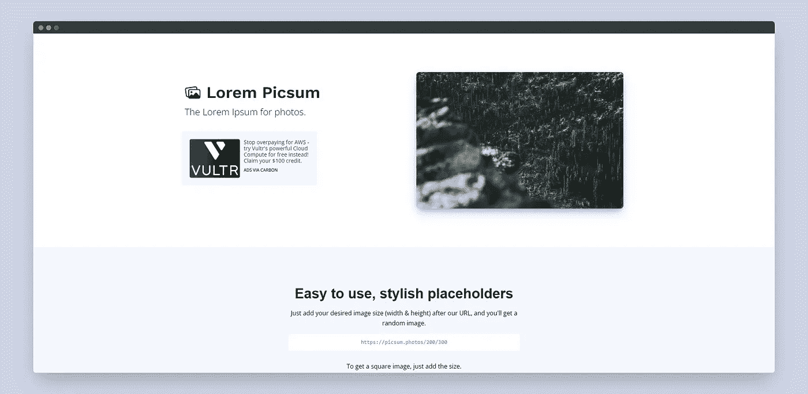

## 2. [Remove.bg](https://www.remove.bg/)

自动移除任何照片的背景。只需选择您的图像，并立即下载去除背景后的结果图像。

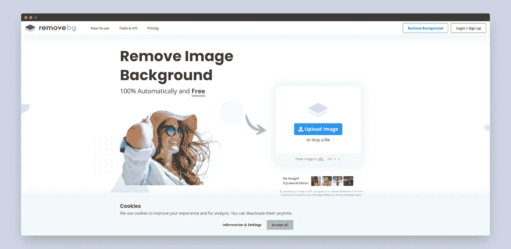

## 3. [PPFmaker](https://pfpmaker.com/)

PFPMaker 从任何照片生成专业的个人资料图片。它使用背景去除人工智能，美化你的照片，并自动生成几十个个人资料图片的变化。

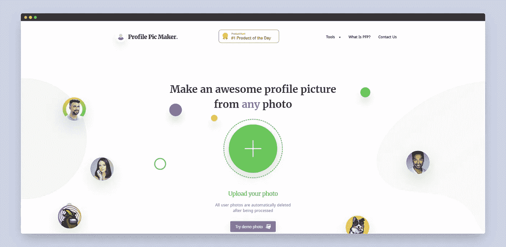

## 4. [Compressor.io](https://compressor.io/)

最有效的图像压缩器之一，具有现代外观的用户界面。

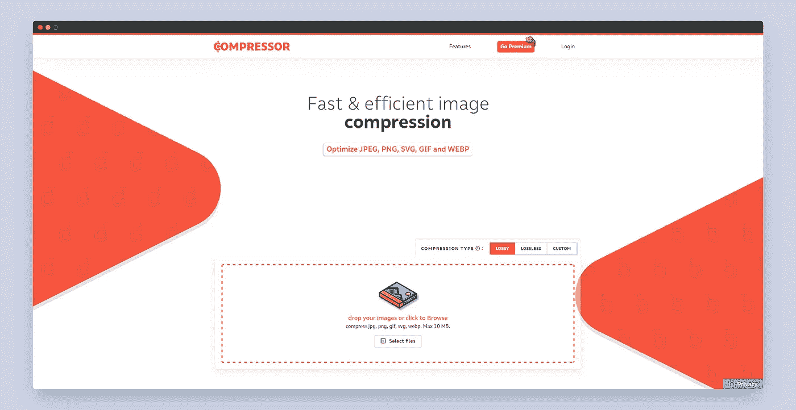

## 5. [CSSGradient](https://cssgradient.io/gradient-backgrounds/)

CSS 渐变让创建新的网页渐变变得非常简单。包括一系列的工具来帮助你升级你的渐变游戏。

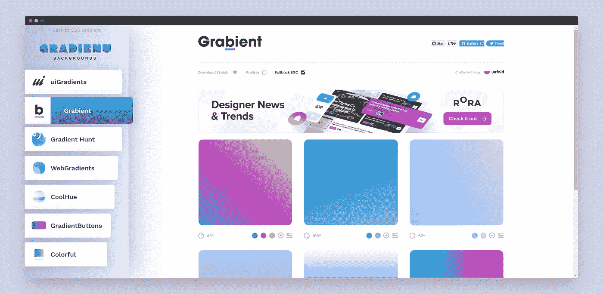

## 6.[神经形态. io](https://neumorphism.io/#e0e0e0)

异形形状看起来不可思议，但很难创造。这个生成器可以很容易地创建你所设想的形状。

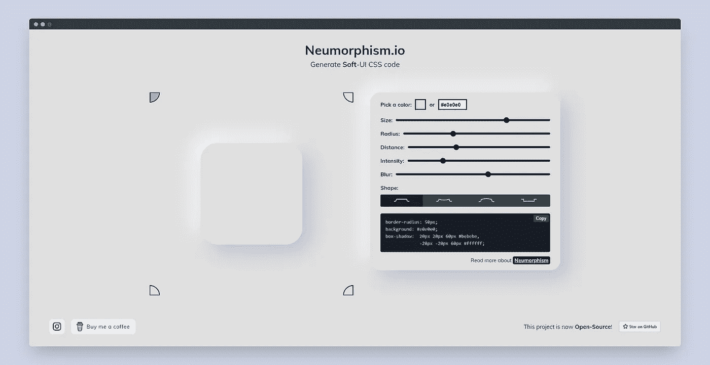

## 7. [Animista](https://animista.net/)

Animista 是一个很棒的工具，可以用来创建自定义的 CSS 动画，有各种各样的效果。创建动画后，生成代码并将其集成到项目中。

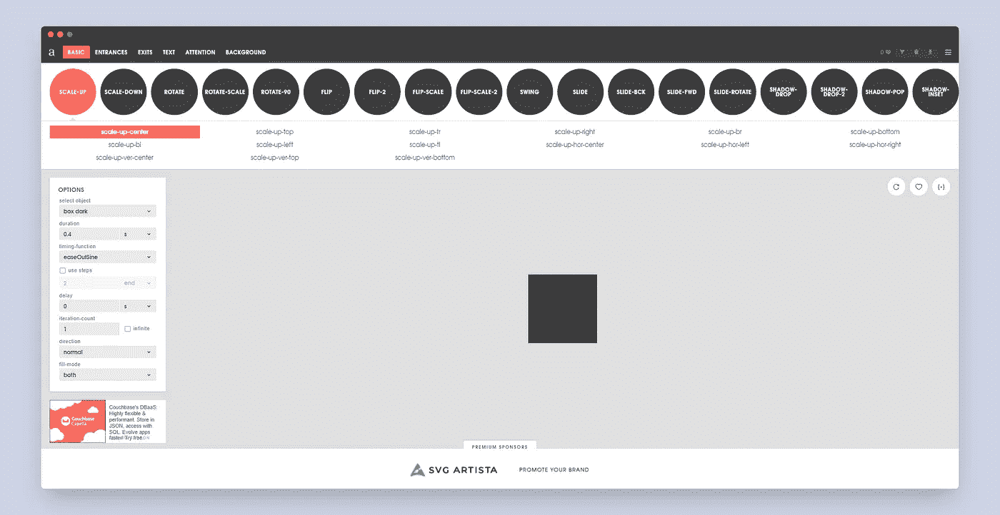

## 8. [FontJoy](https://fontjoy.com/)

Fontjoy 使用神经网络的嵌入层找到有趣的字体配对。点击一个按钮，一个独特的配对出现在我们的最小界面上。

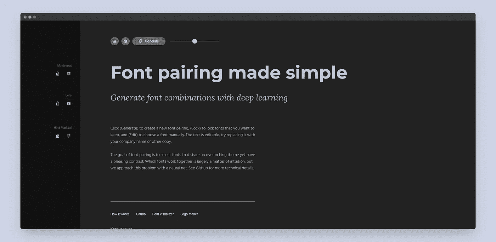

## 9.[标识 Ipsum](https://logoipsum.com/)

当你急着要一个占位标志时，请随意使用 logo Ipsom，它有大量的选择，不同的 Logo 设计可以满足你的各种需求。

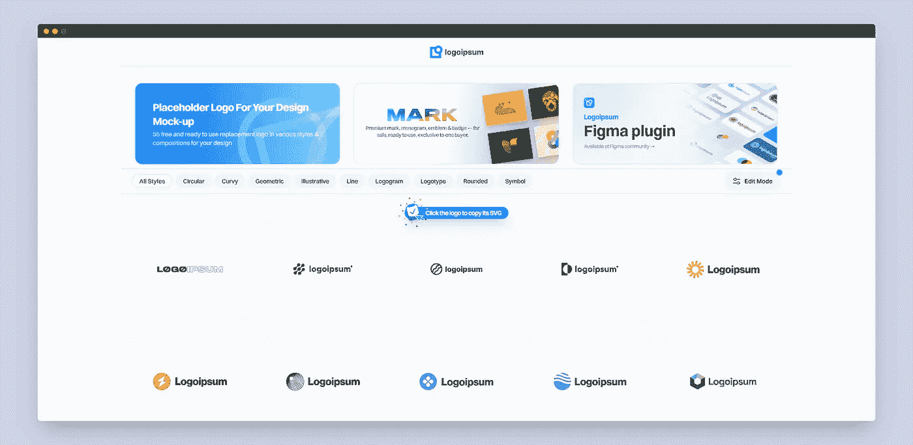

## 10.[碳](https://carbon.now.sh/)

创建和分享源代码的美丽图像。另一个很好的选择是[雷.索](https://ray.so)。

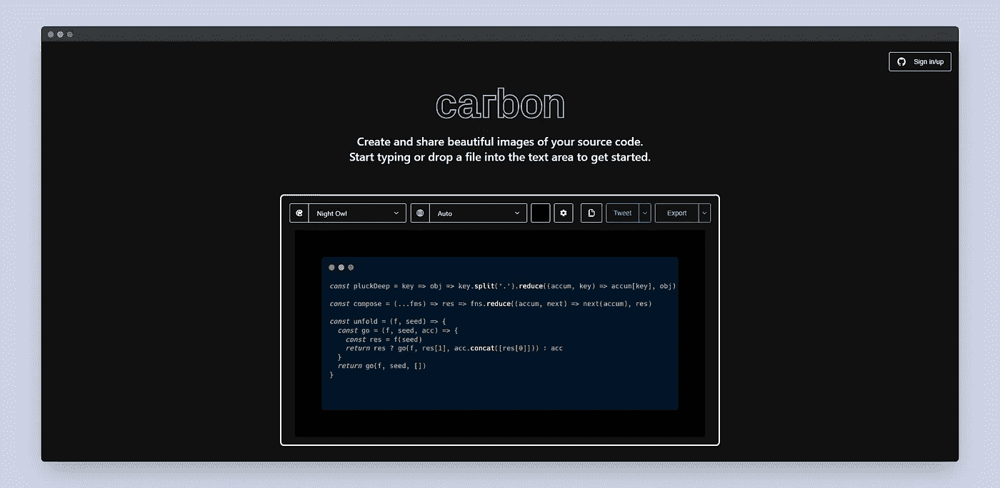

## 11. [Poet.so](https://poet.so)

将 Twitter 帖子捕捉并分享为美丽的图片。它使得在其他平台上分享 Twitter 帖子更加直观和引人注目。

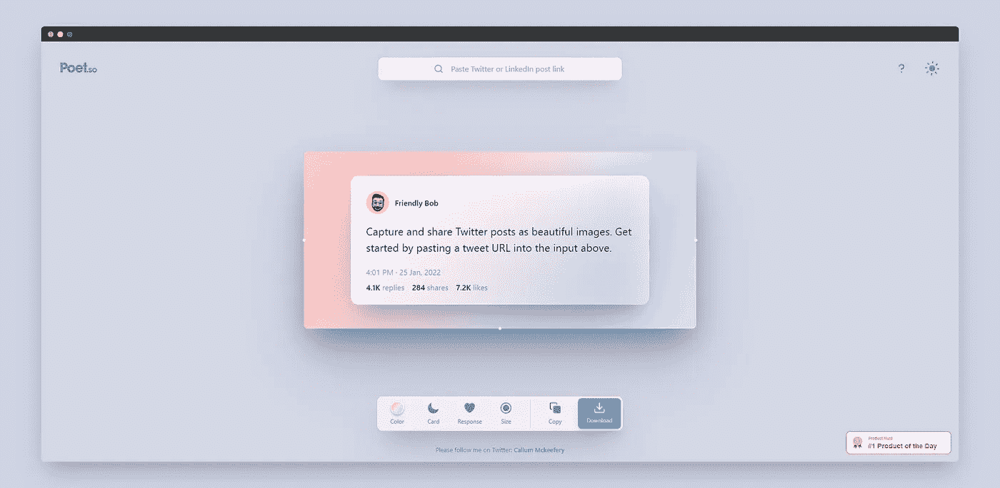

## 12.[浏览器框架](https://browserframe.com/)

在浏览器框架中轻松包装屏幕截图。拖放支持。从 URL 生成屏幕截图。自定义填充、缩放、背景颜色。另一个很好的选择是 [Screely](https://www.screely.com/) 。

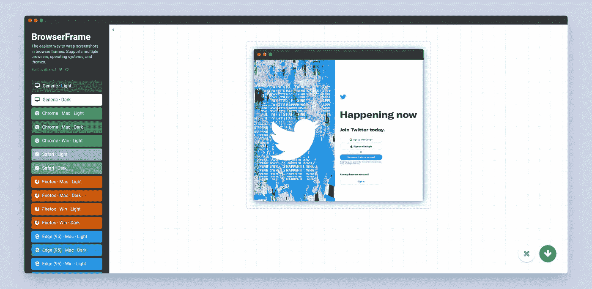

## 13.[箱形阴影](https://box-shadow.dev/)

创造现代感的阴影。编辑它们的水平和垂直偏移、模糊和扩散半径。完成后，生成代码并在项目中使用它。

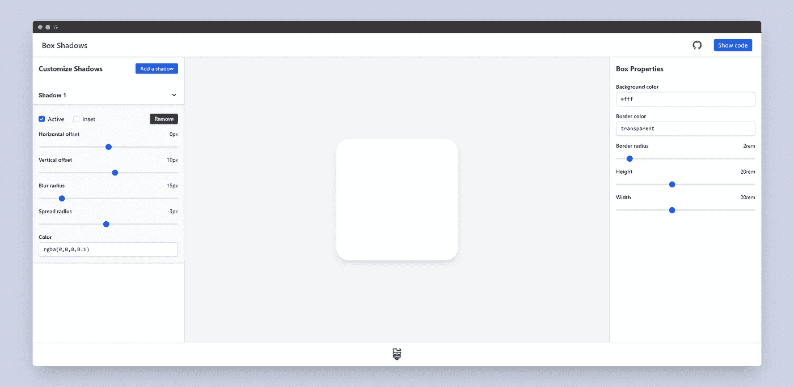

## 14. [Readme.so](https://readme.so)

编辑器允许您快速添加和定制项目自述文件所需的所有部分。

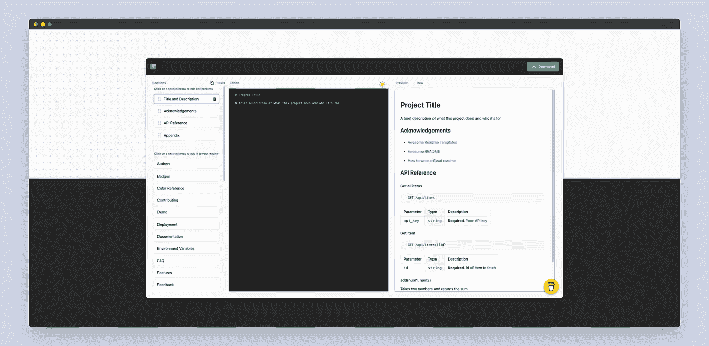

## 15.[元标签 io](https://metatags.io/)

一个为任何网站调试和生成元标签代码的工具。预览您的网页在谷歌、脸书、Twitter 等网站上的外观。

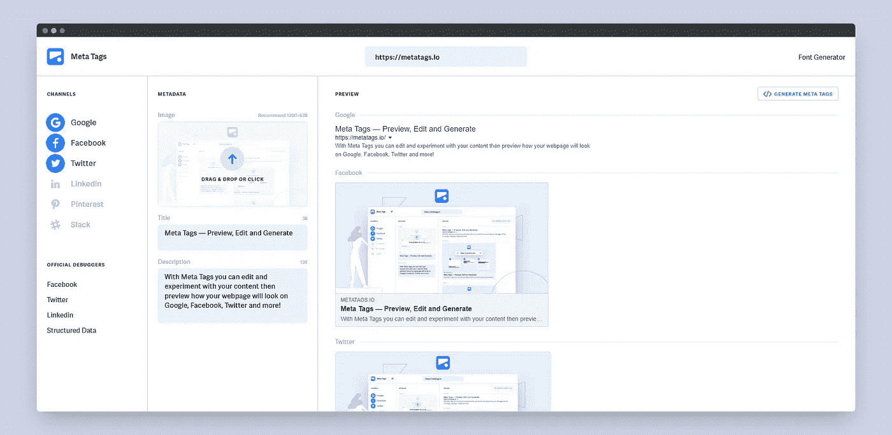

## 16. [Favicon.io](https://favicon.io/)

从文本、图像或表情符号中点击几下，创建一个网站图标。

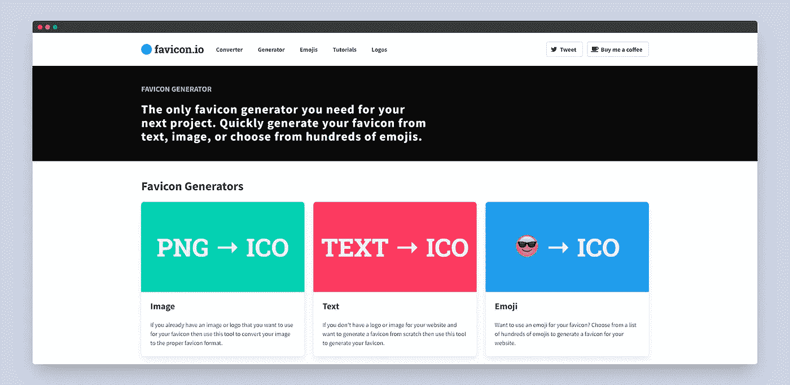

## 17.[未混合](https://unminify.com/)

一个免费的工具来解开 JavaScript，CSS，HTML，XML 和 JSON 代码，使其可读和漂亮。

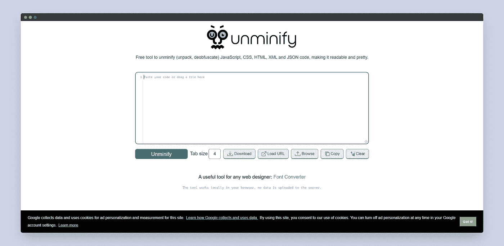

写作一直是我的激情所在，帮助和激励他人给我带来了快乐。如果您有任何问题，请随时联系我们！

在 [Twitter](https://twitter.com/madzadev) 、 [LinkedIn](https://www.linkedin.com/in/madzadev/) 和 [GitHub](https://github.com/madzadev) 上给我接通！

更多类似的文章，请访问我的博客。

*更多内容请看*[***plain English . io***](http://plainenglish.io/)*。报名参加我们的* [***免费周报***](http://newsletter.plainenglish.io/) *。在我们的* [***社区***](https://discord.gg/GtDtUAvyhW) *获得独家获得写作机会和建议。*