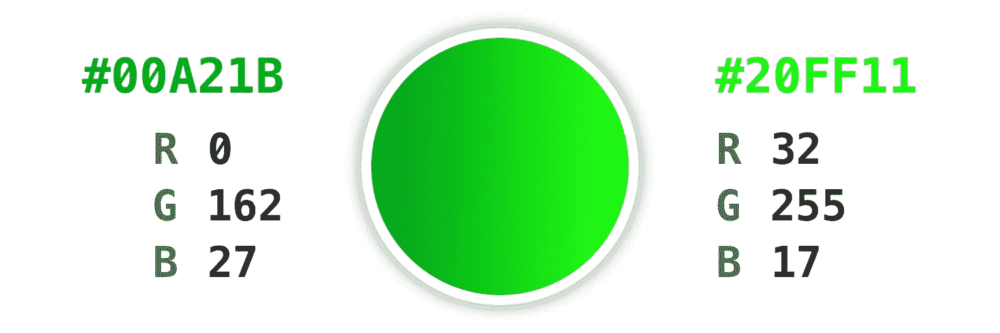

# 在你的下一个项目中使用的 18 种惊人的渐变

> 原文：<https://javascript.plainenglish.io/18-amazing-gradients-to-use-in-your-next-project-c2bc7b06ad2d?source=collection_archive---------23----------------------->

## 无论你是一名设计师，网页开发人员，还是仅仅喜欢渐变，这里有 18 种渐变可以用在你的下一个项目中。

这里有一些很棒的渐变可以用在你的下一个项目中。我已经把它们分类了。这些颜色没有什么特别的，除了我喜欢它们的样子。

我希望你喜欢看这些颜色。如果你喜欢这个结帐更多内容来自我:

 [## CSS 加载动画很容易

### 用纯 CSS 创建一个加载动画比你想象的要容易。忘记 JavaScript、gif 和第三方小部件。

javascript.plainenglish.io](/css-loading-animations-are-easy-a0e785e3e9b6)  [## 在反应堆中创建覆盖

### 一个简单的教程，学习如何使用 ReactJS，使用 TypeScript (TSX)和 CSS 创建自定义覆盖。

towardsdev.com](https://towardsdev.com/creating-overlays-in-reactjs-30b1dfa010a6)  [## 在 React 项目中使用 Ionicons 的正确方法

### HTML 中的 IonIcons 很容易，但在 React 中却很难。尽管缺少文档，我还是弄明白了！

javascript.plainenglish.io](/the-correct-way-to-use-ionicons-in-your-reactjs-project-3b65c97d5b1) 

*更多内容请看*[***plain English . io***](https://plainenglish.io/)*。报名参加我们的* [***免费周报***](http://newsletter.plainenglish.io/) *。关注我们关于*[***Twitter***](https://twitter.com/inPlainEngHQ)*和*[***LinkedIn***](https://www.linkedin.com/company/inplainenglish/)*。查看我们的* [***社区不和谐***](https://discord.gg/GtDtUAvyhW) *加入我们的* [***人才集体***](https://inplainenglish.pallet.com/talent/welcome) *。*