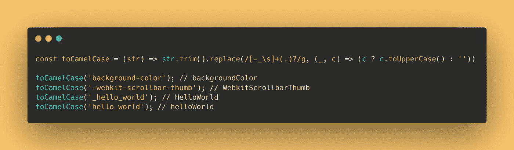
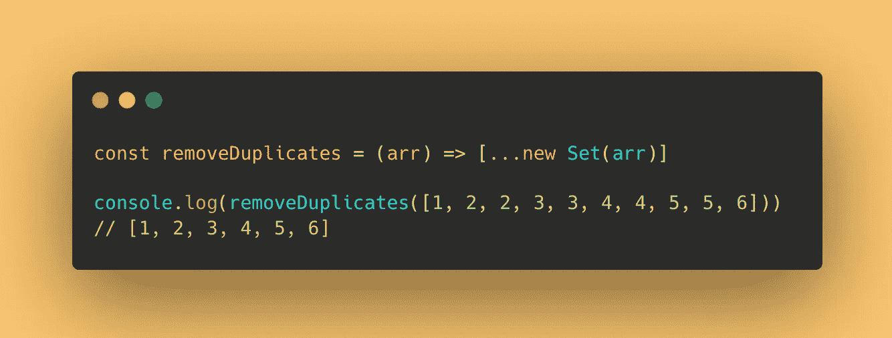
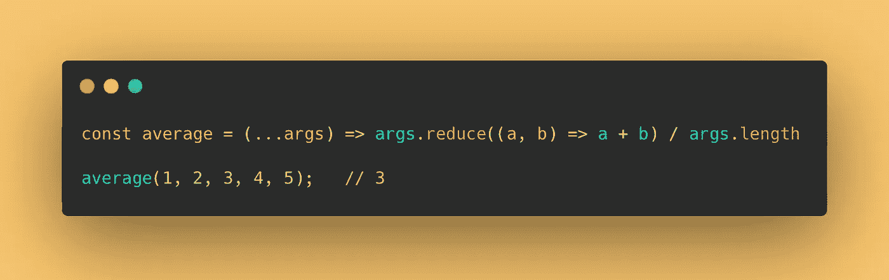

# 18 个让你看起来像专家的 JavaScript 一行程序

> 原文：<https://javascript.plainenglish.io/18-javascript-one-liners-thatll-make-you-look-like-a-pro-678da78ccdb0?source=collection_archive---------1----------------------->

## 为了提高您的 JavaScript 知识，您应该知道的一行程序列表。

在短短几分钟内，加强你的 JS 知识。

# 1.生成随机字符串

我们可以使用 Math.random 来生成一个随机字符串，当我们需要一个唯一的 ID 时，这非常方便。


```
const randomString = () => Math.random().toString(36).slice(2)randomString() *// gi1qtdego0b*
randomString() *// f3qixv40mot*
randomString() *// eeelv1pm3ja*
```

# 2.#转义 HTML 特殊字符

如果你了解 XSS，解决方法之一就是对 HTML 字符串进行转义。


```
const escape = (str) => str.replace(/[&<>"']/g, (m) => ({ '&': '&amp;', '<': '&lt;', '>': '&gt;', '"': '&quot;', "'": '&#39;' }[m]))escape('<div class="medium">Hi Medium.</div>') 
*// &lt;div class=&quot;medium&quot;&gt;Hi Medium.&lt;/div&gt*
```

# 3.#大写字符串中每个单词的第一个字符

此方法用于大写字符串中每个单词的第一个字符。


```
const uppercaseWords = (str) => str.replace(/^(.)|\s+(.)/g, (c) => c.toUpperCase())uppercaseWords('hello world'); *// 'Hello World'*
```

**感谢** [**克里斯托夫·斯特罗里亚-戴维斯**](https://medium.com/u/e58ce76327c4?source=post_page-----678da78ccdb0--------------------------------) **，这是他提供的更简单的方式。**

```
const uppercaseWords = (str) => str.replace(/^(.)|\s+(.)/g, (c) => c.toUpperCase())
```

# 4.#将字符串转换为 camelCase



```
const toCamelCase = (str) => str.trim().replace(/[-_\s]+(.)?/g, (_, c) => (c ? c.toUpperCase() : ''));toCamelCase('background-color'); *// backgroundColor*
toCamelCase('-webkit-scrollbar-thumb'); *// WebkitScrollbarThumb*
toCamelCase('_hello_world'); *// HelloWorld*
toCamelCase('hello_world'); *// helloWorld*
```

# 5.#删除数组中的重复值

删除数组的重复项是非常必要的，使用“Set”会变得非常简单。



```
const removeDuplicates = (arr) => [...new Set(arr)]console.log(removeDuplicates([1, 2, 2, 3, 3, 4, 4, 5, 5, 6])) 
*// [1, 2, 3, 4, 5, 6]*
```

# 6.#展平数组

我们经常在面试中受到考验，这可以通过两种方式来实现。


```
const flat = (arr) =>
    [].concat.apply(
        [],
        arr.map((a) => (Array.isArray(a) ? flat(a) : a))
    )*// Or*
const flat = (arr) => arr.reduce((a, b) => (Array.isArray(b) ? [...a, ...flat(b)] : [...a, b]), [])flat(['cat', ['lion', 'tiger']]) *// ['cat', 'lion', 'tiger']*
```

# 7.#从数组中删除虚假值

使用这种方法，您将能够过滤掉数组中的所有错误值。


```
const removeFalsy = (arr) => arr.filter(Boolean)removeFalsy([0, 'a string', '', NaN, true, 5, undefined, 'another string', false])
*// ['a string', true, 5, 'another string']*
```

# 8.#检查一个数字是偶数还是奇数

使用模运算符(%)可以解决的超级简单的任务。


```
const isEven = num => num % 2 === 0isEven(2) *// true*
isEven(1) *// false*
```

# 9.#获取两个数字之间的随机整数

此方法用于获取两个数字之间的随机整数。


```
const random = (min, max) => Math.floor(Math.random() * (max - min + 1) + min)random(1, 50) // 25
random(1, 50) // 34
```

# 10#.获取参数的平均值

我们可以使用 reduce 方法来获得我们在这个函数中提供的参数的平均值。



```
const average = (...args) => args.reduce((a, b) => a + b) / args.length;average(1, 2, 3, 4, 5);   *// 3*
```

# 11.#将数字截断到一个固定的小数点

使用 Math.pow()方法，我们可以将一个数字截断到函数中提供的某个小数点。


```
const round = (n, d) => Number(Math.round(n + "e" + d) + "e-" + d)round(1.005, 2) *//1.01*
round(1.555, 2) *//1.56*
```

# 12.#计算两个日期之间的差异天数

有时我们需要计算两个日期之间的天数，一行代码就可以完成。


```
const diffDays = (date, otherDate) => Math.ceil(Math.abs(date - otherDate) / (1000 * 60 * 60 * 24));diffDays(new Date("2021-11-3"), new Date("2022-2-1"))  *// 90*
```

# 13.#从日期中获取一年中的某一天

你想知道某一天是一年中的哪一天吗？


```
const dayOfYear = (date) => Math.floor((date - new Date(date.getFullYear(), 0, 0)) / (1000 * 60 * 60 * 24))dayOfYear(new Date()) *// 74*
```

# 14.#生成随机的十六进制颜色

如果你需要一个随机的颜色值，这个函数就可以了。


```
const randomColor = () => `#${Math.random().toString(16).slice(2, 8).padEnd(6, '0')}`randomColor() // #9dae4f
randomColor() // #6ef10e
```

# 15.#将 RGB 颜色转换为十六进制


```
const rgbToHex = (r, g, b) => "#" + ((1 << 24) + (r << 16) + (g << 8) + b).toString(16).slice(1)rgbToHex(255, 255, 255)  // '#ffffff'
```

# 16.#清除所有 cookies


```
const clearCookies = () => document.cookie.split(';').forEach((c) => (document.cookie = c.replace(/^ +/, '').replace(/=.*/, `=;expires=${new Date().toUTCString()};path=/`)))
```

# 17.#检测黑暗模式


```
const isDarkMode = window.matchMedia && window.matchMedia('(prefers-color-scheme: dark)').matches
```

# 18.#交换两个变量


```
[foo, bar] = [bar, foo]
```

# 19.#暂停片刻


```
const pause = (millis) => new Promise(resolve => setTimeout(resolve, millis))const fn = async () => {
  await pause(1000) console.log('fatfish') // 1s later
}
fn()
```

# 最后

以下是今天分享的所有一行代码小技巧，**感谢阅读。**

*更多内容请看*[***plain English . io***](https://plainenglish.io/)*。报名参加我们的* [***免费周报***](http://newsletter.plainenglish.io/) *。关注我们关于*[***Twitter***](https://twitter.com/inPlainEngHQ)*和*[***LinkedIn***](https://www.linkedin.com/company/inplainenglish/)*。加入我们的* [***社区不和谐***](https://discord.gg/GtDtUAvyhW) *。*