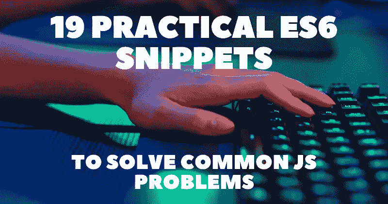

# 解决常见 JavaScript 问题的 19 个实用 ES6 片段

> 原文：<https://javascript.plainenglish.io/19-practical-es6-snippets-to-solve-common-javascript-problems-3ffc4afa9255?source=collection_archive---------0----------------------->

## 在处理 URL、DOM、事件、日期、用户偏好等时，有用的代码片段可能会对您有所帮助。



在我们的开发人员工作流程中，我们经常会遇到可能只需要几行代码就能解决的挑战性问题。在本文中，我试图编译一些有用的代码片段，在处理 URL、DOM、事件、日期、用户偏好等时可能会有所帮助。

所有的片段都是从 [30 秒的代码](https://www.30secondsofcode.org/js/p/1)中精选出来的。这是一个很棒的资源，我强烈推荐去看看更多的东西。

管理这些的主要标准是实用性。希望你能找到一些有价值的东西，可以应用到你未来的代码库中。

## 1.如何获取基础网址？

```
const getBaseURL = url => url.replace(/[?#].*$/, '');

getBaseURL('http://url.com/page?name=Adam&surname=Smith');
// 'http://url.com/page'
```

## 2.如何检查网址是否绝对？

```
const isAbsoluteURL = str => /^[a-z][a-z0-9+.-]*:/.test(str);

isAbsoluteURL('https://google.com'); // true
isAbsoluteURL('ftp://www.myserver.net'); // true
isAbsoluteURL('/foo/bar'); // false
```

## 3.如何获取 URL 参数作为对象？

```
const getURLParameters = url =>
  (url.match(/([^?=&]+)(=([^&]*))/g) || []).reduce(
    (a, v) => (
      (a[v.slice(0, v.indexOf('='))] = v.slice(v.indexOf('=') + 1)), a
    ),
    {}
  );

getURLParameters('google.com'); // {}
getURLParameters('http://url.com/page?name=Adam&surname=Smith');
// {name: 'Adam', surname: 'Smith'}
```

## 4.如何检查一个元素是否包含另一个元素？

```
const elementContains = (parent, child) =>
  parent !== child && parent.contains(child);

elementContains(
  document.querySelector('head'),
  document.querySelector('title')
);
// true
elementContains(document.querySelector('body'), document.querySelector('body'));
// false
```

## 5.如何获取元素的所有祖先？

```
const getAncestors = el => {
  let ancestors = [];
  while (el) {
    ancestors.unshift(el);
    el = el.parentNode;
  }
  return ancestors;
};

getAncestors(document.querySelector('nav'));
// [document, html, body, header, nav]
```

## 6.如何平滑滚动元素进入视图？

```
const smoothScroll = element =>
  document.querySelector(element).scrollIntoView({
    behavior: 'smooth'
  });

smoothScroll('#fooBar'); // scrolls smoothly to the element with the id fooBar
smoothScroll('.fooBar');
// scrolls smoothly to the first element with a class of fooBar
```

## 7.如何处理元素外的点击？

```
const onClickOutside = (element, callback) => {
  document.addEventListener('click', e => {
    if (!element.contains(e.target)) callback();
  });
};

onClickOutside('#my-element', () => console.log('Hello'));
// Will log 'Hello' whenever the user clicks outside of #my-element
```

## 8.如何生成 UUID？

```
const UUIDGeneratorBrowser = () =>
  ([1e7] + -1e3 + -4e3 + -8e3 + -1e11).replace(/[018]/g, c =>
    (
      c ^
      (crypto.getRandomValues(new Uint8Array(1))[0] & (15 >> (c / 4)))
    ).toString(16)
  );

UUIDGeneratorBrowser(); // '7982fcfe-5721-4632-bede-6000885be57d'
```

## 9.如何获取选中的文本？

```
const getSelectedText = () => window.getSelection().toString();

getSelectedText(); // 'Lorem ipsum'
```

## 10.如何将文本复制到剪贴板？

```
const copyToClipboard = str => {
  if (navigator && navigator.clipboard && navigator.clipboard.writeText)
    return navigator.clipboard.writeText(str);
  return Promise.reject('The Clipboard API is not available.');
};
```

## 11.如何给 HTML 元素添加样式？

```
const addStyles = (el, styles) => Object.assign(el.style, styles);

addStyles(document.getElementById('my-element'), {
  background: 'red',
  color: '#ffff00',
  fontSize: '3rem'
});
```

## 12.如何切换全屏模式？

```
const fullscreen = (mode = true, el = 'body') =>
  mode
    ? document.querySelector(el).requestFullscreen()
    : document.exitFullscreen();

fullscreen(); // Opens `body` in fullscreen mode
fullscreen(false); // Exits fullscreen mode
```

## 13.如何检测 Caps Lock 是否打开？

```
<form>
  <label for="username">Username:</label>
  <input id="username" name="username">

  <label for="password">Password:</label>
  <input id="password" name="password" type="password">
  <span id="password-message" style="display: none">Caps Lock is on</span>
</form>const el = document.getElementById('password');
const msg = document.getElementById('password-message');

el.addEventListener('keyup', e => {
  msg.style = e.getModifierState('CapsLock')
    ? 'display: block'
    : 'display: none';
});
```

## 14.如何检查日期是否有效？

```
const isDateValid = (...val) => !Number.isNaN(new Date(...val).valueOf());

isDateValid('December 17, 1995 03:24:00'); // true
isDateValid('1995-12-17T03:24:00'); // true
isDateValid('1995-12-17 T03:24:00'); // false
isDateValid('Duck'); // false
isDateValid(1995, 11, 17); // true
isDateValid(1995, 11, 17, 'Duck'); // false
isDateValid({}); // false
```

## 15.如何从日期获取冒号时间？

```
const getColonTimeFromDate = date => date.toTimeString().slice(0, 8);

getColonTimeFromDate(new Date()); // '08:38:00'
```

## 16.如何从 Date 生成 UNIX 时间戳？

```
const getTimestamp = (date = new Date()) => Math.floor(date.getTime() / 1000);

getTimestamp(); // 1602162242
```

## 17.如何查看当前用户的首选语言？

```
const detectLanguage = (defaultLang = 'en-US') =>
  navigator.language ||
  (Array.isArray(navigator.languages) && navigator.languages[0]) ||
  defaultLang;

detectLanguage(); // 'nl-NL'
```

## 18.如何查看用户喜欢的配色方案？

```
const prefersDarkColorScheme = () =>
  window &&
  window.matchMedia &&
  window.matchMedia('(prefers-color-scheme: dark)').matches;

prefersDarkColorScheme(); // true
```

## 19.如何检查设备是否支持触摸事件？

```
const supportsTouchEvents = () =>
  window && 'ontouchstart' in window;

supportsTouchEvents(); // true
```

写作一直是我的激情所在，帮助和激励他人给我带来了快乐。如果您有任何问题，请随时联系我们！

在 [Twitter](https://twitter.com/madzadev) 、 [LinkedIn](https://www.linkedin.com/in/madzadev/) 和 [GitHub](https://github.com/madzadev) 上给我接通！

访问我的[博客](https://madza.dev/blog)获取更多类似的文章。

*更多内容请看*[***plain English . io***](https://plainenglish.io/)*。报名参加我们的* [***免费周报***](http://newsletter.plainenglish.io/) *。关注我们关于*[***Twitter***](https://twitter.com/inPlainEngHQ)[***LinkedIn***](https://www.linkedin.com/company/inplainenglish/)*[***YouTube***](https://www.youtube.com/channel/UCtipWUghju290NWcn8jhyAw)*[***不和***](https://discord.gg/GtDtUAvyhW) *。对增长黑客感兴趣？检查* [***电路***](https://circuit.ooo/) *。***