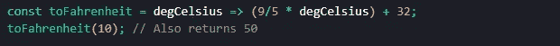

# 2 个介绍 JavaScript 函数的例子

> 原文：<https://javascript.plainenglish.io/2-examples-to-introduce-javascript-functions-f284dc8418c3?source=collection_archive---------9----------------------->

如果你正在学习 JavaScript，学习函数是必须的。即使作为一个很久没有使用 JavaScript 的人，我也无法想象没有它们的 JavaScript 生活。

简而言之，函数包含调用函数时执行的代码(在下面的例子中会有更多的介绍)，这使得多次执行相同的代码成为可能，而不必在每次执行时都键入代码。记得学过变量吗？函数是一种变量，因为它们可以被反复使用，而不需要每次使用时都把函数的整个过程打出来。

非常简单的函数可能只包含一行要执行的代码，有些函数可以完全写在一行上，但是在您的职业生涯中，您可能会遇到执行更复杂代码的函数，所以在这种情况下，函数确实很有用。

函数可以写成传统函数，也可以写成箭头函数。让我们来看看一些不太复杂的例子:

# 示例 1:记录“Hello！”的函数到控制台:

## 传统功能:

Define a traditional function to log ‘Hello!’ to the console

传统上，函数是用' function '关键字定义的，后跟函数名(在本例中为`sayHello`)和括号。要执行的代码放在花括号内。通常会使用“return”关键字，但是因为我们只是记录“Hello！”到控制台，我们将在这里排除它。我们将在示例 2 中使用它。

现在，要执行`sayHello()`，我们必须调用它:

Call the function

在调用该函数时，“你好！”将被记录到控制台。

## 箭头功能:

箭头函数是一种更流行的编写 JavaScript 函数的方式。他们是在 [ES6](https://www.w3schools.com/Js/js_es6.asp) 中被介绍的。它们可以缩短语法，从而使您的代码更加高效。例如，如果只有一个要执行的语句，就像这里的情况一样，整个函数可以放在一行中。用“const”关键字定义它们也是最佳实践。

Define an arrow function to log ‘Hello!’ to the console

不要忘记调用函数，就像我们上面做的那样:

Call the function

# 示例 2:将摄氏度转换为华氏度的函数:

## 传统功能:

Define traditional function to convert Celsius to Fahrenheit, then call the function

请注意，我们包含了' return '关键字，因此该函数实际上返回了值，而不是像前面的示例那样只将它记录到控制台。如果你想把结果记录到控制台，也许是为了检查你的函数是否返回正确的值，在函数中包含一个`console.log()`或者记录对控制台的函数调用。

另外，请注意，我们在括号内包含了'**摄氏度**'。**摄氏度**，在这种情况下，就是所谓的‘参数’。这些使得函数能够处理可变信息。函数处理不同参数的方式是在首次定义函数时建立的。如果一个函数接受参数，但在调用该函数时根本没有传递参数，或者参数传递不正确，那么该函数将不起作用。**这里有一些关于使用参数**的指导方针:

*   参数名应该清楚地表明它们“要求”什么信息
*   函数调用中的参数数量必须与函数接受的参数数量相匹配，正如函数中定义的那样
*   如果有多个参数，请用逗号分隔它们

在这个例子中，当我们调用函数并将 10(摄氏度)作为参数传递时，函数返回 50，这意味着 10 摄氏度等于 50 华氏度。

## 箭头功能:

Define arrow function to convert Celsius to Fahrenheit, then call the function, passing in‘10’ as the parameter

在上图中，你可以看到如何将`toFahrenheit`函数写成一个箭头函数。注意' **degCelsius** '仍然是唯一的参数，并且只有一个要执行的代码语句(这是箭头和分号之间的代码)。

对于箭头函数，如果只有一个参数，它不需要放在括号内，尽管如果您愿意，也可以这样做。如果有多个参数，它们必须在括号内，当然，要用逗号分隔。

如果只有一个要执行的语句，它不需要放在括号内，所以在上面的例子中我也没有放在括号内。**如果只有一个语句**，&，关键字‘return’也可以被排除，这被称为隐式返回。如果有多个要执行的语句，它们必须都在括号内，除非该函数的唯一目的是执行一个命令，如`console.log(…)`，否则必须使用' **return** '关键字；否则，该函数将返回“**未定义的**”。

如果我们在这里调用函数并传入 10，50 又被返回，就像我们用传统方式写函数时一样。

这就是你要的，只是一些基本 JavaScript 函数的例子。它们可能非常复杂，就像 JavaScript 一样，但希望这能帮助您比以前更熟悉它们。

如果你觉得这篇文章有帮助，请告诉我；如果你有任何批评，请也这样做。如果你喜欢阅读这样的文章，请在这里关注我！我很乐意与您联系并分享想法。随着时间的推移，当我有时间的时候，我会写更多这样的文章。

感谢阅读！

[阅读关于 JavaScript 函数的 MDN 文档](https://developer.mozilla.org/en-US/docs/Web/JavaScript/Guide/Functions)

*更多内容看* [***说白了。报名参加我们的***](https://plainenglish.io/) **[***免费周报***](http://newsletter.plainenglish.io/) *。关注我们关于*[***Twitter***](https://twitter.com/inPlainEngHQ)*和*[***LinkedIn***](https://www.linkedin.com/company/inplainenglish/)*。查看我们的* [***社区不和谐***](https://discord.gg/GtDtUAvyhW) *，加入我们的* [***人才集体***](https://inplainenglish.pallet.com/talent/welcome) *。***