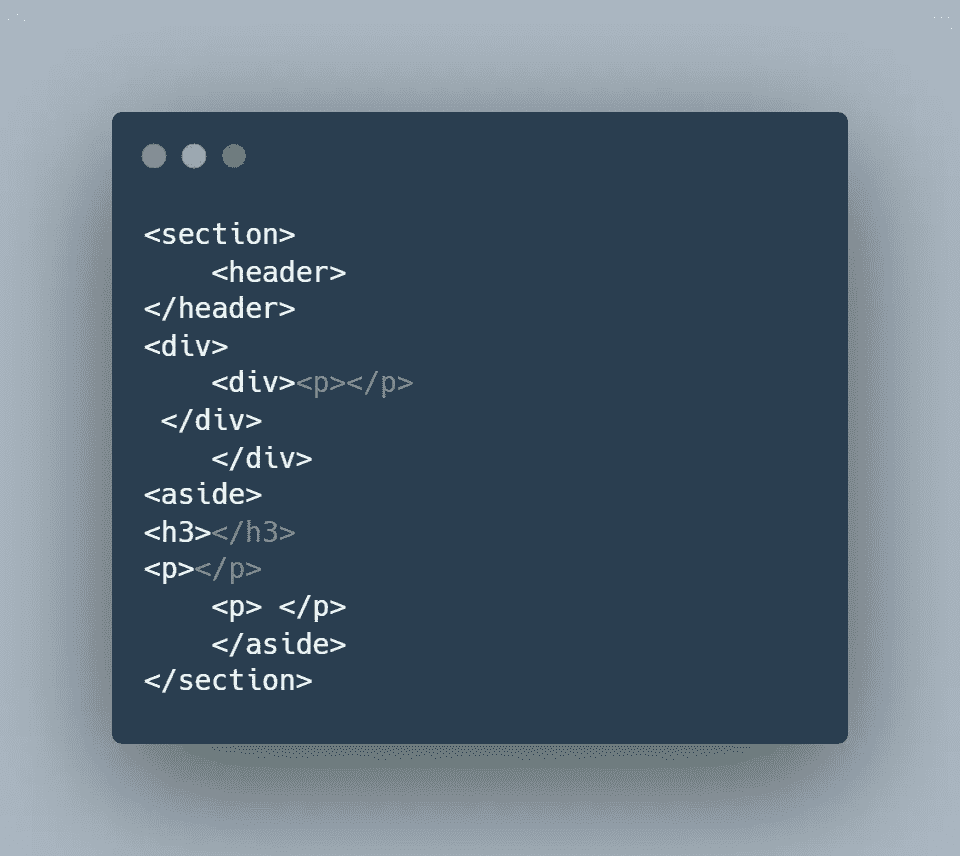
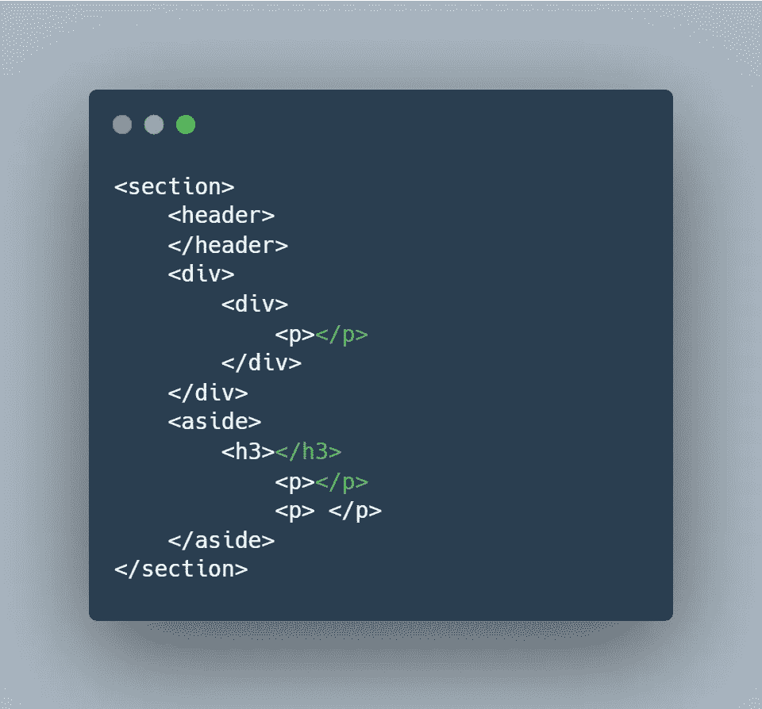

# 像专业人士一样编程需要知道的两个工具

> 原文：<https://javascript.plainenglish.io/2-tools-you-need-to-know-to-code-like-a-pro-prettier-and-eslint-b71086e44e49?source=collection_archive---------17----------------------->

## 什么是棉绒和格式化？


Photo By [**Sigmund**](https://unsplash.com/@sigmund)

嘿朋友们，

今天，我们讨论两个非常受欢迎的工具，它们是大公司的前端工程师使用的。我们正在谈论短绒和格式化:更漂亮和 ESLint。

是一个非常受欢迎的代码格式化程序，支持 JavaScript、TypeScript、CSS、HTML 和许多其他语言。根据 [npm](https://www.npmjs.com/package/prettier) 注册表，beauty 软件包拥有 2400 万次每周下载。更漂亮的还有对 Atom、Sublime、VS Code 的扩展，以及更多的编辑器。在 VS Code 上，[beauty extension](https://marketplace.visualstudio.com/items?itemName=esbenp.prettier-vscode)的总下载量为 2370 万次——其中两次是我的个人电脑和工作电脑。我强烈推荐。根据 Prettier 的网站，他们证实了这些科技公司使用他们的产品:脸书、Dropbox、Spotify、PayPal、Discord 和 Yelp。**真的，大概每个人都用。**

至于 ESLint，它是一个 linter 和 formatter。它可以执行与 Prettier 相同的格式化功能，但它可以做得更多。在 VS 代码上， [ESLint 扩展](https://marketplace.visualstudio.com/items?itemName=dbaeumer.vscode-eslint)有超过 2100 万次下载。在 npm 注册表中，[它拥有超过 2650 万的周下载量](https://www.npmjs.com/package/eslint)。根据他们的网站，像网飞、微软、Airbnb 和脸书这样的公司使用他们的产品。

又一次……大概大家都用吧。如果没有，他们完全使用某种形式的棉绒和格式化程序。如果你学了一门，基本上就全学会了。

所以就来说说吧。让我们培养你的技能和知识。让我告诉你为什么它很重要。

# 什么是格式化程序？什么是棉绒？漂亮和埃斯林特怎么会出现在那张照片里？

让我们从更简单的开始:什么是格式化程序？

代码格式化程序是一个简洁的小工具，它格式化或样式化我们的代码，使得我们的代码是一致的、可读的和可维护的。例如，如果您决定使用单引号:

```
let name = 'Kyle';
```

那么理想情况下，您应该在代码的其余部分保持一致。不要在双引号和单引号之间切换。更漂亮的——也是一个格式化程序——将为我们调整代码，使其保持一致。

另一个大问题是间距。



这样好看吗？你想看吗？如果这些元素中真的有内容，理解发生了什么将会困难十亿倍。可读性系数不会很大；因此，它也很难维持。

漂亮点的会自动帮我们搞定的。



太棒了。它会帮你修改代码，这样你就可以专注于重要的事情:编码。此外，如果你是在一个团队中工作，更漂亮的将确保每个人的代码添加将风格/格式相同。

您的代码将看起来一致。即使其他团队成员有不同的编码风格，最终也会被格式化成相同的格式，使得代码不知所云。

如果你想知道这在技术上是如何工作的，Prettier 基本上只是根据设定的格式规则解析并重写你的代码。(是的，您可以根据自己的喜好调整这些规则。)

如果你想了解更多的信息，可以去官方博客网站看看。要开始使用 Prettier，最简单的方法是在 VS 代码上安装扩展。或者，您也可以将 npm 包安装到项目中。

## 现在，让我们转到 ESLint。

ESLint 也可以充当格式化程序。它会告诉你间距是否错误。

```
let x = 10;
      let y = 3;
let z = 2;let sum = y + z;
console.log(sum)
```

ESLint 会说“嘿，第二行前面有个大空格。太奇怪了。修好它。”或者可能它会注意到我们初始化 z 后的空行，ESLint 会说“嘿，删除随机空行。”

所以 ESLint 肯定能做 beauty 做的事。但是，ESLint 可以做得更多。ESLint 可以根据规则修复你的代码**。**而且有很多。

例如，有一个规则会说“删除未使用的变量”如果启用了该规则，ESLint 会说，“x 永远不会被使用。去掉了。”因为看上面的代码片段。我们从来没有使用过 x，所以这基本上是浪费内存空间和时间。

这是另一个例子。还有一条规则是“删除控制台语句”我猜这样做的目的是我们不希望官方代码中的控制台声明被推送到我们应用的官方版本中。想象一下使用 Medium，检查控制台，只有随机的控制台消息，如“Kyle 在这里”或“在 for-loop 中”。总之，如果这个规则被打开，ESLint 会说，“嘿。删除控制台语句。

同样，ESLint 会根据已经设定的规则帮助你修改你的代码。你完全可以根据自己的喜好进行定制。如果你很想知道有哪些规则——只是为了真正理解 ESLint 的目的——那么看看 ESLint 的官方文档提供的这个[官方规则列表。](https://eslint.org/docs/latest/rules/)

这两个工具一起确保你的代码看起来是最好的。它使我们的代码可读。

而且，ESLint 会告诉你，而不是你的团队或团队领导告诉你他们的每一个编码约定。有很多次，我拥有完美运行的代码，但 ESLint 会告诉我，我的方式不是他们的方式——这非常公平。为了开发一个产品，我们必须达成共识。我们必须以某种方式编写代码，以确保我们的项目易于团队中的每个开发人员理解和维护。所以 ESLint 是一个很好的工具。

这确实需要一些调整。有时候会非常细致。如果有用，那不是很好吗？我不知道。但是我知道的是，当我阅读修复代码的建议时，我学到了很多。我了解为什么他们的建议更好，为什么它更有意义，这有助于我作为开发人员的提高。

帖子到此结束！

如果你想开始，我强烈推荐在 VS 代码上安装 ESLint 和更漂亮的扩展。与 npm 软件包相比，它们更容易处理，你可以马上开始使用。这些扩展总是附带易于遵循的说明，帮助您入门。

为你干杯。

*更多内容请看*[***plain English . io***](https://plainenglish.io/)*。报名参加我们的* [***免费周报***](http://newsletter.plainenglish.io/) *。关注我们关于*[***Twitter***](https://twitter.com/inPlainEngHQ)[***LinkedIn***](https://www.linkedin.com/company/inplainenglish/)*[***YouTube***](https://www.youtube.com/channel/UCtipWUghju290NWcn8jhyAw)*[***不和***](https://discord.gg/GtDtUAvyhW) *。***