# 20 多个 CSS 技巧和窍门，让你成为更好的开发者

> 原文：<https://javascript.plainenglish.io/20-css-tips-and-tricks-to-make-you-a-better-developer-43aa5b9d0c34?source=collection_archive---------1----------------------->

## 让你成为更好、更灵活、更快的开发者的顶级 CSS 技巧和诀窍。


# 前言

**修改输入占位符样式、多行文本溢出、隐藏滚动条、修改光标颜色、水平居中和垂直居中。**多么熟悉的场景！前端开发者几乎每天都会和他们打交道，这里有 20 个 CSS 招数，大家看看吧。

## 对扩展您的软件启动感兴趣吗？检查[电路](https://circuit.ooo/?utm=publication-post-cta)。

# 1.解决图像 5px 间距问题

你是否经常有图片底部多余 5px 间距的问题？不急，这里有 4 种方法可以解决。


picture 5px spacing

**解决方案 1:将 font-size: 0 设置为父元素**

CodePen demo

**解决方案 2:将显示:块设置为 img**

CodePen demo

**解决方案 3:将垂直对齐:底部设置为 img**

CodePen demo

**解决方案 4:将行高:5px 设置为父元素**

CodePen demo

# 2.元素高度与窗口高度相同

如何让元素和窗口一样高？

CodePen demo

# 3.修改输入占位符样式

第一个是修改过的，第二个不是。

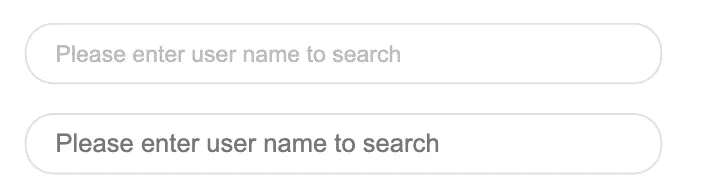

CodePen demo

# 4.使用“:非”选择器

除了最后一个元素之外，所有元素都需要某种样式，使用 not 选择器将非常容易。

**如下图:最后一个元素没有下边框。**

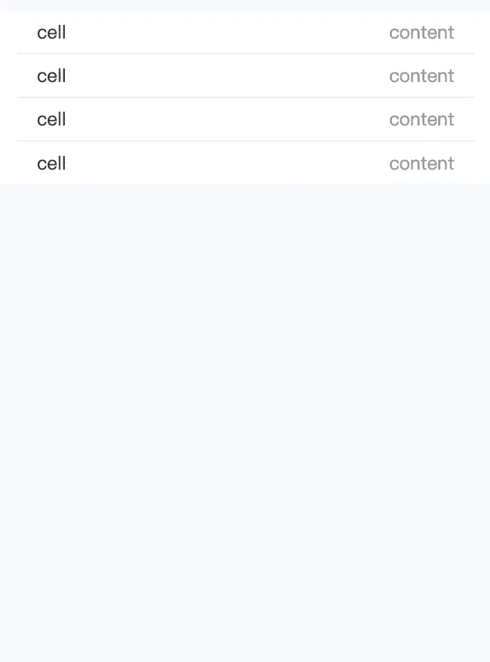

CodePen demo

# 5.使用 flex layout 智能地将元素固定在底部

当内容不够时，按钮应该在页面底部。当有足够的内容时，按钮应该跟随内容。当你有类似的问题时，使用 flex 实现智能布局！

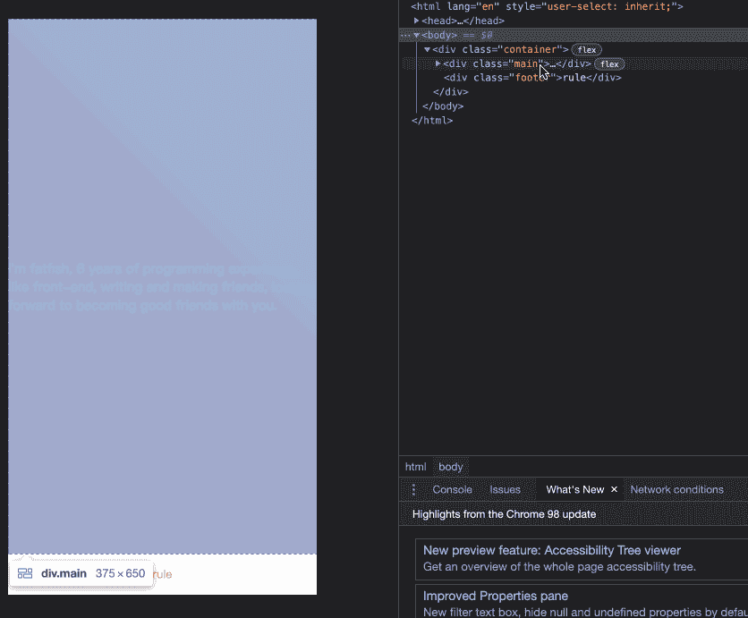

fixed bottom

CodePen demo

# 6.使用“脱字颜色”修改光标颜色

有时需要修改光标的颜色。现在是脱字符颜色显示时间。

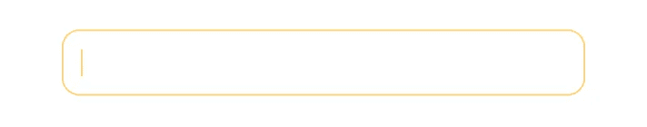

CodePen demo

# 7.移除 type="number "末尾的箭头

默认情况下，输入 type = "number "的末尾会出现一个小箭头，但有时我们需要去掉它。我们做什么呢

**如下图:第二个去掉了，第一个没有。**

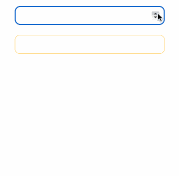

Remove the arrow at the end of type=”number”

CodePen demo

# 8.“大纲:无”删除输入状态行

当输入框被选中时，默认情况下它会有一条蓝色的状态线，可以使用 outline: none 来移除。

**如下图:第二个输入框被移除，第一个没有。**

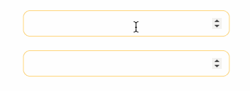

# 9.解决 iOS 滚动条被卡住的问题

> *在苹果手机上，经常会出现滚动时元素卡顿的情况。此时只有一行 CSS 会支持弹性滚动。*

# 10.画三角形


triangle

# 11.画小箭头


Draw small arrows

# 12.图像适合窗口大小

vw 与填充

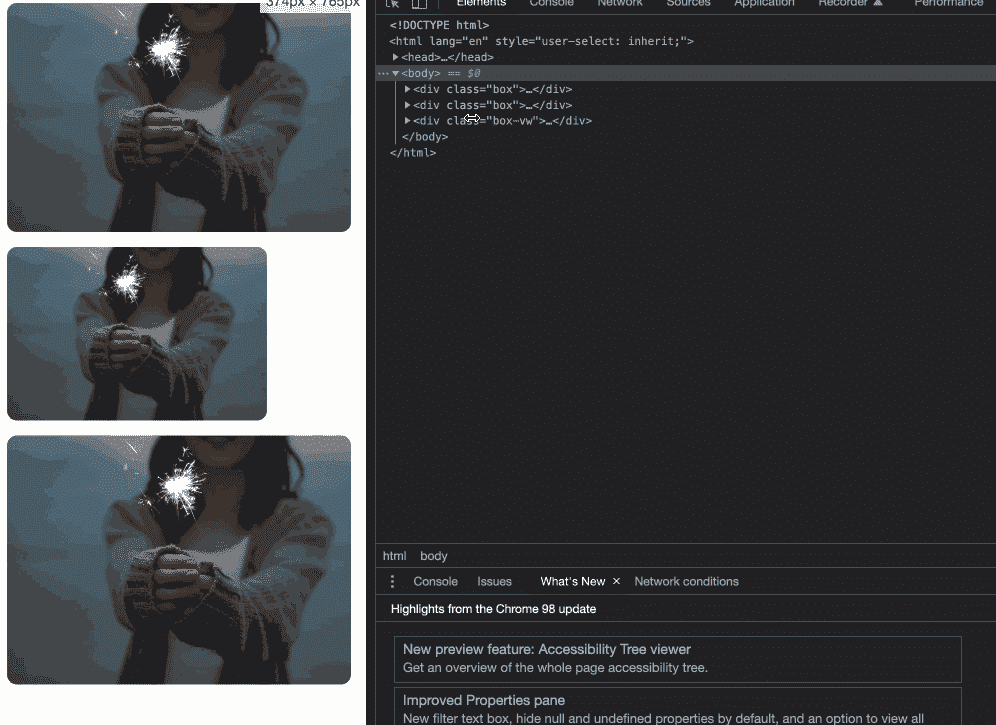

vw vs padding

# 13.隐藏滚动条

第一个滚动条是可见的，第二个是隐藏的。

这意味着容器可以滚动，但是滚动条是隐藏的，就像它是透明的一样。

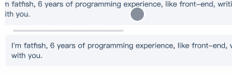

Hide scroll bar

# 14.自定义选定的文本样式

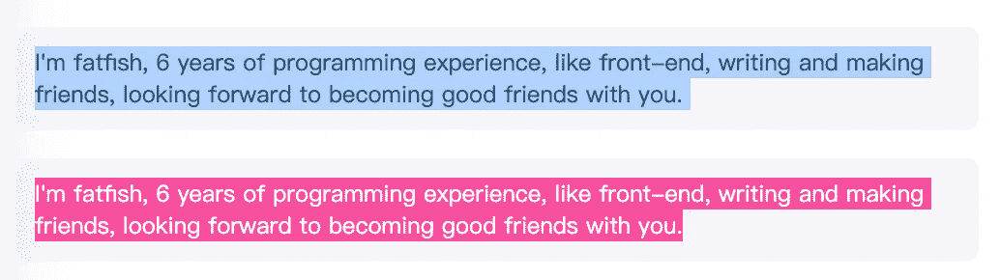

Customize the style of text selection

# 15.不允许选择文本

第一个可以选择，第二个不可以。

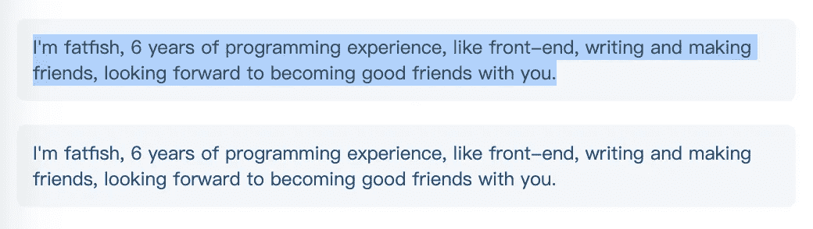

Disable selection of text

# 16.水平和垂直居中元素

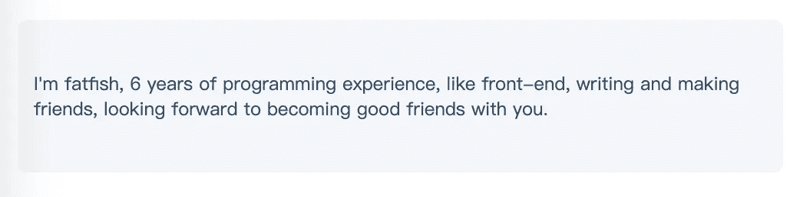

Horizontal and vertical centering

# 17.单行文本溢出时显示省略号

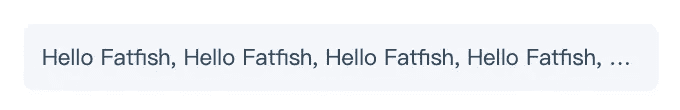

Single line text

# 18.多行文本溢出时显示省略号

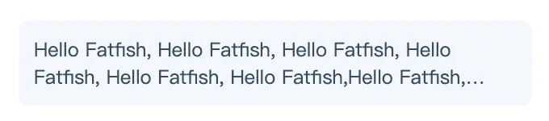

Multi-line

# 19.清除浮动

> 这是一种古老的布局方式，现在大多数移动终端都不使用。

如下所示，外层的高度不会塌陷，这就是使用 clearfix 类的原因

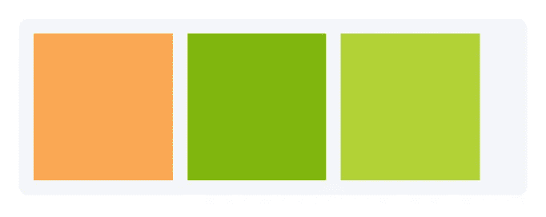

Clear float

# 20.使用“过滤器:灰度(1)”使页面处于灰色模式

一行代码将使页面处于灰色模式。

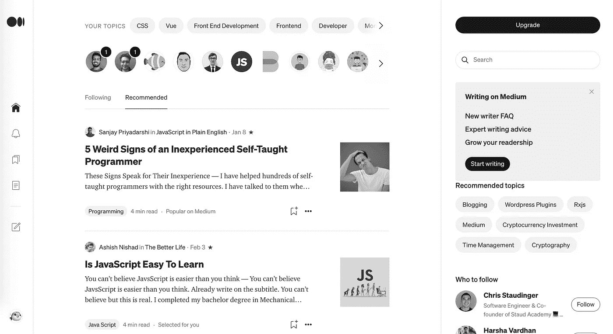

filter:grayscale(1)

```
body{
  filter: grayscale(1);
}
```

# 最后

**感谢阅读。**我期待期待您关注和阅读更多高质量的文章。

[](/interviewer-what-happened-to-npm-run-xxx-cdcb37dbaf44) [## 采访者:“npm 跑 xxx”怎么了？

### 一个大多数人都不知道的秘密。

javascript.plainenglish.io](/interviewer-what-happened-to-npm-run-xxx-cdcb37dbaf44) [](/my-boss-you-dont-know-react-at-all-f493970f1807) [## 我老板:你根本不知道反应！😠

### 你必须知道的 React 的 3 种错误用法。

javascript.plainenglish.io](/my-boss-you-dont-know-react-at-all-f493970f1807) [](/8-cool-github-tricks-to-make-you-look-like-a-senior-developer-ab8fe9ae9b14) [## 让你看起来像高级开发人员的 8 个很酷的 GitHub 技巧

### 使用 GitHub 可以做的 8 件很酷的事情

javascript.plainenglish.io](/8-cool-github-tricks-to-make-you-look-like-a-senior-developer-ab8fe9ae9b14) [](/interviewer-can-x-x-return-true-in-javascript-7e1d1fa7b5cd) [## 面试官:可以“x！== x "在 JavaScript 中返回 True？

### 你可能不知道的五个神奇的 JavaScript 知识点！

javascript.plainenglish.io](/interviewer-can-x-x-return-true-in-javascript-7e1d1fa7b5cd) [](/what-does-123-tostring-length-123-print-out-in-javascript-2c804a414325) [## 123['toString']。length + 123)用 JavaScript 打印出来？

### 95%的前端开发者回答错误的问题。

javascript.plainenglish.io](/what-does-123-tostring-length-123-print-out-in-javascript-2c804a414325) 

*更多内容看* [***说白了就是 io***](https://plainenglish.io/) *。报名参加我们的* [***免费周报***](http://newsletter.plainenglish.io/) *。关注我们关于* [***推特***](https://twitter.com/inPlainEngHQ) ， [***领英***](https://www.linkedin.com/company/inplainenglish/) *，*[***YouTube***](https://www.youtube.com/channel/UCtipWUghju290NWcn8jhyAw)*[***不和***](https://discord.gg/GtDtUAvyhW) *。对增长黑客感兴趣？检查* [***电路***](https://circuit.ooo/) *。**