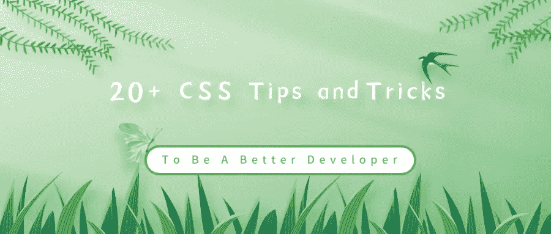
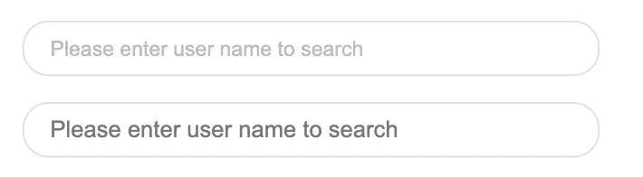
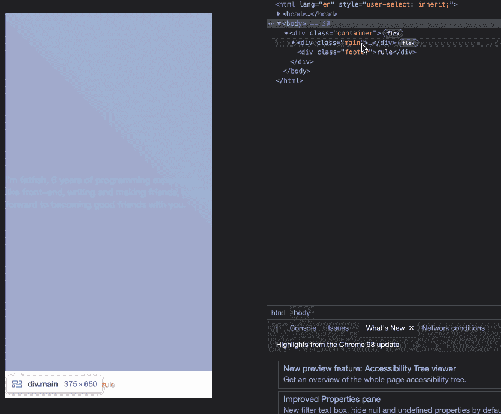
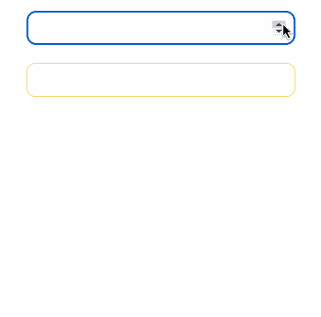
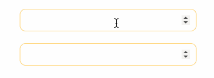
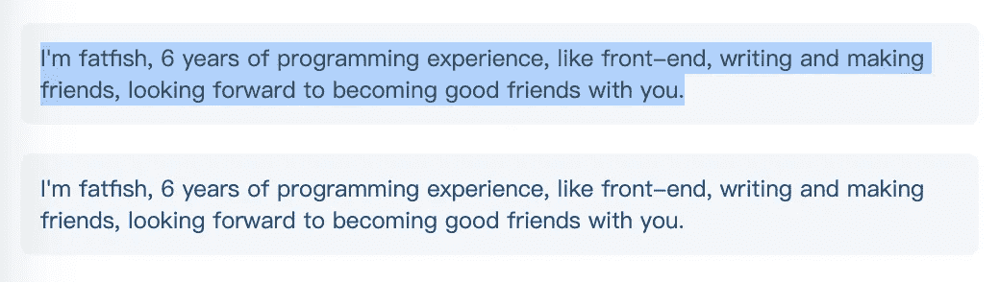
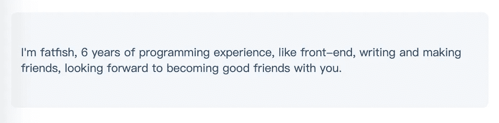
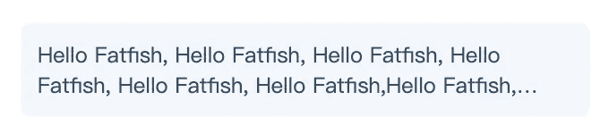

# 20 多个 CSS 技巧和窍门，让你成为更好的开发者

> 原文：<https://javascript.plainenglish.io/20-css-tips-and-tricks-to-make-you-a-better-developer-d80ae5c09617?source=collection_archive---------4----------------------->

## 让你成为更好、更灵活、更快的开发者的顶级 CSS 技巧和诀窍。



# 前言

**修改输入占位符样式、多行文本溢出、隐藏滚动条、修改光标颜色、水平居中和垂直居中。**多么熟悉的场景！前端开发者几乎每天都会和他们打交道，这里有 20 个 CSS 招数，大家看看吧。

# 1.解决图像 5px 间距问题

你是否经常有图片底部多余 5px 间距的问题？不急，这里有 4 种方法可以解决。


picture 5px spacing

**解决方案 1:将 font-size: 0 设置为父元素**

CodePen demo

**解决方案 2:将显示:块设置为 img**

CodePen demo

**解决方案 3:将垂直对齐:底部设置为 img**

CodePen demo

**解决方案 4:将行高:5px 设置为父元素**

CodePen demo

# 2.元素高度与窗口高度相同

如何让元素和窗口一样高？

CodePen demo

# 3.修改输入占位符样式

第一个是修改过的，第二个不是。



CodePen demo

# 4.使用“:非”选择器

除了最后一个元素之外，所有元素都需要某种样式，使用 not 选择器将非常容易。

**如下图:最后一个元素没有下边框。**


CodePen demo

# 5.使用 flex layout 智能地将元素固定在底部

当内容不够时，按钮应该在页面底部。当有足够的内容时，按钮应该跟随内容。当你有类似的问题时，使用 flex 实现智能布局！



fixed bottom

CodePen demo

# 6.使用“脱字颜色”修改光标颜色

有时需要修改光标的颜色。现在是脱字符颜色显示时间。


CodePen demo

# 7.移除 type="number "末尾的箭头

默认情况下，输入 type = "number "的末尾会出现一个小箭头，但有时我们需要去掉它。我们做什么呢

**如下图:第二个去掉了，第一个没有。**



Remove the arrow at the end of type=”number”

CodePen demo

# 8.“大纲:无”删除输入状态行

当输入框被选中时，默认情况下它会有一条蓝色的状态线，可以使用 outline: none 来移除。

**如下图:第二个输入框被移除，第一个没有。**



# 9.解决 iOS 滚动条被卡住的问题

> *在苹果手机上，经常会出现滚动时元素卡顿的情况。此时只有一行 CSS 会支持弹性滚动。*

# 10.画三角形


triangle

# 11.画小箭头


Draw small arrows

# 12.图像适合窗口大小

vw 与填充


vw vs padding

# 13.隐藏滚动条

第一个滚动条是可见的，第二个是隐藏的。

**这意味着容器可以滚动，但是滚动条是隐藏的，就像它是透明的一样。**


Hide scroll bar

# 14.自定义选定的文本样式


Customize the style of text selection

# 15.不允许选择文本

第一个可以选择，第二个不可以。



Disable selection of text

# 16.水平和垂直居中元素



Horizontal and vertical centering

# 17.单行文本溢出时显示省略号


Single line text

# 18.多行文本溢出时显示省略号



Multi-line

# 19.清除浮动

> 这是一种古老的布局方式，现在大多数移动终端都不使用。

如下所示，外层的高度不会塌陷，这就是使用 clearfix 类的原因


Clear float

# 20.使用“过滤器:灰度(1)”使页面处于灰色模式

一行代码将使页面处于灰色模式。


filter:grayscale(1)

```
body{
  filter: grayscale(1);
}
```

# 结局

我是胖鱼。我有 6 年的编程经验，喜欢前端，写作，交友，期待和你成为好朋友。

*更多内容看* [***说白了。报名参加我们的***](http://plainenglish.io/) **[***免费周报***](http://newsletter.plainenglish.io/) *。在我们的* [***社区获得独家访问写作机会和建议***](https://discord.gg/GtDtUAvyhW) *。***