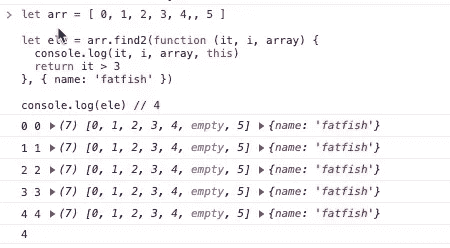
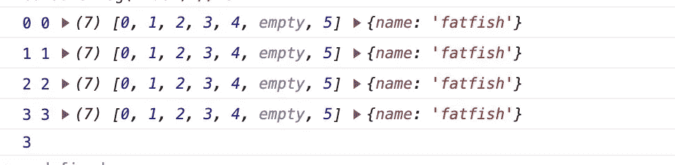

# 每个开发人员都应该知道的 20 种 JavaScript 数组方法

> 原文：<https://javascript.plainenglish.io/20-javascript-array-methods-every-developer-should-know-6c04cc7a557d?source=collection_archive---------0----------------------->

## 你知道这 20 个数组方法是怎么实现的吗？

# 前言

朋友们，你们一定非常熟悉 JavaScript 中的数组，我们每天都在使用它的各种方法，比如`push`、`pop`、`forEach`、`map`...等等。

**但是仅仅是用就够了吗？**如此精彩，你一定不想就此打住。我想和你挑战实现 20+数组方法的功能。

# 1.为每一个

`forEach`是我们工作中非常常用的一种数组方法，实现起来也比较简单。这是我们需要完成的第一个功能。

**代码**

**测试一下**

哇，恭喜你！我们已经实现了`forEach`的特性。

# 2.地图

一般用`map`做什么？大多数时候是把一个数组转换成另一个数组。

**代号**

**测试一下**

朋友们，你们觉得不难吗？那是因为你太棒了。

# 3.每个

(来自 [MDN](https://developer.mozilla.org/en-US/docs/Web/JavaScript/Reference/Global_Objects/Array/every) )方法`every()`测试数组中的所有元素是否通过了由提供的函数实现的测试。它返回一个布尔值。

`every`方法有三点你可能之前没有注意到，是什么？

1.  在空数组上调用`every`方法将返回`true`。
2.  只有已经赋值的索引才会调用`callback`方法。
3.  如果值被删除，则不会调用`callback`

**代码**

**测试一下**

# 4.一些

(来自 [MDN](https://developer.mozilla.org/en-US/docs/Web/JavaScript/Reference/Global_Objects/Array/some) )方法`some()`测试数组中是否至少有一个元素通过了由提供的函数实现的测试。

**代码**

**测试一下**

# 5.过滤器

(来自[MDN](https://developer.mozilla.org/en-US/docs/Web/JavaScript/Reference/Global_Objects/Array/filter))filter()方法创建一个新数组，其中所有元素都通过了由所提供的函数实现的测试。

**测试一下**

# 6.减少

这个函数稍微复杂一点。我们用一个例子来看看是怎么用的。

**代码**

**测试一下**

# 7.reduceRight

reduceRight()方法对一个累加器和数组中的每个值(从右到左)应用一个函数，以将其缩减为单个值。

它与 reduce 非常相似，只是 reduceRight 从右向左遍历。

**代号**

**测试一下**

# 8.发现

(来自[MDN](https://developer.mozilla.org/en-US/docs/Web/JavaScript/Reference/Global_Objects/Array/find))find()方法返回所提供数组中满足所提供测试函数的第一个元素。如果没有满足测试函数的值，则返回 undefined。

**代码**

**测试一下**

# 9.findIndex

(来自[MDN](https://developer.mozilla.org/en-US/docs/Web/JavaScript/Reference/Global_Objects/Array/findIndex))find index()方法返回满足所提供测试函数的数组中第一个元素的索引。否则，它返回-1，表示没有元素通过测试。

**代码**

**测试一下**

# 10.索引 Of

(来自[MDN](https://developer.mozilla.org/en-US/docs/Web/JavaScript/Reference/Global_Objects/Array/indexOf))index of()方法返回给定元素在数组中的第一个索引，如果不存在则返回-1。

**备注:**

1.  如果开始搜索的索引值大于或等于数组的长度，则意味着不会在数组中执行搜索，并返回-1。
2.  如果 fromIndex 为负数，则按照-1 表示从最后一个元素开始搜索，-2 表示从倒数第二个元素开始搜索，以此类推的规则进行搜索。
3.  如果 fromIndex 是负数，则仍然从前到后搜索数组。

**代码**

**测试一下**

# 11.lastIndexOf

(来自[MDN](https://developer.mozilla.org/en-US/docs/Web/JavaScript/Reference/Global_Objects/Array/lastIndexOf))lastIndexOf()方法返回给定元素在数组中的最后一个索引，如果不存在则返回-1。从 fromIndex 开始向后搜索数组。

它与 indexOf 非常相似，只是最后一个 IndexOf 是从右向左遍历的。

**代码**

**测试一下**

# 12.包含

(来自[MDN](https://developer.mozilla.org/en-US/docs/Web/JavaScript/Reference/Global_Objects/Array/includes))includes()方法确定一个数组的条目中是否包含某个值，根据情况返回 true 或 false。

**注释**

1.  includes 方法将从 fromIndex 索引开始搜索 valueToFind。
2.  如果 fromIndex 为负，则开始搜索`array.length + fromIndex`的索引。
3.  如果`NaN`存在于数组中，[...，`NaN`包含(`NaN`)是真的。

**代码**

**测试一下**

# 13.推

(来自[MDN](https://developer.mozilla.org/en-US/docs/Web/JavaScript/Reference/Global_Objects/Array/push))push()方法将一个或多个元素添加到数组的末尾，并返回数组的新长度。

**代码**

**测试一下**

# 14.流行音乐

(来自[MDN](https://developer.mozilla.org/en-US/docs/Web/JavaScript/Reference/Global_Objects/Array/pop))pop()方法从数组中移除最后一个元素并返回该元素。此方法更改数组的长度。

**代号**

**测试一下**

# 15.松开打字机或键盘的字型变换键

(来自[MDN](https://developer.mozilla.org/en-US/docs/Web/JavaScript/Reference/Global_Objects/Array/unshift))un shift()方法将一个或多个元素添加到数组的开头，并返回数组的新长度。

**注释**

如果您传入多个参数来调用 unshift 一次，您将得到与传入一个参数来调用 unshift 多次(例如，循环调用)不同的结果。

**代码**

**测试一下**

# 16.变化

(来自[MDN](https://developer.mozilla.org/en-US/docs/Web/JavaScript/Reference/Global_Objects/Array/shift))shift()方法从数组中移除第一个元素，并返回被移除的元素。此方法更改数组的长度。

**代码**

**测试一下**

# 17.反面的

(来自[MDN](https://developer.mozilla.org/en-US/docs/Web/JavaScript/Reference/Global_Objects/Array/reverse))reverse()方法原地反转一个数组。第一个数组元素成为最后一个，最后一个数组元素成为第一个。

**代码**

**测试一下**

# 18.充满

(From[MDN](https://developer.mozilla.org/en-US/docs/Web/JavaScript/Reference/Global_Objects/Array/fill))fill()方法将数组中的所有元素更改为静态值，从起始索引(默认为 0)到结束索引(默认为 array.length)。它返回修改后的数组。

**代号**

**测试一下**

# 19.串联

(来自[MDN](https://developer.mozilla.org/en-US/docs/Web/JavaScript/Reference/Global_Objects/Array/concat))concat()方法用于合并两个或多个数组。此方法不会更改现有数组，而是返回一个新数组。

**代码**

**测试一下**

# 20.加入

(来自[MDN](https://developer.mozilla.org/en-US/docs/Web/JavaScript/Reference/Global_Objects/Array/join))join()方法通过连接一个数组(或一个类似数组的对象)中的所有元素来创建并返回一个新的字符串，用逗号或指定的分隔符字符串分隔。如果数组只有一项，则该项将在不使用分隔符的情况下返回。

**代码**

**测试一下**

# 最后

**感谢阅读。**我期待期待您的关注和阅读更多高质量的文章。

 [## 采访者:“npm 跑 xxx”怎么了？

### 一个大多数人都不知道的秘密。

javascript.plainenglish.io](/interviewer-what-happened-to-npm-run-xxx-cdcb37dbaf44)  [## 我老板:你根本不知道反应！😠

### 你必须知道的 React 的 3 种错误用法。

javascript.plainenglish.io](/my-boss-you-dont-know-react-at-all-f493970f1807)  [## 让你看起来像高级开发人员的 8 个很酷的 GitHub 技巧

### 使用 GitHub 可以做的 8 件很酷的事情

javascript.plainenglish.io](/8-cool-github-tricks-to-make-you-look-like-a-senior-developer-ab8fe9ae9b14)  [## 面试官:可以“x！== x "在 JavaScript 中返回 True？

### 你可能不知道的五个神奇的 JavaScript 知识点！

javascript.plainenglish.io](/interviewer-can-x-x-return-true-in-javascript-7e1d1fa7b5cd)  [## 123['toString']。length + 123)用 JavaScript 打印出来？

### 95%的前端开发者回答错误的问题。

javascript.plainenglish.io](/what-does-123-tostring-length-123-print-out-in-javascript-2c804a414325) 

[*更多内容请看* ***说白了。报名参加我们的* ***免费每周简讯*** *。关注我们的****Twitter****和****LinkedIn****。查看我们的* ***社区不和谐*** *加入我们的* ***人才集体*** *。***](https://medium.com/p/dcac2d547a9c/edit)