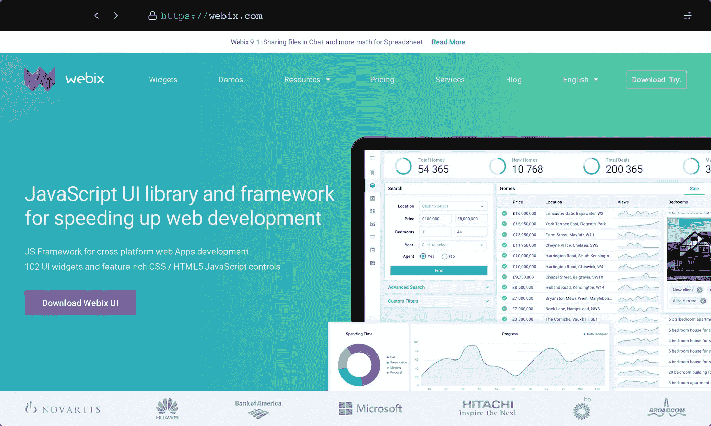
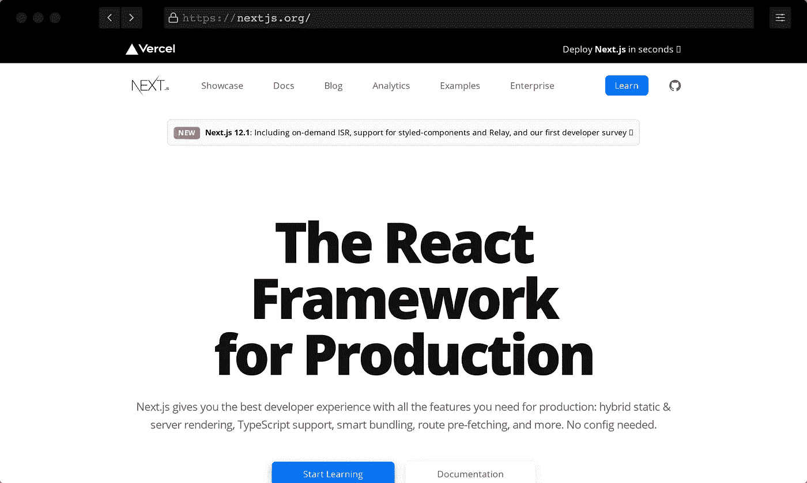

# 20 多个 JavaScript 框架，让你在 2022 年的生活更轻松

> 原文：<https://javascript.plainenglish.io/20-javascript-frameworks-that-make-your-life-easier-in-2022-93be2f06c05d?source=collection_archive---------9----------------------->

Photo by [Helena Lopes](https://unsplash.com/@wildlittlethingsphoto?utm_source=medium&utm_medium=referral) on [Unsplash](https://unsplash.com?utm_source=medium&utm_medium=referral)

连续第八年， [StackOverflow](https://stackoverflow.com/) 对 100，000 多名开发人员进行了一项调查，以确定 2021 年主导的顶级技术趋势和编程语言。

JavaScript 在开发人员中广受欢迎，因为它再次在总排名中名列第一。它在功能和灵活性方面提供了多样性。

JavaScript 库和框架被 web 开发人员广泛使用，他们将这些集成到他们创建的网站中。

这些天我更多地使用 Webflow。作为一个前端开发人员，这个无代码工具几乎满足了我所有的需求。看看我最近做的[空格键计数器](https://www.spacebarcounter.net)工具。是用纯代码写的还是用 webflow 写的？没有区别吧？

尽管如此，JavaScript 框架是无价的，我相信你会在下面的列表中找到你需要的。

# 离子的

[Ionic Framework](https://ionicframework.com) 是一个免费开源的跨平台移动 app 开发框架。有了 Ionic Framework，你可以用 HTML、CSS 和 JavaScript 等 web 技术构建跨平台的移动应用。它由 web 驱动，允许您开发快速且可扩展的应用程序。

# Webix

Webix 是一个 JavaScript UI 库，旨在加速 web 开发。他们认为跨平台应用程序的开发应该是一个简单直接的过程，只需要最少的努力和费用。为此，他们孜孜不倦地开发最好的 JavaScript 框架库——这将使开发跨平台和移动应用程序比以往任何时候都更容易。

# jQuery

这是一个 JavaScript 库，帮助你使你的网站更具互动性。

它通过一个跨多种浏览器工作的易于使用的 API，使 HTML 文档遍历和操作、事件处理、动画和 Ajax 变得更加简单。

凭借多功能性和可扩展性的结合， [jQuery](https://jquery.com/) 已经改变了数百万人编写 JavaScript 的方式。

# vue . j

百搭。表演。可增量采用。易于集成。这些只是用来描述 [Vue.js](https://vuejs.org) 的形容词中的一部分，这是一个渐进的 JavaScript 框架，它是可接近的、通用的和高性能的。Vue.js 非常容易集成到其他项目和库，并且可以根据您的用例在库和全功能框架之间扩展。

# D3.js

[D3js](https://d3js.org/) —数据驱动的文档。D3s 对 web 标准的重视使您能够获得现代浏览器的全部功能，而无需将自己束缚于专有框架，将强大的可视化组件和数据驱动的 DOM 操作方法结合起来。

D3 允许您将任意数据绑定到文档对象模型 DOM，然后将数据驱动的转换应用到文档。

举个简单的例子，您可以使用 D3 从一个数字数组生成一个基本的 HTML 表格。或者，使用相同的数据创建一个具有平滑过渡和交互的交互式 SVG 条形图。

# lodash.com

[Lodash](https://lodash.com/) 是一个 Javascript 函数的工具包，它为操作对象和集合提供了干净、高效的方法。

它是下划线库的“分支”,提供了额外的功能以及一些重要的性能改进

# 下划线. js

[下划线](https://underscorejs.org)是一个 Javascript 的实用函数库，它支持常见的函数助手，如 map、filter、every 和 isEmpty，以及更专业的工具，如 curry、bind 和 partial。

# Jest.js

现在有很多优秀的 JS 测试框架，但是 [Jest](https://jestjs.io) 是不同的。它有一个受 React 启发的简单直观的 API。

很好用。真的没有什么需要学习的——就像平常一样编写测试。它快如闪电且稳定，拥有一个高级的 scape runner，无论你有 10 个还是 3000 个，它都努力保持测试快速运行。

# Nuxt.js

[Nuxt.js](https://nuxtjs.org) 是用于构建快速而健壮的 Vue 应用程序的现代框架，它附带了大量功能来提高开发人员的工作效率和最终用户体验:它构建在 webpack 4 之上，提供开箱即用的代码分割、热重装和服务器端渲染。其强大的目录结构和约定允许开发人员将更多的精力放在产品上，而不是配置上。

# Ember.js

Ember.js 特别有用，因为它是为团队设计的。它允许团队创建可扩展的雄心勃勃的应用程序。它专为提高开发效率而设计，非常注重部署，是构建最具雄心的应用程序的最佳工具。

# 森查

[Sencha](https://www.sencha.com) 帮助你为任何现代设备构建应用。它是一个 JavaScript 框架和 UI 组件，用于构建数据密集型 web 应用程序。

# Anime.js

[Anime.js](https://animejs.com) 是一个 JavaScript 动画库，让复杂的跟随和重叠动画变得简单。

它可以用在计时和属性上。它适用于任何东西 web CSS SVG DOM 属性和 JavaScript 对象用一个统一的 API 激活一切。

# 苗条的

这是一个控制论增强的 web 应用程序生成器，这意味着您可以编写更少的代码，更快地构建。这是因为它与库和框架无关。有了[这个苗条的](https://svelte.dev)，你可以得到两个世界的最好的东西:在你构建你的应用程序时发生的快速编译步骤，以及从最终捆绑包中消失的非常简洁的代码。

# 盖茨比

[盖茨比](https://www.gatsbyjs.com)用最少的努力给你最好的开发者体验。借助 Gatsby 积极维护和不断增长的代码库，您的站点速度快、性能好、易于维护。

# Next.js

[Next.js](https://nextjs.org) 是来自 Zeit 的 React 框架，是很久以来 React 发生的最好的事情。Next(又名 Next.js)建立在 React、webpack 和 Babel 之上。它是生产就绪的，因此您不必投入时间来设置您的开发环境。

# Chart.js

Chart.js 是一个面向设计者和开发者的简单的、面向对象的客户端图形。Open jQuery ChartsJS 2 是一个由社区维护的开源库，它提供了向网站添加精美图表的最简单方法。

它利用广泛实现的 jQuery 和 HTML5 canvas 元素，以出色的性能和兼容性完成工作。

# 三. js

[Three.js](https://threejs.org) 是一个开源库，允许用户在浏览器中创建和显示 3D 对象。如果你对学习三个 j 感兴趣，不要犹豫，看看我们的教程！我们甚至有一家 t 恤店，这样你就可以展示你对三个 j 的喜爱。

# 节点. js

[Node.js](https://nodejs.org) 是一个开源项目，由数百名贡献者和数百万用户在过去 10 年中积极开发。Node 提供了各种 JavaScript 模块的丰富库，简化了 web 应用程序的开发。

# 少许

Glimmer 是一个轻量级的 web UI 组件；它可以在 Emberjs 和独立应用程序中使用。

通过超越对传统 web 模板的理解并进入可重用组件的领域，Glimmer 使您离构建快速而强大的 web 应用程序的梦想更近了一步，它具有由高度优化的渲染引擎支持的轻量级组件。

# 流星

[Meteor](https://www.meteor.com) 配有前端框架、API 库、构建工具链和一套集成实践，旨在帮助您设计和构建现代应用。

# leafletjs.com

[传单](https://leafletjs.com/)是领先的移动友好交互式地图开源 JavaScript 库。JS 重约 39 KB，它拥有大多数开发人员需要的所有映射特性。

传单的设计考虑到了简单性、性能和可用性。利用 HTML5 和 CSS3 的优势，它开箱即可在所有主要的桌面和移动平台上高效工作。

# Moment.js

[Moment.js](https://momentjs.com/) 是一个免费的开源 JavaScript 库，不需要直接使用原生 JavaScript Date 对象。这个库是日期对象的包装器(就像 jQuery 是 JavaScript 的包装器一样),使得对象更容易使用。它使用类似 XML 的语法来定义日期和时间的组成部分。

# Voca

Voca 提供了一些有用的功能来使字符串操作更加舒适:改变大小写、修剪、填充、slugify、latinise、sprintf、截断、转义等等。模块化设计允许加载整个库或单个函数，以最小化应用程序构建。该库针对所有现代浏览器和 Node.js 平台进行了全面测试。

# Moment.js

[Moment.js](https://momentjs.com/) 是一个免费的开源 JavaScript 库，不需要直接使用原生 JavaScript Date 对象。这个库是日期对象的包装器(就像 jQuery 是 JavaScript 的包装器一样),使得对象更容易使用。它使用类似 XML 的语法来定义日期和时间的组成部分。

*更多内容请看*[***plain English . io***](http://plainenglish.io/)*。报名参加我们的* [***免费周报***](http://newsletter.plainenglish.io/) *。在我们的* [***社区***](https://discord.gg/GtDtUAvyhW) *获得独家获得写作机会和建议。*